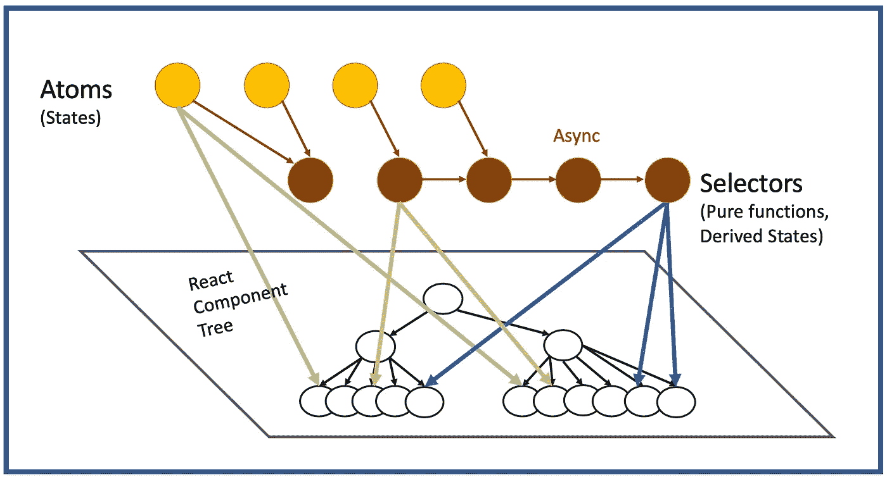
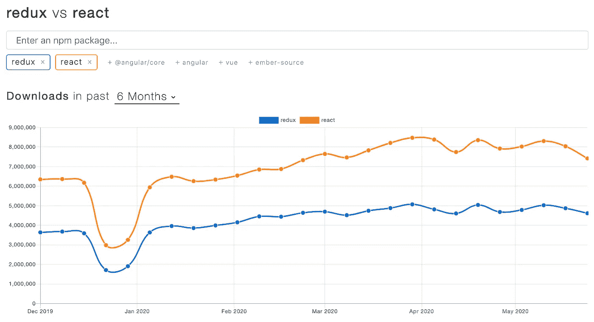
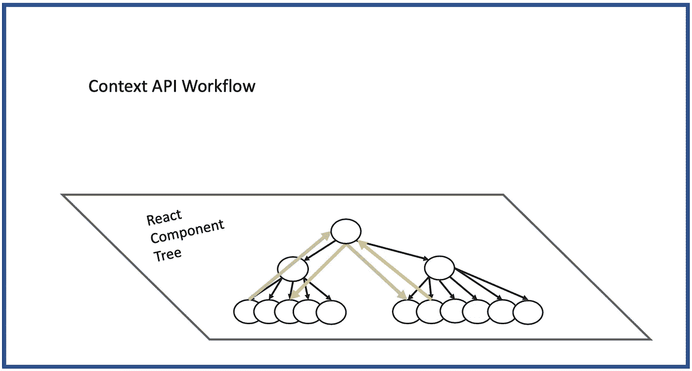
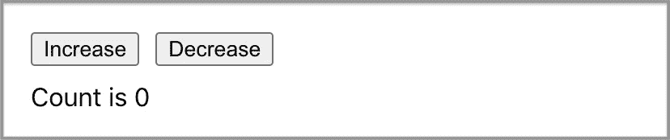
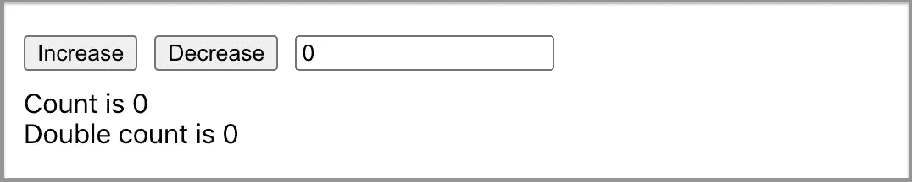
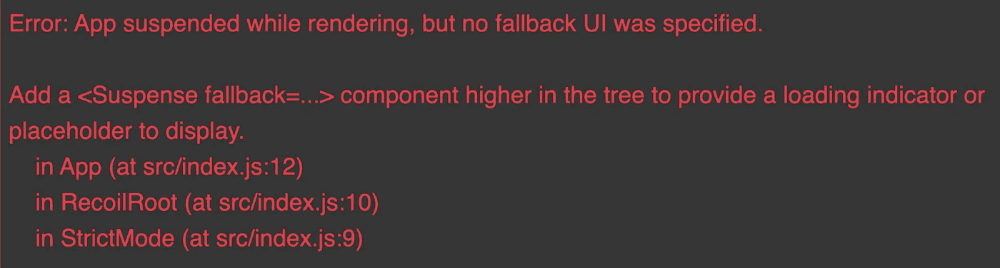

# 反冲:超越 Redux 和上下文 API 的新状态管理库

> 原文：<https://betterprogramming.pub/recoil-a-new-state-management-library-moving-beyond-redux-and-the-context-api-63794c11b3a5>

## 反冲的全面介绍，React 应用程序的实验性状态管理库



状态管理的反冲数据流图—作者照片。

自 2015 年 5 月以来， [Redux](https://github.com/reduxjs/redux) 是 JavaScript 应用程序的可预测状态容器。它是真理的单一来源，它的状态是只读的，并且用纯函数进行更改。Redux 有一个很好的浏览器调试扩展，方便调试。缺点是复杂的样板文件。可能与 React 即将推出的并发模式不兼容。

[上下文 API](https://reactjs.org/docs/context.html) 由 React 16.3 于 2018 年 5 月推出。与 React 挂钩(`useContext`)一起，它提供了一种通过 React 组件树传递数据的方法，而不必在每一层手动传递道具。它旨在共享全局数据，例如当前已验证的用户、主题或首选语言。上下文 API 和 React 挂钩提供了一种新的状态管理方法。调试是困难的，并且在呈现多个动态项目时存在性能问题。

那么应该用 Redux 还是上下文 API 呢？

经过几年的斗争，许多文章宣布 Redux 已经死了，还没有死，等等。，两者都很活跃，并被许多应用程序采用。还没有明确的赢家。

以下是 NPM 趋势比较。这两种工具仍在大量使用:



现在我们有了一个新人。

[反冲](https://recoiljs.org/)是脸书开发的一个全新的实验性 JavaScript 状态管理库。2020 年 5 月起上市。

# **解决的问题**



反冲解决了大型应用程序在使用现有上下文 API 时遇到的许多问题:

*   组件状态只能通过将其推至公共祖先来共享，但这可能包括一个巨大的树，然后需要重新呈现。
*   上下文只能存储单个值，而不是一组不确定的值，每个值都有自己的使用者。
*   这两者都使得将树的顶部(状态必须存在的地方)与树的叶子(使用状态的地方)进行代码分离变得很困难。

反冲定义了一个正交的有向图，但它也是固有的，并附加到 React 组件树(参见顶部的反冲数据流图)。在这个数据流图中，状态变化从图的根(原子)通过派生状态的纯函数(选择器)流入组件。

通过这种架构设计，反冲使用一种反应式的解决方案来解决上下文 API 问题。这种解决方案易于使用，可以兼容并发模式和其他可用的 React 新特性。此外，更高级的调试器选项正在开发中，如时间旅行、撤销功能、持久数据等。

# **反冲设置**

我们来看看 [Create React App](https://medium.com/better-programming/10-fun-facts-about-create-react-app-eb7124aa3785) ( `npx create-react-app my-app`)中反冲是如何工作的。首先用命令`npm i recoil`安装后坐力。然后这个包成为`package.json`中`[dependencies](https://medium.com/better-programming/package-jsons-dependencies-in-depth-a1f0637a3129)`的一部分:

```
"dependencies": {
  "recoil": "0.1.2"
}
```

将`src/App.css`更改为最小化样式:

使用反冲钩的部件必须用`<RecoilRoot>`包裹。在下面的`src/index.js`中，在第 10 行和第 12 行添加`RecoilRoot`:

现在我们准备看反冲的例子。

# 原子

我们想要创建以下用户界面。它显示初始状态`0`。每点击一次`Increase`按钮，计数将增加 1，每点击一次`Decrease`按钮，计数将减少 1。



我们可以使用`useState`在`src/App.js`中实现这一点:

现在我们用反冲的原子做同样的用户界面。原子`countState`在第 5-8 行定义。它由 11 号线使用。就是这样。

什么是原子？

它是一种共享的、可写的反冲状态，包括它所管理的一段数据。组件可以订阅原子，然后在相关原子改变时重新呈现。

一个原子有两个支柱:

*   `key`:用于内部识别原子的字符串。这个字符串相对于整个应用程序中的其他原子和选择器应该是唯一的。
*   `default`:原子的初始值。

以下是与原子相互作用的钩子:

*   `[useRecoilState()](https://recoiljs.org/docs/api-reference/core/useRecoilState)`:这个钩子用来读写一个原子。它向原子订阅调用组件。
*   这个钩子用来读取一个原子。它向原子订阅调用组件。
*   `[useSetRecoilState()](https://recoiljs.org/docs/api-reference/core/useSetRecoilState)`:这个钩子用来写一个原子。
*   `[useResetRecoilState()](https://recoiljs.org/docs/api-reference/core/useResetRecoilState)`:这个钩子用来重置一个原子到它的默认值。
*   `[useRecoilCallback()](https://recoiljs.org/docs/api-reference/core/useRecoilCallback)`:这个钩子用来构造一个回调函数，这个回调函数可以读取一个原子并异步更新它。

# 选择器

原子能很好地储存状态。选择器是用于计算派生状态的纯函数。选择器避免冗余状态，通常不需要归约器来保持状态同步和有效。

正确的设计是使用原子来存储最小的状态集，而其他所有东西都作为原子的函数来有效地计算。组件可以像原子一样订阅选择器，当选择器派生的状态改变时，组件将被重新呈现。

什么是选择器？根据[官方文件](https://recoiljs.org/docs/introduction/core-concepts/):

> “选择器是一个纯粹的函数，它接受原子或其他选择器作为输入。当这些上游原子或选择器被更新时，选择器功能将被重新评估。”

选择器具有以下特性:

*   `key`:用于内部识别原子的字符串。这个字符串相对于整个应用程序中的其他原子和选择器应该是唯一的。
*   `get`:作为对象传递的函数`{ get }`，其中`get`是从其他原子或选择器检索值的函数。传递给该函数的所有原子或选择器都将被隐式地添加到选择器的依赖列表中。
*   `set?`:返回新的可写状态的可选函数。它作为一个对象、`{ get, set }`和一个新值被传递。`get`是从其他原子或选择器中检索值的函数。`set`是设置原子值的函数，其中第一个参数是原子名，第二个参数是新值。

我们添加了一个选择器来生成`src/App.js`中的派生状态:

第 10-13 行上的选择器定义了第 17 行使用的派生的`doubleCountState`。该值在第 23 行显示为双计数值。

可选地，选择器可以设置原子值。我们在用户界面中添加了一个输入字段。它反映了`doubleCountState`选择器的状态。当它得到用户输入时，这个新值被设置为`countState`原子状态。



这里有一个`src/App.js`的例子:

第 15-19 行上的选择器定义了第 24 行使用的派生`inputState`。它的值与选择器的值相同:`doubleCountState`(在第 17 行定义)。

当用户更改输入值时，`onChange`(第 29 行)将调用`setInput`(第 24 行)，然后设置`countState`原子(第 18 行)。原子变化将导致每个相关值的重新呈现。

# 异步选择器

反冲提供了一种通过数据流图将状态(原子)和派生状态(选择器)映射到反应组件的方法。如果选择器中的`get`函数是异步的怎么办？它的工作方式与同步数据流相同。简单地让`get`函数返回一个承诺值。

下面是修改后的`src/App.js`:

在第 12-18 行，我们重写了`get`函数来返回一个承诺。其他一切都保持不变。

事实上，如果您用下面的代码片段替换第 12-18 行来等待承诺，它也可以工作:

等一下。运行`npm start`，我们遇到这个错误:



`RecoilRoot`异步选择器需要一个后备用户界面。我们将其添加到第 12 行和第 14 行的`src/index.js`:

现在，它工作了！

当事情变得动态时，拥有一个`ErrorBoundary`(第 11 行和第 15 行)总是一个好主意。前一篇文章中详细介绍了如何创建误差边界。

# 反冲极限

你在你的项目中使用了[eslint-plugin-react-hooks](https://www.npmjs.com/package/eslint-plugin-react-hooks)吗？如果是，建议将`useRecoilCallback`添加到`additionalHooks`列表中(第 9 行)。

# 结论

反冲是最新的国家管理图书馆提供的脸书。尽管它仍处于试验阶段，但它展示了许多有希望取代状态管理上下文 API 的特性。

我们已经使用反冲有一段时间了。它易于使用，并允许我们使用简单的语法在多个组件/文件之间共享状态。这本故事书包括几个使用反冲的例子。

原子和选择器的状态可以是已定义的或未定义的、原语值或对象值。选择器的值是从原子或其他选择器自动派生的。

还有各种构造原子和选择器的方法。根据编程逻辑，它们可以被分组到一个文件中，或者被分类到几个文件中。反冲提供了从现有技术约束中的自由。

编码快乐！

感谢阅读。我希望这有所帮助。你可以在这里看到我的其他媒体出版物[。](https://medium.com/@jenniferfubook/jennifer-fus-web-development-publications-1a887e4454af)

*注:Jonathan Ma 对本文部分内容有贡献。*