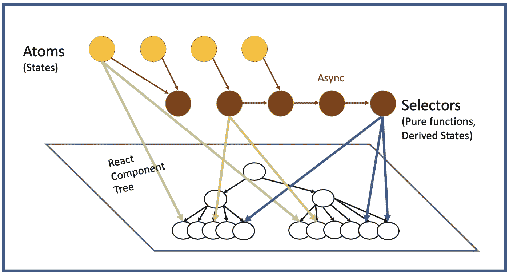
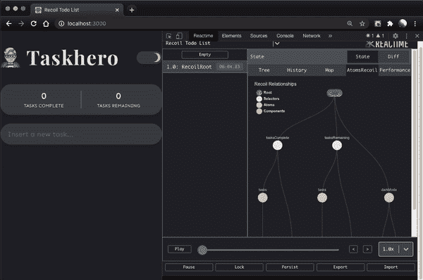
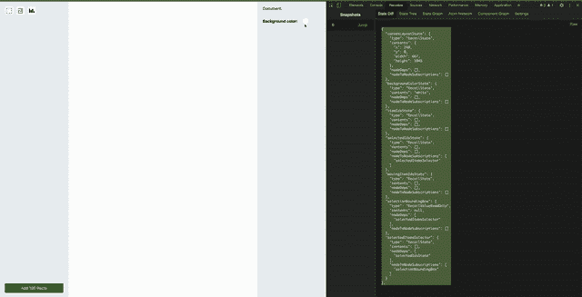

# 反冲. js:开发者工具的现状

> 原文：<https://betterprogramming.pub/recoiljs-current-landscape-of-developer-tools-2e242d4509ae>

## 反冲的权威指南(第二部分)

状态管理的反冲数据流图——照片由 Jennifer Fu 拍摄

# 介绍

考虑到您正在阅读这篇文章，您很可能已经对反冲的核心概念以及它与其他状态管理库的权衡有了坚实的理解。然而，如果你想复习一下，这里有一个[系列的第一部分](https://medium.com/@CSVince/ffb1345833b6)，我们将在这里讨论这个问题。本文主要关注目前有哪些开发人员工具可用于反冲，以及目前没有解决的任何差距。

# 反冲开发工具的官方发展状况

我们中的许多人越来越喜欢 Redux devtools，因为它强大的时间跳跃能力，以及直观的界面。现在反冲正在慢慢接近一个稳定的版本，它的宣传继续增长，并导致许多人想知道他们是否应该将反冲集成为他们的状态管理架构的一部分。

虽然反冲团队已经承认有一个[开发工具](https://github.com/facebookexperimental/Recoil/issues/49)在脸书内部工作，还没有正式宣布发布。

# 外面有什么工具？

开源社区已经迅速介入，并尽最大努力填补该领域目前的空白。然而，困难在于这个状态管理库相对较新的性质——即缺少文档、快速发展的特性以及缺少支持。目前没有可用的资源来整合已经支离破碎的生态系统，这正是本文希望缓解的问题。

下面列出了开源反冲开发工具。

## [反应时间](https://github.com/open-source-labs/reactime):

任务英雄——反冲待办事项列表

*   Reactime 具有类似于 Redux devtools 的时间旅行功能，但它与一组更多样化的 React 状态管理库一起工作，并提供了一套功能更全的可视化工具
*   具有通过刷新或重新加载页面来保持应用程序状态的全部功能，以及刷新后的全部功能
*   在您进行时间旅行/对状态进行新的更改时监视历史，以及通过单击按钮在 DOM 中模拟任何历史状态更改的能力
*   从原子到选择器再到组件的数据流的可视化。

## [反冲](https://github.com/open-source-labs/Recoilize):

*   反冲是一个易于使用的 NPM 包，目的是帮助调试用反冲库构建的应用程序。
*   时间旅行能力，具有提供精确时间旅行调试的更新算法
*   原子和选择器网络图有助于可视化状态依赖
*   组件图，通过显示对原子、选择器或两者的依赖关系，允许开发人员快速区分有状态和无状态组件
*   如果您也对 Reacts 实验并发模式感兴趣，组件图将显示组件是否被暂停使用并发模式

# 当前开发工具中的潜在差距

亚历克斯·拉德里奇在 [Unsplash](https://unsplash.com?utm_source=medium&utm_medium=referral) 上的照片

尽管 Reactime 和反冲在它们包含的特性上是健壮的，但是仍然有其他开发工具为生态系统做出重大贡献的空间。一个这样的差距是关于工具能够利用反冲 API 来提取状态。提高开发人员调试能力的另一个有价值的特性是通过名称搜索/过滤原子或选择器列表的能力。

# 结论

那么反冲的未来是什么样子的呢？说实话，看起来还蛮不错的！反冲似乎真的给 T4 社区注入了活力。

随着正式发布的临近，我相信会有更多的开发者开始测试这个库。虽然官方的 devtools 尚未确定，但开源社区能够如此迅速地介入并填补空白是非常有希望的。

***供稿人:*** [*克里斯·吉塞蒂*](https://www.linkedin.com/in/christopherguizzetti/)*[*杰森·维克托*](https://www.linkedin.com/in/jasonvictor608/)*[*桑杰·拉文吉亚*](https://github.com/SanjayLavingia)*[*亚历山大·兰德洛斯*](https://www.linkedin.com/in/alexander-landeros/) *和* [*文森特·阮*](https://www.linkedin.com/in/vnguyenucla/)***