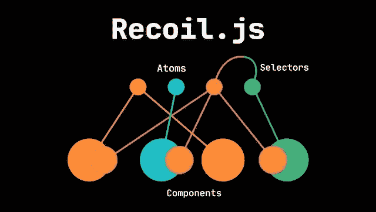
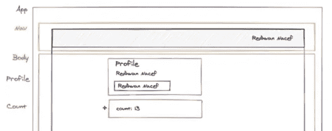
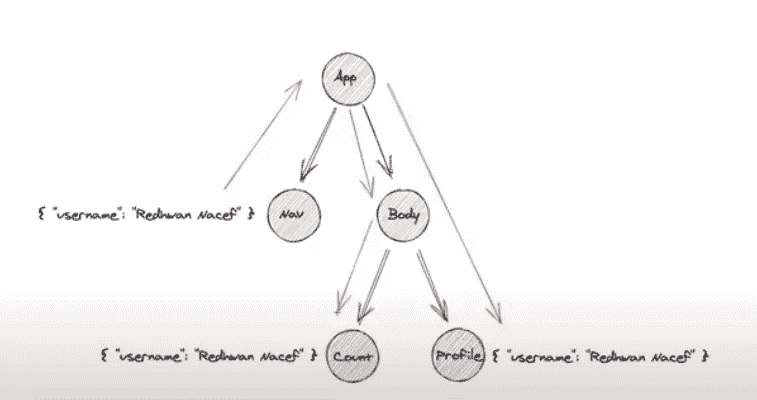
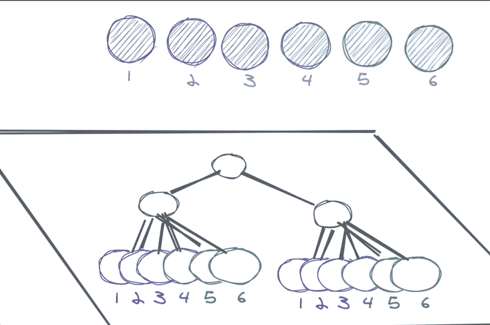
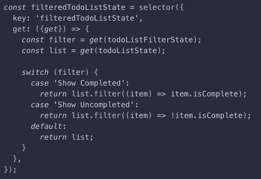

# React 状态管理的未来？

> 原文：<https://betterprogramming.pub/recoiljs-the-future-of-react-state-management-ffb1345833b6>

## 深入了解脸书新国家管理图书馆

拉詹的照片— [来源](https://medium.com/swlh/recoil-a-better-react-state-management-library-c136c41a5578)

脸书最近在欧洲的年度 React 会议上推出了作为开源状态管理库的[反冲](https://recoiljs.org/)。

它旨在:

1.  尽量少反应。
2.  通过纯函数和高效订阅驯服派生数据和异步查询。
3.  在不影响代码拆分的情况下，进行跨应用程序的观察和调试。

引用[丹·阿布拉莫夫](https://twitter.com/dan_abramov/status/1262141017421209604)**(Redux 的原作者)回到 2019 年 5 月:**

> **“首先，后坐力只在少数地方使用。脸书是一个巨大的代码库(> 100，000 个组件)，你不能期望某个单一的方法在任何地方都能使用。有几个地方也在用 Redux。但这并没有解决反冲试图解决的问题。”**

**从那以后，后坐力的受欢迎程度急剧上升。在撰写本文时，反冲已经获得了超过 10k+ GitHub 星，是前十名的每周趋势 JS GitHub repos，其每周 NPM 包下载自发布以来一直呈上升趋势。当您考虑到该库仍处于试验阶段，并且对于生产级应用程序来说太不稳定时，这是非常令人印象深刻的。**

***注:脸书已经成功地在生产中为其一些内部工具部署了反冲。***

**那么这一切炒作是为了什么？反冲试图解决的那些问题是什么？还有…**

# **我们是怎么到这里的？**

**让我们快速看一下促使脸书工程团队开发后坐力的一些潜在驱动因素。我们将会看到与其他常见的流行状态管理解决方案相比，反冲提供了一些独特的优势，例如Redux 和 Hooks/Context API。**

## ****Vs. Redux****

*   **更少的样板代码——反冲可以用更少的代码完成与 Redux 相同的关键功能，比如向存储订阅组件和分派动作**
*   **更容易的学习曲线——实现 Redux 需要大量的设置开销。你有一个商店，reducers，`mapDispatchToProps`，`mapStateToProps`，这样的例子不胜枚举…**
*   **并发模式支持——反冲与并发模式兼容，但 Redux 没有纳入兼容性的计划。**

## ****Vs .上下文 API****

*   **无上下文的地狱——尽管 Context API 的样板文件比 Redux 少，但是具有不确定数量的提供者的应用程序可能会导致您的 React 应用程序看起来像这样:**

*   **更高效、更具性能的更新——由于状态变化而导致的不必要的渲染会影响应用程序的性能。这是上下文 API 的一个问题，因为上下文提供者值的更新会导致订阅该值的组件有时不得不进行不必要的重新呈现。**
*   **不限于低频率更新— 当与高频率更新一起使用时，Context API 的性能会急剧下降，并且最终它从未打算以那种方式使用。**

**现在让我们更深入地了解反冲的核心概念以及它如何管理状态。**

# **反冲核心概念**

**假设我们有一个如下所示的应用程序:**

****

**Redhwan Nacef 的反冲教程。**

**我们看到 NavBar、Body、Profile 和 Count 组件都订阅了相同的用户名状态:“Redhwan Nacef。”**

**我们的组件树看起来像这样:**

****

**Redhwan Nacef 的反冲教程。**

**在组件树中，导航组件与计数和配置文件组件“相距数英里”。为了在所有组件之间共享相同的状态，您通常会做的是从应用程序到计数和配置文件的适当钻取状态。**

**我们知道这在较大的应用程序中不能很好地扩展，因为当状态改变时，它会导致组件不必要的渲染。**

**那么反冲如何解决这个问题呢？**

**为了回答这个问题，我们将介绍原子和选择器。**

**我们可以想象将组件树平铺在一个平面上，与该平面正交的是原子和选择器。**

****

**React 欧洲会议 [2020 反冲演示](https://www.youtube.com/watch?v=_ISAA_Jt9kI)**

**原子是组件可以订阅的状态单位。您可以订阅和更新它们，但这里的关键是，当每个原子的状态改变时，只有订阅了该原子的组件才会被重新呈现。**

****

**官方文件:原子**

**一旦创建了一个原子并声明了状态(类似于 Redux store)，您就可以通过使用以下任一方法为该原子订阅组件:**

1.  **`useRecoilValue`**
2.  **`useRecoilState`(类似于钩子中的`useState`)**

**选择器代表一个派生状态，当您想要一个从多个原子或依赖项派生的输出时，它是适用的。下面的反冲文档显示了一个很好的例子:**

****

**反冲 JS [公文](https://recoiljs.org/docs/basic-tutorial/selectors/):选择器**

**如果你有兴趣了解更多，请查看本系列的[第 2 部分](https://medium.com/@guizzettic/2e242d4509ae)，在那里我们将深入了解当前存在反冲的开发者工具的情况。**

**撰稿人:Vincent Nguyen、Sanjay Lavingia、Jason Victor、Chris Guizzetti 和 Alexander Landeros。**