# 通过观察重构 API 规范

> 原文：<https://betterprogramming.pub/reconstructing-an-api-specification-through-observation-d7bd7b0e5b6d>

## 通过观察请求来构建安全的 API


在 [Unsplash](https://unsplash.com?utm_source=medium&utm_medium=referral) 上由[Nejc sokli](https://unsplash.com/@nejc_soklic?utm_source=medium&utm_medium=referral)拍摄的照片

API 在现代微服务架构中无处不在。它们使得从外部应用程序消费数据变得容易，并减少了开发人员需要编写的代码量。总的结果是更容易交付有用的软件产品。然而，API 的流行意味着它们代表了一个很大的攻击面。事实上， [Gartner 预测](https://www.gartner.com/en/webinars/4002323/api-security-protect-your-apis-from-attacks-and-data-breaches)到 2022 年，API 攻击将成为企业 web 应用程序最常见的攻击媒介。同样，IBM 的一份报告发现三分之二的数据泄露可以追溯到错误配置的 API。

显然，企业需要采取主动的方法来确保他们对 API 的使用是安全的。不幸的是，由于现代应用程序的复杂性、第三方代码依赖性和文档的缺乏，API 可观察性是一个巨大的挑战。通常，企业对于他们的生产应用程序没有任何 API 规范。因此，与安全相关的错误配置未被发现，应用程序在生产中使用各种不推荐的“僵尸 API”和未记录的“影子 API”。

解决这个问题的基本第一步是创建一个 API 规范，并用它来审计和记录您的应用程序使用的 API。理想情况下，我们可以简单地通过观察真实应用程序中的 API 流量来创建 API 规范。在过去，没有简单的、可伸缩的、开源的工具能够做到这一点。现在，我们有了[API clarity](https://apiclarity.io/)——一个用于 Kubernetes (K8s)集群的开源 API 流量可见性工具。它是专门为解决这一差距而构建的，并支持通过观察进行 API 重构。

在这篇文章中，我们将看看什么是 API 重构以及 APIClarity 如何解决 API 可观测性问题。然后，我们将通过一个在 K8s 上运行的基于微服务的应用程序来使用 APIClarity 的实际例子。

# API 重构的重要性

简而言之，API 重构就是通过观察进出 API 的流量来构建 API 规范。如果做得好，API 重构可以让您了解微服务使用的 API，并使您能够评估 API 安全风险。一旦建立了规范，相同的工具可以将运行时流量与规范进行比较，以检测偏差。

API 规范的关键组成部分包括:

*   参数检测(路径、头参数、查询参数、请求体参数和 cookies)
*   对象引用
*   文件传输
*   安全性定义

理想情况下，API 重建工具需要以符合 OpenAPI 规范(OAS)的格式量化这些组件，而不会给应用程序带来不必要的开销或复杂性。在 APIClarity 之前，有几个工具部分解决了 API 重构用例，但是没有全面的开源解决方案。其他一些 API 可见性工具包括:

*   Optic —一个可扩展的、与语言无关的开源工具。它对于在部署之前记录、审查和批准 API 很有用。
*   [SwaggerHub](https://swagger.io/tools/swaggerhub/) —一个将 API 流量转换为 OAS 的流行工具。
*   [CloudVector API Shark](https://www.cloudvector.com/api-shark/) —可以监控多服务环境，并根据运行时流量生成 OAS 规范。
*   Imvision —用于多服务环境的强大 API 可见性和文档工具。

Optic 不是为监视多服务环境而构建的，SwaggerHub 也没有与运行时环境集成。API Shark 和 Imvision 都不是开源的。上述工具都不能完全满足 API 重构的需要。

# APIClarity 如何解决 API 重构和可见性挑战

APIClarity 填补了其他工具留下的空白，提供了一个健壮的、开源的、可扩展的多服务 API 可见性和重构解决方案。它可以使用服务网格框架轻松集成到现有环境中。使用 APIClarity，开发人员可以导入一个 API 规范或者根据观察重新构建一个 API 规范。开发人员还可以实时监控所有 API 流量，无需更改代码或工作负载。

那么，它是如何工作的呢？

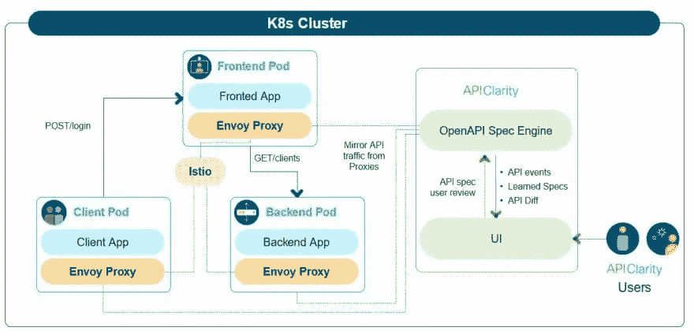

[图像来源](https://github.com/apiclarity/apiclarity/blob/master/diagram.jpg)

*   APIClarity 部署在现有的 K8s 集群中
*   API 流量从集群中的 pod 镜像到 APIClarity 的 OpenAPI 规范引擎
*   规范引擎监控内部和外部流量，并记录 API 事件
*   APIClarity 基于 API 流量学习规范并构建 API 规范
*   用户审阅、编辑和批准规范
*   APIClarity 提醒用户注意安全问题，或者观察到的 API 和批准的 API 规范之间是否存在任何偏差

# APIClarity 在行动:一个演练

现在我们知道了什么是 APIClarity，让我们深入我们的教程，看看它在 K8s 集群和基于微服务的应用程序中的运行情况。在这里，我们将:

1)在我们的 K8s 集群中部署 [Sock Shop app](https://microservices-demo.github.io/) 。虽然我们将使用 Sock Shop 作为我们的示例应用程序，但是您可以将自己的应用程序部署到您的集群中，并继续使用。
2)在我们的 K8s 集群中部署 APIClarity 并配置监控
3)观察 APIClarity 仪表板上的 API 流量
4)查看并创建 API 规范，并查看生成的 Swagger 格式的 OpenAPI 规范。
5)识别与 API 规范的偏差以及影子和僵尸 API 的使用。
6)查看和过滤 API 事件

## 先决条件

要跟进，您需要:

*   定义了缺省值`StorageClass`的 Kubernetes 集群
*   Istio 1.10 或更高版本，安装在集群上

您的 K8s 集群可以部署在您喜欢的任何平台上，包括 minikube。虽然 APIClarity 支持代理 API 流量的多个集成，但您需要[下载并安装 Istio](https://istio.io/latest/docs/setup/getting-started/#download) 。

## 在 K8s 集群中部署 Sock Shop 应用程序

我们将使用流行的 [Sock Shop 微服务应用](https://microservices-demo.github.io/)作为我们的测试应用。通过 14 个不同的微服务和一个交互式前端，这是在 K8s 集群中测试 API 流量的一个很好的方法。

1)创建`sock-shop`名称空间。

```
kubectl create namespace sock-shop
```

2)为`sock-shop`名称空间启用 Istio 注入。

```
kubectl label namespaces sock-shop istio-injection=enabled
```

3)在集群中部署 Sock Shop 演示应用程序。

```
kubectl apply -f [https://raw.githubusercontent.com/microservices-demo/microservices-demo/master/deploy/kubernetes/complete-demo.yaml](https://raw.githubusercontent.com/microservices-demo/microservices-demo/master/deploy/kubernetes/complete-demo.yaml)
```

4)获取`front-end`服务的节点端口。

```
kubectl describe svc front-end -n sock-shop | grep NodePort:
```

输出应该如下所示:

```
NodePort:                 <unset>  30001/TCP
```

5)在浏览器中连接到`http://<node_IP>:<NodePort>`。使用我们上面的例子，如果我们的节点的 IP 是 192.168.49.2，浏览到`http://192.168.49.2:30001`。如果不知道自己节点的 IP，可以用`kubectl get nodes -o yaml`或者`minikube ip`来验证。如果一切正常，袜子店演示应用程序应该加载。

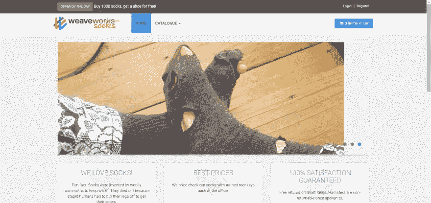

## 在我们的 K8s 集群中部署 APIClarity 并配置监控

首先，我们需要在集群中部署 APIClarity。

1)我们首先将 GitHub 存储库克隆到我们的主目录:

```
cd ~
git clone [https://github.com/apiclarity/apiclarity](https://github.com/apiclarity/apiclarity)
```

2)接下来，导航至`apiclarity`目录。

```
cd apiclarity
```

3)使用`kubectl`部署 APIClarity。使用默认的 apiclarity.yaml，名称空间将是`apiclarity`。

```
kubectl apply -f deployment/apiclarity.yaml
```

4)确认 pod 正在运行。

```
kubectl get pods -n apiclarity
```

输出应该如下所示:

```
NAME                          READY   STATUS    RESTARTS   AGE
apiclarity-679949b687-x25pb   1/1     Running   0          16m
apiclarity-postgresql-0       1/1     Running   0          16m
```

5)初始化并更新`wasm-filters`子模块:

```
git submodule init wasm-filters
git submodule update wasm-filters
```

6)导航到`wasm-filters`文件夹:

```
cd wasm-filters
```

7)运行 wasm `./deploy.sh`脚本，以便特使 wasm 过滤器可以捕获来自我们袜子店的流量。该脚本接受多个名称空间作为输入参数，例如`./deploy.sh <namespace_one> <namespace_two> <namespace_three>`，但是对于这个演示，我们只需要指定`sock-shop`名称空间。

```
./deploy.sh sock-shop
```

8)为 APIClarity 配置端口转发。

```
kubectl port-forward -n apiclarity svc/apiclarity 9999:8080
```

9)使用网络浏览器连接到`[http://localhost:9999](http://localhost:9999.)` [处的 APIClarity GUI。](http://localhost:9999.)

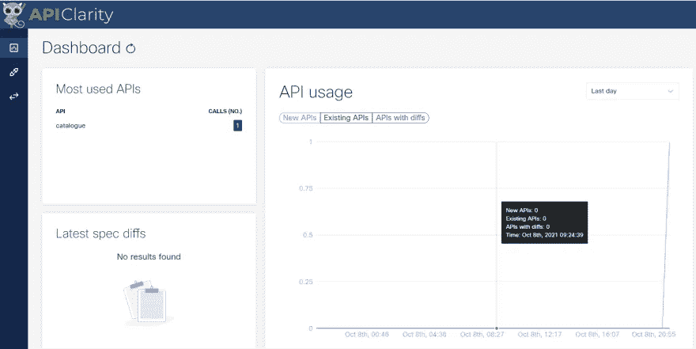

## 观察 APIClarity 仪表板上的 API 流量

现在，是时候产生流量了。首先点击袜子商店应用程序中不同的按钮和菜单。

亲提示:API 流量越多越好！更多流量=更多观察=更深入的可见性。对于我们演示的这一部分，我们只需要一点点流量，但是在生产中要记住这个原则。

在 Sock Shop 中生成一些 API 流量后，返回到 APIClarity 仪表板。您会注意到 APIClarity 记录了所有不同的 API 调用。在下面的例子中，我们可以看到对`catalogue`端点的 17 次调用，对`carts`的 8 次调用，以及对`user`的 3 次调用。我们还可以看到 APIClarity 是如何开始绘制 API 使用情况的。在我们产生更多的流量和创建我们的 API 规范之后，这些图表将变得更加有趣和有用。

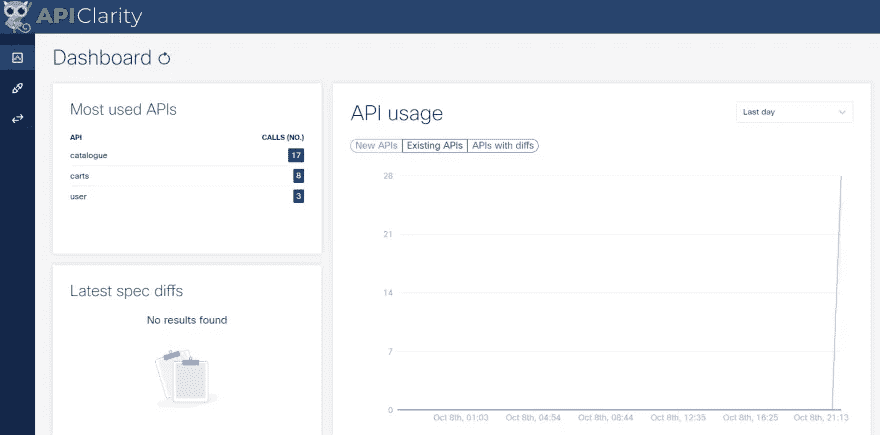

## 在 Swagger 中查看和创建 API 规范并查看文档

现在，让我们根据我们拥有的相对较小的流量创建一个 API 规范。

1)单击“最常用的 API”之一我就用`catalogue`。

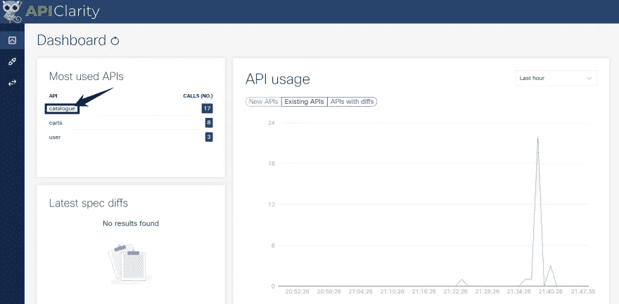

2)单击“重建”选项卡，然后单击“查看”

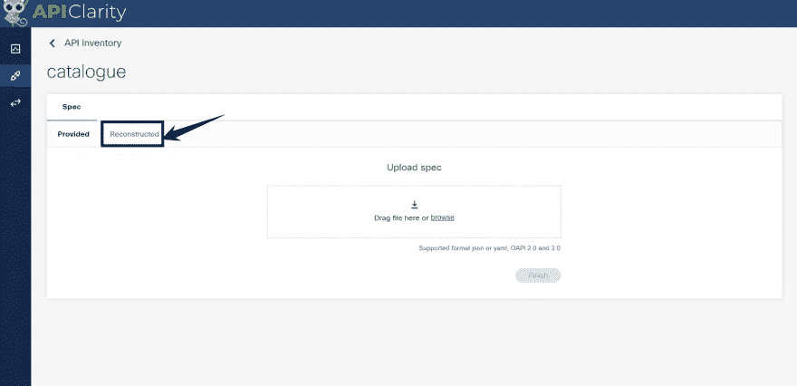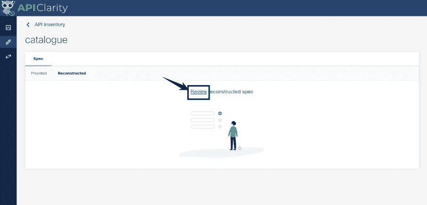

3)在这里，我们可以查看 API 路径、添加参数和合并条目。我将添加一个`example_param`并审核和批准路径。在这里，你可以随意试验你的选择。

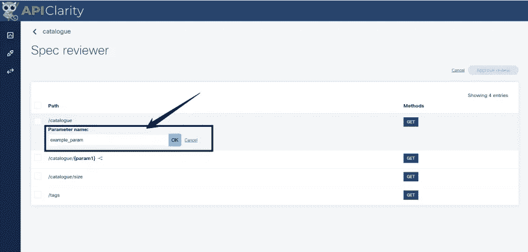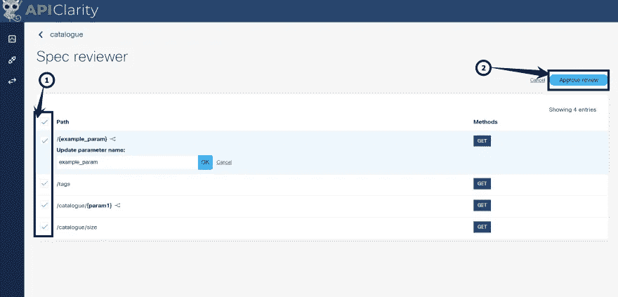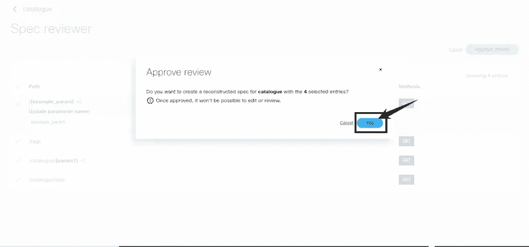

4)现在，我们有了一个 OAS API 规范。我们可以直接从 APIClarity GUI 中查看 Swagger 中的 API 文档。

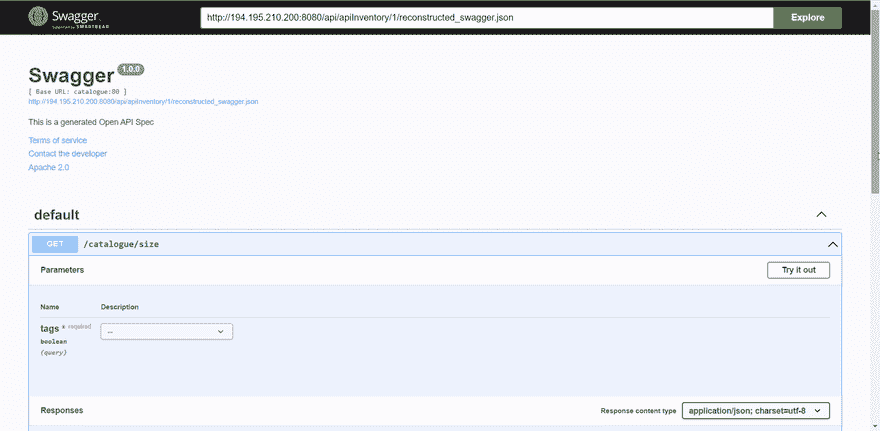

## 识别与 API 规范的偏差

现在我们有了一个 API 规范作为基线，APIClarity 可以标记与规范的偏差，以帮助检测安全问题和隐藏 API。要了解其工作原理，请返回到 Sock Shop GUI 并进行更多的实验。单击一些您上次没有使用的功能或过滤器。如果您创建了订单，请将其删除。这里的关键是执行一些规范中没有的动作。这些将被标识为“差异”

例如，这里我对不符合我的规范的`catalogue`端点进行了多次调用:

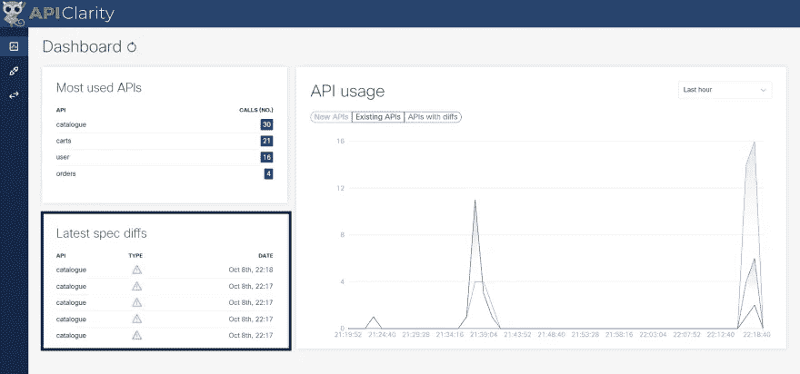

我们可以通过单击一个特定的差异来深入查看，并查看与规格有什么不同。这里我们可以看到检测到偏差，因为我的 API 调用缺少一些参数。

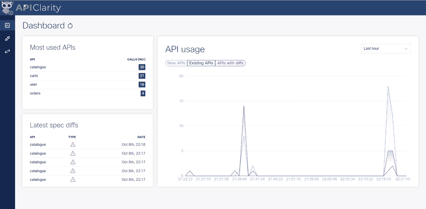

这是一个有文档记录的 API 调用的例子，其参数不同于规范。但是，如果 API 调用根本没有记录在规范中呢？在这种情况下，APIClarity 会将其标记为影子 API。

这正是这个 API 调用`carts`路径所发生的情况。在我们创建规范的时候，我们只观察到一个 GET 和一个 POST，所以这就是文档记录的内容。因此，删除调用超出了规范，被标记为影子 API。

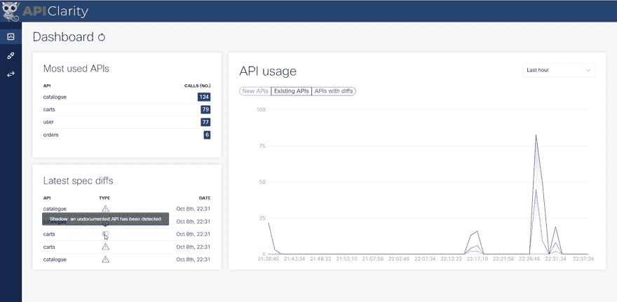

如您所料，这是一个合法的 API 调用，我应该记录下来。这个场景为我们提供了一个实际的例子，说明为什么在创建 API 规范之前让 APIClarity 捕获大量流量是有用的。

## 查看和过滤 API 事件

我们还可以用 APIClarity 查看和过滤 API 事件。

要查看事件，请单击事件图标:

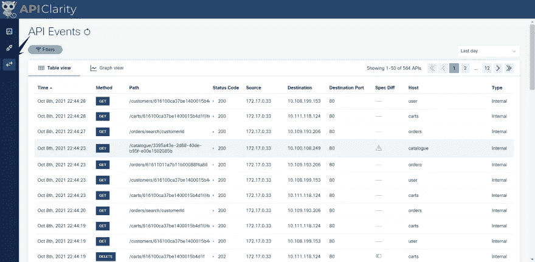

在这里，您将看到给定时间段内所有 API 事件的详细列表(“最后一天”是默认值)。我们还可以深入查看单个事件，就像我们在控制面板中所做的那样:

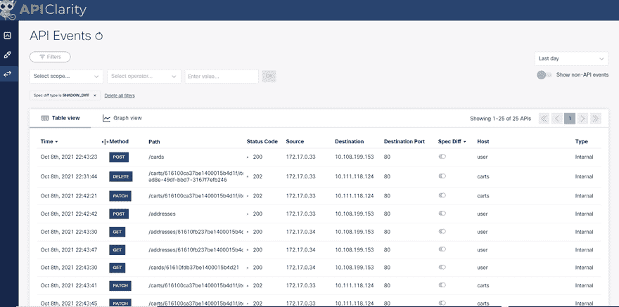

此外，您可以应用高级过滤器来搜索特定的 API 事件。例如，我们可以通过应用`Spec of type is shadow`过滤器来创建 APIClarity 观察到的所有影子 API 调用的列表。

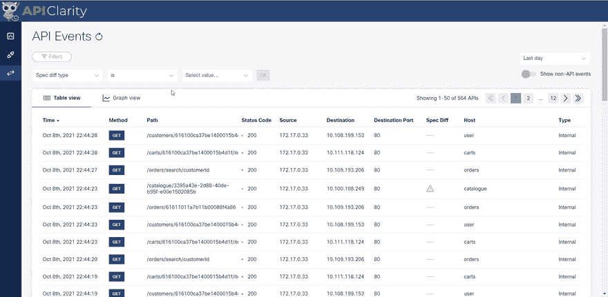

僵尸 API 的检测也是类似的。我们将修改过滤器来寻找`Spec of type is zombie`。如果我们的一个调用是对规范中一个不推荐的 API 的调用，那么我们会在这里看到它。

您可以混合搭配过滤器和排序结果，以实现各种不同的视图。这样，您就可以深入应用程序中的 API 事件。

# 最后的想法

作为一个[开源项目](https://github.com/apiclarity/apiclarity)，APIClarity 继续发展并接受来自开发者社区的贡献。

我希望你喜欢这个演练！这里我们只是触及了表面，对于 APIClarity 的 API 重构和流量监控有几个有趣的用例。除了提高 API 的可见性和安全性，它还支持模糊测试、客户机/服务器代码生成以及改进内部和面向用户的文档等用例。