# 在 Android 中重新创建按钮

> 原文：<https://betterprogramming.pub/recreating-a-button-in-android-97e5eac067bc>

## 创建外观和行为都像按钮的复杂布局

由 [Waldemar Brandt](https://unsplash.com/@waldemarbrandt67w?utm_source=medium&utm_medium=referral) 在 [Unsplash](https://unsplash.com?utm_source=medium&utm_medium=referral) 上拍摄的照片。

在本教程中，我们将学习如何在 Android 中通过将任何复杂的布局转换成按钮来创建复杂的按钮。

“但是我可以给任何视图附加一个`OnClickListener`。有什么好学的？”嗯，我们将创建复杂的按钮，不仅功能像按钮，而且在视觉上也像按钮一样。我指的是两件事:

*   正如[材料设计指南](https://material.io/design/environment/elevation.html)所指示的那样，布局会随着您的点击而改变标高。

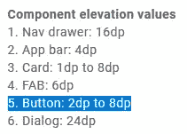

Android 中按钮的预期高度变化

*   当你点击它时，布局会显示一个涟漪效果，就像普通的按钮一样。

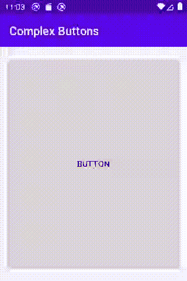

连锁反应

在我们深入讨论之前，我将快速确认一下默认按钮是可以稍微定制的。你可以给它添加一个图像或者改变它的背景，但是当你想要更多的自定义它的时候，这变得更加困难。

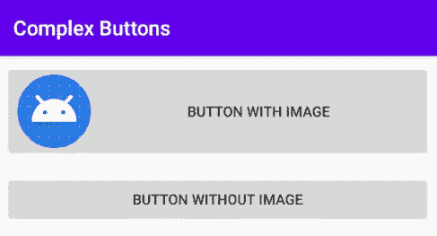

带图像和不带图像的默认按钮

首先，我们需要一个布局。我把那个留给你。你的任何布局都可以。对我来说，我会选择一个角落有两个 T2，中间有几个 T3 的 T1。我将 XML 布局资源文件命名为`custom_button`。

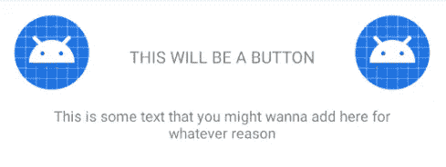

自定义按钮. xml

为了简单起见，我将把它直接包含到活动的布局中。当然，你可以把它作为`RecyclerView`物品或者随便你怎么用。

activity_main.xml

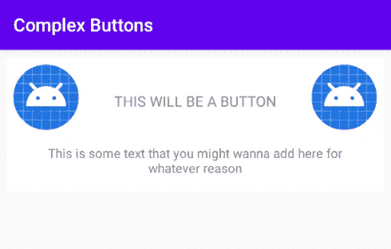

现在，确保你设置了`custom_button`的背景，这样它就不会是透明的。否则，您将看不到我们正在做的更改。稍后我们将再次更改背景属性，但是现在，将其设置为任意颜色。我会选择白色。

custom_button.xml(表头)

现在我们已经设置好了，让我们来处理高程和涟漪效应。

# 海拔

你要做的第一件事是给`custom_button`添加一些属性，让 Android 知道它是一个可点击的项目，并且根据材料设计指南，它有一个默认的 2dp 高度。为此，我们将属性`clickable`和`focusable`设置为`true`并将`elevation`设置为`2dp`。

custom_button.xml(带有可单击、可聚焦和仰角的标题)

我们的`custom_button`现在开始看起来更像一个按钮，但当点击时，它不会在视觉上发生变化。

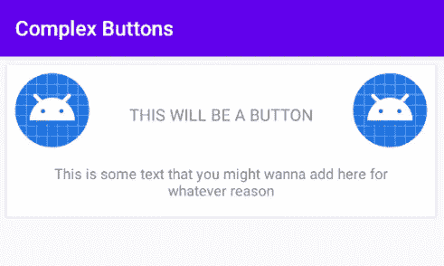

具有 2dp 仰角的自定义按钮

为了基于布局的状态(例如，是否按下)应用立面动画，我们需要利用布局本身的`stateListAnimator`属性。在此之前，我们需要添加一个动画师，我们将首先定义动画。

要做到这一点，去你的休息区。如果找不到动画师资源目录，可以右键点击 res -> New -> Android 资源目录添加。

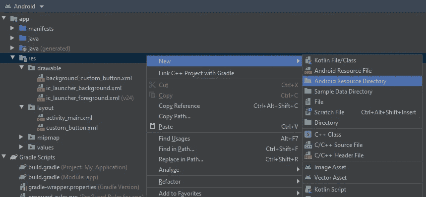

然后在“新资源目录”弹出窗口中，在资源类型中选择“animator ”,然后单击“确定”。

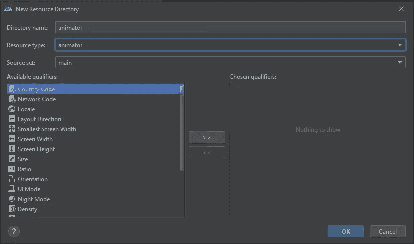

你现在应该有一个动画师资源目录。是时候加个动画师了。右键点击动画->新建->动画资源文件。

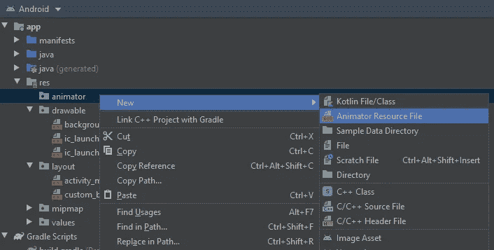

将文件命名为`button_elevation_animator`，选择选择器作为根元素，然后点击确定。

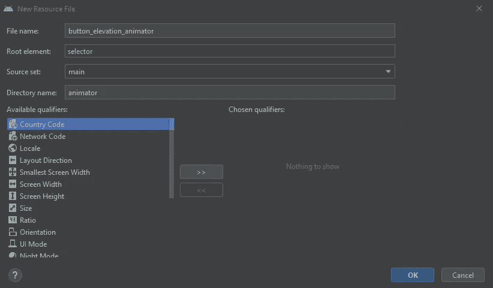

动画师会有物品。每个项目将定义它将应用一些动画的状态。每个项目还将有一个`objectAnimator`，它将定义动画的持续时间，它将激活的属性，以及它将应用于该属性的值更改。

谈到海拔，我们关心的地产是`translationZ`。根据材料设计指南，我们希望将其增加 6dp(在原始标高的基础上增加),这样总标高为 8dp。我们还希望在布局启用并按下时出现动画。否则，将高程值更改设置回 0dp(原始高程)。

button_elevation_animator.xml

随意改变动画的持续时间。不过我选择了一个预定义的`shortAnimTime`，200 毫秒。

为了应用这个状态动画，我们将它设置为之前制作的`custom_button`的`stateListAnimator`。

custom_button.xml(带有 stateListAnimator 的标题)

瞧啊。现在`custom_button`将根据它的状态增加和减少仰角(从它的阴影可以看出)。

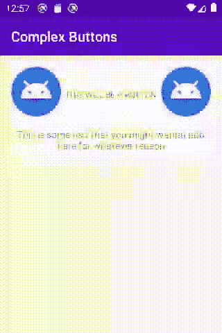

点击时高度增加到 8dp

# 涟漪效应

添加涟漪效果就像创建一个可应用于`custom_button`背景的涟漪效果 drawable 一样简单。右键点击可绘制- >新建- >可绘制资源文件。

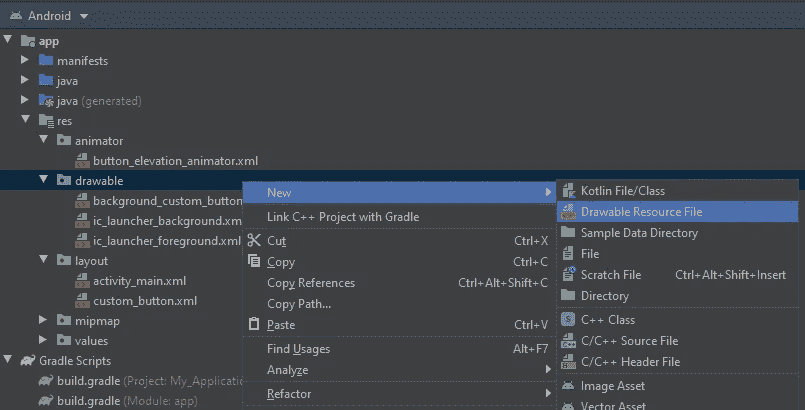

选择 ripple 作为根元素，命名为`button_ripple`，然后点击 OK。

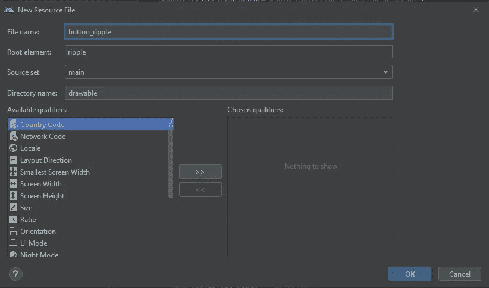

`ripple`根元素需要有一种颜色(波纹的颜色)，并且它将有一个有形状的项目(它将添加波纹效果的视图的形状)。我们还将在此处将形状的颜色(形状的背景色)设置为白色，因为我们将替换先前直接设置为白色的背景属性。

按钮 _ 波纹. xml

现在我们可以回到`custom_button.xml`，将背景设置为`button_ripple`。

custom_button.xml(带有波纹背景的页眉)

就是这样！现在你有了一个布局，点击时看起来就像一个按钮！你可以简单地给它添加一个`OnClickListener`，它就会像一个按钮一样工作！

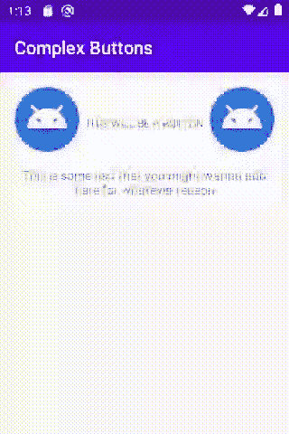

决赛成绩

# 结论

感谢阅读。我希望这对你有用。直到下一次，这是开发咬签出！

# 资源

*   [立面材料设计指南](https://material.io/design/environment/elevation.html)