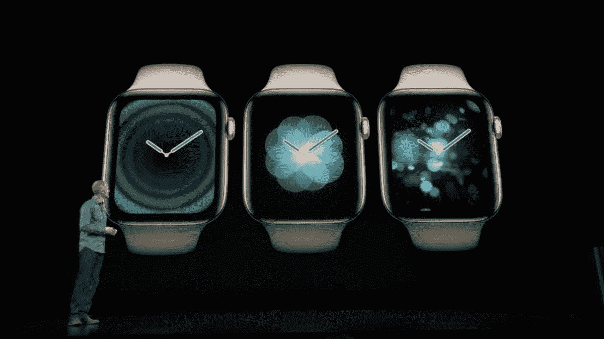
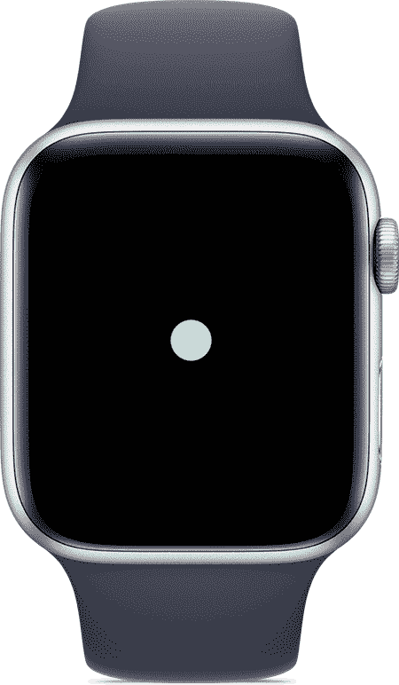
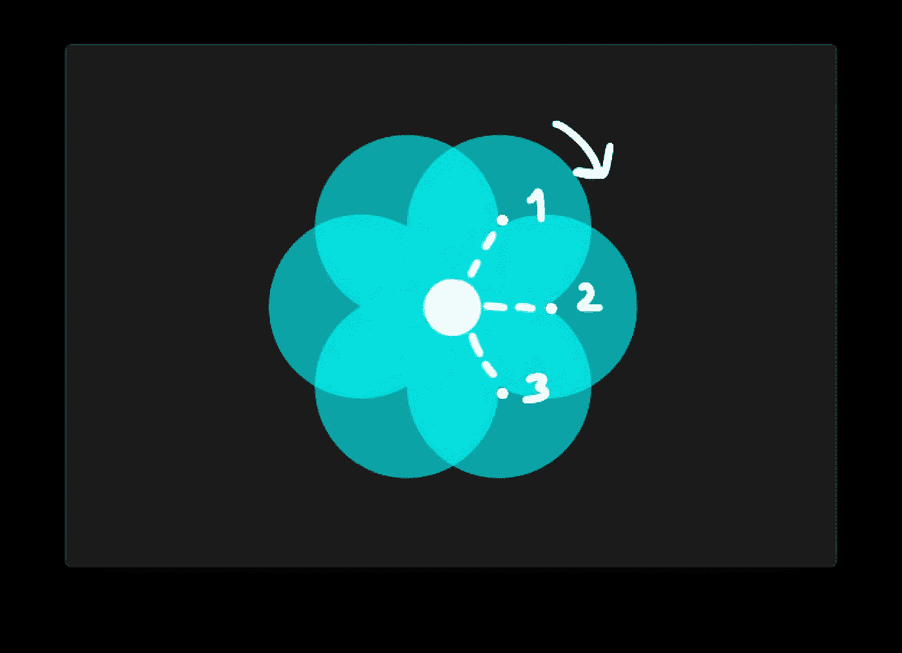
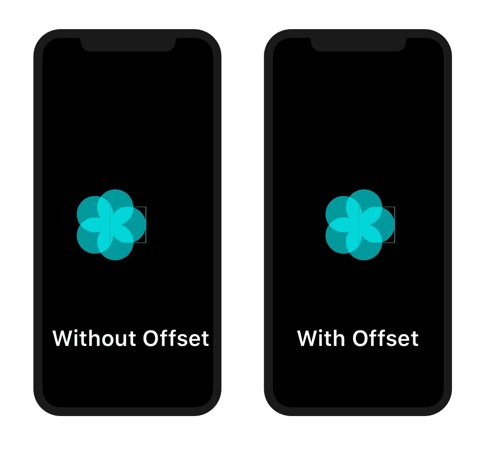
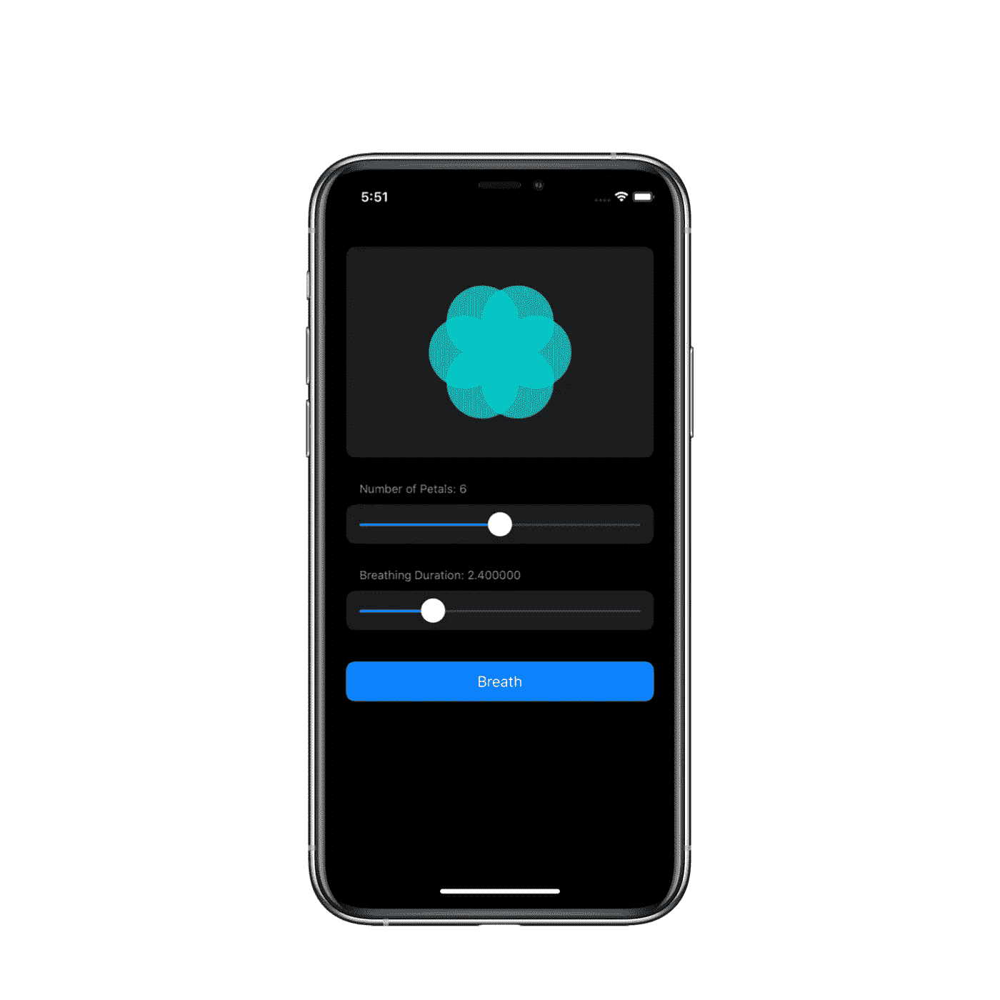
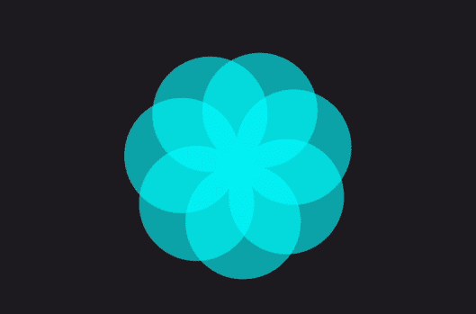
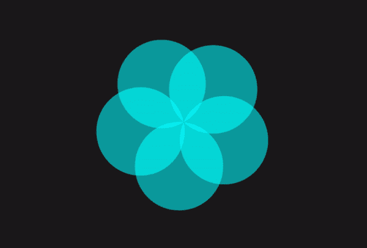
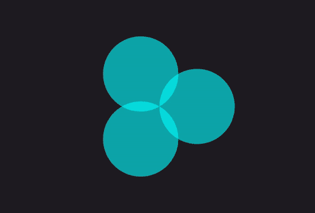
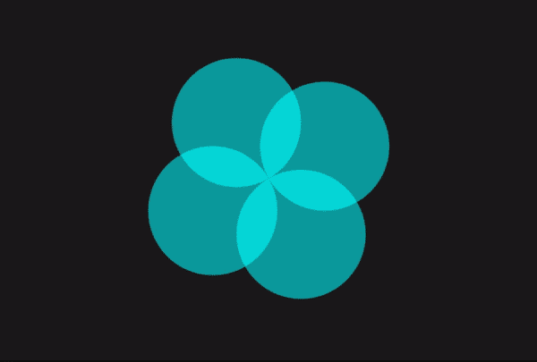

# 在 SwiftUI 中重现苹果的呼吸动画(第 1 部分)

> 原文：<https://betterprogramming.pub/recreating-apples-breathing-animation-in-swiftui-part-1-3848c5558fb6>

## 学习 SwiftUI 的核心概念，同时重现他们著名的呼吸 UI

图片来源:苹果

你可能已经看过并玩过 Apple watch 上的呼吸应用。这一系列的效果和过渡带来了惊人的体验。

今天，我们将使用 SwiftUI 的基本修饰符在不到 100 行代码中重新创建它！

我们将把用户界面分为以下几个部分:

*   一个可重用的组件，创建花并处理所有的动画逻辑
*   iOS `ContentView`:操控`FlowerView`状态的控制室。

注意:确保你在测试时使用的是黑暗模式，因为这是动画看起来最令人惊叹的环境。

# 创建 FlowerView

让我们首先创建一个新的 SwiftUI Xcode 项目和一个名为`FlowerView`的视图，并添加所有必要的属性:

*   `isMinimized`:跟踪动画状态的布尔值
*   `numberOfPetals`:该变量是一个 Double，用于动画添加/移除花瓣
*   `animationDuration`
*   `circleDiameter`:代表每个花瓣的大小
*   `absolutePetalAngle`:圆周除以花瓣数得出每个花瓣旋转的绝对角度

现在，您还需要更新`FlowerView_Previews`并用常量初始化您的绑定属性。

向前到身体！

花是通过添加多个围绕花的中心点旋转和相交的圆制成的。我们将通过在`ForEach` 的帮助下添加一个圆形数组来创建它，并将它嵌入到一个`ZStack`中。

神奇的部分是，我们将使用`.rotationEffect()` 修改器，并围绕其主要锚点(即花的中心)旋转圆。

锚点是视图中应该固定在旋转中心位置的部分。

花卉景观的主体

现在我们需要根据圆的半径来调整`.offset()`和`ZStack`，因为我们想要根据花的中心而不是初始圆的中心来确定视图的中心。

在我们继续之前，您还需要添加`.animation()`修饰符，以便在我们更改绑定属性时使我们的视图动画化。

# 更新内容视图

现在我们将在屏幕上工作，让我们操纵花的属性和切换动画状态。为了简单和美观，我们将为每个视图创建一个列表和部分:

*   `FlowerView`
*   用于改变的滑块`numberOfPetals`
*   用于改变`breathingDuration`的滑块
*   用于触发动画的按钮

内容视图

用于操作`numberOfPetals`的第一个滑块检查**`onEditingChanged`属性，并检测用户何时完成拖动滑块。这允许我们`.round()`**`numberOfPetals`，所以我们永远不会以 2.5 瓣或类似的东西结束。****

****关于按钮，我的实现有点挑剔，由`DispatchQueues.`组成，这背后的原因是在花完成收缩后立即切换`isMinimized` ，使它重新展开。****

****请随意创建您自己的实现；省略`DispatchQueue`完全没问题。****

****我讨厌的按钮实现****

********

# ****呼吸动画****

****我们一直在等待的！这部分有点复杂，但是不要担心——swift ui 让它变得轻而易举。****

********

****我们将动画分成三个部分:****

*   ****花卉视图的旋转****
*   ****花卉景观的规模****
*   ****每个花瓣的旋转****

****要实现前两个部分，相当容易。我们将使用`.rotationEffect()`和`.scaleEffect()`修饰符以及三元运算符来根据`isMinimized`状态改变值。****

****将此添加到来自`FlowerView`的`.animation()`修改器上方。****

********

****要创建所有花瓣都来到中心的效果，只需将锚点从每个花瓣的`.rotationEffect()`更改为`.center`即可。****

# ****瞧啊。****

****我们只写了不到 100 行代码，我们已经有了一些看起来与我们的目标极其相似的东西。****

********

# ****还有一件事…****

****我们可以做一件事来进一步改进这个动画。如果你仔细看，每当我们添加或删除一个花瓣，它立即出现在屏幕上。让我们试着解决这个问题。****

****为了快速解决这个问题，我们将总是展示一个额外的花瓣，准备动画其不透明度。根据花瓣的位置计算 alpha 值涉及到一点数学问题，但是不要担心，我已经为你想好了一切。****

****让我们对`FlowerView`进行这些更改。确保将`ForEach`的范围从`0<Int(numberOfPetals)`修改为`0…Int(numberOfPetals)`。****

****让我们也给`ContentView`添加一个专用的`petalDuration` 属性，它只用于这个微妙的动画。为了确保正常工作，您需要在`breathDuration` 和`petalDuration`之间动态切换。****

********

# ****结论****

****我做这个项目是为了展示开始使用 SwiftUI 和动画是多么简单。这种疯狂的力量来自函数式编程范式和数据绑定，它们完美地协调工作，使您的代码保持更新和流畅！****

****如果你想在这个项目上更进一步，你可以看看这个教程的第二部分，在那里我们探索了如何创建出血模糊效果，并讨论了视图转换。****

****如果你只对源代码感兴趣，这里有 [GitHub repo](https://github.com/Pondorasti/WatchOSBreathingAnimation) 。****