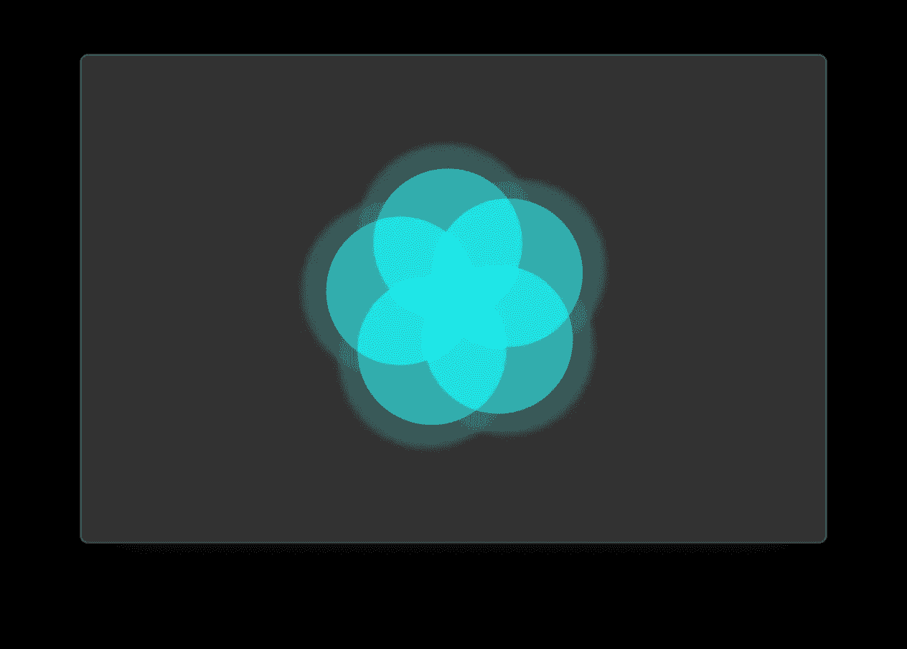
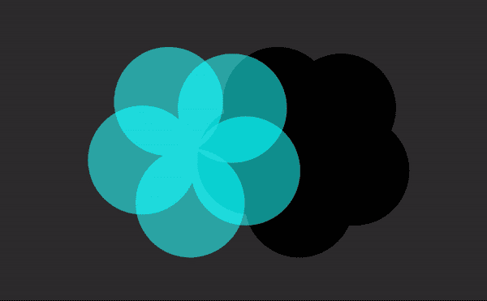
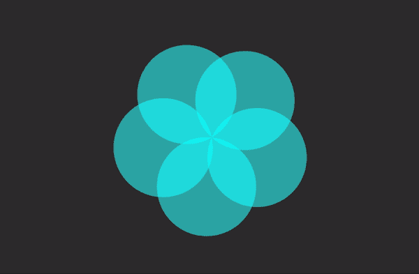
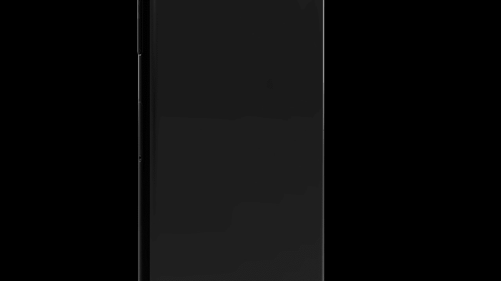

# 在 SwiftUI 中重现苹果的呼吸动画(第二部分)

> 原文：<https://betterprogramming.pub/recreating-apples-breathing-animation-in-swiftui-part-2-d548e690c542>

## 探索如何创建当你开始呼吸时发生的模糊效果

模糊-淡化效果(图片来源:作者)

如果你对我们如何创建花和呼吸动画感兴趣，你可以看看这个教程的第一部分。

为了达到这个惊人的效果，我们要把问题分成两部分。我们需要做以下两件事:

1.在花卉视图周围创建一个遮罩

2.创建模糊淡化效果

如果你对我们正在做的事情和原因有点困惑，请稍等片刻。它将在接近尾声时开始变得有意义。

# 在花卉视图周围创建一个遮罩

你可能会认为这相对容易——只需给花卉视图添加一个`.background()`修饰符，然后就到此为止，但是…

使用背景修改器的遮罩

如您所见，这并没有完全解决问题。因为花卉视图由多个圆组成，所以为花卉视图创建背景的最简单的方法是使用与动画同步的整个其他花卉视图。

让我们通过在一个`ZStack` 中嵌入我们的原始`FlowerView`来实现它，并添加第二个`FlowerView`作为背景。对`ContentView`进行这些更改。

并列示例

# 模糊淡化效果

如果我们仔细观察，模糊淡入淡出动画有三个要点:

*   模糊效果
*   不透明度从 1 变到 0
*   落后于原来的萎缩动画

模糊效果

我们将通过在`ZStack`上增加另一个`FlowerView`来实现这一点，这应该不会让你感到惊讶。

这一次，我们将隐藏和显示基于`isMinimized`属性的第三个`FlowerView`，并创建一个自定义过渡修改器，该修改器应该在缩小时创建模糊淡入淡出效果。

创建新的 Swift 文件或将其添加到`ContentView`之后。

快好了！现在我们来添加最后的`FlowerView`。我们还将创建一个基于`breathingAnimation`持续时间的`fadeDuration`属性。

请注意，我们使用的是非对称过渡，因为我们不希望模糊淡化效果双向。

最终产品

# **结论**

正如你所看到的，通过使用简单的内置形状和动画，我们成功地合成了一个非常复杂的动画。

如果你觉得自己足够勇敢，现在我鼓励你尝试制作自己的动画！PS:一定要发微博告诉我。

这是带有完整项目的 [GitHub 回购。](https://github.com/Pondorasti/WatchOSBreathingAnimation)