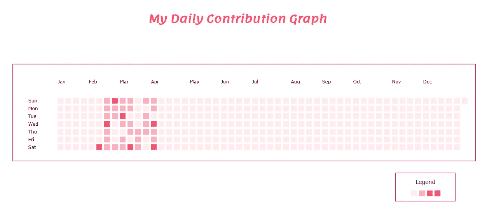
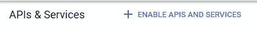
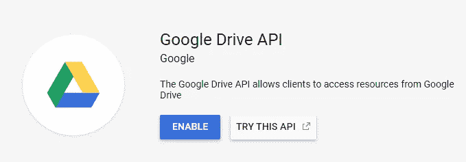
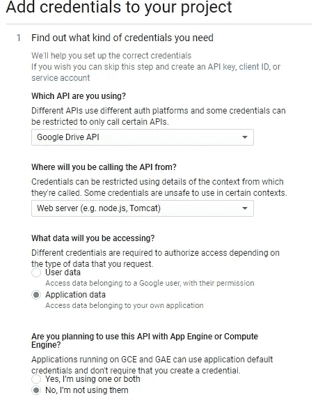
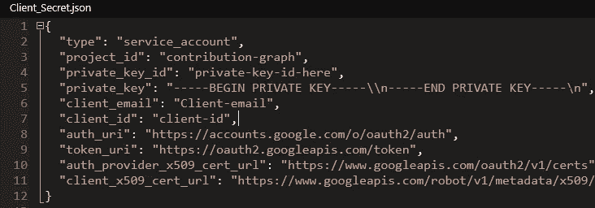
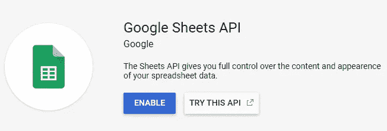
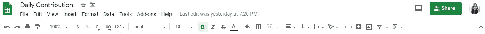
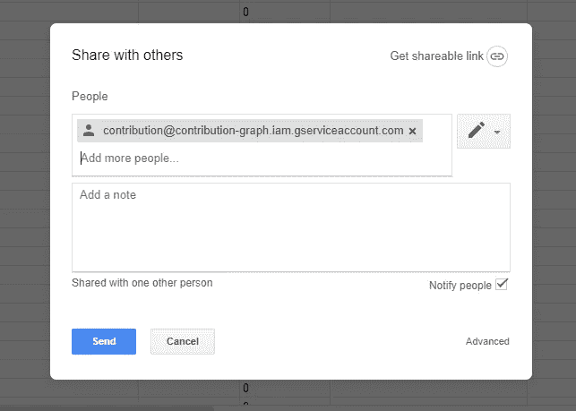

# 使用 Flask 和 Google Sheets 重新创建 GitHub 的贡献图

> 原文：<https://betterprogramming.pub/recreating-githubs-contribution-graph-using-python-flask-and-google-sheets-73ce9c096784>

## 一致性孕育一致性

GitHub 的贡献图克隆

我是一个效率狂。我曾经每天用纸和笔来监控我的任务。然后，随着任务变得越来越复杂，我开始将它们记录在电子表格中。这种方法在四周内都很有效，但后来我失去了动力。我需要有人督促我按部就班。这就是贡献图出现的地方。

如果你使用 [GitHub](https://github.com/) ，你会在你的个人资料中看到热图，显示你一年中每天的贡献(提交、拉取请求等)——如上图所示。我每天都在做一个项目，以保持我的 GitHub 连胜——一直讨厌我个人资料中的灰色方块！我在 Node.js 找到了[这个教程](https://levelup.gitconnected.com/how-to-create-a-tracker-like-the-github-contribution-graph-with-node-js-and-google-sheets-5e915c668c1)，但是我喜欢 Python，所以我自己用 [Flask](https://flask.palletsprojects.com/) 和 Google Sheets API 做了一个。

在本教程中，我将介绍从创建应用程序到在 Heroku 上部署它的每个步骤。我也将分享我发现的错误，以及它们的解决方案。

## 设置您的项目环境

让我们从创建一个项目工作环境开始。我假设您已经在系统中安装了 Python(最好是 Python 3)和 pip 否则，请在这里下载 Python [并按照说明进行操作。Pip 是 Python 的包管理器，有助于安装应用程序所需的附加库和依赖项。在命令提示符下使用以下命令检查是否安装了 pip:`pip --version`。](https://www.python.org/downloads/)

1.  您希望为您的应用程序及其依赖项提供一个隔离的环境，所以从设置一个[虚拟环境](https://docs.python.org/3/library/venv.html)开始。导航到您想要设置项目的新目录，打开命令提示符并使用命令`pip install virtualenv`安装 [virtualenv](https://pypi.org/project/virtualenv/) 。
2.  通过键入`pip install virtualenvwrapper-win`安装 [virtualenvwrapper](https://virtualenvwrapper.readthedocs.io/en/latest/) ，这是 virtualenv 的一组扩展(注意:此命令仅适用于 Windows。对于基于 Unix 的环境，请遵循[本](https://medium.com/@gitudaniel/installing-virtualenvwrapper-for-python3-ad3dfea7c717)教程。
3.  输入`mkvirtualenv your-env-name`创建一个虚拟环境。
4.  您可以使用`workon your-env-name`激活虚拟环境，并使用`deactivate`命令将其停用。
5.  虚拟环境启动并运行后，通过输入`pip install flask`安装 flask。

# 创建您的投稿电子表格

现在，继续创建作为数据库的电子表格。你可以在这里看看我的表[。它有四个字段:](https://docs.google.com/spreadsheets/d/13E-axJ2W2t__bU-Y79rUgHKFbScNiyeIUXOx3xWqJs4/edit#gid=0)

*   `Date`，我把这个字段格式化成类似 GitHub 的格式。你可以随意设置格式。
*   `Task`、*、*包含每个任务的名称及其描述(可选)。
*   `Number of Tasks` *，*，包含了任务的计数。
*   `Level` *，*其中使用公式`=IF(C2=0,"0",if(C2<=2,"1",if(C2<=4,"2","3")))`计算等级，基于任务数的计数。整个列都用这个公式填充。

您可以随意定制这些字段，但必须有一个类似的字段级别，因为它用于确定图形中每个方块填充的颜色。

# 获取 API 以使用您的电子表格

这一步至关重要，因为它允许我们的应用程序与 Google Sheets 连接:

*   转到[谷歌开发者控制台](https://console.developers.google.com/)，用你的谷歌账户登录。
*   创建一个新项目，然后单击 enable API。

启用 API 按钮

*   寻找 Google Drive API，点击“启用”。

Google Drive API

*   启用 API 后，单击“创建凭据”。将会打开一个凭据向导。如下所示填写每个字段。

Google 开发者控制台中的凭证向导

*   在第二步中，命名您的服务帐户并选择“角色”>“项目”>“编辑器”。单击“继续”,它会生成一个. json 文件，如下所示。改名为`Client_Secret.json`。

客户端 _ 秘密. json

*   如果你现在尝试访问你的电子表格，你会得到`Insufficient Permission`错误。
*   除了 Google Drive API，您还必须启用 Google Sheets API。

谷歌工作表 API

*   启用 API 后，转到要从中提取数据的工作表，然后单击“share”按钮。

共享您的工作表

*   在`Client_Secret.json`里会有一个`client_email`。复制电子邮件并粘贴到弹出窗口中，然后点击“发送”。

就是这样！现在让我们从电子表格中提取数据，并显示在我们的应用程序中。

# 构建您的烧瓶应用程序:

项目结构

不要担心，我会解释每个文件的用途以及它的作用。这只是让你对我们的文件夹结构有一个大概的了解。你可以去[这里](https://exploreflask.com/en/latest/organizing.html)了解更多关于构建 Flask 应用的信息。

# 访问 Google Sheets 数据

现在让我们看看是否可以从工作表中访问数据。有一个叫做`[gspread](https://gspread.readthedocs.io/en/latest/)`的流行 Python API，它使得从 Google Sheets 和 Oauth 中读取和写入变得容易，并使您的应用程序能够代表服务帐户调用 Google API。使用 pip、`pip install gspread oauth2`安装`gspread`和`oauth2`。

JSON 文件嵌套在`static`(所有不变的静态文件，像 CSS、JS 都存储在这里)文件夹下，所以使用 *os 模块* `os.path.realpath(os.path.dirname(__file__))`从根目录访问它。然后创建一个包含驱动器中提要链接的`scope`变量和一个使用服务帐户凭证访问 JSON 文件的`creds`变量。创建一个`client`变量来授权`gspread`使用凭证。

现在，您可以使用`client.open('Daily Contribution').sheet1`访问工作表，其中`Daily Contribution`是文件的名称，`sheet1`是第一个工作表的名称。我们将把每一列的值存储在一个变量中，并创建一个公共变量`data`，它保存所有的值，并将其赋给函数`getData()`的返回值，如下面的代码所示。

电子表格. py

要检查这是否正常工作，您可以在命令提示符下用`python spreadsheet.py`打印`data`。

我们应用程序的数据已经准备好了。现在让我们把它变漂亮！

# 应用程序样式

创建一个`index.html`文件，并将其嵌套在模板文件夹下。Flask 通常在这个文件夹中查找 Html 文件，因为它使用 [Jinja](https://jinja.palletsprojects.com/en/2.11.x/templates/) 模板库来呈现模板。

index.html

对于 CSS，我发现 Ire Aderinokun 的这个有趣的教程可以重建图表。它节省了我的时间，但是您可以按照自己的意愿来实现它。

我还创建了一个图例，包括工具提示，并将正方形颜色改为粉红色。这是一个游乐场，想有多有创意就有多有创意！

# 将数据与模板连接起来

创建一个向 HTML 文件发送数据的中间文件，我称之为`app.py`。导入`spreadsheet.py`并将`getData()`函数返回的值赋给一个变量。将变量和 HTML 一起传递给`render_template()`函数。

每次做出更改时，`if block`中的代码会自动重新加载应用程序的内容。

现在使用命令`python app.py`从命令行运行应用程序(确保您已经激活了虚拟环境)。如果一切顺利，你的应用应该已经在本地主机`[http://127.0.0.1:5000](http://127.0.0.1:5000)/`上运行了，我相信它看起来很漂亮！

# 使用 Heroku 部署应用程序

使用 Heroku 需要安装 Git:

1.  从[这里](https://devcenter.heroku.com/articles/heroku-cli)下载 Heroku CLI，并遵循安装步骤。
2.  打开您的命令提示符(建议使用 Git Bash)并使用`Heroku --version`检查 Heroku 是否已安装。
3.  在 Heroku 网站[这里](https://signup.heroku.com/)创建一个免费账户。
4.  一旦你设置了你的账户，通过输入`Heroku login -i`使用 shell 登录并输入你的凭证。
5.  我们将使用`[gunicorn](https://gunicorn.org/)`来部署我们的应用程序，因为它相对较快，可以同时处理多个请求。使用命令`pip install gunicorn`安装它。
6.  通过键入`pip freeze > requirements.txt`，创建一个`requirements.txt`文件，该文件通知 Heroku 我们的应用程序的依赖关系。
7.  由于我的愚蠢，我面对了如此多的错误。我冻结了需求文件，没有激活虚拟环境。*始终*确保虚拟环境启用时你正在工作。
8.  在根目录下创建一个新文件并输入`web: gunicorn --bind 0.0.0.0:$PORT app:app`。命名为`Procfile`(注意:不要使用任何扩展)。一个`Procfile`通知 Heroku 应用程序在启动时将运行什么命令。
9.  在`app:app`中，第一个`app`是指文件名(例如:`app.py`)，第二个`app`是指`app = Flask(__name__)`。要了解后一个应用程序的更多信息，请查看此处的(我搞砸了这个应用程序，因为我不知道其中的区别)。
10.  我有一个`H14 error: no web processes running`，但是我通过运行这个命令去掉了它:`heroku ps:scale web=1`。这通知 Heroku 我们没有运行任何 web dynos。如果你没有得到这个，很好——继续。
11.  现在使用`git init`在工作目录中启动一个空的 git 存储库。
12.  现在添加所有文件`git add .`并提交`git commit -m "Initial Commit"`。
13.  使用`heroku create`在 Heroku 上创建一个新的应用程序，它会为您的应用程序和远程回购 URL 生成一个链接，然后键入`heroku open`在您的浏览器中打开该应用程序。
14.  使用`git remote add heroku 'repo-link-generated-on-heroku-create'`添加您的远程回购。
15.  现在推动你的改变，`git push heroku master`

您的应用程序现在正在 web 上运行！

[这个](https://obscure-scrubland-21146.herokuapp.com/)是链接到矿上的。

你可以在我的 GitHub repo 上查看我的最终文件。

感谢你一路阅读到这里。如果你有任何问题、反馈或批评，请在评论区告诉我。祝你今天开心！玩的开心！