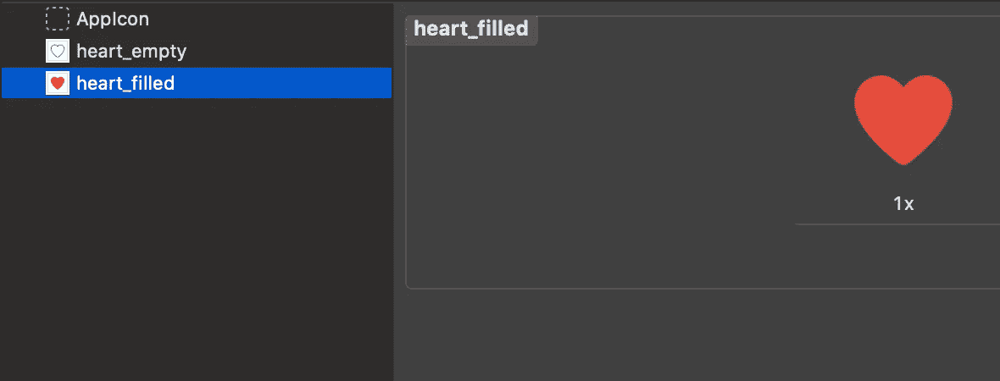
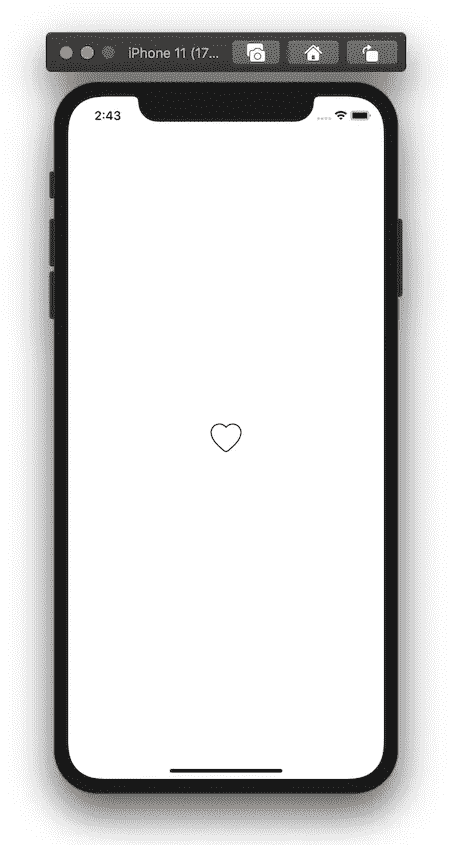
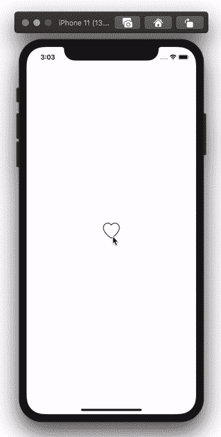
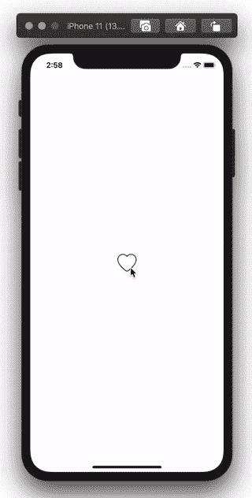

# 在 Swift 中重现 Instagram 的“喜欢”动画

> 原文：<https://betterprogramming.pub/recreating-instagrams-like-%EF%B8%8F-animation-in-swift-6b95f74c9593>

## 为你的应用程序创建一个有生命的心脏

动画可以极大地改善用户在与移动应用程序交互时的体验。在本教程中，我将向您展示如何重新创建一个我们大多数人都熟悉的非常简单的动画:Instagram 的“喜欢”动画。

Instagram 的“喜欢”动画。

让我们从添加我们将在 Xcode 项目中使用的心形图标资源开始。一个是白色的，另一个是红色的(我通常在[图标 8](https://icons8.com/) 上找到很棒的图标)。

Xcode 中的资产文件夹

现在让我们为按钮创建一个类。我们称它为`HeartButton`，并使它成为`UIButton`的子类。让我们从将初始图像设置为空的心开始。

如果你添加一个`HeartButton`到你的应用并运行它，它看起来会像这样:

让我们添加一些代码来跟踪按钮的状态，并添加一个方法来翻转该状态并相应地激活按钮。动画本身包含两个主要步骤:

*   第一步:当按钮被按下时，我们缩小按钮(使用[缩放变换](https://developer.apple.com/documentation/coregraphics/cgaffinetransform/1455882-scaledby))并翻转心形图像。
*   第二步:当动画完成时，我们将按钮返回到它的原始比例(我们通过应用`[identity](https://developer.apple.com/documentation/coregraphics/cgaffinetransform/1455180-identity)` [变换](https://developer.apple.com/documentation/coregraphics/cgaffinetransform/1455180-identity)来完成)。

我们将通过使用`[UIView.animate](https://developer.apple.com/documentation/uikit/uiview/1622515-animate)`来实现这些步骤，其中动画块将执行上面的步骤一，而完成块将在它自己的动画中执行步骤二:

现在，当您的按钮被点击时，您可以调用`flipLikedState`方法来执行动画。

我们还可以做一些调整，使我们的`HeartButton`的规模将根据它进入的状态而变化。例如，如果按钮进入“喜欢”状态，我们可以在将它恢复到正常大小之前将其放大。或者，如果按钮进入“未链接”状态，我们可以在将它恢复到正常大小之前缩小它。

我们最终的`HeartButton`实现如下所示:

即使是简单的动画，像 Instagram 使用的这个心形动画，也可以改善我们在导航应用程序时的体验。你可以在 Github 上找到这个动画的完整演示。

感谢阅读，希望这篇文章对你有用。