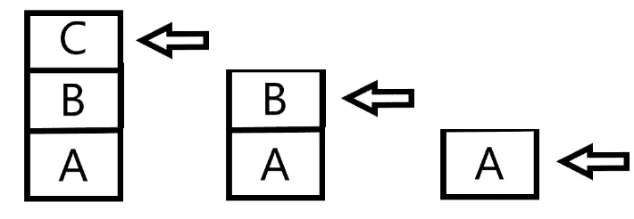
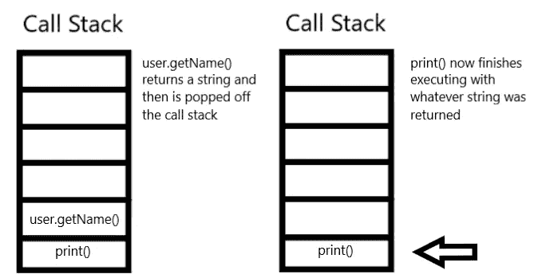
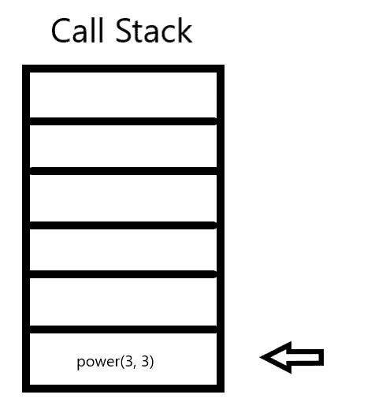
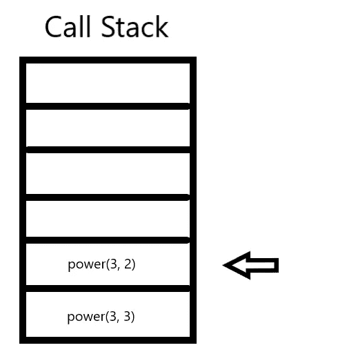
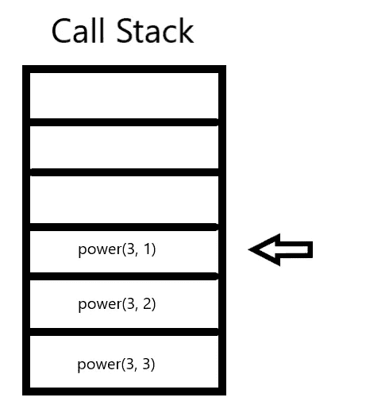
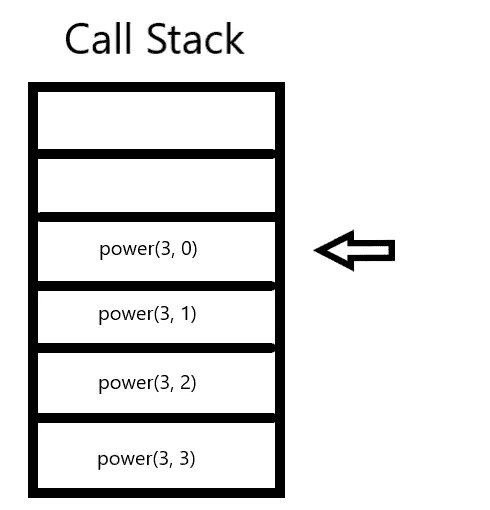
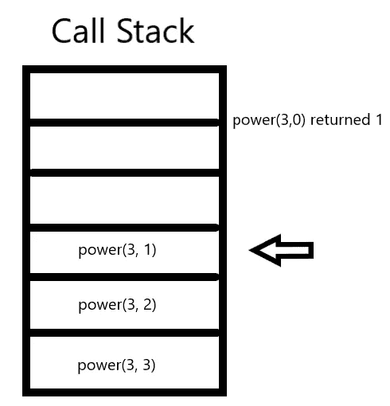
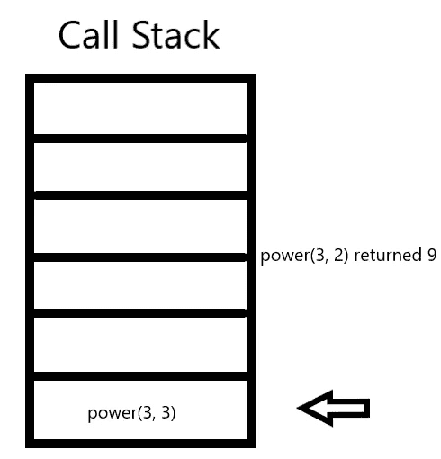

# 递归 101

> 原文：<https://betterprogramming.pub/recursion-101-a5e18158c66f>

## 一步一步地递归解决问题


在 [Unsplash](https://unsplash.com?utm_source=medium&utm_medium=referral) 上由[Tine ivani](https://unsplash.com/@tine999?utm_source=medium&utm_medium=referral)拍摄的照片

欢迎来到递归 101。在这篇文章的结尾，你将对递归解决问题和相关的数据结构有更深的理解。这些是编程世界中一些比较沉重的话题，新程序员经常害怕这个词*递归*。虽然在一篇文章中深入解释所有这些概念几乎是不可能的，但是您将更好地理解递归，以及为什么了解一些数据结构将有助于了解全局。就像你第一次在编程中学习的许多东西一样，这似乎很难。但是如果你慢慢来，了解基本原理，你会发现这没什么可怕的。

# 堆

我相信栈是理解递归的基本构件。堆栈被称为[抽象数据类型](https://en.wikipedia.org/wiki/Abstract_data_type) (ADT)。抽象数据类型意味着它是一种描绘数据的逻辑方式和操纵数据的方式，而不涉及它将如何实现的细节。记住这一点的一个简单方法是 ADT 回答这个问题，它做什么？ADT 的实际实现被称为[数据结构](https://en.wikipedia.org/wiki/Data_structure)，它回答了这个问题:它是如何实现的？如何将由 ADT 详述的方法的实际编程来表示。ADT 是独立于语言的。因为它没有指定需要如何完成，所以可以用任何语言编写。

一个[堆栈](https://www.geeksforgeeks.org/stack-data-structure/)模拟后进先出(LIFO)的行为。正如名字 *stack* 所暗示的，想象一堆块。你把几块积木放在一起。要在不破坏堆栈的情况下安全地移除一个块，您需要移除顶部的块，这是您放置的最后一个块。stack ADT 的工作方式相同。您只能按照将项目放入堆栈的相反顺序移除它们。



# 调用堆栈

也许你甚至不知道，你已经在你所有的代码中使用了堆栈。您的程序使用堆栈来控制子例程的流程，并在执行某些过程后将控制返回到程序的正确部分。

例如，考虑这一行代码`print(user.getName()`。从左到右，首先我们遇到了`print()`函数，所以它被放在堆栈上。在打印函数的参数中，一个方法`user.getName()`作为一个返回字符串的参数给出。在 print 方法可以执行之前，它需要从用户那里获取名称。现在它将`getName()`放入堆栈。这将停止打印的执行，直到`getName()`完成执行。把这个想象成点击暂停。“嘿，我会让你完成，但暂停你正在做的事情，以便我可以为你得到这个名字。我会把这个名字给你，这样你就可以从你停下来的地方继续。”

在`print()`功能暂时暂停且`user.getName()`被置于堆栈上的情况下，`user.getName()`拥有控制权。它获取用户的名字，并向`print()`函数返回一个字符串。在完成`user.getName()`方法后，它被弹出堆栈，控制返回到`print()`，在那里它完成打印用户名的工作。一旦完成，它也会弹出堆栈。



# 递归

好了，现在我们已经建立了一些基础，这将更容易理解。到底什么是递归？递归是一种独特的算法问题解决技术。这听起来可能有点吓人，但它本质上归结为创建同一问题的越来越小的版本，直到最小的解决方案被轻松解决，然后反向一点一点地解决更大的问题。

当一个函数一遍又一遍地调用自己时，就会发生递归。该函数本身被称为递归函数。你可能想知道一个函数如何调用自己，这样做有什么好处。让我们看一个使用指数的简单例子。

这是我能想到的最简单的例子。老实说，你永远不会用这种方法求解指数，但是它可以让你确切地看到递归是如何工作的，而不会使事情变得太复杂。我们如何用递归求解 3 的 3 次方？让我们想个办法，把这个问题分解成更小的自相似的部分。

```
3 to the 3rd power = 3*3*3
3 to the 3rd power = 3 * (3 to the 2md power)3 to the 2nd power = 3 * (3 to the 1st power)
3 to the 1st power = 3 * (3 to the 0 power)
3 to the 0   power = 1
```

如果你看看上面例子中的前两行，你会发现它们是得到完全相同答案的两种方法。第一行是解决这个问题的传统方法。第二行是递归解决这个问题的方法。

从第二行开始，您会注意到可以解决这个问题的模式或算法。我们使用相同的算法不断地将问题分解成越来越小的部分，直到我们得到最小的问题和最简单的解决方案:`1 to the 0 power = 1`。让我们来看看如何编写一个使用这个算法的函数。

```
public int power(int base, int exponent) {
   if(exponant == 0) {return 1;}
   return base * power(base, exponent - 1);
```

让我们一行一行地分解这个函数。函数`power`的定义返回一个`int`。它有两个参数。它接受一个基数和一个指数。

第二行检查指数是否为 0。如果指数是 0，我们就不再需要把问题分解成小块了。这就是所谓的*基础案例*。我稍后会对此进行更多的解释。如果我们已经到达了问题需要被分解的最小值，它返回 1。(记住零指数规则:任何指数为 0 的基数都等于 1)。

只有当第二行没有返回 1 时，才会调用第三行。这意味着我们可以将问题分解成更小的部分，直到达到基本情况。这被称为*较小的调用方*。这个问题的缩小版，按照我们的算法是`base * power(base, exponent — 1)`。我们将底数乘以底数的幂和(指数-1)。还记得之前我们展示的 3*3*3 和说 3 * (3 的 2 次方)是一样的吗？

让我们直观地看看发生了什么，使用调用堆栈来更好地理解正在发生的确切过程。

我们从调用函数 power(3，3)开始，它被添加到调用堆栈中:



现在这种方法已经走到了尽头。它检查`if 3(exponent) == 0`。那是假的，所以转到下一行，`return 3 * power(3, 2)`。在这个函数返回值之前，我们遇到了另一个函数。所以我们将暂停这个当前函数来获取这个被调用的函数的值`power(3, 2`。这个新函数被添加到堆栈中并获得控制权。



现在，新的通用方法已经走到了尽头。它检查`if 2(exponent) == 0`。那是假的，所以它转到下一行，`return 3 * power(3, 1)`。在这个函数可以返回值之前，我们又碰到了另一个函数！所以我们将暂停这个当前函数来获取这个被调用的函数的值`power(3, 1)`。这个新函数被添加到堆栈中并获得控制权。



现在栈上最新的函数拥有控制权。它运行它的代码并检查`if 1(exponent) == 0`。那是假的，所以它转到下一行，`return 3 * power(3, 0)`。在这个函数返回值之前，我们遇到了另一个函数！不过，不要担心，我们正在取得进展。所以我们将暂停这个当前函数，以获取这个被调用的函数的值`power(3, 0)`。这个新函数也被添加到堆栈中并获得控制权。



栈上最新的函数又一次获得了控制权，我们重复我们一直在做的事情。它运行它的代码并检查`if 0(exponent) == 0`。那是真的！最后，我们将问题分解成问题的最小版本(基础案例)。既然我们已经达到了基本情况，我们可以返回 1。从这里开始，我们按照后进先出的顺序返回堆栈。因为这个函数返回了 1，所以它已经完成了所有的功能，我们也完成了，所以它被弹出堆栈，控制权交给了值为 1 的前一个函数。



这就是事情变得有趣的地方。这基本上就像在整个堆栈中填充空白一样。函数`power(3, 1)`就是所谓的函数`power(3, 0)`。我们暂停执行`power(3, 1)`来计算`power(3, 0)`，结果是 1。因此，控制权现在属于`power(3,1)`，我们从上次停止的地方重新开始。该函数中剩下的最后一部分代码是`return 3 * power(3, 0)`。我们现在知道了`power(3, 0) = 1`，所以我们可以填补空白。现在变成了`return 3 * 1`。简单的数学告诉我们 3 * 1 = 3，所以我们返回 3。我们现在完成了这个函数，它被弹出堆栈，控制权交给下一个函数。


我们将再次填补空白。因为函数`power(3, 2)`调用了`power(3,1)`并且我们得到了 3，我们可以在函数的剩余行中替换它。最后一行变成了`return 3 * 3`，我们得到 9。这就完成了这个函数调用，并且在将控制权返回到堆栈中下一个值为 9 的函数时，它被弹出堆栈。



现在我们处于初始函数调用，由于递归和将问题分解成更小的问题，我们可以解决这个问题。该函数中剩下要执行的最后一行是`return 3 * 9`。这将返回数字 27，并且将是初始函数调用`power(3, 3)`的解。既然这个函数现在已经完成了，我们就把它从栈中弹出来，剩下一个空栈。我们可以仔细检查我们的工作。3*3*3 = 27 吗？是的，它是！递归地解决这个问题确实给了我们正确的结果

# 三个问题

当试图递归地解决一个问题时，你需要问自己三个问题。这将使找到一个算法来解决你的问题变得更加容易。为了验证递归解决方案是否有效，我们必须能够对这三个问题都回答“是”。

1.  **基础案例问题:**算法中是否有非递归的方法，算法对于这个基础案例是否正确工作？
    **回答:**是的，当指数达到 0 时，我们不再需要进行递归调用，可以改为返回 1。
2.  **较小的调用者问题:**对算法的每次递归调用是否都涉及原始问题的较小情况，从而不可避免地导致基本情况？
    **回答:**是的，较小的调用者总是涉及到将指数递减 1，直接导致基本情况。
3.  **一般情况问题:**假设对较小情况的递归调用正常工作，那么算法对一般情况是否正常工作？
    **答案:**假设递归调用 power(base，exponent-1)给出使用正确的值，那么 return 语句计算 base * exponent。是的。

当试图将你的问题分解成更小的自相似问题来递归求解时，确保在尝试实现你的算法之前问自己这些问题。

# 结论

恭喜你！您现在对如何递归解决问题有了基本的了解。仍然有许多方法来扩展这个新发现的递归知识。研究一下[递归和迭代](https://www.geeksforgeeks.org/difference-between-recursion-and-iteration/)编程方式将会解释两者的优缺点。递归在许多[函数式编程](https://en.wikipedia.org/wiki/Functional_programming)语言中使用，比如 [Elixer](https://elixir-lang.org/) 。函数式编程是编程的[范式](https://www.geeksforgeeks.org/functional-programming-paradigm/)，就像面向对象编程也是[范式](https://www.tutorialspoint.com/object_oriented_analysis_design/ooad_object_oriented_paradigm.htm)一样。此外，还有[尾部调用优化](https://stackoverflow.com/questions/310974/what-is-tail-call-optimization)，它不需要保存堆栈上的所有函数。但那是另一天的话题。研究递归和迭代编程方式将会解释两者的优缺点。

希望现在如果你遇到需要递归解决的问题，你不会感到害怕。只是一步一步来，把问题分解成更小的自相似问题。然后问自己三个问题。