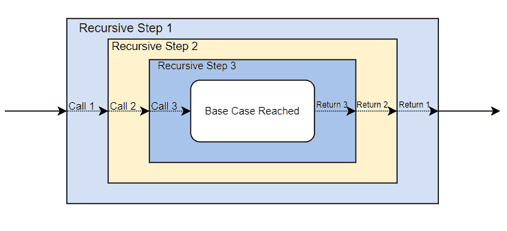
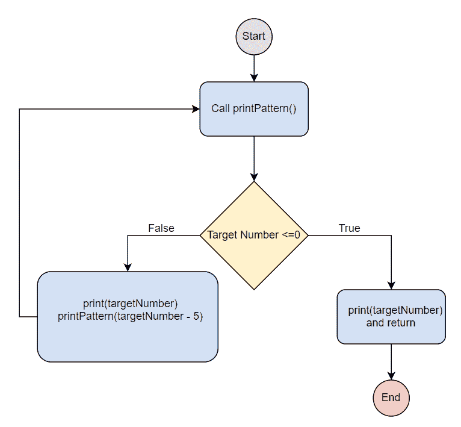
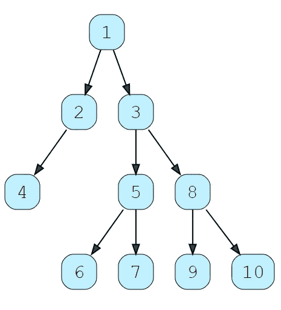

# Python 中的递归

> 原文：<https://betterprogramming.pub/recursion-in-python-32d464653984>

## 对令人困惑的编程范例的探究


图片来源:作者

递归是计算机科学中的基本概念之一，对于程序员和数据科学家来说都是必不可少的。不仅许多排序和搜索算法是递归的，而且每个 Python 面试都会包括一些基于递归的问题。这标志着递归成为在任何编码面试之前需要修改的一个关键概念。

今天，我们将帮助您复习 Python 中的递归编程技巧，并通过六个练习题获得实践经验。

下面是我们今天要讲的内容:

*   什么是递归？
*   Python 中的递归
*   数字的 Python 递归
*   使用字符串和数组的 Python 递归
*   数据结构的 Python 递归
*   接下来学什么

# 什么是递归？

递归是计算机科学中的一个概念，当一个函数调用它自己并循环直到它到达期望的结束条件。它来源于递归定义的数学概念，递归定义根据集合中的其他元素来定义集合中的元素。

每个递归实现都有一个*基本情况*，此时已达到所需状态，还有一个*递归情况*，此时尚未达到所需状态，函数进入另一个递归步骤。



图片来源:作者

递归函数调用之前的递归情况下的行为，即内部自调用，在每一步都重复。因此，当您可以通过完成重复的子问题(递归情况)来实现更大的问题(基本情况)时，递归结构是有用的，这些子问题将程序逐步推进到基本情况。

其结果与`for`或`while`循环类似，除了递归更接近目标条件，而`for`循环运行固定次数，而`while`循环运行直到不再满足条件。

换句话说，递归是声明性的，因为你设置了你想要达到的状态，而`for` / `while`循环是迭代的，因为你必须设置重复的次数。

看看迭代方法和递归方法在语法上的区别:

**递归**

`**for**` **循环**

```
arr = ["A", "B", "C"]
for x in arr: #sets the number of iterations
  print(x)
```

`**while**` **循环**

```
i = 1
while i < 6: #sets number of iterations
  print(i)
  i += 1
```

当一个问题有明确的必须重复的子问题，并且如果你不确定你需要用迭代解决方案循环多少次时，递归解决方案是最好的。

例如，如果您想创建一个阶乘函数程序来寻找一个未知数的阶乘:

## 直接递归与间接递归

到目前为止，我们只讨论了*直接递归*，其中递归函数在其递归步骤中显式调用自身。还有*间接递归*，其中递归调用从函数中移除，但仍作为原始递归步骤的结果运行。

例如，`functionA`调用`functionB`，T1 再调用`functionA`。

**直接**

```
def function1(p1, p2, ..., pn) :
  # Some code here
  function1(p1, p2, ..., pn)
  # Some code here
```

**间接**

## Python 中递归的利与弊

所有编程语言都支持递归；然而，并不是所有的都是同等优化的。

在 Python 中，迭代通常是首选，由于内置的优化，迭代被认为更“Python 化”。一般来说，递归解决方案比迭代解决方案更适合大型计算，因为递归通常会产生更少的代码和更快的性能。

**优点**

*   **优化后速度更快**:如果你包括递归优化，比如尾端递归和记忆化，Python 中的递归方法会更快。
*   **代码更少**:递归解决方案更紧凑，这意味着你可以更快地编写递归解决方案，调试时需要审查的代码更少。
*   **声明性**:许多开发人员发现声明期望状态的逻辑比迭代更容易理解，迭代关注的是达到未声明目标所需的步骤。
*   **高效的排序和搜索**:递归对 Python 数据科学特别有用，因为它是 mergesort 等流行排序算法的基础。

**缺点**

*   **最大递归深度** : Python 的调用栈有限，仅支持 1000 个嵌套步骤。虽然这看起来很多，但在处理像列表和数组这样的大型结构时，这就成了一个问题。这可以用`sys.setrecursionlimit(1500)`覆盖，风险自负。
*   **支持，不建议** : Python 允许递归调用，但是不包含很多内置优化。与迭代优化不同，开发人员必须自己编写全递归改进代码。
*   **使用更多内存**:每次调用都会保存调用堆栈中的前一步，直到递归过程完成。这意味着递归解决方案比迭代解决方案使用更多的内存。

注意:我没有增加任何一列的可读性，因为一些开发人员发现递归更容易理解，而另一些开发人员发现嵌套行为令人困惑。最终，这取决于每个问题和开发人员的具体情况。

# Python 中的递归

现在让我们更深入地看看 Python 中的递归函数。

下面是一个递归打印模式的示例程序:`10 5 0 5 10`。

我们要把每个数字打印两次，除了`0`，中间只打印一次。这让我们知道`if (targetNumber <= 0)`是我们的基本情况。

因此，我们的递归例子是第 7–9 行。

在第 8 行，您可以看到递归调用`printPattern(targetNumber - 5)`，它将我们的程序移动到下一个递归步骤。

第 9 行打印最后的`10`，并且在递归调用后只运行一次。

记住，只有递归调用之前的行为才会在递归循环中重复。

看一下这个程序流程图，看看程序步骤是如何连接的:



图片来源:作者

现在我们已经把这个递归程序拆开了，让我们看看递归的一些应用。

# 数字的 Python 递归

## 斐波那契数列

首先，我们来看一个经典的递归例子:斐波那契数列。这个程序接受一个给定的数字并返回它的斐波那契数。

你可以在第二行看到我们的基本情况，`if n >= 1`。如果不满足这一点，我们就进入第 5 行的递归情况，其中有两个递归调用。

每次循环递归时，`n`都会降低，这意味着我们的基本情况最终会变为真。

## 从 1 到`n`的总和

现在我们来看看如何使用递归对从 1 到给定数字的所有数字求和。这个程序接受一个正整数作为输入，并返回一个从 1 到整数之间的所有数字之和的打印输出。

我们的程序从给定的数字开始，每递归一步就把数字加 1，直到它达到 1。

基础案例在第 3 行，`if targetNumber ==1`。递归的情况是将`targetNumber`的当前值相加，然后用一个低 1 的值调用`sumTill()`。

# 使用字符串和数组的 Python 递归

递归对字符串或数组也很有帮助。许多递归面试问题会要求您转换字符串或数组，直到所有字符串或数组都符合某个标准。

## 从字符串中删除空格

在这个练习中，我们将创建一个程序，它接受一个给定的字符串并返回一个没有任何空格或制表符(`/t`)的新字符串。例如，`Hello World`会变成`HelloWorld`。

从空字符串`""`中移除制表符只会返回空字符串`""`。因此，我们的基本情况是原始字符串为空(第 3 行)。

对于第 7–10 行的递归情况，我们检查当前元素是`"\t"`还是`" "`:

*   如果当前元素是`"\t"`或`" "`，我们丢弃它，并在移除该元素后调用函数的另一个实例。
*   如果当前元素不是`"\t"`或`" "`，我们将它添加到输出字符串中，并在删除该元素后调用函数的另一个实例。

## 反转数组

现在我们将创建一个递归程序，它接受一个给定的数组，并以相反的顺序返回相同的数组。

例如，`1, 2, 3, 4`会变成`4, 3, 2, 1`。

对于这个解决方案，我们将创建一个临时变量来保存每个递归步骤中传递的数组的最后一个元素。最后，这些值将用于以相反的顺序重新填充数组，因为嵌套的递归函数最先完成。

这个问题的基本情况是当数组中有 0 或 1 个元素时，因为反转这些数组将返回相同的数组。

# 数据结构的 Python 递归

最后，让我们看看递归函数是如何在链表和二叉树这样的数据结构上使用的。

## 反转一个链表

反转一个链表类似于反转一个数组，但是有点复杂。这个程序将接受一个链表，并返回节点顺序相反的链表。

例如，链表`3, 4, 7, 11`将有一个返回值`11, 7, 4, 3`。

在上面的代码片段中，我们将链表`myLinkedList`传递给函数`reverse()`。这个函数检查链表的头是否是`null`。如果头节点不为空，我们称之为`helperFunction()`。这个函数是递归的，也是链表反转的地方。

在`helperFunction()`中，使用以下语句反转节点:

```
next = current.next # The original next node of the current node is saved
current.next = previous # The next of the current node is updated
```

更改之后，我们再次递归调用该函数:

```
# Recursive case
helperFunction(myLinkedList, next, current)
# The current node in the next recursive call will be the "next" node that we saved.
# The previous node will be the parent function's current node
```

这个问题的基本情况是我们到达链表的末尾。这是`current`节点的`next`节点将成为`None`的地方。我们将这个最后的节点作为链表的头，更新它的位置，然后`return`。

## 从左到右打印二叉树的所有叶节点

这个问题有点棘手，但正是你将在 Python 编码面试中看到的问题类型。

我们将创建一个程序，打印树形图中从左到右出现的所有叶节点。这是我们将要用的树。



图片来源:作者

这个树的正确解是`4 6 7 9 10`。

**提醒**:叶节点是没有子节点的节点，因此结束子树分支。

这个程序获取根节点并从左到右打印所有叶节点。我们的基本情况是 1)没有剩余节点，或者 2)没有剩余叶节点。

程序跟踪每个孩子的连接，每次都向左走，直到找到一个叶节点。程序打印这个值，然后沿着不同的节点路径重复这个子问题。

最终，函数返回，所有叶节点将从左到右打印。

# 接下来学什么

递归是任何 Python 开发人员技能的重要组成部分。递归问题在编码面试中经常占据面试问题的很大一部分，对于动态编程问题是必不可少的。学习这些概念的最好方法是亲身体验真实的面试问题。

如果你想不断进步，可以看看下面这些问题:

*   0-1 背包问题
*   平衡括号问题
*   将树转换成双向链表
*   反转一叠
*   最低共同祖先

快乐学习！