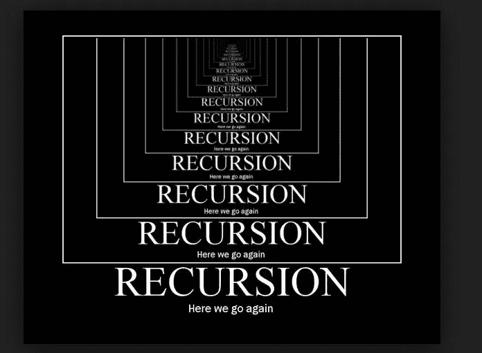
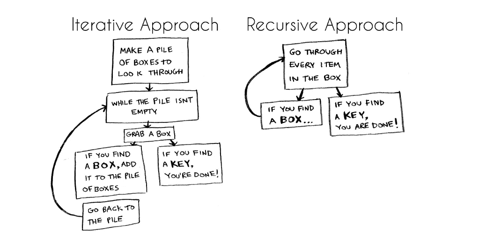
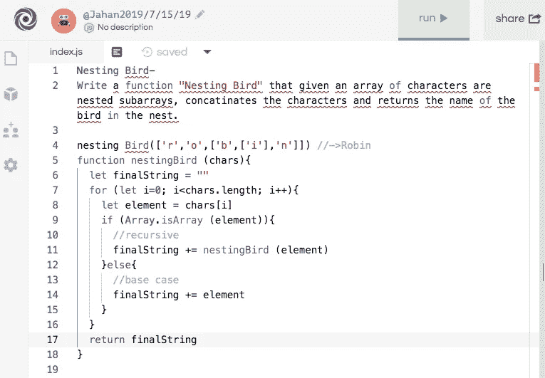
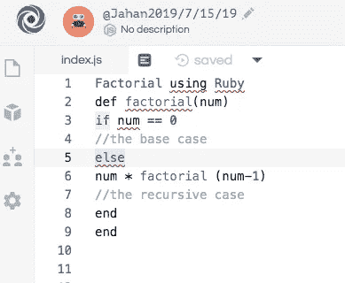

# 递归恐惧症:害怕陷入递归的无限循环

> 原文：<https://betterprogramming.pub/recursion-phobia-4251f625d7b6>

图片来自谷歌<[https://www . quora . com/What-s-some-of-the-best-recursion-skills](https://www.quora.com/What-are-some-of-the-best-recursion-jokes)>

在我的代码学习之旅中，我为一个叫做*递归*的话题纠结了很久。

如上图所示，在程序崩溃之前，我总是发现自己处于一个无限循环中。

不知何故，我通过调用递归的兄弟**迭代**，设法解决了大多数涉及递归的代码挑战问题。

我不建议在一个明显需要递归的问题中进行迭代(使用循环),因为它们只是不必要的代码行，需要花更长的时间来编写。

在代码挑战中，时间是一个重要因素。但最重要的是，数组可以像这样深度嵌套:`[13,[5,[3[“hello”,[9,[“can”,[“you find me”]]]`。

如果你像我一样是个初学者，你在理解递归上有困难，那么你知道你可以用迭代来解决它，因为递归是迭代的一种替代。

[https://www . freecodecamp . org/news/how-recursion-works-explained-with-flow-and-a-video-de 61 f 40 CB 7 f 9/](https://www.freecodecamp.org/news/how-recursion-works-explained-with-flowcharts-and-a-video-de61f40cb7f9/)

然而，一旦你理解了基本情况和递归情况为什么以及如何工作——在任何情况下你都会选择递归而不是迭代。

# 什么是递归

让我们深入了解什么是递归，如何识别递归问题，以及我用来解决递归问题的常用方法。

当函数调用自身时，就会发生递归。递归有助于将更大的问题分解成更小的块，直到没有更多问题需要分解——我们可以将最后一个块称为*基础用例*。

如果你没有一个基本用例，一旦函数/方法调用它自己，它将陷入一个无限循环，直到程序崩溃。

让我们来看看 JavaScript 和 Ruby 中的两个不同问题。

来自 repl.it/jahan2019

上面的图片是我在 [Repl.it](https://repl.it/) (练习你的代码的网站)上解决并复制的一个问题的快照。

如你所见，嵌套鸟是一个深度嵌套的数组。

当我着手解决这个问题时，我问自己:“我要把所有的迭代都写出来吗？如果嵌套更深，比如 9 个或 12 个深度数组呢？”

我创建了一个名为*nestibird*的函数，它在括号中接受一个参数。然后，我已经在一个空字符串中设置了我的最终答案(我要返回的值)。

第 7 行“for 循环”是查看第一个数组并检查。

我有一个`if`子句(第 9-15 行),它基本上说明了如果它是一个数组，那么调用函数，否则转到最基本的状态。

在我的基本案例中，每个元素都被添加到`finalString`中。

回复它

类似地，我们可以通过设置一个基础案例和一个递归案例，用 Ruby 以同样的方式解决阶乘问题。