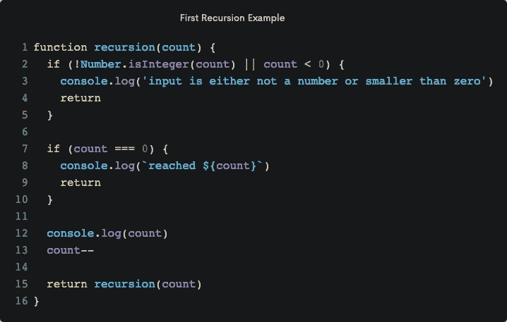
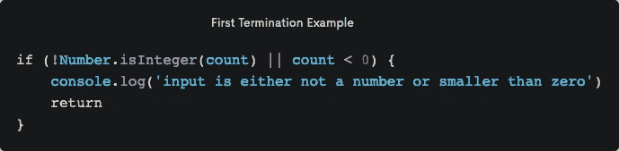
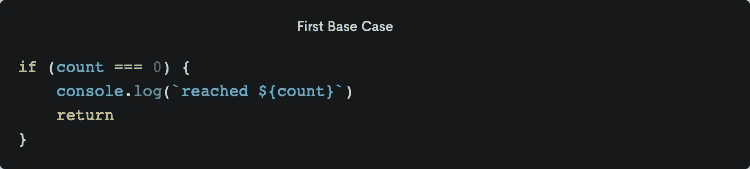
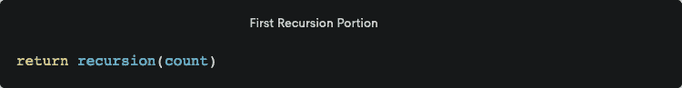
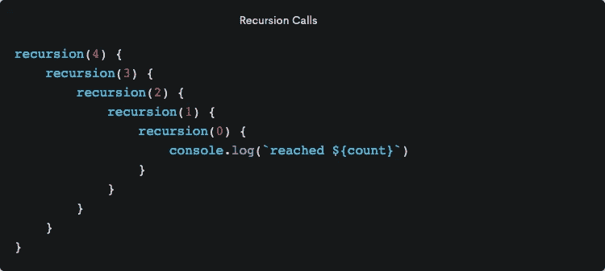
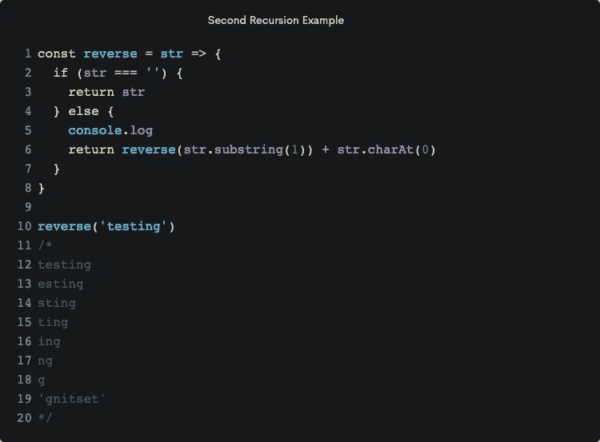
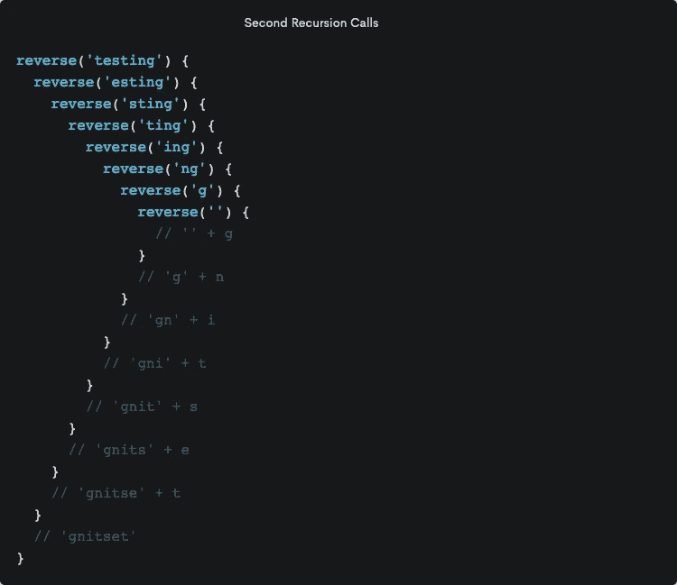
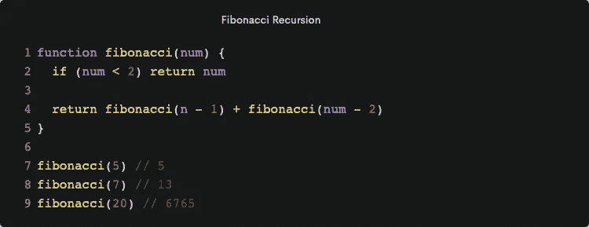

# 递归…递归…递归…变得简单

> 原文：<https://betterprogramming.pub/recursion-recursion-recursion-made-simple-6b10e641e680>

## 当一个函数调用自己时会发生什么？

在 [Unsplash](https://unsplash.com/s/photos/fibonacci?utm_source=unsplash&utm_medium=referral&utm_content=creditCopyText) 上由 [Ira Mint](https://unsplash.com/@iramint?utm_source=unsplash&utm_medium=referral&utm_content=creditCopyText) 拍摄的照片

在自身内部调用同一个函数是怎么回事，被调用函数开始时的返回是如何工作的？那不就是在函数之外返回吗？我真的花了一分钟的时间来完全理解它是如何工作的，但一旦我做到了，一切都变得有意义了。

在这篇文章的结尾，我们将会讲述递归是如何工作的，看了一些递归的例子，也看了一个流行的使用递归的编程算法。所以让我们开始吧。

# 什么是递归？

首先，让我们检查一下递归的更好的定义:递归是一种迭代操作的技术，通过让一个函数重复调用它自己，直到它得到一个结果。

好吧，这个解释其实还不错。比给出的大多数定义都简单。但是让我们更容易理解:一个调用自身的函数。

递归是指函数在同一个函数中调用自己。在我们看一个实际的例子之前，让我们先看看是什么构建了一个递归函数。递归函数主要由三部分组成。

*   **终止条件**——这有点像你函数中内置的短路或安全检查。这是一个需要通过的条件，以确保您的函数不会中断。
*   基本情况 —这基本上是你想要的最终目标。当这个条件通过时，返回最终结果，函数结束。请注意，有时您可以将终止条件和基本条件结合起来。
*   **递归** —这是函数中不断调用自身的部分。

# 例子

现在来看一个例子。当你看这个例子的时候，看看你是否能识别这个函数的各个部分。第一个函数非常简单。它只是从一个给定的数字开始倒数，直到它到达零，然后记录到控制台。

你算出函数的每一部分了吗？

首先，我们来看终止条件。

在这种情况下，我们检查以确保给定的参数是一个数字并且不小于零。如果这个条件通过，那么我们把函数向下移动到我们认为的基本情况。

如果这个条件没有通过，那么我们知道这个函数还没有完成。我们转到函数的递归部分，再次调用函数。

我们的函数一直这样做，直到它到达它的基本情况，然后从函数中返回。

让我们看看不同输入的一些结果。

第一次用字符串调用`recursion()`时，`string`没有通过终止条件，所以它将`input is either not a number or smaller than zero`记录到控制台。它对`-1`记录相同的内容，因为它小于零。最后，我们使用输入`4`。这一次它通过了 conditional，我们看到记录的倒计时和记录到控制台的`reached 0`的最终结果。

前两个例子非常简单。不过，我们会更多地讨论第三个例子。函数内部到底发生了什么？首先，我们将看一看调用的物理表示，然后讨论它。

在本例中使用`4`每次计数减少时调用`recursion()`。当计数达到`0`时，它将`reached 0`记录到控制台。

如果你和我一样，那么`recursion()`前面的`return`会让你有点困惑。就我个人而言，我很难理解`return`在这种情况下是如何工作的。我一直在想，如果在函数之外返回，那么用`return`对函数的不断调用是如何工作的。但是`return`实际上在递归本身中起着至关重要的作用。

如果我们不把`return`放在`recursion()`前面，我们实际上永远不会记录或返回任何东西。添加`return`导致众所周知的冒泡返回期望的结果。所以不要让这困扰你。

让我们看另一个例子，但这次比从一个给定的数字开始倒数要复杂一些。

知道这个函数是做什么的吗？你想明白了吗？它——等等——反转一个字符串。如果你自己想出来的话，做得很好(虽然它在图像底部显示为输出)。

我在函数中包含了一个`console.log`来显示函数重复时的`str`参数值。让我们看看函数运行时的输出。如您所见，每次调用该函数时，它都会从初始字符串中删除一个字母。它一直这样做，直到我们得到一个空字符串。

一旦函数到达空字符串，终止/基本情况条件通过并返回`str`。如前所述，一旦函数接收到空字符串，它就会冒泡返回到初始函数调用，并返回字符串结果。

终于到了看一个使用递归的流行编程算法的时候了。知道那会是什么吗？我给你一个提示。

[https://giphy.com/search/fibonacci](https://giphy.com/search/fibonacci)

是想通了，还是比以前更迷茫了？最后一个提示:0 1 1 2 3 5 8 13 21 34 55 89 144。如果你说*斐波那契*，那么你是正确的。如果你不确定，斐波纳契是一个数列。斐波纳契数列是一系列的数字，下一个数字是通过将前面的两个数字相加得到的。

斐波那契算法是一种非常著名的算法。让我们快速地看一个递归函数来寻找序列。

我们不打算深入研究斐波那契数列和算法，尤其是如果这里有人是递归的新手。如果你有兴趣了解更多关于斐波那契的知识，在谷歌上快速搜索会给你带来很多结果。

这个函数不是实现它的最省时的方法。我们可以用一个实现记忆化的函数来改进大 O 符号。这里的主要收获是看看我们如何在函数中不断调用斐波那契本身。每次这样做，我们都要从初始值中减去。最终我们会达到我们的基本情况，这将是一个小于 2 的数字。一旦我们达到这个数字，函数调用栈就会冒泡并返回我们想要的值。

# 结论

这就是递归的全部内容。我们看了一些例子，包括一个使用递归算法的真实例子。我希望这能对递归及其工作原理有更多的了解。尝试一下。试着用递归代替迭代，看看自己感觉如何。