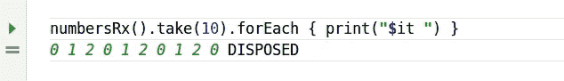
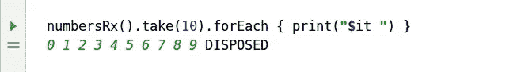
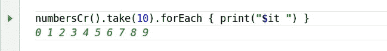
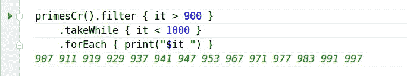

# RxJava 和 Kotlin 协程中的递归依赖

> 原文：<https://betterprogramming.pub/recursive-dependency-in-rxjava-and-kotlin-coroutines-926a3ea4f0cb>


尼古拉斯·霍伊泽在 [Unsplash](https://unsplash.com?utm_source=medium&utm_medium=referral) 上拍摄的照片

今天我们要玩这个有趣的递归游戏——递归依赖流。那是一条自给自足的溪流。首先，让我们尝试一下这个概念在`RxJava`中的简单实现:

```
fun numbersRx(): Observable<Int> = Observable.concat(
  Observable.range(0, 3),
  numbersRx()
)
```

这个想法很清楚。必须开始发射一些基数，在它们用完之后，钩住它自己，继续发射来自内部的东西。很像大毒蛇吃它的尾巴。

但是这并没有真正起作用:


问题是`Observable`在组装时陷入无限递归下降。让我们希望介绍一些懒惰会有所帮助:

```
fun numbersRx(): Observable<Int> = Observable.concat(
  Observable.range(0, 3),
  Observable.defer(::numbersRx)
)
```

的确如此:



现在，我们只是再次发出相同的数字，这并不好玩。让我们给这个流添加一些动态:

```
fun numbersRx(): Observable<Int> = Observable.concat(
  Observable.range(0, 3),
  Observable.defer(::numbersRx).map { it + 3 }
)
```

这一次`Observable`在吃它的尾巴时抵消了它一点点，它的工作就像一个魔咒:



听着，我们不用计数器就能得到无穷多的数字。让我们暂时离开 Rx，尝试使用 Kotlin 协程达到同样的效果。

我们要建造一台发电机，所以`buildSequence`是这里显而易见的选择:

```
fun numbersCr(): Sequence<Int> = buildSequence {
    yieldAll(0..2)
    val numbersSupply = numbersCr().iterator()
    while (true) yield(numbersSupply.next() + 3)
}
```

在我看来，这更像是必不可少的，类似于 pythonic 生成器，这是一件好事。当然，它运行顺畅:



看起来很棒。我可以想象我们可以用这个机械做很多有趣的事情。例如，让我们基于惰性筛子构建一个无限素数生成器。

这种算法本质上是必要的，因为筛子是一个可变的地图，它在道路上标记数字。我将为这个特定的实现选择协程，因为它们对状态更友好，代码也更清晰。

```
fun primesCr(): Sequence<Int> = buildSequence {
  yieldAll(listOf(2, 3, 5, 7))
  val sieve = mutableMapOf<Int, Int>()
  val basePrimes = primesCr().iterator()      // generate supply of "base" primes
  var p = basePrimes.apply { next() }.next()  // discard 2 then get 3
  var q = p * p         // square next base prime to keep track of in sieve
  var n = 9             // n is the next candidate number
  while (true) {
    if (n !in sieve) {  // n is not a multiple of any of base primes,
      if (n < q) {      // below next base prime's square, so
        yield(n)        // n is prime
      } else {
        val p2 = p * 2        // n == p * p: for prime p, add p * p + p * 2
        sieve[q + p2] = p2    // to the sieve, with p * 2 as the increment step
        p = basePrimes.next() // pull next base prime
        q = p * p             // and get its square
      }
    } else {
      val s = sieve.remove(n)!!
      var nxt = n + s         // n is a multiple of some base prime, find next multiple
      while (nxt in sieve) {  // ensure each entry is unique
        nxt += s
      }
      sieve[nxt] = s          // nxt is next non-marked multiple of this prime
    }
    n += 2                    // work on odds only
  }
}
```

现在我们可以用它做有趣的事情，比如得到 900 到 1000 之间的所有素数



或者得到第 10001 个素数


今天就到这里，祝你愉快！