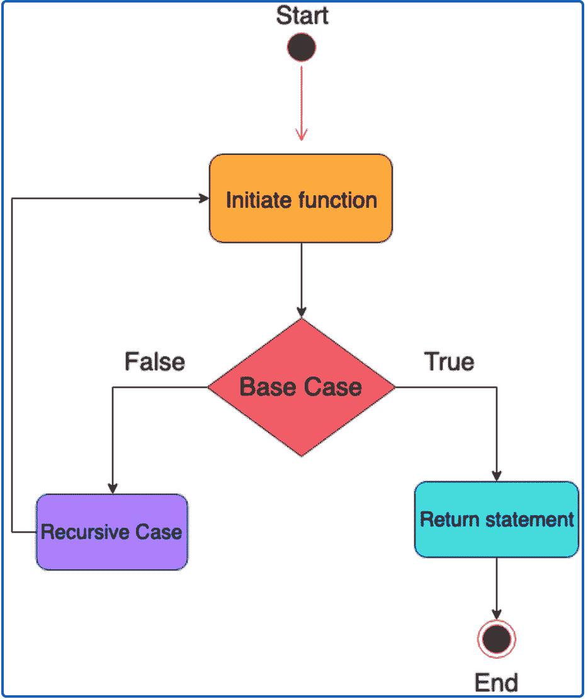
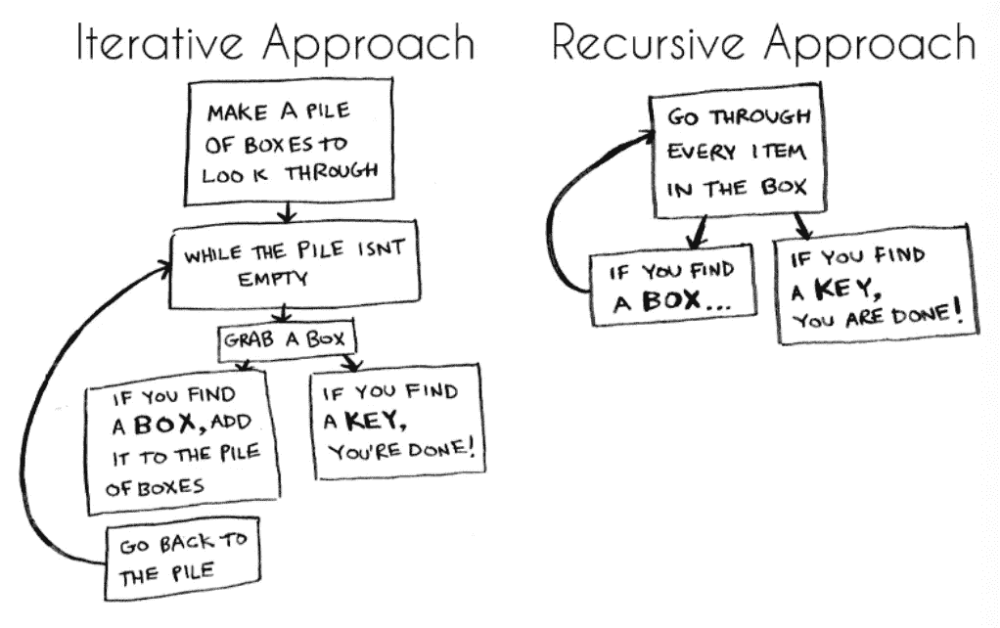

# 递归函数

> 原文：<https://betterprogramming.pub/recursive-functions-2b5ce4610c81>

## 什么是递归，我们为什么要关心它？


照片由 [Unsplash](https://unsplash.com?utm_source=medium&utm_medium=referral) 上的[诺亚·温德尔](https://unsplash.com/@noahwindler?utm_source=medium&utm_medium=referral)拍摄

递归是计算机科学中的一个重要概念。这是一种编程技术，涉及到一个函数反复调用自己，直到找到解决方案。那么，*递归函数*就是一个调用自身的函数。

递归函数包括一个*递归调用*和一个*基础用例*。递归调用是函数体的一部分，它调用自己，直到满足指定的条件，而基本情况是函数的停止点。重要的是我们有一个基本案例，因为没有它，我们将陷入无限循环。下图有助于理解递归函数的流程:



学分:[教育性](https://www.educative.io/courses/recursion-for-coding-interviews-in-python/7DOjVYx3OVB)

让我们看一个递归函数的例子来说明这个概念:

```
function printString(myString) {console.log(myString[0]); *if* (myString.length > 1) {
      let mySubString = myString.substring(1, myString.length);           
      printString(mySubString); *// recursive call*
   *} else {
      return* true; *// base case*
   }
}
```

在上面的例子中，我们使用递归来打印字符串的每个字符，首先打印出字符串的第一个字符。如果字符串的长度超过一个字符，我们就获取原始字符串的子字符串并进行递归调用，重复这个过程，直到字符串的长度只有一个字符——这是我们的基本情况，在这种情况下，我们将退出递归函数。

在 JavaScript 递归函数中，函数会被重复调用，直到达到基本情况。只有当达到基本情况并提供解决方案时，才能评估递归调用。

为什么我们关心递归？虽然递归并不适合每种情况，但它是一个需要理解的重要概念。编程涉及递归思维，如果使用得当，它可以帮助我们编写更短、更高效的代码。

虽然迭代函数通常可以做同样的工作，但递归函数更容易阅读和理解。递归函数在遍历树结构时特别强大。理解递归很重要的另一个原因是许多算法都使用递归。然而，递归函数的一个缺点是，它们通常需要更多的内存空间，并且往往比迭代函数慢。



这个图表解释了迭代函数和递归函数之间的区别。信用:[免费代码营](https://www.freecodecamp.org/news/how-recursion-works-explained-with-flowcharts-and-a-video-de61f40cb7f9/)

字符串和数组是两种特别适合递归解决方案的数据结构。我们可以将字符串视为由更小的重叠子字符串组成的数据结构。类似地，我们可以将数组的属性看作一系列子数组。

找到问题的递归解决方案的一个好方法是应用以下步骤:

1.选择一个具体的例子来说明问题的概念。

2.想出一个函数，为具体的例子提供一个解决方案。

3.重新构造解决方案，以便应用递归。改写函数，使其在函数体内调用自身。

虽然递归函数的概念最初可能很难掌握，但我们练习得越多，它就变得越清晰。