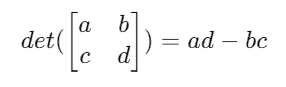
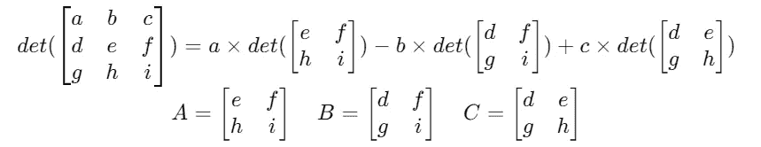

# 用 Go 进行递归矩阵行列式计算

> 原文：<https://betterprogramming.pub/recursive-matrix-determinant-calculation-using-go-53eb9a353829>

## 实现算法的实践方法


沃洛季米尔·赫里先科在 [Unsplash](https://unsplash.com?utm_source=medium&utm_medium=referral) 上的照片

前一段时间，当我试图学习 [Go 编程语言](https://go.dev/)时，我想到了记录我的旅程中一些有趣的方面。现在我来了，这是我在 Medium 上的第一篇文章，它是关于使用 Go 的打包思想实现一个递归方法来计算方阵的行列式。

TL；DR:这篇文章中讨论的项目可以通过这个 [GitHub 库](https://github.com/rapour/determinant)访问。

[行列式](https://en.wikipedia.org/wiki/Determinant)仅在方阵上定义，并且可以在递归算法下导出，就像本[讲座](https://warwick.ac.uk/fac/sci/physics/research/condensedmatt/imr_cdt/students/david_goodwin/teaching/cis008-2/determinant_algorithm_cis008-2_lec_21.pdf)中讨论的那样，我们将在这里使用。

我们不打算在这里遍历这个算法的细节，只关注实现本身。然而，熟悉它是我们在这里讨论的先决条件。

在研究矩阵的行列式之前，首先，我们需要对矩阵本身有一个概念。

Go 是一种严格类型的语言，我们可以利用这一特性来模块化我们的代码。我们打算将矩阵概念的实现从主包中分离出来。

因此，我们需要初始化一个 Go 模块。在项目根目录中使用以下命令初始化一个新模块:

```
go mod init "example/det"
```

我们定义了一个名为`Matrix`的新类型，并把它放在一个`matrix`包中，和我们的`main`包放在一起，结构如下:

```
├── main.go
├── matrix
│   ├── matrix.go
├── go.mod
```

我们的矩阵将是浮点数的二维切片。`matrix.go`将如下所示:

```
package matrix

type Matrix [][]float64
```

接下来，我们将为这种类型定义一些方法。Go 允许在类型上定义操作，这种模式类似于 OOP 编程语言。由于行列式只为方阵定义，所以我们必须有一种方法来检查一个矩阵是否是方阵。让我们定义函数来获得一个`Matrix`实例的行数和列数:

```
func (m Matrix)Rows() int {
  return len(m)
}

// we assume the Matrix have the same number of elements in each row and
// is not empy, which is true for all matrices
func (m Matrix) Columns() int {
 return len(m[0])
}

func (m Matrix) IsSquare() bool {
 return m.Columns() == m.Rows()
}
```

此外，我们在这一点上对矩阵的定义并没有强制一个`Matrix`实例实际上是一个矩阵。我们可以定义一个`Matrix`实例，不同的行有不同数量的元素；一个绝对不是矩阵的结构！我们稍后将讨论解决这个问题的方案，但是现在，我们需要一种方法来确认`Matrix`确实是一个矩阵！检查一个`Matrix`实例是否是一个矩阵，就是检查它是否为空，并且每行中的元素数量相同:

```
func (m Matrix) IsMatrix() bool {

 if m.Rows() == 0 {
  return false
 }

 for _, row := range m {

  if len(m[0]) != len(row) {
   return false
  }

 }

 return true
}
```

现在我们准备开始写行列式计算的方法。首先，我们检查`Matrix`实例是否是有效的方阵。随后，如果矩阵的大小为 2×2，则可以使用以下表达式简单地计算行列式:



2×2 矩阵的行列式

我们此时的方法是:

```
func (m Matrix) Det() (float64, error) {

 if !m.IsMatrix() || !m.IsSquare() {
  return -1, 
  fmt.Errorf(
    "determinant is not defined for the input [Matrix: %t][Square: %t]",
    m.IsMatrix(), m.IsSquare())
 }

 if m.Rows() == 2 {
   return m[0][0]*m[1][1] - m[0][1]*m[1][0], nil
 }

  //TODO: calculate the determinant otherwise
  return 0, nil
}
```

对于更大的矩阵，行列式可以递归计算。例如，3×3 矩阵的行列式通过下面的表达式导出:



3×3 矩阵的行列式

如您所见，要实现这一算法，我们需要计算子矩阵 A、B 和 c。观察这些子矩阵后，您会发现它们是通过从原始矩阵中删除特定的行和列而创建的。

这种迭代方法可以推广到 n×n 矩阵，其中每次迭代的行列式表达式分解为一组子矩阵的行列式。由于算法是迭代工作的，所以每次迭代只需删除一行和一列就足够了。下面的函数将从矩阵中删除一列并返回结果矩阵。

```
func InBetween(i, min, max int) bool {
 if (i >= min) && (i <= max) {
  return true
 } else {
  return false
 }
}

func (m Matrix) ExcludeColumn(col_index int) (Matrix, error) {

 if !InBetween(col_index, 1, m.Columns()) {
  return Matrix{}, fmt.Errorf("input not in range")
 }

 result := make(Matrix, m.Rows())
 for i, row := range m {
  for j, el := range row {
   if j == col_index-1 {
    continue
   }
   result[i] = append(result[i], el)
  }
 }
 return result, nil
}
```

请注意函数`InBetween`，它用于确保移除列的索引位于有效范围内。我们获取输入矩阵的每一行，并将元素复制到另一个矩阵中，除了`col_index`列中的元素。排除一行也是以同样的思路实现的:

```
func (m Matrix) ExcludeRow(row_index int) (Matrix, error) {
 if !InBetween(row_index, 1, m.Rows()) {
  return Matrix{}, fmt.Errorf("input not in range")
 }

 var result Matrix
 for i, r := range m {
  if i == row_index-1 {
   continue
  }
  result = append(result, r)
 }
 return result, nil
}
```

同样，我们获取输入矩阵的每一行，并将整行添加到新矩阵中，除了`row_index`行。现在我们准备完成我们的`Det`功能。

```
func (m Matrix) Det() (float64, error) {

 if !m.isMatrix() || !m.isSquare() {
  return -1, fmt.Errorf("determinant is not defined for the input [Matrix: %t][Square: %t]",
   m.isMatrix(), m.isSquare())
 }

 if m.Rows() == 2 {
  return m[0][0]*m[1][1] - m[0][1]*m[1][0], nil
 }

 // if rows are more than 2
 // exclude the first row accoring to the algorithm
 partial_matrix, err := m.ExcludeRow(1)
 if err != nil {
  return -1, err
 }

 var temp float64 = 0

 // iterate over the elements of the first row
 for i, el := range m[0] {

  // get the corresponding submatrix
  reduced_matrix, err := partial_matrix.ExcludeColumn(i + 1)
  if err != nil {
   return -1, err
  }

  // get the dterminant of the submatrix, recursively
  partial_det, err := reduced_matrix.Det()
  if err != nil {
   return -1, err
  }

  // determinant would be the sum of the determinant of 
  //the sumatrices multiplied by the right coefficients
  temp = temp + partial_det*el*math.Pow(-1, float64(i))
 }

 return temp, nil
}
```

请注意，在我们的算法中，使用标准的`math`包来计算每个乘法系数的符号。我们可以使用我们新策划的包来计算主包中矩阵的行列式:

```
package main

import (
 "example/det/matrix"
 "fmt"
 "log"
)

func main() {

// sample matrix
 matrix := matrix.Matrix{
  {3, 6, 2, 4},
  {7, 1, 5, 3},
  {9, 9, 1, 2},
  {4, 6, 3, 2}}

 det, err := matrix.Det()
 if err != nil {
  log.Fatalf("Error in calculating the determinant: %v", err)
 }

 fmt.Printf("The determinant is: %f", det)

}
```

输出将是样本矩阵的真实行列式:

```
The determinant is: -543.000000
```

# **矩阵验证**

我们最初的实现允许初始化数学上不是矩阵的`Matrix`实例。

这是一个实现问题，而不是数学问题。一个典型的解决方案是将`Matrix`更改为未导出的类型，该类型只能通过您实现的实例化虚构来访问，并且将有足够的验证。

我不打算详细介绍实现，但是结构应该是这样的:

```
package matrix 

import "fmt"

type matrix [][]float64

func GenerateNewMarix(input [][]float64) (matrix, error){

  // do some validations on input argument and see if it passes the checks
  passed := true

  if !passed {
    return matrix{}, fmt.Errorf("error, not passed") 
  }

  return matrix(input), nil
}
```

仅此而已。感谢阅读。