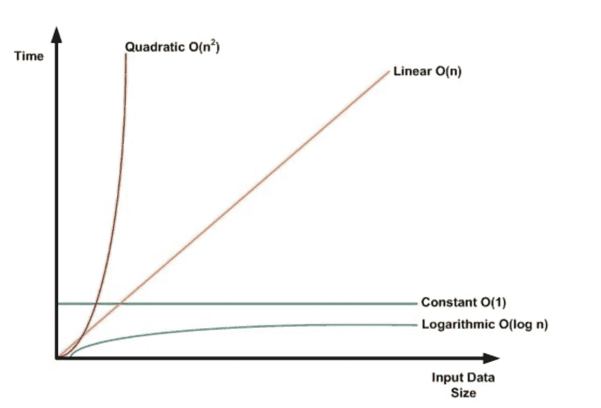
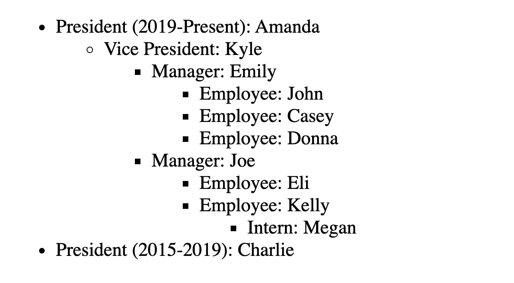

# JavaScript 中的递归呈现

> 原文：<https://betterprogramming.pub/recursive-render-in-javascript-25269594bad>

## 更好的渲染以获得更好的性能


照片由[卢德·洛伦兹](https://unsplash.com/@luddelorentz?utm_source=unsplash&utm_medium=referral&utm_content=creditCopyText)在 [Unsplash](https://unsplash.com/?utm_source=unsplash&utm_medium=referral&utm_content=creditCopyText) 上拍摄

在编程中，递归是一个函数在自己体内调用自己的概念。请看下面的代码，由 [Javascript.info](https://javascript.info/recursion) 提供。

```
function pow(x, n) {
  let result = 1;
  // multiply result by x n times in the loop
  for (let i = 0; i < n; i++) {
    result *= x;
  }
  return result;
}

alert( pow(2, 3) ); // 8
```

这个函数的目标是将`x`乘以自身`n`倍。在上面的例子中，`pow(2, 3)`看起来像 2*2*2，结果是`8`。

上面的函数是一个*迭代*方法的例子，使用一个`for`循环并在每次迭代中应用重复的逻辑。这里可以采用的另一种方法是*递归*方法，我们将建立一个可以在需要时调用自身的流程。参见下面的递归函数，也是由 Javascript.info 提供的。

```
function pow(x, n) {
   if (n == 1) {
      return x;
   } else {
      return x * pow(x, n — 1);
   }
}alert( pow(2, 3) ); // 8
```

该函数不使用`for`循环，而是检查`n`的值。如果`n`等于`1`，只需返回`x`，因为任何一个的幂都等于它本身。这就是所谓的*基础案例*。

# 基础案例

在递归中，基本情况是结果是直接的，并且是递归停止的情况。

没有它，我们将简单地无限期地继续调用函数。函数的下一种情况出现在 else 语句中——这是*递归情况。*

# 递归情况

递归的情况是函数调用自己。

在上面的例子中，直到`n`等于`1`，这将满足我们的基本情况并结束递归，我们将`x`乘以递归函数，其中`n`的值递减 1。这确保了我们最终会到达我们的基地，同时，算法会相应地执行。

你可以把递归想象成吃奥利奥。你买了一整套奥利奥(好吃)，然后一直吃到一点不剩(嗯，至少我会。说到饼干我是毫无节制的)。一旦没有了(哭丧着脸)，就停止吃。

```
function eatOreos(oreos) {
  if (oreos === 0) {
     return oreos;
   } else {
     dunk()
     eat()      
     return eatOreos(oreos-1);
   }
}eatOreos(oreos)
```

在这种情况下，递归方法比迭代方法简单，因为我们所做的只是检查`oreos`的值，除非它等于`0`，否则我们再次调用相同的逻辑，同时将`oreos`减少`1`。对于迭代方法，我们必须遍历集合，并在每次迭代中执行我们的功能(`dunk`和`eat`)。

对我来说，递归不仅仅是一个简单的解决方案。这对我的功能来说是必不可少的。这里有一点背景。

我有一个数组，姑且称之为`company`，它包含一个在公司工作的人的列表，这些人是按照权限级别组织的。下面是人民对象的样子。

```
{name: 'Amanda', role: 'President (2019-Present)', authority: [...]}
```

`authority`数组包含当前人员有权管理的人员列表。那些人也有一个`authority`数组，可以包含更多的人(在某些情况下没有)。这个过程对每个人重复进行。

现在假设我们需要呈现列表中的所有人。每个人代表一个`li`项目。如果那个人的`authority`值中有更多的人，我们需要将这些人呈现为`ul`元素下的`li`元素。重复此过程，直到我们列出了`company`中的每个人。如果你确切地知道有多少层，那么你可以采取迭代的方法。

如果您确定有三个级别，并且您需要检查每个人的`authority`数组中的所有人，那么您需要编写三个嵌套循环来检查他们的`authority`值。

```
const renderCompany = (company) => {
  company.forEach(person=>{    
    //create li, render person
      if (person.authority.length > 0){ 
        //create ul, render people in person.authority
        person.authority.forEach(x=>{
          //create li, render person          
          if (x.authority.length > 0){ 
            //create ul, render people in person.authority
            x.authority.forEach(y=>{
               //create li, render person
            })
          }
        })
      } 
   })
}renderCompany(company)
```

且不说这是多余的，就 [*时间复杂度*](https://open4tech.com/time-complexity-of-algorithms/) *而言，这是非常低效的。*对于那些不熟悉时间复杂度的人来说，时间复杂度本质上是相对于集合来说完成一项任务所需的时间。线性时间用 *O(n)* 来表示，基本上就是说随着你的集合规模的增加，你的函数执行的时间也会成比例的增加。

根据 [Open4Tech](https://open4tech.com/time-complexity-of-algorithms/) :

> “如果一个算法的运行时间与输入的平方成正比，则称该算法具有二次时间复杂度。”当您在循环中执行循环时就是这种情况，您需要在原始循环的每次迭代中遍历集合。



图片来自 [Open4Tech](https://open4tech.com/time-complexity-of-algorithms/)

由于我们在上面的函数中使用了三个`for`循环，所以它所代表的时间复杂度为 *O(n)。*这是非常低效的。除了效率低之外，这只能在假设我们知道数据集嵌套有多深的情况下才能工作。如果我们不知道它的嵌套程度，上面的函数就不会有效。

虽然迭代方法不足以完成我们在`company`中呈现人物的任务，但是我们仍然可以使用递归来完成我们的目标。首先让我们确定基本情况。记住，基本情况是，我们想要停止函数时，满足的条件。对于`renderCompany`，我们想在`authority`中没有人时停止该功能。相反，我们的递归案例是当这个人的`authority`数组中有一群人时我们想要执行的案例。

让我们把它分解成伪代码。

1.通过`company`循环。

2.在`company`中为每个人创建一个`li`元素。

3.检查当前迭代中的人是否有`authority`中的人。

4.如果`authority`中有人员，则创建一个`ul`元素，将其附加到人员的`li`元素中，并对`authority`重复上述逻辑以代替`company`。否则，什么都不做。

5.将为`company`创建的所有`li`元素追加到`DOM`中。

现在说说代码。下面是我们的递归`renderCompany`函数。

```
const renderCompany = (arr, node) =>{
  return arr.map(x=>{
    var newListItem = document.createElement("li")
    newListItem.innerText = x.role + ': ' + x.name   
    if (x.authority.length > 0){
       var newSubList = document.createElement("ul")
       newListItem.appendChild(newSubList)       
       renderCompany(x.authority, newSubList)
    }
    if (node){
      node.appendChild(newListItem)
    }
    return newListItem
  })
};
```

我们的第一个参数是数组。我们第一次调用这个函数的时候， `arr`是`company`，是我们在公司的人员集合。我们不为`node`传递一个论点。对于`arr`中的每一项，我们使用 JavaScript 的 [create-element](https://www.w3schools.com/jsref/met_document_createelement.asp) 函数创建带有行`var newListItem = document.createElement("li")`的`li`元素。我们将人的角色和他们的名字分配给`newListItem`的`innerText`。

在我们返回这个列表项之前，我们用行`if (x.authority.length > 0)…`检查这个人是否拥有对任何人的权限。如果是这样，我们创建一个子列表，并把它附加到`newListItem`中。

之后，我们执行递归，这次将`x.authority`作为数组和新创建的子列表节点传递。由于`x.authority`只是一个人的集合(正如`company`一样)，前面的逻辑可以用同样的方式重复。创建一个`li`条目，给它的`innerText`赋值，检查它的`authority`中是否有任何人，最后，检查`node`是否被定义。如果是，这意味着我们需要给它附加一个`newListItem`。

一旦我们有了元素的集合，我们就可以将它们添加到我们的根节点`DOM`中。

```
var container = document.getElementById('parentList')var items = renderCompany(company)for (var i = 0; i < items.length; ++i){
  container.appendChild(items[i])
}
```

下面是我们呈现的`company`中的人以及他们有权管理的人的列表。



通过使用递归，我们的函数保持干燥、相对高效，而且最重要的是动态的。因为只要有嵌套数据，它就调用相同的逻辑，所以我们不需要指定要执行多少次循环。它将继续执行递归步骤，直到我们到达我们的基本情况:这个人在`authority`中没有人。

完整的代码，包括`company`数组，都可以在这个[代码笔](https://codepen.io/macro6461/pen/gObNjBK)中找到。

在此 *将您的免费媒体会员升级为付费会员，每月只需 5 美元，您就可以收到来自各种出版物上数千名作家的无限量无广告故事。这是一个附属链接，你的会员资格的一部分帮助我为我创造的内容获得奖励。谢谢大家！*

# 参考

[](https://javascript.info/recursion) [## 递归和堆栈

### 编辑描述

javascript.info](https://javascript.info/recursion) [](https://open4tech.com/time-complexity-of-algorithms/) [## 算法的时间复杂度

### 算法无处不在，几乎应用于我们生活的方方面面。选择正确的算法来执行…

open4tech.com](https://open4tech.com/time-complexity-of-algorithms/) [](https://dzone.com/articles/is-your-code-dry-or-wet) [## 你的代码是干的还是湿的？-赞恩·德沃普斯

### 不要重复你自己(DRY)是一个软件开发原则，它的主要目的是减少代码的重复…

dzone.com](https://dzone.com/articles/is-your-code-dry-or-wet)