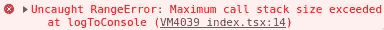
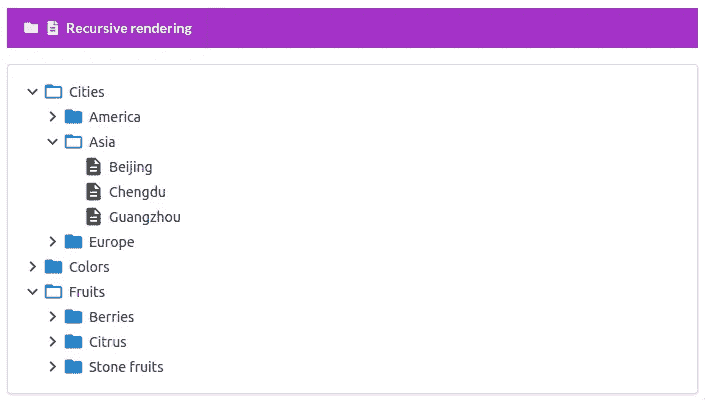
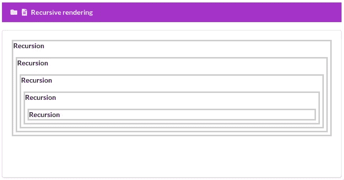
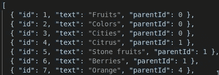
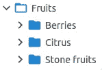
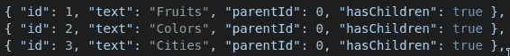
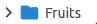
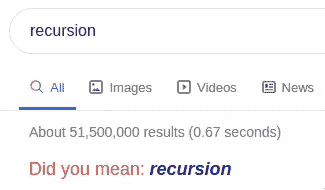

# 使用 React 组件进行递归渲染

> 原文：<https://betterprogramming.pub/recursive-rendering-with-react-components-10fa07c45456>

## 呈现嵌套数据结构的快速指南


作者照片。

[维基百科](https://en.wikipedia.org/wiki/Recursion)这样描述递归:

> "当过程的一个步骤涉及到调用过程本身时，递归就是过程所经历的过程。"

在编程术语中，它是一个调用自身的函数。我们可以用一个非常简单的例子来说明这个概念:

当你看到上面的片段时，你会意识到一些事情。首先，也许你没有意识到这是可能的。是的，尽管你能做到这一点有点违反直觉。我们在构造函数体的时候调用了一个函数。这确实有点奇怪。

也就是说，您可能已经注意到了这个特定代码片段的一些特别之处:它永远不会停止运行。这是一个无限循环！你可能是正确的。我们的浏览器不喜欢这样，在迭代了几千次后，它被搁置了:



出错信息

这是因为我们小小的说明性函数不包含任何阻止这种情况发生的逻辑。没有*终止条件*。但是很容易添加，我们很快就会看到。



这就是我们今天要创造的！

注意:你可以在 GitLab 上的 [my repository 中找到下面的所有代码。](https://gitlab.com/gvanderput/gerard-recursive-tree)

# React 中的递归

我们刚刚解释了一个函数可以调用它自己。由于 React 组件也是一个函数，因此它也可以呈现自身:

同样，渲染上述内容会导致无限循环，因为我们没有终止循环的条件。但是如果我们添加一些简单的逻辑(和一些简单的内联样式),确保我们的循环只迭代五次:

结果看起来像这样:



React 组件的递归呈现

可以看到，`MyComponent`是在 `MyComponent`里面渲染*的，这个过程自己重复了五次。很迷人，不是吗？*

我们将快速看一下如何在现实世界的例子中利用这一点。有许多用例，但传统的一个是呈现嵌套数据。嵌套数据的一个例子是文件系统中的目录结构。目录可以包含目录，目录也可以包含目录，等等。

我们将使用一些虚拟数据，但效果是一样的。正如您已经看到的，这是我们将要创建的内容:


嵌套行

# 数据源

我们从表示树中所有项目(行)的一些数据开始。文件`[nestedTreeData.json](https://gitlab.com/gvanderput/gerard-recursive-tree/-/blob/master/components/Tree/nestedTreeData.json)`看起来是这样的:



我们的 JSON 文件中的前七条记录

请注意，我们有一个平面数据结构—所有记录都存在于同一级别。记录里面没有记录，也不应该有(在我看来)。这会让你的生活轻松很多。我写了一篇关于这个概念的完整文章，我强烈推荐你在之后阅读。

注意这些记录是如何包含一个名为`parentId`的属性的。这些指针指向同一列表中的另一条记录。他们定义哪个记录是他们的祖先。前三条记录没有`parentId`(它等于零)。那些是最高级别的记录。我们可以看到，顶级记录`Fruits`有三个后代(子代):`Citrus`、`Stone fruits`和`Berries:`



# 准备我们的数据

我们创建一个实用函数来读取 JSON 文件并准备数据。在返回它之前，我们所做的唯一一件事就是为每条记录添加一个新的布尔属性(`hasChildren`)，以表明是否有记录指向它:

请注意，我们没有将子记录添加到父记录中。我们希望保持我们的数据结构平坦，我们很快就会看到这是如何给我们带来好处的。

上面函数返回的数据被传递给我们的`Tree`组件(见下一节)，名为`treeData`。

# 树组件

组件是递归魔术发生的地方。我们将渲染树里面的树。这时你应该喝一口热饮，然后跟着喝。

我们从组件定义开始:

你知道`treeData`参数是什么。第二个是`parentId`，表示我们想要呈现哪些记录——将该值作为其`parentId`的记录。在我们查看组件主体之前，让我们快速看一下如何在页面上呈现我们的`Tree`:

```
<Tree treeData={treeData} />
```

如您所见，我们只传递数据。这意味着对于呈现我们的`Tree`组件的第一次迭代，我们将使用参数`parentId`和`level`(都是`0`)的默认值。记住这一点。

回到组件的主体。首先，我们将选择要呈现的记录:

我们也按字母顺序排列它们(第 4 行),因为我们可以。

下一行很有趣(也很重要):

如果我们没有找到给定的`parentId`的任何记录，我们通过返回`null`来停止。我现在不会对此做任何进一步的评论，但请记住，因为我稍后会提到它(剧透警告:它防止了无限循环)。

最后，我们返回我们的元素。我们迭代我们找到的项目:

在第 8-11 行，对于我们过滤掉的每一项，我们呈现一个`Row`元素。每个`Row`元素都有一个子元素:另一个`Tree`元素！递归的极致。

在这一点上你可能会有疑问。让我们更深入地了解一下正在发生的事情。

# 进一步解释

当我们呈现我们的`Tree`组件时，除了数据之外，我们没有传递任何参数:

```
<Tree treeData={treeData} />
```

这意味着我们用值为`0`的参数`parentId`和`level`来呈现我们的组件。因此，在我们的`Tree`组件主体的顶部，当我们过滤数据时，我们将剩下三个顶级记录。

换句话说，第 2-4 行的逻辑:

将选择这些记录:



然后，对于这三条记录中的每一条，我们呈现一个`Row`元素:

我不会在本文中展示`Row`组件(你可以在回购中找到[完整文件](https://gitlab.com/gvanderput/gerard-recursive-tree/-/blob/master/components/Tree/Row.tsx))，但基本上，它所做的就是呈现这个:



它呈现一行。一张唱片。作为`div`元素。带有一些漂亮的图标和一些跟踪行是扩展还是收缩的状态。在这个`div`之下，它还做了一件事:它呈现传递的子元素。

我们向它传递了一个子元素:另一个`Tree`元素！整个过程再次开始，*在最初的* `*Tree*` *元素里面，我们正在渲染*:

递归调用。

唯一不同的是，这次我们使用了其他属性值。`treeData`保持不变，但是`parentId`现在变成了我们当前正在呈现的记录的 ID(比如说`fruits`)。

## 防止无限循环

还记得我们的`Tree`组件体内的这行代码吗？

```
if (!items.length) return null;
```

这将停止潜在的无限循环。什么时候？当我们遇到这样的情况，我们开始渲染`Tree`组件，但是我们没有为给定的`parentId`找到任何项目(记录)。

# 一锤定音

递归有时是一个很难理解的话题。我希望这篇文章通过一个简单的例子来引导您，从而驱散一些迷雾。这是我在[我的媒体文章](https://gerardvanderput.medium.com/)中经常使用的格式。

在我结束之前，你试过谷歌一下“递归”这个词吗？

当显示结果时，谷歌巧妙地回答:



感谢您的宝贵时间！