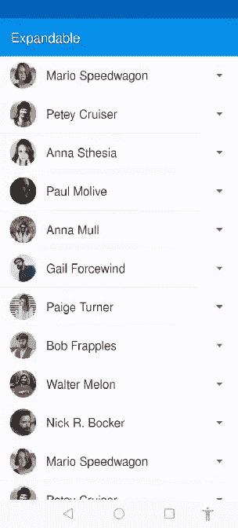
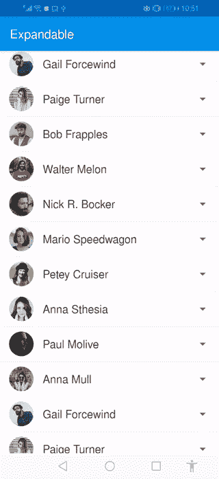

# 如何使 RecyclerView 项目随着动画展开

> 原文：<https://betterprogramming.pub/recyclerview-expanded-1c1be424282c>

## ***构建简单、漂亮的过渡，在你的应用中向用户展示更多数据***


> *任何停止学习的人都是老了，无论是二十岁还是八十岁。***”——亨利·福特****

*之前写过一篇关于 [RecyclerView 的文章，配有精美的动画](https://medium.com/better-programming/android-recyclerview-with-beautiful-animations-5e9b34dbb0fa)，都是关于 RecyclerView 的物品入口动画。现在，在本教程中，我们将学习如何使 RecyclerView 项目可以用动画扩展。听起来很有趣？让我们看看我在说什么。*

**

*通过点击小箭头，每个项目下的额外布局变得可见。你可以把任何额外的信息放在那里。还可以看到布局的折叠和展开以及小箭头每次旋转的流畅动画。*

*我们开始吧！*

*如果你不知道如何开始使用 RecyclerView，我强烈建议你去看看这个官方的[文档](https://developer.android.com/guide/topics/ui/layout/recyclerview)，这样你可能会对正在发生的事情有一个清晰的了解。*

# ***第一步***

*让我们创建一个新项目，并在您的`build.gradle`文件中添加以下依赖项。*

*build.gradle*

*我通常使用数据绑定，所以让我们通过在`android{}`下的`build.gradle`中添加小代码来启用它。*

```
*dataBinding{
    enabled true
}*
```

*注意:如果你不知道这是数据绑定，你可以在这里查看。*

# *第二步*

*现在是时候做一个样板课了。把一个班级命名为**人*。*** 复制并粘贴以下代码:*

*Person.java*

# *第三步*

*让我们制作一个适配器来使 RecyclerView 工作。我正在制作一个叫做 ExpendableRecyclerViewAdapter.java*的班级。*复制并粘贴以下代码:*

*为了表示每个项目，我制作了一个 RecyclerView 项目，如下所示。*

**

*item_expand.xml*

*复制并粘贴以下代码:*

*item_expand.xml*

*现在，让我们在进入动画部分之前，让我们的 RecyclerView 工作。*

*我的`activity_main.xml`长这样:*

*activity_main.xml*

*在`MainActivity.java`我将实现 RecyclerView 及其功能。为了做到这一点，我们需要一些虚拟数据。我在`array.xml`的值文件夹里做了一些数组。您可以拥有虚拟数据，也可以拥有真实数据。复制并粘贴以下代码:*

*MainActivity.java*

*希望你能得到这个结果。*

**

*现在基本实现已经做好了。是时候添加一些动画了。让我们开始吧。*

# ***第四步***

*我正在制作一个名为`animations`的包，在里面我正在制作一个名为`Animations.java`的类。*

*我们一步一步来。我将通过点击这个箭头来激活这个小箭头。为此，您需要在您的`Animations.java`类中添加这一小段代码:*

*让我们编辑我们的适配器。*

*运行应用程序并点击箭头。它应该旋转。*

**

*旋转箭头*

# *第五步*

*让我们实现一些功能，通过点击这个箭头来打开一个额外的布局。*

*为此，您需要在您的`Animations.java`中添加几行代码。*

*同样，您需要编辑您的适配器。这一次你必须在你的`toggleLayout`方法中添加一些代码。*

```
*private boolean toggleLayout(boolean isExpanded, View v, LinearLayout layoutExpand) {
    Animations.*toggleArrow*(v, isExpanded);
    if (isExpanded) {
        Animations.*expand*(layoutExpand);
    } else {
        Animations.*collapse*(layoutExpand);
    }
    return isExpanded;

}*
```

*现在，让我们运行应用程序，看看我们做了什么。*

# *备案*

*`toggleArrow()`:该方法帮助我们旋转调用视图类的 animate()方法的箭头，并根据需要设置其持续时间。*

*在这个方法中，我们测量将要展开的布局的高度，并根据这个高度设置动画的持续时间。*

*`collapse()`:折叠动作也一样，但是这次我们将布局可见性设置为`GONE`而不是`VISIBLE`。*

## *您可以克隆该项目*

*[](https://github.com/Mustufa786/recyclerViewCollapase) [## must ufa 786/recyclerviewcallapase

### 此时您不能执行该操作。您已使用另一个标签页或窗口登录。您已在另一个选项卡中注销，或者…

github.com](https://github.com/Mustufa786/recyclerViewCollapase) 

**关注**[**CodixLab**](https://medium.com/codixlab)**了解更多科技知识。**

觉得这篇文章有用？在媒介上跟随我[穆斯塔法安萨里](https://medium.com/u/8ee4abb8abb8?source=post_page-----1b8c9832af43----------------------)。看看下面我读得最多的文章。

*   [如何使用 TextView 在 android 中实现复制/粘贴功能？](https://medium.com/better-programming/android-copy-paste-7dd60ad47d0)
*   想要制作具有更多选项的动画浮动操作按钮？
*   用漂亮的动画制作 RecyclerView！
*   [什么是 AndroidX？](https://medium.com/better-programming/what-is-androidx-1b8c9832af43)

## [喜欢我的脸书页面](https://www.facebook.com/codixlab/)*