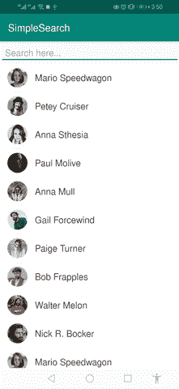

# 使用 RecyclerView 构建简单的搜索

> 原文：<https://betterprogramming.pub/recyclerview-search-326030d4bdf1>

## 如何使用 recyclerView 实现简单的搜索功能


[https://icons8.com](https://icons8.com)

几天前我在做一个项目，我遇到了一个情况，我必须使用`recyclerView`制作一个静态数据列表，并使用搜索过滤这些数据。

这是我做过的最简单快捷的搜索功能。我认为使用`recyclerView`构建这样一个简单的搜索肯定会对其他人有所帮助。

那么，我们开始吧。

# 开始

我已经在我的文章 [*中介绍了一些有用的技巧和`recyclerView`的完整实现。去看看。*](https://medium.com/better-programming/gmail-like-list-67bc51adc68a)

首先，创建一个新项目并复制粘贴这个模型类。

在`build.gradle`中添加以下依赖关系:

```
implementation 'androidx.recyclerview:recyclerview:1.1.0'
implementation 'com.squareup.picasso:picasso:2.71828'
implementation 'de.hdodenhof:circleimageview:3.0.0'
```

我们需要做一个适配器来使`recyclerView`起作用。所以，我们来做一个适配器类。

我们转到`MainActivity.kt`。为了简单起见，我现在只是先展示一个简单的列表。

为了填充`recyclerView`，它需要一些数据来显示。以下方法有助于您制作虚拟数据。把这个方法放在`MainActivity.kt`里面。

```
fun getData(context: Context): ArrayList<Data> {

    val people = ArrayList<Data>()
    val data = context.*resources*.getStringArray(R.array.*people*)
    val images = context.*resources*.obtainTypedArray(R.array.*images*)

    for (i in data.*indices*) {
        val d = Data(data[i], "", images.getResourceId(i, -1))
        people.add(d)
    }

    return people

}
```

`MainActivity.kt`

我的`activity_main.xml`:

让我们运行应用程序吧！


到目前为止，我们取得了良好的进展。现在是创建主要功能的时候了，这是一个搜索特性。为此，让我们回到我们的`MainActivity.kt`。

其背后的主要思想是，我将在我们在`activity_main.xml`中添加的`EditText`中添加一个`TextWatcher`。

然后在`onTextChanged()`中，我添加了一个条件，如果我们搜索的字符(`charSquence`)出现在我们的数据中，它就已经在我们的列表中了……就这么简单！

匹配的条目将被添加到一个新的列表中，我称之为`filteredList`。

让我们现在运行应用程序吧！



我知道你在想:“为什么一个单品会显示两次？”

这是因为我把同样的数据加了两次，就是为了做一个长长的列表。别担心。

希望你学到了一些东西！

**关注**[**CodixLab**](https://medium.com/codixlab)**了解更多科技知识。**

## 我阅读最多的文章:

[](https://medium.com/better-programming/animated-fab-button-with-more-options-2dcf7118fff6) [## 动画 FAB 按钮有更多的选项！

### 开发者们好！欢迎来到教程。今天我要教你如何制作 FAB(浮动动作按钮)动画…

medium.com](https://medium.com/better-programming/animated-fab-button-with-more-options-2dcf7118fff6) [](https://medium.com/better-programming/simple-notes-app-with-flutter-part-1-ab66e15c8635) [## 一个简单的带 Flutter 的笔记应用程序—第 1 部分

### 是时候用 sqflite 数据库创建一个 Flutter 应用程序了

medium.com](https://medium.com/better-programming/simple-notes-app-with-flutter-part-1-ab66e15c8635) [](https://medium.com/better-programming/android-copy-paste-7dd60ad47d0) [## 如何使用 TextView 在 Android 中实现复制/粘贴

### 以编程方式在 Android 的文本视图中实现复制/粘贴

medium.com](https://medium.com/better-programming/android-copy-paste-7dd60ad47d0)