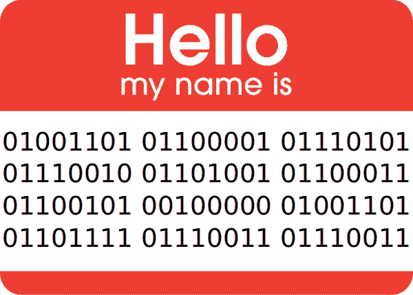

# 只有最优秀的开发者才会(小心翼翼地)学习无用的东西

> 原文：<https://betterprogramming.pub/redeeming-compsci-sometimes-you-need-to-learn-the-useless-before-you-find-its-use-2f50bd85b3d1>

## 找到我们学习方式的平衡点

我过去认为计算机科学是给傻瓜看的。这只是一堆学术废话，对现实世界中的任何人都没有用(除非你是那些研究编译器之类的东西的人)。康普斯似乎是一个金钱的黑洞；将贫穷、天真的开发人员引入某种程度的误解。是不是有点刺耳？当然——我是一个年轻、自负的网络开发人员，自学成才的成功让他觉得自己站在了世界之巅。但是，这是真的吗？嗯，事实证明，也许不完全是。

看，实际上我前几天需要计算机科学的东西。我知道——令人震惊，对吧？问题是，我总是为自己冷酷的务实而自豪。尽管我热爱学习，但我对知识本身并不感兴趣。我来这里是为了有所作为——在真实的世界里做真实的事情。我有计划，有目标，有动力让事情发生，任何不能让我朝那个方向前进的事情都最好离我远点。如果你想一生都追求学术，理论什么的，那也没问题，但那不是我的特长。坦白地说，我从来没有时间和耐心去研究计算机科学。我总是想，如果它在现实世界中真的有用，我会遇到对它的需求，然后伸出手去学习它，就像我自学的其他东西一样。

当然，这肯定是有道理的。毕竟，作为一名高效的高级开发人员，我的成功要归功于它。但那只是一种学习——姑且称之为**基于推动的学习**，因为你必须被推动。就像生活中的任何事情一样，它有自己的优势，但也有自己的弱点(实际上，我最近在一次求职面试中被问到这些弱点。谁知道面试能教会你[如何避免毁掉生活](https://blog.usejournal.com/how-to-avoid-ruining-lives-front-end-security-matters-26d4f906c7a6) *和*如何在自己的生活中成长？)

# 基于推动的学习

当我还是个孩子的时候，我一直对电脑有着浓厚的兴趣。也许是因为花了无数个小时在像素只有你拳头大小的单色屏幕上玩游戏。也许是因为我父亲已经做了几十年的软件开发员。也许都不是，也许都是。最后，我不知道是什么让计算机吸引了我，但是我知道是什么让我在 10 岁的时候第一次学习如何编程。游戏。我非常喜欢游戏——也许比我喜欢小说更甚——我一直在玩一些老派的(甚至是当时的)基于文本的冒险游戏。游戏*和*讲故事的结合？我完全同意。所以当我父亲告诉我，我真的可以创造这些神奇的奇迹？是的，直接签我吧。

所以他教我如何构建一个基于文本的基本冒险游戏，我成功地用它作为一个很棒的学校作业。多么神奇的感觉。我让我认识的每个人都玩那东西，一边看着他们玩一边咬指甲，寻找任何享受的迹象。那种激动，那种建立一个我们可以踏入的世界并驾驭我们的想象力到达世界尽头的冲动。我眼中闪烁着兴奋的光芒，这无疑是我编程之旅的开始，从那时起，我开始充满激情地通过 CRT-nightlight 编码到深夜——对吗？

没有。你看，我认识的其他人都不喜欢基于文本的冒险游戏，开发一个没人玩的游戏又有什么意义呢？我的父亲知道编程的广阔世界有如此多的东西可以提供，他试着教我更多——在屏幕上画 2D 图形——但是失败了，我退出了编程界。

你发现哪里出错了吗？[我充满了痴迷的激情，但从未学会挖掘和谐的激情](https://www.webuildlegends.com/obsessive-harmonious-obligated-you-choose)。部分原因是因为我遵循了**的推动式学习**。在推进式学习中，我们只有在对学习结果有明确的当前需求时才会学习。换句话说，我懒得去学那些 2D 图形，因为我觉得没有必要在屏幕上画彩色线条和简单的几何图形。

但这有个问题:*我没有完美的洞察力*。我当时看不出来，但是我在屏幕上显示的那些图形是更高级编程的基础，而这些编程是*将*带给我的。尽管我热爱 web 开发，但想象一下，如果我在十岁时继续追求这些技能，并最终获得了游戏开发人员所需的技能。天啊。小时候开发那些可怕的基于文本的冒险游戏让我如此兴奋，我甚至无法想象如果我没有说“我不明白这有什么意义”并退出的话，我的生活会是什么样子。

基于推动的学习对于让我们保持在正确的轨道上和在我们当前的现实中有很好的基础是很好的，但是它的一个明显的缺陷是它完全容易受到未知的未知的影响。有时候，你不知道某样东西会有多有用，直到你真正学会了它，并且现在可以看到它的用例。如果你幸运的话，你会偶然发现这些东西，并找到足够的信息，至少对你的知识缺口有一个概念。但是，我们有多少次甚至没有被这些东西绊倒，让它们完全从我们的掌握中溜走呢？我不知道——这就是问题的关键(和危险)。

# 拉动式学习

罗布·沃什在 [Unsplash](https://unsplash.com/search/photos/dreamer?utm_source=unsplash&utm_medium=referral&utm_content=creditCopyText) 上拍摄的照片

拉式学习与推式学习相对应。这些时候，你学习某样东西只是为了它可能会派上用场，或者是因为你喜欢学习本身(你至少已经这样做过一两次了，对吧？).然而，这并不是灵丹妙药——一如既往，这里既有优点也有缺点。

第一个弱点——也可能是我过去对它嗤之以鼻的原因——是那些主要遵循拉动式学习的人最终往往只是变得*如此无用。在拉动式学习中，有一种非常真实的危险，那就是迷失在一个兔子洞里——或者更糟，一个兔子窝——没有任何有形的东西可以展示。你知道我的意思——我们都见过那些对区块链或一些编译器的内部工作原理如此了解的人，但当你问他们是否遇到过这种知识比任何其他选择都提供更好的成本效益比的情况时，绝大多数情况下答案都是“不”。*

我看到的第二大弱点是，当人们过于追求基于拉动的学习时，他们开始认为这是学习本身的目标，或者价值所在。以 Haskell 为例——它很难学，这不是一件好事。但是很多 haskeller——一旦他们掌握了窍门——似乎将这种痛苦视为荣誉的象征，而不是需要改进的地方。好像学习的挑战给了学习本身某种额外的价值。

或者是所有热爱函数式编程的开发人员(像我一样)，使用 JavaScript 作为他们选择的武器(像我一样)，并最终跳过疯狂、复杂的圈套将函数式编程强加到他们的 JavaScript 中(像我有时做的那样)，即使语言设计人员真的不想与之合作。当被问到为什么时，我会得到关于函数式编程的各种特性的答案——“它是无要点的”或者“它将‘数据这样’与‘功能那样’分开”。

但事实是，像无点风格这样的东西是一种*技术*，而不是*利益*。*在这里*无积分如何帮助我们*？有什么*影响*？过于沉迷于拉动式学习似乎常常让我们看不到知识的*价值*(这是知识应用的*结果*，并且取决于应用的背景)和知识本身之间的差异。*

# 阴阳

那么这给我们留下了什么？如果两种学习方式都有各自的弱点——是不是就没有希望了？就像生活中的大多数事情一样，答案是找到合适的工作工具。如果没有拉动式学习将我们带到我们永远不会去的地方，我们就无法真正繁荣，如果没有推动式学习将我们保持在正确的轨道上，我们就无法有效。

**使用基于推送的学习时，请记住以下几点:**

*   不要太注重结果，否则你会失去做任何事情的动力。
*   记住你有未知的未知——当你不知道未知的东西可能有多有用时，你不能说某样东西更重要，因为它更需要！
*   当我们过于脚踏实地时，我们就会失去创造力、灵活性和对新事物的开放态度。偶尔后退一步，审视一下其他的选择和方法，有意识地去除你的眼罩。

**使用基于*拉动*的学习时，请记住以下几点:**

*   不要在兔子洞里迷路了！时常后退一步问自己“有没有我知道/能做的事情足够好/足够接近？”
*   记住，作为一名开发人员，你的*专业*知识和技能是为了一个目的而存在的——创造现实世界的价值。不要为了知识本身而重视知识。它的价值在于它所创造的影响——用它作为你的评价标准。
*   探索(与拉动式学习一样)可以带来更大的创造力、灵活性和对新事物的开放性，但代价是专注和动力。当生活向你扔出曲线球，需要你在此时此地处理时，要愿意把你的拉动式学习放在一边。

最重要的是——试着不去评判那些更自然地属于光谱不同部分的人(是的，我知道，我错了，我正在努力)。从阴阳学说中吸取教训——没有什么是绝对的好，也没有什么是绝对的坏。我们需要各种类型的人来让世界运转，我们都需要一个全面发展的人格。请尝试使用合适的工具来完成工作！

*原载于我的博客(*[*【https://www.webuildlegends.com】*](https://www.webuildlegends.com/redeeming-compsci-use-in-the-useless)*)*