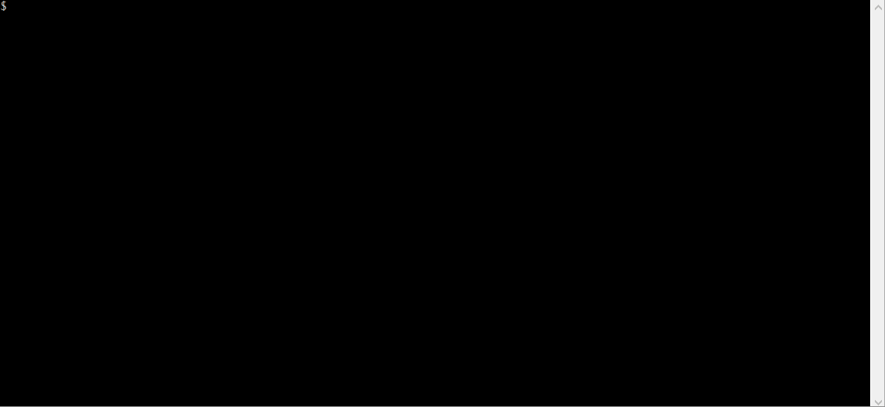
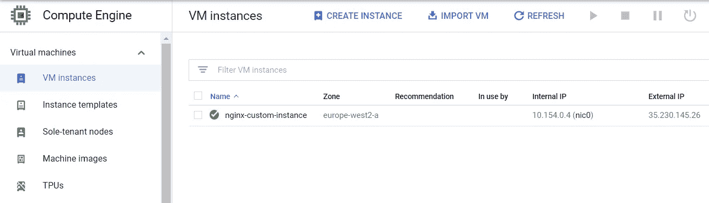
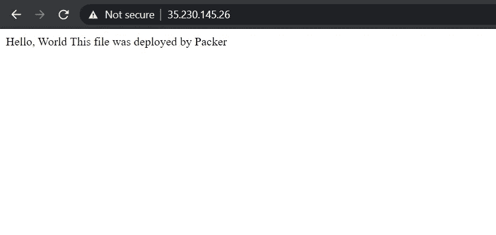

# 使用 Terraform 和 Packer 重新定义您的云之旅

> 原文：<https://betterprogramming.pub/redefine-your-cloud-journey-with-terraform-and-packer-ca65e0f04730>

## 以正确的方式进行基础设施和配置代码


由 [Unsplash](https://unsplash.com?utm_source=medium&utm_medium=referral) 上的[ukasz ada](https://unsplash.com/@lukaszlada?utm_source=medium&utm_medium=referral)拍摄的照片。

对于大多数 DevOps 专业人员来说，创建虚拟机通常包括使用 [Terraform](https://www.terraform.io/) 在云上启动它，然后使用配置管理工具(例如 Ansible 或 Puppet)或引导脚本(例如 cloud-init)将原始虚拟机转换为有目的的服务器。

我们都已经这样做了很长时间，它在大多数情况下都有效，但它也有一些缺点。

我举一个亲身经历的例子。我们有一个使用托管实例组(MIG)在 GCP 上运行的可水平扩展的 web 服务器。每当 MIG 想要向组中添加新节点时，节点都需要一些时间来准备好。

服务器启动后，Ansible 需要几分钟来安装软件包、进行配置，并使节点准备好处理请求。对于处理大量数据的生产服务器来说，时间延迟意味着会丢失影响客户体验的请求。为了解决这个问题，我们必须降低 CPU 和内存阈值，以便 MIG 可以在为时已晚之前启动新的服务器。这也意味着有太多的误报，我们正在浪费宝贵的基础设施。

此外，还要考虑修补每台服务器所需的工作量，并确保每个节点上都有合适的修补程序。复杂性和风险随着节点数量的增加而增加。

嗯，我们发现我们做错了，有一个更好的方法:通过使用*不可变的基础设施*。那么，这个术语是什么意思呢？这意味着，我们可以预烤操作系统映像中的所有配置，这样，当机器启动时，它就准备好了，而不是启动基础架构并在准备就绪后进行配置。这也意味着您不应该对它进行任何进一步的配置，因为下一次启动该机器的副本时，它将不会有您的设置—因此具有不变性。这是虚拟机空间中容器的概念。

虽然这个概念并不新鲜，但这种方法存在挑战，因为当时没有可用的工具。幸运的是，借助现代的 DevOps 和 CI/CD 实践，我们可以轻松地创建新的映像，并在需要时发布它。您还可以在决定发布新映像之前对其进行测试。它有助于减少您在生产中可能遇到的许多痛苦。回滚更改也很容易。只需部署旧映像。如果需要，您可以使用这种方法进行 canary 部署，并轻松地进行 A/B 测试。

[HashiCorp](https://www.hashicorp.com/) 拥有令人印象深刻的 DevOps 堆栈，涉及基础设施管理和服务器配置。虽然 HashiCorp 的 Terraform 是领先的云计算基础设施代码解决方案，但 [HashiCorp Packer](https://www.packer.io/) 为您提供了创建不变基础设施的能力。

Packer 可以帮助您从基础上获取操作系统映像，在临时虚拟机中运行它，通过运行 shell 脚本甚至 Ansible 行动手册定制您的映像，测试配置，构建映像，并将其推送到您的映像存储库。所以下一次，当您想要发布一个新的配置时，您需要更新您的实例模板。

在本文中，我们将通过动手演示来了解其中的一些功能。由于我们主要在 GCP 工作，我们将使用 GCP 的例子，但原则是相同的，该工具支持任何公共云平台。

# 先决条件

你需要一个谷歌云项目和一个项目的服务帐户，有必要的访问权限。在这种情况下，为了简单起见，我们将使用具有项目编辑器访问权限的服务帐户。但是，您应该始终遵循最小特权策略，只授予必要的访问权限。

有关创建服务帐户的更多详细信息，请参考本文[如何与 Jenkins 和 Slack 在 Google 的云平台上进行平台化](https://medium.com/better-programming/how-to-terraform-with-jenkins-and-slack-on-googles-cloud-platform-56c5e8b3aeeb#f1cb)中的“设置您的云环境”部分。

克隆[这个](https://github.com/bharatmicrosystems/packer-gce-nginx)仓库，将下载的 JSON key 复制到仓库位置，重命名为`credentials.json`。您可以遵循下面列出的步骤:



# 安装封隔器和平台

安装封隔器和 Terraform 很容易。为您的环境下载二进制文件，并将其移动到您的路径中。

您可以遵循[打包机](https://learn.hashicorp.com/tutorials/packer/getting-started-install)和[地形](https://learn.hashicorp.com/tutorials/terraform/install-cli)的官方安装指南了解更多详情。

# 运行打包程序构建

既然我们已经下载了打包程序和 Terraform CLIs，让我们开始打包程序配置。

我们将使用 Packer 创建一个定制的 NGINX web 服务器映像。

首先，我们需要为 Packer 创建一个 JSON 配置文件来处理:

文件中有两个部分:构建器和供应器。

在构建器部分，我们提供以下内容:

*   `type` —我们试图构建的图像类型(此处为`googlecompute`，因为它是一个 GCP 图像)。
*   `account_file` —我们将使用创建的服务帐户通过云 API 进行身份验证和授权的凭证文件。
*   `project_id` —您想要构建和存储此图像的 GCP 项目 ID。用您的项目 ID 替换`<GCP_PROJECT_ID>`。
*   `zone` —您想要运行构建虚拟机的区域。打包程序创建一个虚拟机来构建映像，因此请确保服务帐户拥有启动虚拟机的权限。
*   `source_image_family` —这是您想要从中获取源图像的图像族。如果您打算使用特定的基础映像来构建您的 VM，您也可以使用`source_image`，但是如果您想使用特定系列的最新稳定映像作为基础，您可以指定`source_image_family`。这也将确保你不会过时。在这种情况下，我们将使用`ubuntu-1604-lts`。
*   `ssh_username` —这是 Packer 将用于登录您的构建虚拟机的用户名。
*   `image_name` —配置完成后要创建的映像的名称。在这种情况下，我们使用`nginx-{{timestamp}}`。所以当 Packer 完成构建映像时，它会用构建的实际时间戳替换`{{timestamp}}`。这将确保您每次构建时都有新的映像，并且旧的映像不会被覆盖。
*   `image_family` —您想要存储图像的图像族。虽然它是可选的，但它很有帮助，因为当您构建同一族的多个图像时，您可以在实例模板本身中指定图像族。下次构建基础设施时，您会部署最新的稳定映像。在这种情况下，我们使用`webserver`作为图像系列。

“provisioners”部分包含一个置备程序列表，我们将使用该列表从基本映像设置虚拟机。在这种情况下，我们使用:

*   文件供应器，用于将本地目录中的`index.html`文件复制到构建虚拟机的`/tmp`目录中。
*   在机器上设置 NGINX 的 shell provisioner。我们也可以为此使用一个 Ansible provisioner，但现在让我们保持简单。

我们先来看一下`index.html`文件:

`setup.sh`脚本安装 NGINX，将`index.html`文件移动到默认的 NGINX HTML 目录，然后启用并启动 NGINX 服务。

现在，让我们通过运行以下命令来构建虚拟机:

```
$ packer build packer.json
```

当我们运行它时，Packer 执行以下步骤:

*   使用 Ubuntu 16.04LTS 作为基础映像，使用我们在打包文件中指定的区域，在 GCP 上运行一个构建虚拟机。
*   将`index.html`文件复制到构建服务器的`/tmp`目录中。
*   使用`setup.sh`脚本在其上安装 NGINX。
*   根据生成的配置创建图像。
*   将图像推送到项目图像存储库。


封隔器制造

如果你在你的云控制台中进入谷歌云项目->计算引擎->存储->图像，你会看到一个 NGINX 图像，最后有一个时间戳。


# 从打包映像创建 GCE 实例

现在我们已经成功构建了映像，让我们使用该映像旋转一个实例。在这个练习中，我们将使用 Terraform。

`main.tf`文件使用来自`webserver`系列的定制图像定义了一个 GCE 实例。您需要将`terraform.tfvars.example`文件复制到`terraform.tfvars`并编辑该文件以适应您的配置。

编辑并保存文件后，可以运行以下命令从自定义映像创建实例:

```
$ terraform init
$ terraform apply
```


地形应用

完成`terraform apply`后，让我们看看云控制台并获取实例的外部 IP 地址:



GCE 实例

由于 NGINX 监听默认的 HTTP 端口(80)，我们可以使用 IP 来访问定制的网站。



正如我们看到的，我们得到了定制的`index.html`页面，而不是默认的 NGINX 页面。

恭喜你！您已经成功地使用 Packer 和 Terraform 构建并启动了自定义图像。

# 结论

将 Packer 与 Terraform 结合使用有助于重新定义配置管理实践，并在主流技术行业中实现了不可变基础设施的使用。

感谢阅读！我希望你喜欢这篇文章。