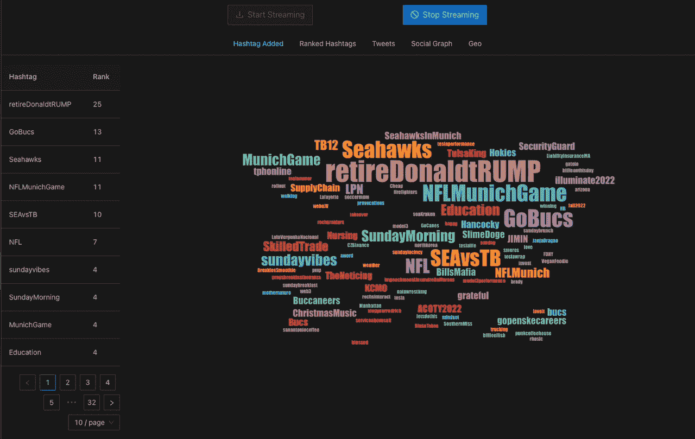
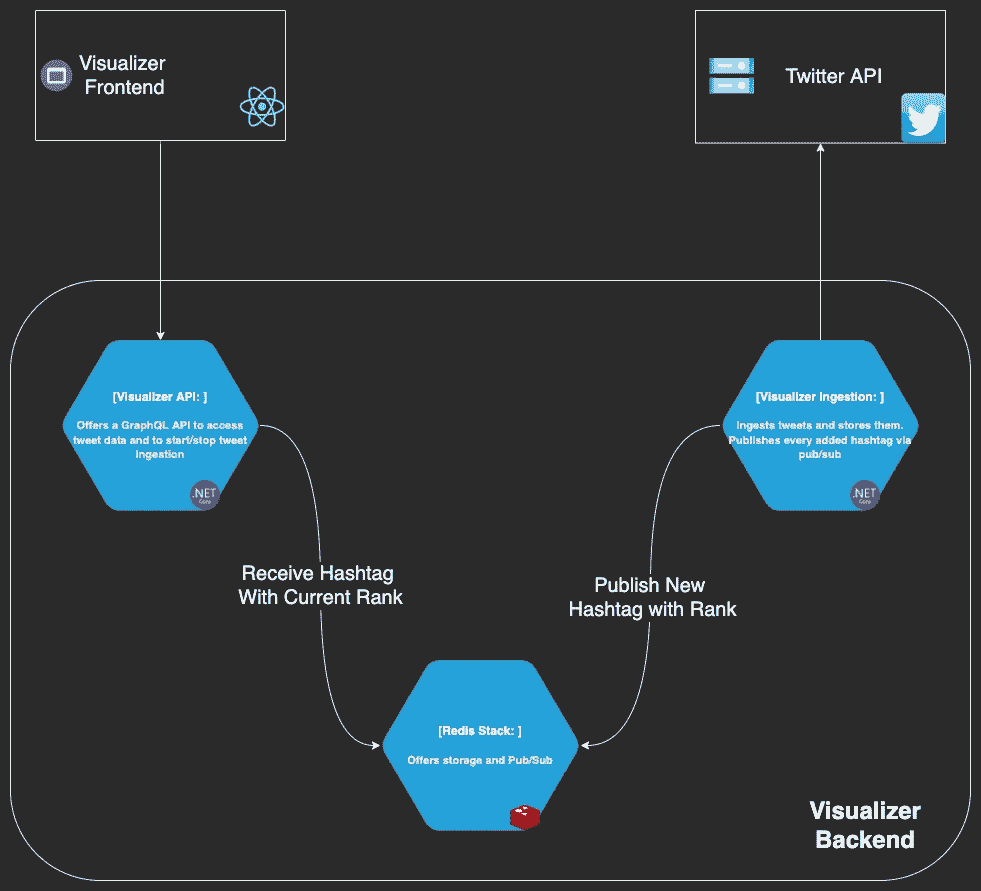
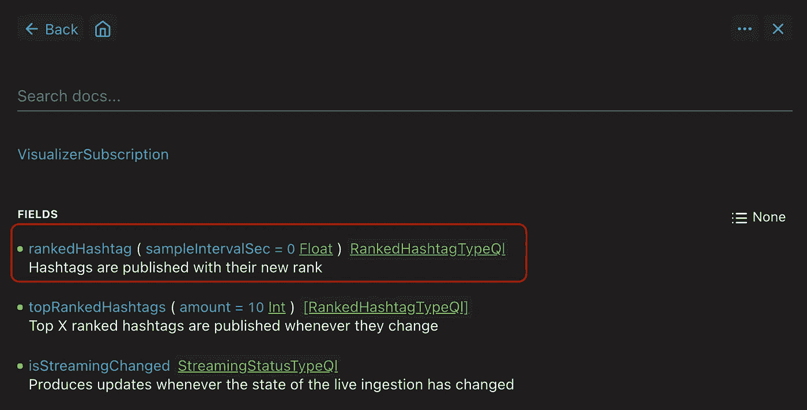

# Redis 作为数据库—通过 PubSub 和 GraphQL 订阅进行实时数据更新

> 原文：<https://betterprogramming.pub/redis-as-a-database-live-data-updates-with-pubsub-and-graphql-subscriptions-efafa665e173>

## 构建一个漂亮的小单词云

美国使用的实时标签—2022 年 11 月中旬

我的宠物项目被我命名为 Visualizer，我用它来了解 Redis，它可以开始从 Twitter 的[音量流](https://developer.twitter.com/en/docs/twitter-api/tweets/volume-streams/introduction)或从他们的[过滤流](https://developer.twitter.com/en/docs/twitter-api/tweets/filtered-stream/introduction)中摄取推文。

在这样做的同时，Visualizer 可以生成当前在摄取的推文中遇到的所有标签的实时流，并根据它们的频率对它们进行排名。

在这篇文章中，我想回顾一下系统中处理新推文的部分，提取并发布排名标签，最后将它们推到前端，以创建漂亮的词云。

如果你只是想看代码，这里有后端的 GitHub [链接，这里有前端](https://github.com/mariusmuntean/Visualizer)的[链接。顺便说一句。这是我关于使用 Redis 的第三篇文章，所以请确保阅读其他文章。](https://github.com/mariusmuntean/VisualizerFrontend)

# 可视化工具部分架构

可视化工具—部分架构

可视化工具由三个组件组成:

*   **Visualizer 摄取—** 一种 ASP.NET Core 6 服务，处理推文流并将它们存储在 Redis 中作为索引文档(JSON 格式)。它还发布每个遇到的 hashtag 及其等级，即 Visualizer 遇到它的次数。
*   **Visualizer API** —另一个 ASP.NET Core 6 服务，提供对存储的 tweet 数据和排名标签的实时流的访问。 [GraphQL](https://graphql.org/) 是我喜欢的另一项技术，它的[订阅](https://graphql.org/blog/subscriptions-in-graphql-and-relay/)是向任何消费者推送排名标签流的理想选择。
*   **Visualizer 前端** —一个展示 Visualizer 特性的 React type script+[ViteJs](https://vitejs.dev/)SPA。

在以后的文章中，我会更多地谈论我使用这种架构的原因。

# 发布排名标签

正如我提到的， **Visualizer 摄取**从 Twitter 的 API v2 获取推文，除了保存它们，它还发布任何遇到的标签及其排名。

tweet 数据检索不是很有趣。我只想说我使用了 [Tweetinvi](https://linvi.github.io/tweetinvi/dist/streams-v1.1/streams-introduction.html) 来做这件事。

对于每个提取的标签，都会发生一些事情:

*   **存储和排序**:我将每个标签存储在一个 [Redis 排序集合](https://redis.io/docs/data-types/sorted-sets/#:~:text=A%20Redis%20sorted%20set%20is,Leaderboards.)中。这个 Redis 数据结构具有集合的预期时间和空间特征，另外，多次添加一个元素将每次增加它的等级。这对于我的用例来说非常好，因为除了抽取我的有序集合中的所有标签之外，我不需要做太多事情。

下面是获取`IDatabase` *实例的代码。*最好将其添加到您的 DI 容器中。

之后，我将 hashtag 添加到一个有序集合中，并告诉 Redis 将这个 hashtag 的等级增加 1。请注意，我得到了新的排名作为响应。

*   发布等级为的标签:当我得到标签的新等级后，我正在发布它。这里我使用了 Redis ' Pub/Sub,它允许我向通道发布字符串消息。这有效地将**可视化器摄取**与**可视化器 API** 分离。

首先，您需要一个`ISubscriber`实例。像大多数可重用对象一样，我将它添加到我的 DI 容器中。

有了这个订阅者，我就可以将我的排名标签发布到一个频道

请注意，我使用了一个`RankedHashtag` DTO 来表示标签及其等级，并且在发布之前将它序列化为一个 JSON 字符串。还要注意，我使用了一个常量作为通道名。这是因为常量位于同一解决方案的共享项目中，并由 Visualizer API 重用。

# 消费排名标签

排名标签流由**可视化 API** 使用。它通过订阅 **Visualizer 摄取**用来发布每个标签及其当前排名的同一个通道来做到这一点。

在单例服务中，我为流中的新 hashtags 注册了一个处理程序

在处理程序中，每个通道消息被反序列化为`RankedHashtag` 的一个实例，并被传递给任何 GraphQL 订阅者

你看到的`_rankedHashtagStream`是一个普通的反应式扩展 *ReplaySubject* ，缓冲区为 1

它立即向其订户广播任何通知。但我听到你问，谁是它的订户？订阅排名标签的是 GraphQL API 用户；他们是订户。

在 **Visualizer** 中完成的方式对于我的需求和我正在使用的库来说是非常具体的，称为 [GraphQl-Dotnet](https://github.com/graphql-dotnet/graphql-dotnet) 。

RankedHashtag 订阅定义

请注意，GraphQL `rankedHashtag`订阅接受一个名为`sampleIntervalSec`的参数，默认值为 0。该值用于确定订户是否应该在所有已排名的标签到来时立即接收它们(通常称为实时，但不是严格意义上的)，或者订户是否应该接收通过每隔`sampleIntervalSec`秒对“实时”流进行采样而获得的另一个已排名的标签流。

GraphQL 模式中的 **rankedHashtags** 订阅。

# 可视化工具前端

这可能是系统中最没意思的部分，因为它只处理数据检索和呈现。它使用 [Apollo Client for React](https://www.apollographql.com/docs/react/) 连接到 **Visualizer API** 和 [react-wordcloud](https://github.com/chrisrzhou/react-wordcloud) 来呈现数据。

在高层次上，前端检索前 50 个 hashtags，按照它们的等级降序排列(在本文中没有显示，但这是一个简单的排序集合操作)。这是为了在 word cloud 中有所显示。

然后，它订阅已排序的标签流，每当一个已排序的标签到达时，它要么覆盖现有的 50 个标签中的一个，要么将其添加到同一个标签集中。

## **订阅排名标签**

我正在使用 Apollo 客户端的 codegen 特性来创建一个不错的 React 挂钩，用于订阅排名标签

然后，每当有新的排名标签可用时，我的组件被重新呈现。我正在合并新排名的标签和最初的 50 个

## **排名标签 Wordcloud**

显示一个漂亮的单词云涉及一些系统组件和多个概念，但是每个都很容易理解。

感谢阅读。如果你喜欢这个锅，给它一个👏请跟随我了解 Redis 的最新消息。