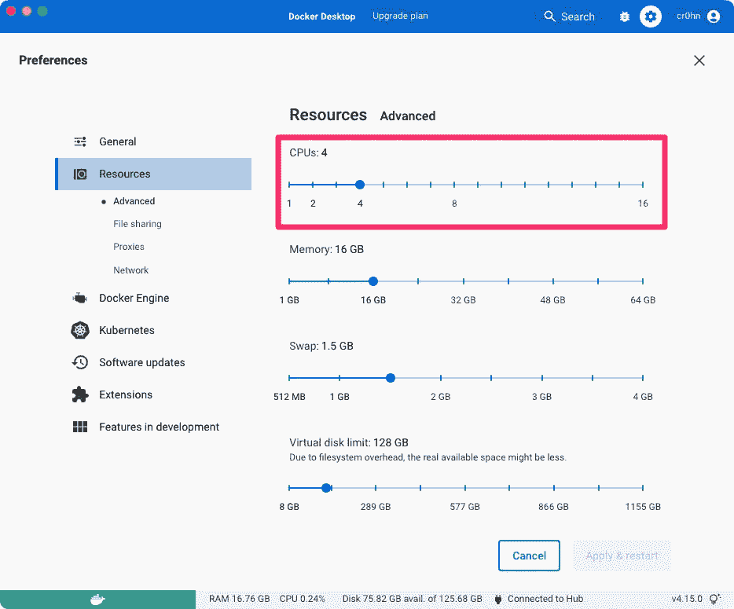
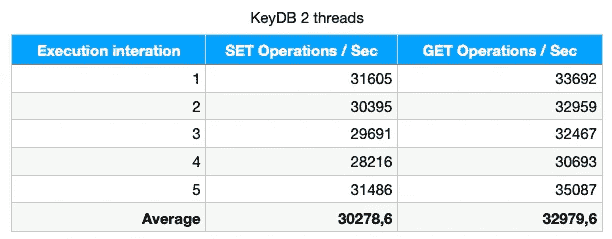
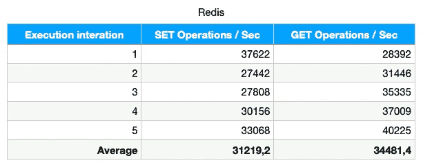

# Redis vs. KeyDB —我的性能测试和结论

> 原文：<https://betterprogramming.pub/redis-vs-keydb-my-performance-test-and-conclusions-519a658ded6e>

## KeyDB 比 Redis 快吗？


KeyDB 是 Redis 的一个分支。KeyDB 项目声称 Redis 实现方法是不正确的，在性能方面可以更好。

与只运行一个线程的 Redis 方法相比，KeyDB 可以运行多个线程。

[KeyDB 网站](https://docs.keydb.dev)声称它比 Redis 快。我做了一些快速测试来检查缓存服务器的性能(这意味着我测试了 GET / SET 之类的命令)，在这篇文章中，我将分享我的结果。

# 我考的怎么样？

对于我的测试，我使用 Docker 运行 Redis 和 KeyDb。我用 4 个 vCPUs 配置了我的 Docker 引擎，以利用 KeyDB 多线程的优势:



我还增加了操作系统的限制，以允许测试有大量的并发连接:

```
> ulimit -a
-t: cpu time (seconds)              unlimited
-f: file size (blocks)              unlimited
-d: data seg size (kbytes)          unlimited
-s: stack size (kbytes)             8192
-c: core file size (blocks)         0
-v: address space (kbytes)          unlimited
-l: locked-in-memory size (kbytes)  unlimited
-u: processes                       11136
-n: file descriptors                256
```

# 测试条件

我用这些参数做了一个测试:

*   查询总数:50.000
*   测试的命令:GET / SET
*   并发客户端:500
*   我执行了 5 次相同的测试。

# KeyDB 结果

`KeyDB Version: 6.3.1`

## 4 线程服务器

```
> docker run -p 6777:6379 eqalpha/keydb keydb-server --server-threads 4
```

执行测试:

```
> redis-benchmark -p 6777 -t get,set -q -n 50000 -c 500
SET: 23775.56 requests per second, p50=14.559 msec
GET: 22758.31 requests per second, p50=13.439 msec

> redis-benchmark -p 6777 -t get,set -q -n 50000 -c 500
SET: 18903.59 requests per second, p50=16.247 msec
GET: 22872.83 requests per second, p50=13.359 msec

> redis-benchmark -p 6777 -t get,set -q -n 50000 -c 500
SET: 23430.18 requests per second, p50=14.583 msec
GET: 20729.69 requests per second, p50=14.687 msec

> redis-benchmark -p 6777 -t get,set -q -n 50000 -c 500
SET: 17325.02 requests per second, p50=19.263 msec
GET: 19723.87 requests per second, p50=16.591 msec

> redis-benchmark -p 6777 -t get,set -q -n 50000 -c 500
SET: 25706.94 requests per second, p50=13.191 msec
GET: 19817.68 requests per second, p50=14.839 msec
```

总结一下:


## 双线程服务器

```
> docker run -p 6777:6379 eqalpha/keydb keydb-server --server-threads 2
```

执行测试:

```
> redis-benchmark -p 6777 -t get,set -q -n 50000 -c 500
SET: 31605.56 requests per second, p50=11.095 msec
GET: 33692.72 requests per second, p50=10.815 msec

> redis-benchmark -p 6777 -t get,set -q -n 50000 -c 500
SET: 30395.14 requests per second, p50=12.271 msec
GET: 32959.79 requests per second, p50=13.639 msec

> redis-benchmark -p 6777 -t get,set -q -n 50000 -c 500
SET: 29691.21 requests per second, p50=13.087 msec
GET: 32467.53 requests per second, p50=13.159 msec

> redis-benchmark -p 6777 -t get,set -q -n 50000 -c 500
SET: 28216.71 requests per second, p50=14.295 msec
GET: 30693.68 requests per second, p50=14.103 msec

> redis-benchmark -p 6777 -t get,set -q -n 50000 -c 500
SET: 31486.14 requests per second, p50=12.543 msec
GET: 35087.72 requests per second, p50=12.543 msec
```

总结一下:



## 单线程服务器

我只用一个线程做了测试，但是结果和用两个线程一样。

# Redis 结果

`Redis Version: 7.0.2`

执行服务器:

```
> docker run -p 6379:6379 redis
```

执行测试:

```
> redis-benchmark -p 6379 -t get,set -q -n 50000 -c 500
SET: 37622.27 requests per second, p50=12.527 msec
GET: 28392.96 requests per second, p50=12.919 msec

> redis-benchmark -p 6379 -t get,set -q -n 50000 -c 500
SET: 27442.37 requests per second, p50=13.439 msec
GET: 31446.54 requests per second, p50=15.527 msec

> redis-benchmark -p 6379 -t get,set -q -n 50000 -c 500
SET: 27808.68 requests per second, p50=13.751 msec
GET: 35335.69 requests per second, p50=13.391 msec

> redis-benchmark -p 6379 -t get,set -q -n 50000 -c 500
SET: 30156.82 requests per second, p50=14.631 msec
GET: 37009.62 requests per second, p50=12.711 msec

> redis-benchmark -p 6379 -t get,set -q -n 50000 -c 500
SET: 33068.79 requests per second, p50=13.359 msec
GET: 40225.26 requests per second, p50=10.999 msec
```

总结一下:



# 结论

好的。结果很奇怪:

1.  KeyDB 说它们比 Redis 更快，因为它们可以以多线程的方式运行，但在测试中，结果显示当线程数为 10 比 1 时，它运行得更快…就像 Redis 一样。
2.  这意味着 KeyDB 需要更多的资源来达到与 Redis 相同的性能。
3.  KeyDB 线程需要统计你的硬件资源；否则，Redis。

我们还必须记住，KeyDB 有一个 Redis 没有(至少在他们的开源版本中没有)的特性，比如:

*“*开启闪光”功能。该功能使用 SSD 磁盘作为 RAM 的扩展，在性能非常相似的情况下花费更少的 RAM。

*   闪存上的 redis:[https://redis . com/redis-enterprise/technology/redis-on-flash/](https://redis.com/redis-enterprise/technology/redis-on-flash/)
*   闪存上的 KeyDb:[https://docs.keydb.dev/docs/flash/](https://docs.keydb.dev/docs/flash/)

> 我试图在 Flash 特性上运行带有*的 KeyDB 服务器，但是我做不到。它给了我一个错误:“尚不支持 FLASH”。*