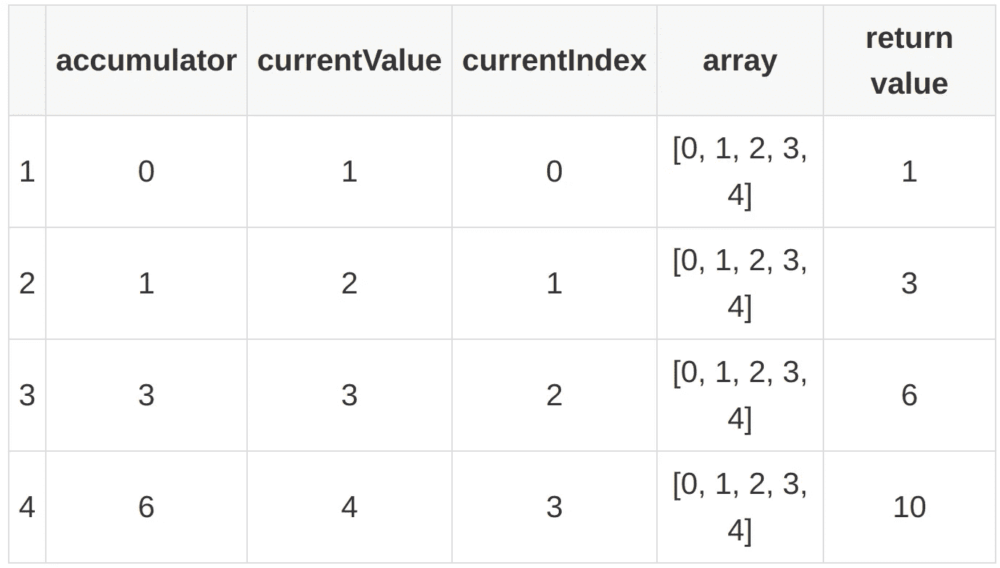
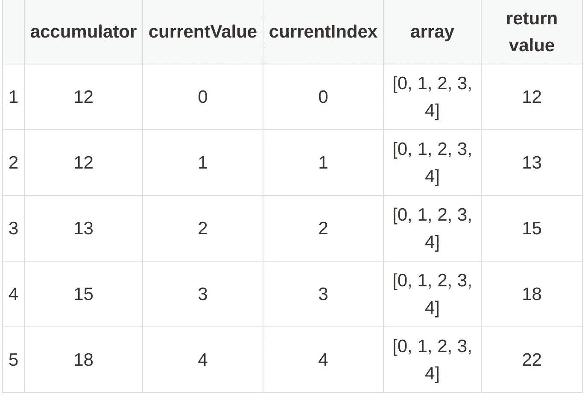

# JavaScript 中的 Reducer:一个简单而强大的数组方法

> 原文：<https://betterprogramming.pub/reducer-in-javascript-a-simple-yet-powerful-array-method-108c74b4c888>

## 了解这个基本 JavaScript 数组函数的来龙去脉


作者照片。

JavaScript 的`reducer`是开发人员最有用的数组方法之一。在 ES5 中引入，它有点类似于用于数组的`for…each`和`map`方法，但是在特定情况下改进了它们的性能和简单性。

`reduce`方法执行我们为存储在数组中的每个元素提供的回调函数，并输出操作生成的最终值。这是一种迭代和处理存储在数组中的数据的更干净的方式。

目前，所有主流浏览器版本都支持它[,并且从 10.0 版本开始，Node.js 就可以使用它了。](https://caniuse.com/mdn-javascript_builtins_array_reduce)

今天，我们将探索`reduce`方法。我们将介绍在不同的场景中，您应该如何以及何时使用`reducer`。

那我们开始吧！

# JavaScript 减少方法参数

`reduce`方法接受两个参数:一个用作回调的数组的`reducer`函数和一个可选的`initialValue`参数。reducer 函数有四个参数:`accumulator`、`currentValue`、`currentIndex`和`array`。

```
arr.reduce(callback( accumulator, currentValue, [, index[, array]] )[, initialValue])
```

下面是 JavaScript 数组`reduce`方法的一个实例:

```
[0, 1, 2, 3, 4].reduce((accumulator, currentValue, currentIndex, array) => accumulator + currentValue);
```

这个`reduce`方法与下面的`for…each`循环做同样的工作，但是代码行更少:

```
const array = [0, 1, 2, 3, 4];let total = 0
array.forEach(num => {
  total += num
});
```

使用这些参数，`reduce`方法是如何实现的？

由`reducer`函数返回的值被分配给`accumulator`变量。在数组项的每次迭代中，`accumulator`的值被更新为返回的结果。迭代结束时，`accumulator`的最终值作为`reduce`函数的输出返回。

如果传递了一个`initialValue`参数，第一次执行`reducer`函数时，`accumulator`将等于`initialValue`，`currentValue`将等于数组中存储的第一个元素。如果没有通过`initialValue`，则`accumulator`将等于数组的第一个值，而`currentValue`将等于第二个值。

在下面的例子中，让我们看看每次调用回调函数时，这些参数的值是如何变化的。这里，我们不传递一个`initialValue`参数:

```
[0, 1, 2, 3, 4].reduce((accumulator, currentValue, currentIndex, array) => accumulator + currentValue);
```



这个函数的最终输出是`10`。

接下来，让我们看看当一个`initialValue`被传递时它是如何工作的:

```
[0, 1, 2, 3, 4].reduce((accumulator, currentValue, currentIndex, array) => accumulator + currentValue, 12);
```



该函数输出值`22`。

# 何时使用减速器

`reduce`方法提供了一种独特的方法来遍历数组中的项目并处理它们。那么在什么情况下我们可以从这种独特性中获益呢？

## 计算数组中值的总和

这类似于我们在前面的例子中所做的。唯一的区别是我们必须为`initialValue`参数传递`0`:

```
let total = [34, 12, 143, 13, 76].reduce((accumulator, currentValue) => accumulator + currentValue, 0);
```

## 展平数组

如果我们有一个数组的数组，我们可以使用`reduce`方法将其展平，并创建一个没有嵌套数组的单个数组:

```
let array = [[0, 1], [2, 3], [4, 5], [5, 6]];let flattenedArray = array.reduce((accumulator, currentValue) => accumulator.concat(currentValue), []);
```

我们传递一个空数组作为初始值，这样第一个数组中的项目就与它连接在一起，创建一个扁平的数组。

如果第一个数组有不止一层的嵌套数组，我们可以递归地调用`reduce`函数来展平它们，然后将它们与最终的数组连接起来:

如果回调函数接受的当前值是一个数组，正如使用`isArray`方法验证的那样，我们递归调用它的`flattenArray`函数。如果当前值不是一个数组，我们只需将该值与最终的扁平数组连接起来。

## 按属性对对象数组进行分组

让我们假设我们有一个国家对象数组。我们希望根据所在的洲对阵列中的每个国家进行分组。我们可以使用`reduce`方法来完成这项任务:

在回调函数中，我们为不在`groupedCountries`地图中的每个洲创建一个新键，并为其赋值一个空数组。然后，我们将每个国家对象推送到由它们各自的洲存储的数组中。

# 使用 reduce()代替 filter()。地图()

在 JavaScript 中，我们使用`filter`方法通过回调来过滤存储在数组中的项目。我们使用`map`方法使用旧数组创建一个新数组，使用回调中传递的逻辑。有时我们不得不一个接一个地使用这两种方法来创建一个新的数组，其中包含我们使用某些条件过滤的结果。

您可以使用 JavaScript `array reduce`方法来完成相同的任务，而不是使用两个数组方法。这将减少完成时间，因为现在您只需遍历数组一次，而不是两次。

例如，让我们以下面的场景为例，我们希望创建一个大于 30 的数字的平方根数组:

```
let numbers = [3, 21, 34, 121, 553, 12, 53, 5, 42, 11];let newArray = numbers.filter(number => number > 30).map(number => Math.sqrt(number));
```

使用`reduce`实现的相同场景如下所示:

在回调函数中，我们简单地检查数字是否大于 30，并将它的平方根加到`accumulator`数组中。你必须传递一个空数组作为初始值来得到这个结果。

# 构建您自己的减速器

在本节中，我们将自己实现`reducer`函数，看看它是如何工作的。这将让您更好地了解何时使用`reducer`来优化程序性能。

首先，我们检查是否在空或未定义的对象上调用了`reduce`方法。然后我们检查传递的回调是否是一个函数。

在初始类型检查之后，我们将传递的`initialValue`分配给`accumulator`。然后我们遍历数组，并为数组中的每一项调用回调函数。在执行结束时，我们必须返回`accumulator`值。

我们使用这个实现只是为了帮助你理解`reduce`方法实际上是如何工作的。例如，您可以看到它使用了一个`for`循环来遍历这个数组。

但是，请注意，您不应该在生产代码中使用这种实现。事实上，将方法原型化为 JavaScript 标准类型是一种糟糕的编码实践，您永远不应该沉迷于此。

# 摘要

在本文中，我们讨论了最有用的 JavaScript 数组方法之一:`reducer`。我们讨论了如何以及何时使用它，甚至从头开始构建了我们自己的`reduce`方法。

我希望这些知识能帮助你在将来识别出可以通过使用`reducer`解决的问题。其中一些用例与`[forEach](https://livecodestream.dev/post/javascript-foreach-powered-array-for-loop/)`、`map`和`filter`数组方法重叠，因此您应该知道如何选择可以使用`reduce`方法最佳解决的情况。