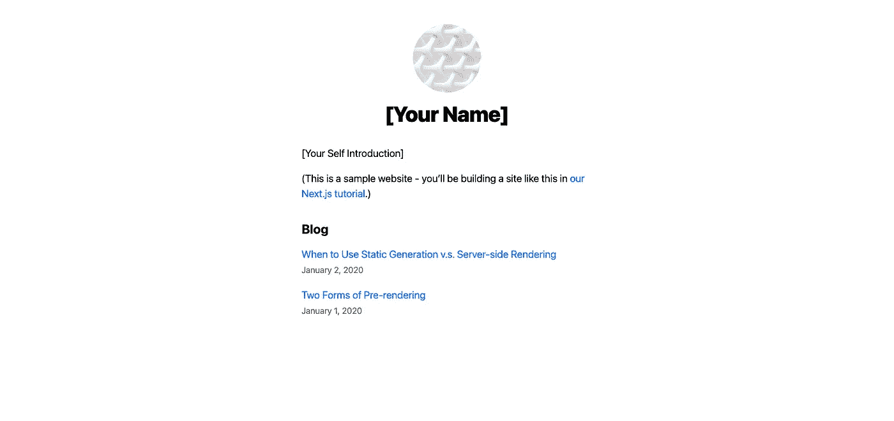
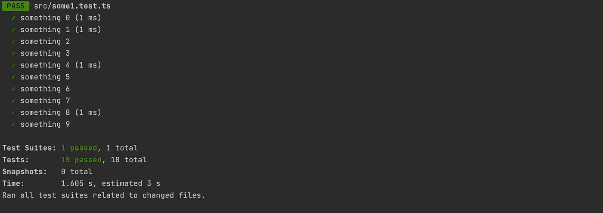
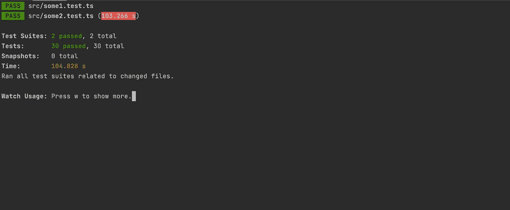
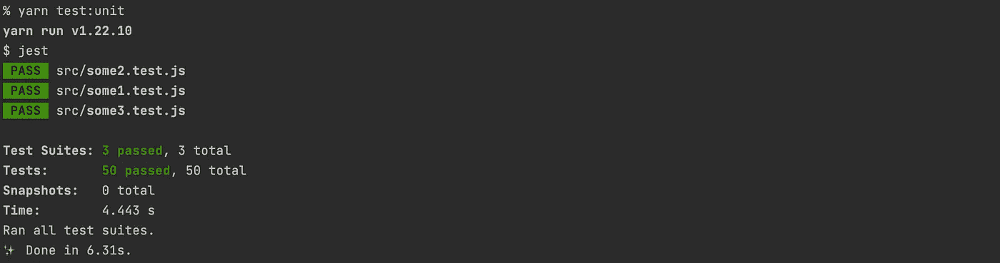
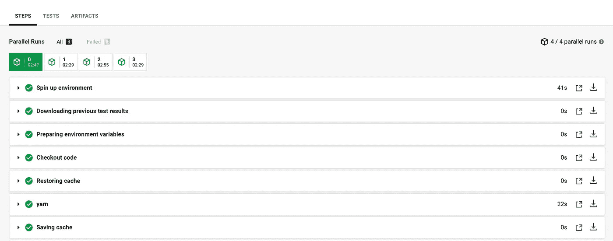

# 使用 Jest 和 CircleCI 缩短应用测试时间

> 原文：<https://betterprogramming.pub/reducing-app-testing-time-using-jest-and-circleci-39170231fee2>

## Jest 和 CircleCI 并行测试指南


照片由 [Unsplash](https://unsplash.com?utm_source=medium&utm_medium=referral) 上的 [Kristopher Roller](https://unsplash.com/@krisroller?utm_source=medium&utm_medium=referral) 拍摄。

这篇文章将带你了解如何使用 CircleCI 进行测试分割，以及如何减少你的应用程序的测试时间。它还将详细说明如何分割前端测试以改进 DX。

以下是 GitHub 的最终代码:

[](https://github.com/manakuro/testing-in-parallel-example) [## manakuro/并行测试示例

### 与 Jest 和 CircleCI 并行测试。通过创建……为 manakuro/并行测试示例开发做出贡献

github.com](https://github.com/manakuro/testing-in-parallel-example) 

# 设置 React 应用程序

为了快速开始，我们将使用 create-next-app 来设置 React 应用程序:

```
npx create-next-app test-app
```

安装完成后，通过运行以下命令运行开发服务器:

```
yarn dev
```

您将看到欢迎页面:



欢迎页面

# 开个玩笑

接下来，我们将设置一个 Jest 环境。

安装依赖项:

```
yarn add -D babel-jest jest
```

创建一个`babel.config.js`:

并将测试脚本添加到`package.json`:

```
"scripts": {
  ...
  "test": "jest"
},
```

# 写一个测试

假设我们有两种文件:

*   测试不会花很长时间的简单模块。
*   测试大型组件将花费大量时间。

首先，我们将编写一些模块测试。像这样创建一个名为`some1.test.js`的测试:

并执行测试，这将只需要几秒钟:



接下来，我们将创建第二个类别，它将测试大型组件，需要很长时间。

在这种情况下，我不会实现细节，但这些测试类似于在酶中使用`[mount()](https://enzymejs.github.io/enzyme/docs/api/mount.html)`的测试。

与浅层或静态呈现不同，`mount()`很重，因为它将呈现整个组件——包括所有子组件——并将组件挂载到 DOM 中。

得益于此，一个完整的 DOM API 在全球范围内可用。它将使您能够在您的应用程序中测试实际案例。

然而，如果你的应用程序中存在大量这样的测试，这可能会花费相当多的时间，并影响你的团队的生产力。

因此，让我们来编写测试。

创建一个名为`some2.test.js`的文件:

当您运行测试时:



需要 104 秒，尽管第一个只需要几秒钟。

在实际情况下，这是因为你的应用程序越大，你的应用程序中需要的测试就越多。

另外，如果你一直加上`some3.test.js`、`some4.test.js`、`some5.test.js`等等，那么在 CI 中的时间会更长。

# 前端测试

我们如何应对这个问题？在回答这个问题之前，让我们考虑一下前端测试应该覆盖哪些内容。

在前端开发中，您的测试套件应该由三层组成:

*   E2E 测试
*   集成测试
*   单元测试

## E2E 测试

端到端(E2E)测试用于模拟用户与应用程序交互的实际步骤。

它们是在真实浏览器中工作的所有组件和 API 的组合，这让您确信它们真的会在您的应用程序中工作。

在前端开发中，E2E 测试应该只覆盖应用程序中的基本特性，而不应该覆盖所有的功能，因为它可能会变得昂贵和不可靠。

## 集成测试

集成测试由组件和函数组成，它们只断言组件的公共接口。他们不应该关注组件的内部实现细节和完整的基于行的覆盖。

对于单个测试用例，它应该只关注组件的预期输出，如[黑盒测试](https://en.wikipedia.org/wiki/Black-box_testing)。这样做的好处是，无论您如何更改组件的内部实现，只要输出与之前相同，测试就会通过。

为了实现这一点，应该在 DOM 中安装组件来模拟用户交互。但是如果有很多测试，这可能会变得很麻烦，因为安装整个组件及其所有依赖项可能会变得很慢。

在前端开发中，集成测试应该覆盖什么样的组件？例如，在原子设计中，集成测试应该在模板或页面层编写。它们由原子、分子和有机体组成，并在页面上提供一组特征。他们不关心孩子们如何工作，只关心投入和产出。

## 单元测试

单元测试用于测试更小的模块或组件，例如原子设计中的原子、模块和有机体。

与集成测试不同，组件中的单元测试使用浅层呈现，这允许您挂载组件，而无需通过模仿子组件来呈现它们。单元测试的范围应该更窄，并使代码可测试，这样您就可以轻松地运行它们，而无需任何开销。

所以单元测试的数量可能远远超过任何其他类型的测试。

# 将测试分为单元测试和集成测试

如果您在测试中遇到性能问题，尝试将它们分成单元测试和集成测试，并在不同的线程中运行它们。这可以减少所需的测试时间。

让我们假设我们有十个测试文件。其中七个使用 mount render，与其他相比成本较高，如下所示:

```
some1.test.js
some2.test.js
some3.test.js// use mount render
some4.test.js
some5.test.js
some6.test.js
some8.test.js
some9.test.js
some10.test.js
```

然后我们将它们的扩展名重命名为`intg.js`，就像这样:

```
some1.test.js
some2.test.js
some3.test.js// use mount render
some4.**intg**.js
some5.**intg**.js
some6.**intg**.js
some8.**intg**.js
some9.**intg**.js
some10.**intg**.js
```

这意味着我们这里有七个集成测试。

而在`jest.config.js`中，像这样添加`testMatch`:

对`package.json`做如下修改:

```
"scripts": {
   ...
  "test:unit": "jest",
  "test:integration": "INTEGRATION=true jest"
},
```

现在我们已经将测试分为单元测试和集成测试。

当您添加一个新的单元测试时，运行所有的单元测试会更容易，而不需要昂贵的单元测试:



然而，运行集成测试仍然很昂贵。让我们让它们并行执行。

# CircleCI 的平行测试

CircleCI 提供了通过测试分割进行并行测试的能力，它接受一个测试列表，并将它们分割到由`config.yml`中的`parallelism`定义的节点数上。

这是在 CircleCI 上加速构建和运行的最简单的方法之一。

首先，为`package.json`中的 CI 添加`test:integration:ci`:

转到您的`.circleci/config.yml`并添加`parallelism`键:

在测试作业中，添加如下命令:

`circleci test glob src/**/*.intg.js`将接收测试文件列表，CircleCI CLI 将根据计时数据对其进行分割。CircleCI 查看历史计时数据，并跨节点动态拆分测试。

为了能够在 CircleCI 中做到这一点，我们需要安装`jest-junit`:

```
yarn add -D jest-junit
```

既然我们已经准备好了。当您推动变更时，CircleCI 会自动拆分您的测试并并行运行它们:



# 结论

就是这样！我们已经介绍了前端测试应该覆盖的内容，以及如何通过拆分来加速测试。

随着应用程序的增长，测试中需要的内容会发生变化。

拆分测试并并行运行它们是提高测试性能的方法之一。在某些情况下，例如对于较大的应用程序，它可能适合您的需要。

这个问题可能有其他的解决方法，所以请在评论中告诉我。