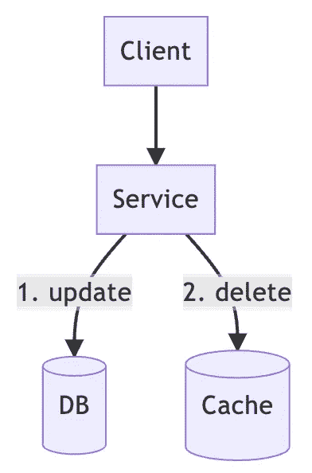
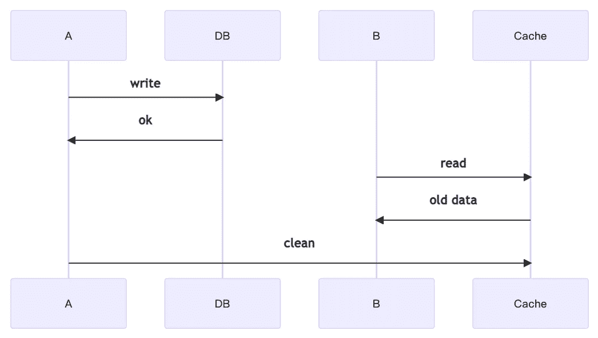
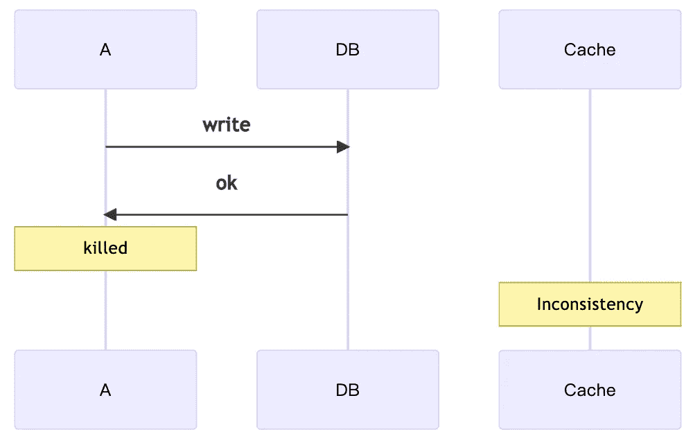
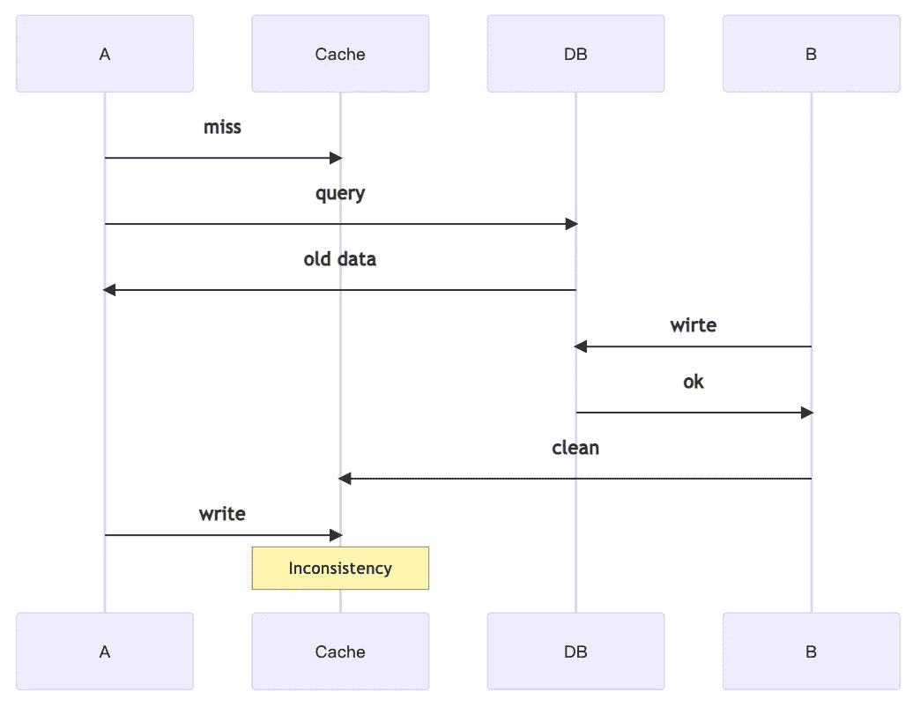
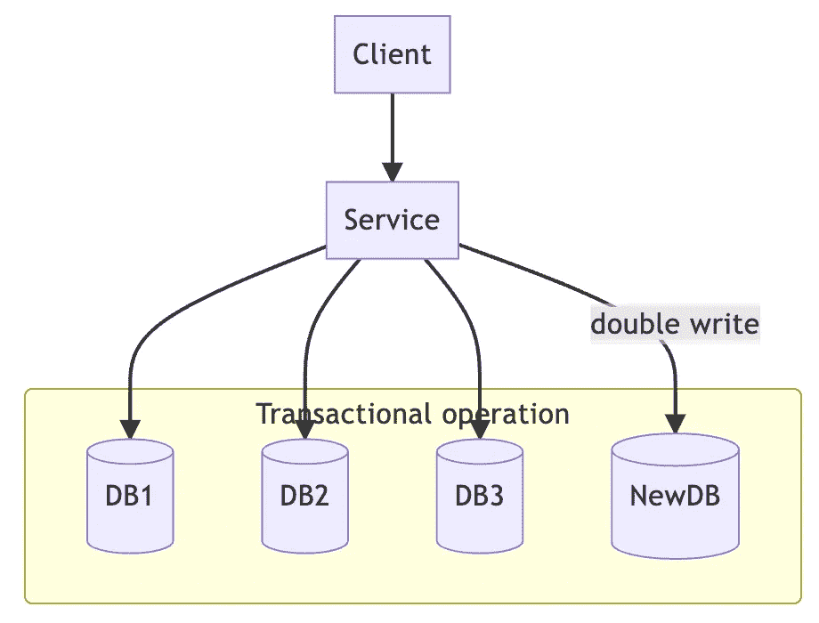
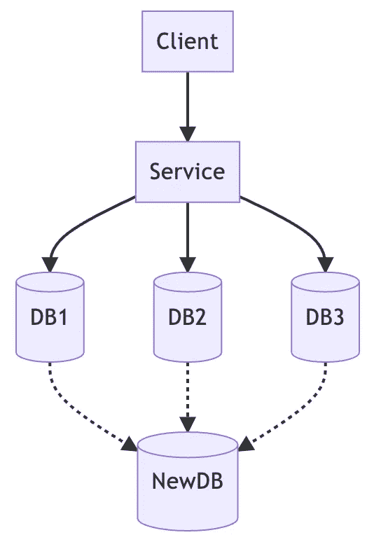
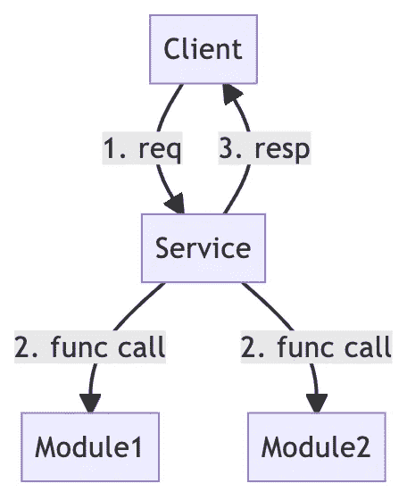
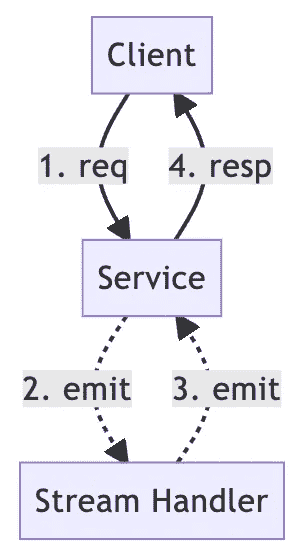

# 减少数据库负载

> 原文：<https://betterprogramming.pub/reducing-database-loading-b54f2d8edb39>

## 提高数据库弹性的三种方法

迈克·范·登博斯在 [Unsplash](https://unsplash.com/photos/jf1EomjlQi0) 上的照片

上周我们谈到了[可伸缩性和弹性的区别](/scalability-vs-elasticity-cfae2d7a19b)，解决方案的概念被提到了很高的层次。在本文中，我们来看看一些实用的解决方案。

第一，如果你还没看完[上一篇](/scalability-vs-elasticity-cfae2d7a19b)，建议你先看完。这次我们解决的是弹性问题，而不是可伸缩性问题。如前所述，弹性问题的两个最常见的解决方案是缓存和消息传递。

因此，在本文中，我们将列出一些常见的实用解决方案，并简要分析其优缺点。让我们开始吧。

# 旁读缓存

当谈到缓存时，最常用的机制是旁读缓存。

优点是它非常容易理解和实现，并且已经提供了良好的一致性水平。我已经在我的上一篇文章中解释了它是如何工作的，但是让我们再回顾一下。

旁读缓存的读取路径

旁读缓存的读取机制非常简单:首先尝试从缓存中获取数据，如果无法获取，则从数据库中获取，并将其保存回缓存。这样，对相同数据的下一个请求可以直接从缓存中取出。

如何保证缓存的数据是最新的(一致性)？

旁读缓存的写入路径

更新数据库后，应立即清除缓存中的相应记录。当下一次出现相同的请求时，将首先从数据库中取出请求，并将最新的结果写回到缓存中。

看起来读和写都是完美的，所以旁读缓存应该有高度的一致性！其实也不尽然。

旁读缓存的问题#1

根据上面的时序图，我们可以发现，A 和 B 的行为都是正确的，但是放在一起，他们犯了一个错误，B 得到了不一致的数据。这是第一个问题。

旁读缓存的第二个问题

第二种错误更直观，当 A 想要更新数据时，A 在完成数据库更新后被杀死，可能是因为 bug 或者应用升级等等。那么缓存中的数据将长时间保持不一致，直到下一次更新或超时。

旁读缓存的问题#3

第三个错误和第一个类似，A 和 B 的单个动作是正确的，但是放在一起就是错误的。这种不一致的缓存数据也会保留一段时间，直到下一次更新。

这些细节在[我之前的文章](https://medium.com/starbugs/consistency-between-cache-and-database-part-1-f64f4a76720)里已经解释过了，如果想了解更多也可以作为参考。

事实上，问题 1 和 3 可以通过修改应用程序的实现来大大缓解。在第一个问题中，当 A 写完数据后，不要再做其他事情，然后快速清理缓存，减少被 b 接触的可能性。

问题 3 也是如此。当 A 完成查询后，不要做过多的处理，尽快回写缓存，这样也可以大大降低 b 之后发生的几率。

然而，旁读缓存有三个潜在的问题。

1.  如果缓存中的内容范围很大，就很难确定何时清理和实现它。另一方面，当许多地方需要清理时，可能会降低缓存的效率。
2.  狗堆效应。这是指当高流量系统频繁访问缓存时，如果遇到清除缓存或缓存过期，这些流量仍然会出现在数据库上。数据库可能无法支持。
3.  没有正常关机。问题 1 和 3 可以通过修改应用来改善，但是问题 2 并不总是可以的，尤其是当应用失败的时候，基本上就没什么可做的了。

# 反规格化

> *如果我们必须从许多地方获取数据，理想的做法是将所有数据放在一起，只获取一次。*

按照惯例，为了避免 RDBMS 中的数据重复，我们会根据数据类型创建单独的表，然后通过外键相互连接。

但是这样会造成一个问题，如果是一个聚合数据必须从每个表中拉出，在系统的流量和数据量不大的情况下，这种方法是合理的，并且会有很好的性能。然而，在大数据场景中，这样的表现是悲剧性的。

JOIN 的性能对于大数据来说不够好，如果是子查询就更差了。

因此，反规范化的思想是将所有数据放在一起，并通过单个查询提取所有需要的数据。常见的做法包括事实表等。，但本文的重点不是数据建模，而是系统架构。

然而，问题是从一个地方读取是可能的，但是向它写入呢？原始表已经被客户机使用，那么我们需要找到所有的客户机来修改它们吗？不行，工作量太大了！

有两种方式，同步和异步。

同步数据复制

这是一个同步的架构。以下数据库可以被视为数据库或表，甚至是缓存。

当服务需要写数据时，原本只需要写`DB1`、`DB2`、`DB3`，为了实现反规范化，还需要用代码写`NewDB`，而`NewDB`就是聚合的结果。

如果有人需要汇总结果，他们可以直接从`NewDB`中提取。如果这些 db 的所有者都属于同一个职能团队，那么这个实现看起来是可以接受的。

相反，如果需要巩固成果的团队是另一个职能团队，这样的架构是行不通的。首先，另一个功能团队必须找到所有的更新，然后他们必须在服务中进行更改，并且他们必须以事务的方式进行。

对于一个跨职能团队来说，这样的工作流程是不现实的，也是不可能的。因此，引入了异步数据复制。

异步数据复制

这种架构在我以前的文章中应该很常见，它实际上是 CQRS。

*   [从独石转向 CQRS](https://medium.com/interviewnoodle/shift-from-monolith-to-cqrs-a34bab75617e)
*   [通过 CQRS 解决性能瓶颈](https://lazypro.medium.com/solve-performance-bottleneck-through-cqrs-3fd456df1551)

然而，有各种实施 CQRS 的实践，下面列出了其中的一些。以下是从长到短时间间隔的常见做法列表。

***ETL***

> *DBs - >批处理- >物化视图*

这是现在最常见的做法，几乎所有的数据工程师都是这样做的。数据通过批处理从一个地方迁移到另一个地方，不管是 Hadoop 还是 Spark。

在流程中可能会添加一些转换和业务逻辑。为了让数据更易访问，如果使用 RDBMS 作为 NewDB，那么可能会添加`Materialized View`。数据按预定义的规则拍摄快照，如果数据更新，它会刷新以响应新数据的计算。

但是数据迁移是一项非常昂贵的实践，因此 ETL 不会一直发生，相反，它会每小时甚至每天发生一次。

所以从 NewDB 获取的数据不会是最新的，而是某个时间点的快照。

***疾控中心***

为了使数据尽可能保持最新，我们知道 ETL 是不够的。因此，CDC 是另一种常见的做法。

> *DBs->Debezium->Kafka->流媒体 DB*

当数据更新时，它被 [Debezium](https://debezium.io/) 捕获，流出到 Kafka，最后被写入一个流数据库。

流式数据库可供外部用户使用，因此流式数据库必须不仅能够支持流式写入，还能够支持快速查询功能。

主流的流式数据库有很多， [Apache Pinot](https://pinot.apache.org/) 是最近最流行的一个。

因为 CDC 流是实时更新的，所以外部用户可以获得几乎实时的数据。

***串流***

另一种实时流机制来自最初写入数据的服务。

> *服务- > Kafka - >流处理器- > RocksDB*

当服务完成对原始数据库的更新时，它会主动向 Kafka 发送一个事件，由 Kafka 进行调度。

在这样的系统中，最常见的是使用流框架来做流的预处理并将它们存储在数据库中。常见的流框架有 Apache Flink 或者 Apache Samza，当然还有最近的 Kafka 流。

对于后端数据库，我们选择一种可以匹配流式处理框架的状态持久化机制，RocksDB 是几种常见流式处理框架的最佳选择。

这样我们也可以得到最新的数据，但是从查询的角度来说，流处理框架提供的查询能力是流数据库无法比拟的。

以上三种是常见的数据复制方法，值得一提的是，每种方法的组件都可以相互交换甚至扩展，从而可以根据需求构建不同的架构。

然而，异步数据复制存在潜在的问题。

1.  如果要使用的数据范围很广，那么定义要复制的数据是个大问题。正如很难确定旁读缓存的清理时间一样，很难定义数据复制的范围。
2.  另外，无论是通过流式框架进行预处理，还是通过流式数据库定义查询，在涉及到复杂的数据结构和复杂的计算时，复杂度明显较高。
3.  这三种方法中，ETL 的复杂度最低，但是 ETL 损失了数据的实时性。

# 异步请求/响应

我们都知道传统的请求/响应模型如下。

同步请求响应模型

虽然这里是一个函数调用，但也可以是跨服务的远程调用。

客户端发出请求后，服务器通过一系列处理来响应请求，这是传统的做法。我们如何异步地做到这一点？

异步请求响应模型

答案是让服务器后面的函数实现异步。

这样做有什么好处？

1.  通过使用事件处理程序来处理事件，然后我们可以控制处理程序的数量来确定后端系统或数据库的压力。在同步模型中，当大量客户端请求进来时，服务器会相应地分叉线程，并对后端系统施加压力。然而，当事件处理程序的数量可控时，后端系统的压力也可以得到控制。
2.  请求重复数据删除。由于来自客户端的所有请求都会进入消息队列，因此事件处理程序能够根据特定规则执行重复数据删除。
3.  此外，如果使用流式框架，则可以遵循上一节中的第三种方法来实现进一步的反规范化。

然而，这样的架构也有缺点。

1.  这种架构必须基于这样的假设，即用户将在短时间内大量刷新页面，以便能够发挥重复数据删除的优势。这种架构并不意味着只适用于这种上下文，但是如果没有匹配的上下文，那么实现起来就会太痛苦，收获太少。
2.  实现开销。服务器必须有等待异步消息的能力，这说起来简单，但是实现起来有很多方面。例如，我们应该使用临时队列还是永久队列？我应该等多久？诸如此类的问题需要慎重考虑。
3.  饥饿。为了控制并发消息的数量，我们没有无限制地启用处理程序，但这也意味着有些人等不及处理而超时。

# 结论

本文描述了一些提高数据库弹性的方法。

与提高可伸缩性的方法不同，可伸缩性可以通过面向数据库的方法来实现，如查询优化、索引和数据分片。

然而，提高弹性不能仅仅通过数据库来完成，而必须伴随着架构调整，因此本文列出了一些常见的方法。

事实上，还有许多比这更有用的实践，本文针对的是中小型组织。人数有限，预算有限，不可能进行大规模的改变，只能在原有的做法上进行优化。

尽管如此，我相信这些方法应该为系统的进一步发展提供很好的见解，毕竟，所有的方法都是相似的。