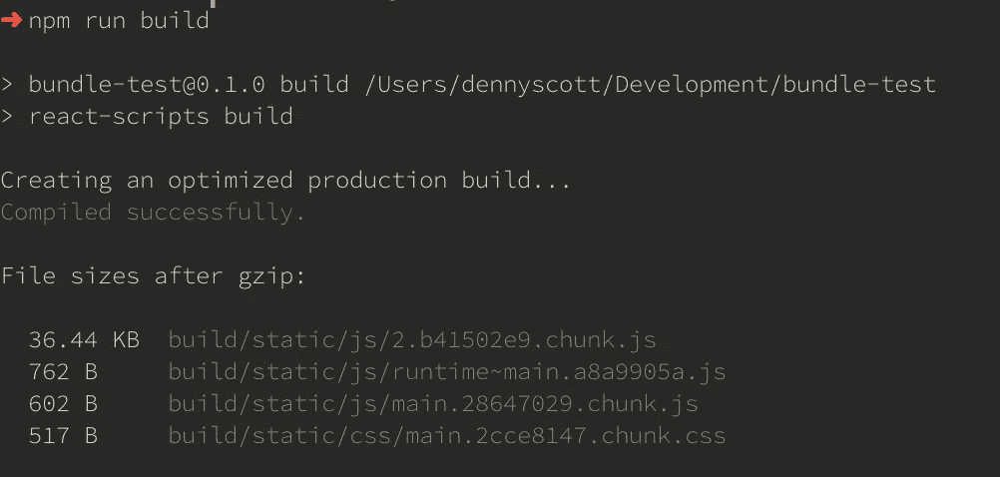
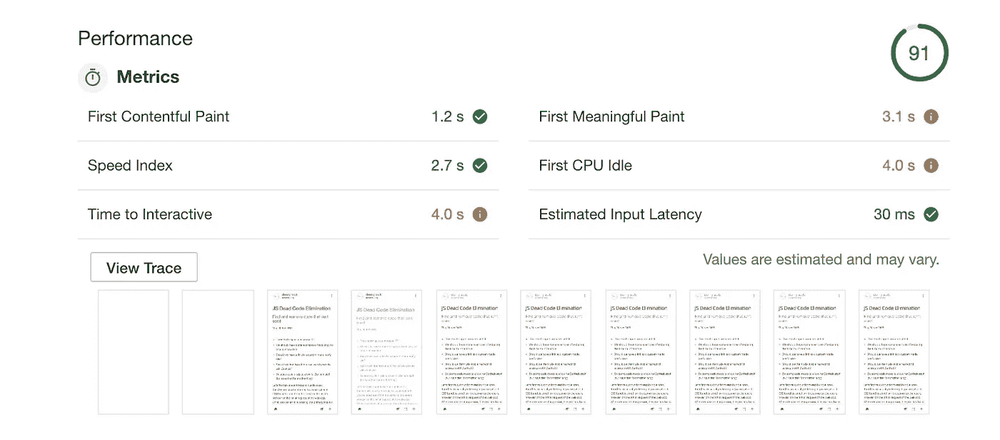

# 减小 JavaScript 包的大小

> 原文：<https://betterprogramming.pub/reducing-js-bundle-size-58dc39c10f9c>

## 第一部分:策略的度量和高级视图


欢迎来到关注减少 JavaScript 包大小的系列文章的第一部分。

随着 2011 年左右像 [AngularJS](https://en.wikipedia.org/wiki/AngularJS) 这样的框架的出现，以及[单页面应用](https://en.wikipedia.org/wiki/Single-page_application)的普及，JavaScript 的使用在前端出现了爆炸式增长。仅 2010 年一年，网络应用的平均规模就超过了三倍。由于 JavaScript 库和框架广泛用于开发这些 web 应用程序，缩小 JavaScript 包的能力变得前所未有的重要。

在这篇文章中，我们将了解:

*   什么是 JavaScript 包？
*   我们如何衡量捆绑包对用户的影响？
*   什么是 TTI？
*   我们如何分解我们的捆绑包？

我们开始吧！

# Javascript 包

先说 JavaScript 捆绑包。Bundles 通常是指从服务器发送到用户浏览器的 JavaScript 和 CSS 包。当我们顺便讨论它时，主要的焦点通常是发送到客户端以初始化 web 应用程序的初始 JavaScript 包的大小，以及该包如何影响用户可以使用应用程序之前的时间量。然而，主捆绑是什么呢？

曾经有一段时间，我们会发送几个 JavaScript 文件，使我们的网页更具互动性。通常情况下，你会有一个到 JQuery 的 CDN 链接，可能还有一些插件，然后是一个保存了你大部分定制代码的`main.js`。这不是一个硬性规定，但是在这个场景中，您只有一个包含相对较少 JavaScript 的文件。当用户向服务器发出请求时，JavaScript 将与 HTML 和 CSS 一起被发送到浏览器。实际的网页和内容在发送到客户端之前通常完全构建在服务器上。如果用户需要另一个页面，他们会向服务器发出后续请求。

这并不是说缩小和大小在当时并不重要！

如今的景观大不相同。单页应用程序(SPA)意味着用户将向服务器发出请求并下载整个 web 应用程序。从那里开始，JavaScript 将负责路由、交互、网络请求等等。这意味着比以前有了更多的 JavaScript。此外，我们的项目已经从几个。js 文件扩展到数百或数千个。如果我们单独地请求所有这些，那将花费无穷的时间！

相反，我们使用 Webpack、Parcel 或 Rollup 之类的工具将文件打包成包进行分发。这些捆绑系统的默认策略是用我们的。js 文件，因为这将花费最少的时间和最少的请求来收集数据。当然，这些系统做的不止这些，但是对于我们的目的，这个创建的包是我们的*主包*。为了看到这一点，我们可以创建一个新的`create-react-app`。

```
npx create-react-app bundle-test
cd bundle-test
npm run build
```

我们使用`create-react-app`,因为它是一个纯粹的样板文件来可视化变化，不需要进入代码！



我们将在后面的系列文章中讨论这些“块”是什么；我们只是对`main.#.chunk.js.`感兴趣，这个块是由 webpack 打包成一个文件的所有组件的集合。我们编写的任何新代码都将被添加到这个块中，并作为一个单独的包下载。

然而，我们为什么要关心束的大小呢？

# 先测量

在我们深入技术层面之前，让我们从统计的角度来看一下为什么减少我们的包的大小如此重要。请注意，性能和加载时间对用户的影响可能会有很大的不同。例如，为电子商务网站快速加载页面的能力可能会比用户使用照片编辑 web 应用程序产生更大的影响。不管怎样，可以很有把握地假设，应用程序的性能越好，与客户的转化率就越高。

让我们看一些案例研究来进一步巩固这个假设。如果您对性能不感兴趣或已经买账，欢迎您继续！

*   Akami 的一项研究发现，如果一个网站的加载时间超过 4 秒，超过 25%的用户会放弃这个网站。
*   2010 年，Strangeloop Networks [发现了](https://blog.radware.com/applicationdelivery/applicationaccelerationoptimization/2013/03/free-report-ecommerce-page-speed-web-performance-spring-2013/)

> *一个在 3 秒内加载的网站，其页面浏览量会比 1 秒内加载的网站少 22%，跳出率会高 50%，转化率会低 22%，而一个在 5 秒内加载的网站，其页面浏览量会低 35%，跳出率会高 105%，转化率会低 38%*

*   **[当 Pinterest 将感知等待时间减少 40%时，其搜索引擎流量和注册人数增加了 15%](https://medium.com/@Pinterest_Engineering/driving-user-growth-with-performance-improvements-cfc50dafadd7) 。**
*   **BBC 发现，他们的网站加载每多花一秒钟，就会多损失 10%的用户。**
*   **对于 Mobify 来说，主页加载速度每降低 100 毫秒[，基于会话的转换率就会增加 1.11%](http://resources.mobify.com/2016-Q2-mobile-insights-benchmark-report.html)，平均每年增加*近 38 万美元*的收入。此外，结账页面加载速度每降低 100 毫秒，基于会话的转化率就会增加 1.55%，这反过来又会带来平均每年*近 530，000 美元*的收入增长。**

**因此*性能*，或者更具体地说，在我们的案例中，*加载时间*，对我们的客户有着实质性的影响。但是，我们如何确定我们的加载时间呢？我们可以做出我们在网上听到的改变，并希望有最好的结果，但是有许多人进行剪切和粘贴“优化”改变的故事，这导致了性能下降。一个策略在一个地方有效并不意味着它在所有情况下都有效。我们需要做出明智的优化！**

**在这一阶段，我们想要测量我们的应用程序。最好的部分是，这些工具现在内置在 Chrome 中，非常容易使用！第一步是在任何页面上打开我们的开发人员工具，转到审计选项卡，并运行审计。这个审计运行 [Lighthouse](https://developers.google.com/web/tools/lighthouse/) ，这是一个开源的自动化工具，用于提高我们 web 应用的质量。无需任何配置，它将在我们的应用中运行，并为我们分解大量指标。更好的是，我们可以挖掘这些指标，Lighthouse 会给我们一些很好的提示，告诉我们可以改进什么，以及如何改进。**

****

**在 Lighthouse 之外，还有很多其他工具可以用来测试我们的应用程序。这已经超出了本文的范围，但是我们将在本系列的后面讨论性能选项卡。performance 选项卡允许我们查看详细的火焰图和其他指标，并分析在给定时间明确加载、调用和编译的内容。**

**现在，Lighthouse 给了我们一大堆指标，它们都给了我们对网站可能存在的瓶颈和问题的深刻见解。我推荐阅读[谷歌的指标分解](https://developers.google.com/web/fundamentals/performance/user-centric-performance-metrics)来了解每个指标告诉你什么，但是对于我们的例子，让我们把这个系列缩小到一个单一的基准，TTI。**

***注意:我建议寻找适合你的流程的 CI 工具来衡量绩效。检查出*[](https://speedcurve.com/)**或* [*Treo*](https://treo.sh/) *。****

# ***TTI 和为什么***

***[*【互动时间(TTI)*](https://developers.google.com/web/tools/lighthouse/audits/time-to-interactive) 很好地反映了我们的捆绑包大小，因为在用户能够与我们的 web 应用充分互动之前，我们的捆绑包需要进行全面评估。TTI 很长的网站经常让用户感到沮丧和烦恼，因为网站的一些部分已经加载了，但是他们还不能“做”任何事情。***

***理解[FCP](https://developers.google.com/web/tools/lighthouse/audits/first-contentful-paint)和 TTI【的区别是很重要的，因为我们可以用 FCP 来衡量我们的包大小。一旦页面上呈现了第一部分内容，并且下载并评估了我们的 JavaScript，就会发生 FCP。FCP 非常适合评估包的大小，事实上，减少 FCP 时间的主要策略之一就是减少包的大小。然而，随着时间的推移，TTI 已经成为更重要的关注指标，因为有很多用户行为与页面交互能力相关。***

***除此之外，我们从本系列中概述的策略中获得的一些好处，例如代码分割，不仅有助于减少包的大小，还对我们的应用程序的渲染时间有很大的影响。在这种情况下，TTI 是有益的，因为渲染改进没有在 FCP 指标中处理。***

***总的来说，FCP 仍然是一个非常重要的指标。就用户行为而言，FCP 与用户何时知道*某事正在发生*有关，而 TTI 对应于用户何时能够*使用*应用程序。TTI 与用户行为的关系更密切。也就是说，如果您有理由更具体地使用 FCP，欢迎您使用该指标作为初始包加载时间的基准。它仍然会给你一个适当的参考，并允许你做出明智的优化。***

****注意:TTI 依赖于主线程的使用。这意味着，即使页面是交互式的，如果有一个长时间运行的任务占用了主线程，TTI 基准也会等待长时间运行的任务完成。我们的策略将有助于许多这些，但对于如何测量长期运行任务的详细文章，请查看* [*这篇文章*](https://web.dev/long-tasks-devtools/) *。****

# ***拆开包裹***

***当谈到减少我们的 TTI 时，有许多策略，其中许多不在本系列中。我们将致力于减少我们的包的大小，但是其他方法将在以后的帖子中讨论，包括:***

*   *****监控我们的网络请求**。这些发生在我们的 FCP 和 TTI 之间，因为最初的数据请求通常发生在我们的组件最初安装时。作为一个简单的提示，我们不应该尝试发出超过六个请求，因为这是许多浏览器(即 Chrome)的往返限制。***
*   *****减少页面呈现所需的 dom 节点总数**。Lighthouse 的审计将为我们提供页面最初创建的 dom 节点数量的明细。毫无疑问，页面需要渲染的越少，花费的时间就越少🤷‍♂***
*   *****将工件从主线程上移开**。繁重的计算就是一个很好的例子。通过将它转移到一个 web worker，计算将在一个独立于主线程的线程上运行，而不会阻塞页面的实际呈现。***
*   *****缓存**！虽然缓存数据、包和资产对用户的第一页登录没有什么帮助，但它可以让后续访问变得快如闪电。***

***远不止这些。扎扎实实的练习开始会使用[*【PRPL】*](https://developers.google.com/web/fundamentals/performance/prpl-pattern/)*的模式！****

***这样一来，我们就可以分解一些策略来减小 JavaScript 包的大小了。我们将从较高的层面来看下面的三种策略，并讨论它们将如何影响我们的捆绑包大小。本系列的后续博文将深入探讨如何在我们的代码库上实际执行这些策略。***

****注意:为了简单起见，我们将在整个系列中使用* [*EcmaScript 模块*](https://hacks.mozilla.org/2018/03/es-modules-a-cartoon-deep-dive/) *语法。在接下来的步骤中，使用 ESM 将更加重要。****

# ***策略一:精简和死代码消除***

***[*此处检查第二部分*](https://medium.com/better-programming/reducing-js-bundle-size-a6533c183296)***

***我们在系列中处理的第一个策略——精简和死代码消除——的目标是建立一个自动化的方法来:***

*   ***收缩代码以占用尽可能少的字节***
*   ***删除模块中未被调用的任何*死代码****

***当我们*缩减代码*时，这包括删除所有不需要的数据，比如创建一个更小的函数和变量名，删除换行符、注释、分隔符和字符间的空格，合并文件，可能还有优化调用。这些过程通常被总结为*缩小*或*丑化*。***

***移除*死代码*允许我们“删除”给定模块中任何未使用的代码。虽然没有从源代码中删除，但是构建的包不会包含删除的部分。删除代码意味着*更少的*代码被传输到客户端并在其上编译。最简单的想象是，如果一个模块中有一个函数没有在该模块中被调用，那么从我们构建的包中删除这个函数。***

***死代码消除和缩减已经在许多语言中使用了一段时间，并且是我们在构建过程中首先采用的策略。在[第二部分](https://medium.com/@gitinbit/reducing-js-bundle-size-a6533c183296)中查看。***

# ***策略二:摇树***

***[*查看我的帖子*](https://medium.com/better-programming/introduction-to-tree-shaking-e94e57db081e) 树摇上深入***

***树摇动构建是死代码消除为我们建立的基石。树抖动是项目或库级别的死代码消除。为了帮助描绘这幅画面，回想一下对死代码消除的描述:***

***最简单的想象是，如果一个模块中有一个函数没有在那个模块中被调用，删除那个函数。***

***如果这个函数使用了`export`语法会怎么样？通过使用`export`关键字，我们的函数可以被另一个模块导入并执行。直到最近，我们还不能确定是否有另一个模块运行这个函数，因此，死代码消除会跳过处理这个函数。这是因为没有合适的方法来静态分析我们的代码库。然而，如果我们可以确定这个函数的用法，并且如果它在我们的代码库中的其他地方被执行，我们也可以删除那个函数。用拉曼斯的话来说，这就是树摇动的作用。***

***树抖动，或者只是使用我们调用的模块，对于我们的代码库和第三方库，尤其是实用程序库都是有用的。我们将在第三部分更深入地研究这个策略。***

# ***策略三:代码拆分和延迟加载***

***当我们谈论代码分割时，我们通常指的是代码分割和延迟加载。人们通常认为，如果您正在进行代码拆分，那么您这样做的唯一目的就是延迟加载这些包。现在让我们将这些过程分开，以便更好地理解每个过程。***

***代码分割是获取一组模块，以某种模式捆绑在一起，并将它们从主 JavaScript 包中移除的能力。然后我们用这些模块创建一个新的包。移除这些模块会减小主包的大小。然而，这些模块的功能发生了什么变化，用什么模式来组合这些模块呢？***

***延迟加载是解决方案。延迟加载意味着我们可以在以后选择的更合适的时间加载这个新创建的包。通过延迟加载，我们仍然可以获得这些模块的功能，但是我们不需要在 app 初始化时加载这些模块*。流行的策略包括按路线分割，其中仅当用户试图导航到给定路线时才请求所需的模块。****

***还有其他策略和陷阱可以避免，所以请务必在第四部分中查看。***

# ***结束语***

***这就是这个系列的第一部分。我们现在有了一个坚实的背景，了解如何衡量我们对 or 包所做的更改，为什么这些指标对用户行为至关重要，以及我们将用来减少 JavaScript 包大小的策略的高级视图。***

***我们系列的第一部分可能看起来平淡无奇，因为我们的代码库还没有什么不同，但是不要担心！早期最关键的一步是了解我们在改变什么，为什么要改变它，以及看到改变它的效果。没有这些，我们甚至不知道我们的改变是否产生了我们想要的结果。***

***当然，除了我们在这里讨论的之外，还有更多工具和策略可供我们使用。我确信我会写一些文章，在这些文章中我们会更深入地探究性能指标。我很想写一些其他的表现策略或者自己学习一下。如果这个博客上有你感兴趣的东西，或者你认为我应该看看，一定要联系我 [@gitinbit](https://twitter.com/gitinbit) 。干杯！***

***[第二部](https://medium.com/better-programming/reducing-js-bundle-size-a6533c183296)***

# ***参考资料和进一步阅读***

***[https://addyosmani.com/blog/performance-budgets/](https://addyosmani.com/blog/performance-budgets/)***

***[https://hacks . Mozilla . org/2018/03/es-modules-a-cartoon-deep-dive/](https://hacks.mozilla.org/2018/03/es-modules-a-cartoon-deep-dive/)***

***[https://developers . Google . com/web/fundamentals/performance/prpl-pattern/](https://developers.google.com/web/fundamentals/performance/prpl-pattern/)***

***[https://developers . Google . com/web/fundamentals/performance/以用户为中心的性能指标](https://developers.google.com/web/fundamentals/performance/user-centric-performance-metrics)***

***[https://developers . Google . com/web/tools/light house/audits/time to-interactive](https://developers.google.com/web/tools/lighthouse/audits/time-to-interactive)***

***[https://developers . Google . com/web/fundamentals/performance/why-performance-matters/](https://developers.google.com/web/fundamentals/performance/why-performance-matters/)***

***[https://developers . Google . com/web/fundamentals/performance/optimizing-JavaScript/code-splitting/](https://developers.google.com/web/fundamentals/performance/optimizing-javascript/code-splitting/)***

***[https://www . ezoic . com/time-to-interactive-website-revenue-performance/](https://www.ezoic.com/time-to-interactive-website-revenue-performance/)***

***[https://www . get elastic . com/ttfb-and-tti-2-KPIs-比页面加载速度更重要](https://www.getelastic.com/ttfb-and-tti-2-kpis-more-important-than-page-load-speed)***