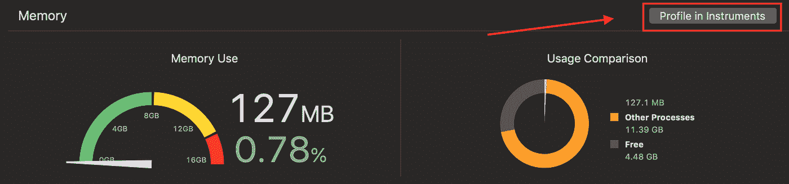

# 如何减少应用程序的内存占用

> 原文：<https://betterprogramming.pub/reducing-your-apps-memory-footprint-b7afcb9f3749>

## 高内存使用率的原因，减少应用程序的内存占用和调试


[freestocks.org](https://unsplash.com/@freestocks?utm_source=unsplash&utm_medium=referral&utm_content=creditCopyText)在 [Unsplash](https://unsplash.com/search/photos/app?utm_source=unsplash&utm_medium=referral&utm_content=creditCopyText) 上拍照

这听起来似乎很明显，我们应该让我们的应用程序的内存占用尽可能的低，但是实际上为什么呢？

有几个原因:

*   在某种程度上，高内存使用率会引发内存警告、性能问题，如果您反应不迅速，可能会终止您的应用程序。对内存警告做出快速反应并不像你想象的那么容易。
*   当你的应用程序进入后台时，它就进入了与其他应用程序的某种竞争。当 iOS 需要内存来执行其他任务时，它会终止高使用率的应用程序，而你不想被列入黑名单。

最终，低效的、消耗内存的应用程序提供了糟糕的用户体验，所以系好安全带，抓紧你的应用程序。是时候减少内存使用了。

# 高内存使用率的常见原因

## 1.保留周期

几年前，我们必须手动分配和释放 Objective-C 对象。现在我们有了 [Swift](https://developer.apple.com/swift/) 和 [ARC](https://docs.swift.org/swift-book/LanguageGuide/AutomaticReferenceCounting.html) (自动引用计数)，但是内存泄漏仍然会出现。当他们这样做的时候，是很痛苦的。

简而言之:对象可以通过几种方式指向其他点。两种基本方法是*弱*和*强*。

当一个对象没有任何*强*引用时，它被释放。例如，当一个`UIViewController`有一个子视图控制器时，它对它的子视图有一个强引用，而子视图对它的父视图有一个弱引用。

但是如果两个对象用强引用指向对方呢？他们不会得到释放，直到应用程序被终止。这被称为*保持周期*。

我们需要了解保留周期的两种主要使用情形:


1.  **委托**—iOS 中委托的基本模式是，有一个对象(某个其他对象用强引用持有它)，这个对象持有另一个对象，用强引用，充当它的委托人。在这种情况下，另一个对象应该有一个对委托的引用，因为委托用 strong 持有它，所以这个引用必须是弱的，否则我们将在这里有一个保留循环。
2.  **数据结构，** **这样的 trie** —有些数据结构需要双向引用。它可以是一棵 trie 树，也可以是一棵包含父视图和子视图的树(我向您展示了`UIViewController`和子视图控制器的例子)。请记住，每次添加返回引用时，都可能会创建一个保留循环，所以要小心。

## 2.定时器

计时器实际上是保留周期的一个特例。我之所以给 timer 单独一个项目符号，是因为它不是一个“常规的”保留周期案例。

当你设置一个定时器时，它把它的目标作为一个强引用，在很多情况下，这个目标也把定时器作为一个强引用。

有几种方法可以避免这种保留周期:

1.  传递一个弱引用作为计时器的目标。
2.  让保存计时器的对象和目标成为两个不同的对象。
3.  确保在退出屏幕或者不需要的时候，定时器失效。无论如何，这是最佳实践。

## 3.大图像

关于图像，你需要记住几件事。

1.  你加载到内存中的图像的大小不是文件的大小，而是它的尺寸大小。例如，如果您有一个 100 KB 的压缩 JPEG，但图像尺寸为 1000 x 1000，您实际上向内存中加载了 100 万个像素(！).现在，由于每个像素都包含额外的信息，所以实际上每个像素有 4 个字节，这意味着对于一个 100 KB 的文件，大约需要 4 MB 的内存。
2.  缩小的图像可以显著减少内存使用。

## 4.隐藏物

我们都知道有些情况下可以用 CPU 换内存。但是当缓存变得更大时，我们可能会发现自己在处理内存问题，而不是 CPU 问题。

# 减少内存占用的提示

## 1.惰性装载

惰性加载意味着只有在需要的时候才把对象加载到内存中。除了节省内存，它还减少了应用程序和屏幕的加载时间。

可以使用传统的方法，在使用对象之前检查对象是否为 nil，如果为 nil，则分配并使用它。

```
if image == nil {
    image = UIImage(named : "ocean")
}
```

或者您可以使用 Swift 极其简单的`lazy`关键字:

```
lazy var image = UIImage(named : "ocean")
```

## 2.实现内存警告方法

您的应用程序并不总是内存警告的原因，但它应该对它们做出响应，否则，它会变得滞后，最终崩溃。

开发人员在收到内存警告时做的第一件事就是释放缓存，但这实际上取决于缓存的类型。

当 iOS 注意到你不经常使用某个对象时，它会压缩它，所以释放它在内存方面不会有太大帮助，反而会损害用户体验。

您应该做的是释放未压缩的内存对象。例如，尝试关闭/弹出当前屏幕，或者卸载当前加载的大图像。

## 3.使用 NSCache

用 [NSCache](https://developer.apple.com/documentation/foundation/nscache) 代替字典。令人惊讶的是，许多开发人员忽略了这个伟大的 API。

NSCache 的行为就像一个普通的字典，但它有几个优点。它是线程安全的，当系统进入低内存状态时，它会释放对象。不仅如此，它还开始释放您不经常使用的对象，因此它为真正良好、高效的缓存进行了优化。

## 4.请使用 UIGraphicsImageRender，而不是 UIGraphicsBeginImageContext

我们前面提到过，将一幅图像加载到内存中时，每像素要加载四个字节。

在处理图像时，这可能是一件大事。你能做的最好的事情就是用`UIGraphicsImageRender`代替`UIGrahpicsBeginImageContext`。

`UIGraphicsImageRender`实际识别你正在加载的图像类型，并分配优化的每像素字节数。例如，单色(黑/白)图像将使用一个像素或每个像素一个字节。

## 5.自动释放池

请记住，我们使用 ARC 并不意味着我们不必保留、自动释放和释放命令。都在那里，由编译器自动添加。

自动释放池仍然存在，建议在循环内部使用。

当您在循环中运行代码时，在循环中创建的对象只在作用域的末尾被释放。这意味着，在大型循环中，您可能会遇到内存高峰。

这里最好的做法是将每个循环迭代的重分配包装在 autorelease 块中，这样对象将在块的末尾被释放。

# 如何调试内存问题

和每个技术问题一样，你要从概述你的应用开始。

幸运的是，我们在 [Xcode](https://developer.apple.com/xcode/) 中内置了一个工具，叫做*记忆量表*。从这一点来说，你有额外的工具来挖掘，直到你找到你的问题。

## 1.记忆量表

内存标尺位于左侧导航器窗格中的调试导航器上。只有在调试中运行应用程序时，它才会显示出来。


内存标尺显示应用在其生命周期中的使用情况。

一般来说，当你运行你的应用程序时，你应该看看内存标尺，并尝试找出任何奇怪的行为。

怪异行为的例子:

1.  **极高的内存使用率** —苹果将内存使用率分为三类:绿色、黄色和红色。你应该总是试着让你的应用程序处于绿色部分。
2.  **持续增长的内存** —当你使用你的应用程序时，你应该期待你的内存使用量随着时间的推移保持不变。如果您看到它持续增长，那么您可能有内存泄漏或其他需要调查的问题。试着呈现屏幕并消除它们，看看你的记忆是否会收缩，以便确定具体的问题。
3.  **去后台** —当你去后台的时候，你应该会看到你的记忆力降低了。如果不是，你要想到释放资源，比如大图的加载，以便留在后台，内存占用小。

如果您在概述阶段遇到问题，您可以通过点击“仪器中的配置文件”按钮轻松进入仪器工具。



## 2.工具

我不打算解释如何使用这些工具，但这是一个低级工具(虽然不是最低级的)，用于识别应用程序中的泄漏和分配。

除了查找应用程序中的错误分配，它还可以让你比较不同修复之间的运行情况。

## 3.Dealloc / deinit 方法

每个对象都有`dealloc` (Obj-c)或`deinit` (Swift ),当对象被释放时会调用它们。

实现这个方法并放入一个日志或断点——这是一个很好的、先发制人的、快速的方法来验证对象是否如你所期望的那样被释放。

## 4.使用内存度量的单元测试

在 iOS 13 中，我们在性能测试方面有了很大的增加。除了时间度量，我们还有一个内存度量。

如果您知道某段代码正在产生高内存使用率，那么最好使用内存指标来测量它。这样一来，一方面你可以调试方法，另一方面，你将有另一个测试，这总是很棒的。

## 5.模拟内存警告

在模拟器中，在调试菜单下，有一个选项“模拟内存警告”。您可以使用它来查看当它得到我们谈到的内存警告时，您的内存使用情况会发生什么。

在设备上模拟这个警告有点棘手。你可以在你的应用程序中进行一些加载来达到这种状态，或者你可以使用一个私有的 API 来模拟它(记住在你完成之后要移动这个方法)。

```
UIControl.sendAction(Selector(("_performMemoryWarning")), to:UIApplication.shared, for: nil)
```

## 6.内存调试器


在 Xcode 窗口的底部，您会找到“调试内存图”选项。

如果你还没有用过，现在是时候了。这是一个神奇的工具。它可以让你看到应用程序中对象之间的关系，甚至保留循环。

它还允许您计算每个类的实例数量(就像 instruments 工具一样)，这样您就可以快速检查您的内存映射。

# 摘要

正如你所看到的，你的应用内存是一个需要观察、调试和维护的大问题。

遵循本文中的提示将有助于您通过编写适当的代码来防止内存泄漏。通过观察内存量规并使用一些工具(如仪器和内存调试器)修复它们，它将帮助您及时解决问题。