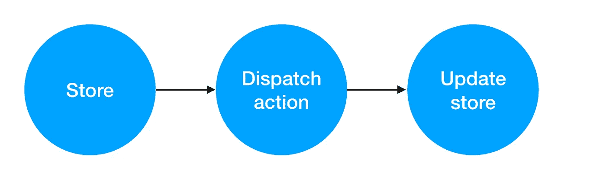
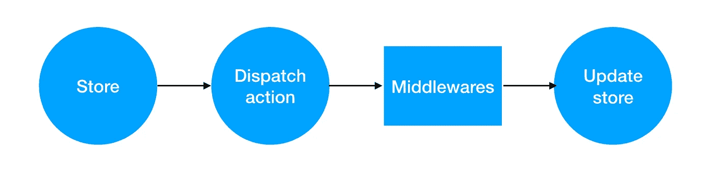

# Redux 中间件深度:编写定制的 Redux 中间件

> 原文：<https://betterprogramming.pub/redux-middleware-in-depth-write-custom-redux-middleware-4f02e2497cd6>

## 通过示例了解更多关于 Redux 中间件的信息


J. Kelly Brito 在 [Unsplash](https://unsplash.com/search/photos/laptop?utm_source=unsplash&utm_medium=referral&utm_content=creditCopyText) 上的照片

我在玩 [redux-saga](https://github.com/redux-saga/redux-saga) 、 [redux-thunk](https://github.com/reduxjs/redux-thunk) 和 [redux-observable](https://redux-observable.js.org/) ，这时我意识到 [redux](https://redux.js.org/) 中间件可能是一个全新的话题，因为这些库(尤其是 redux-saga 和 redux-observable)依赖于 Redux 中间件的实现。

# **Redux 简介**

Redux 是 JavaScript 应用程序的可预测状态容器。

如果你不熟悉 Redux，我建议你看一下[官方文档](https://redux.js.org)，记下 Redux 的主要概念:`store`、`reducer`、`actions`、`actionCreator`。

请看看下面的示例代码:

简而言之，这里发生的事情是我们使用 Redux 的`createStore` 函数创建了商店，Redux 接收`reducer` 函数作为参数。

这个`reducer`函数定义了我们如何更新我们的状态。更新状态的唯一方法是调度一个`action` **，**基本上是一个普通对象**。**

使用`actionCreator` 函数来构造`action`是常见的做法，我们也将使用这种模式。

作为一个例子，我们将使用 to-do 应用商店，稍后我们将更改一些代码以获得更多功能。为了构建一个完整的 UI，以便我们可以真正看到我们在构建什么，我将使用 [React](https://reactjs.org/) 。

# 什么是 Redux 中间件，为什么它很重要

Redux 通过调度动作同步改变其状态。



其实，我们可以把*中间件* 放在*调度动作*和*更新存储*到之间做一些疯狂的事情，比如放入一个 while ( `true`)语句(请不要那样做)。



你注意到我在那里写了*中间件*而不是*中间件*了吗？是的，没错，因为我们可以在那里放置多个中间件。

这些中间件使我们能够扩展我们的商店的功能，例如:记录每个分派的动作或动作类型验证。

# 简单日志中间件

请看看下面的 React to-do 应用程序示例。

我将所有代码都写在一个文件中，以便您更容易阅读代码示例(请让我知道它是否工作)。

使用 Redux 和 logger 中间件的待办事项应用程序示例

在这个待办事项应用程序示例中，我们有一个日志记录中间件，它将记录更新前的状态、分派的动作和更新后的状态。你应该试着玩玩沙盒，看看它是如何工作的。

运行中的记录器中间件

中间件是*函数返回函数返回函数，* 好玩的。

每个函数都有`store`、`next`和`action`作为参数。

*   `Store`是商店实例。
*   `next`是下一个中间件功能。
*   `action`是派遣行动。

执行下面的代码行将执行下一个具有分派动作的中间件。

```
next(action);
```

# 编写自定义操作验证器

假设我们想要确保商店调度的每个动作都是有效的动作。

我们有两种类型的动作:`ADD_TODO`和`RESET_TODO`。

我们只想处理这些动作，如果我们有另一种动作类型，就抛出异常。请检查下面这段代码:

这个验证中间件将检查动作的类型是`ADD_TODO`还是`RESET_TODO`，否则，它不会执行下一个函数。

带有验证中间件的待办事项应用

# **结论**

我们可以使用 Redux 中间件来执行各种事情，比如日志记录、验证、放入 try/catch 块来处理异常，或者可能产生副作用，比如将事件广播给另一个侦听器。

或者，放入一个 while ( `true`)语句。不，不要那样做，那绝对是一个笑话。

你怎么看待 Redux 中间件？你有其他的想法可以用来做什么吗？

感谢阅读！