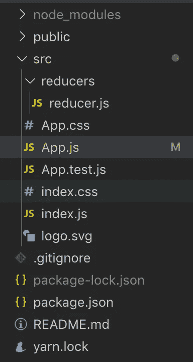
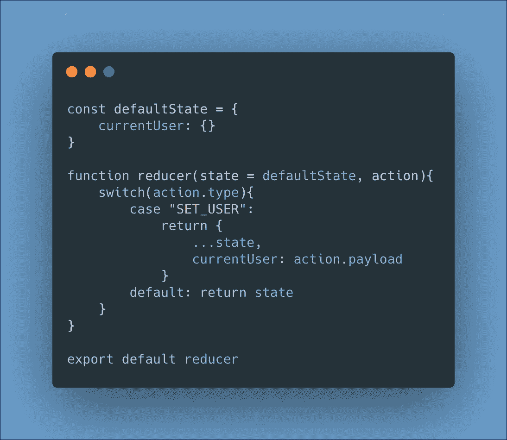
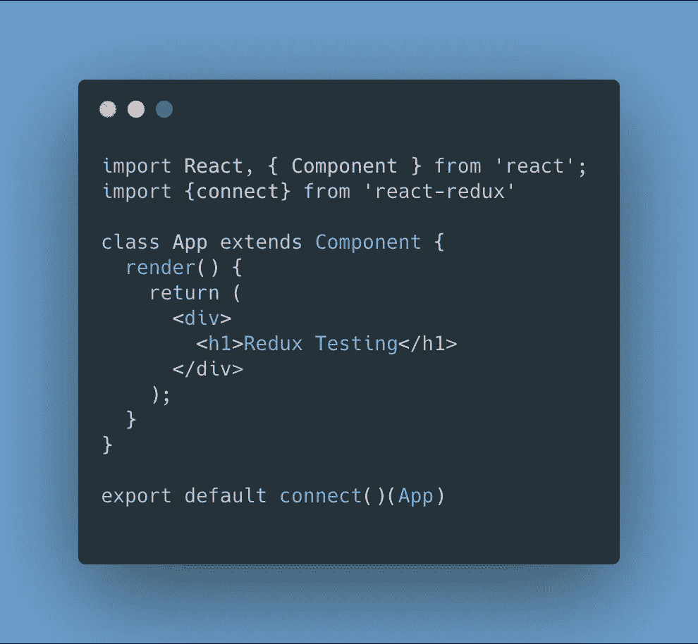
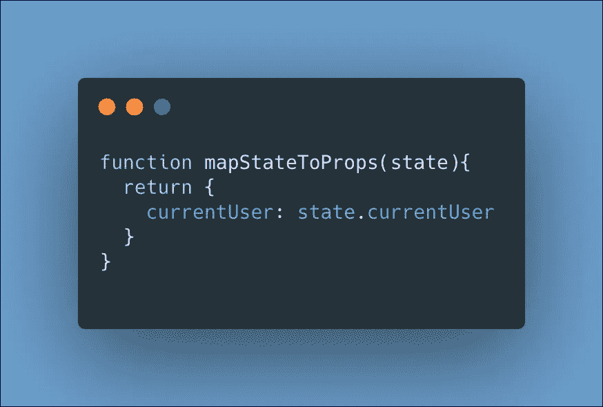
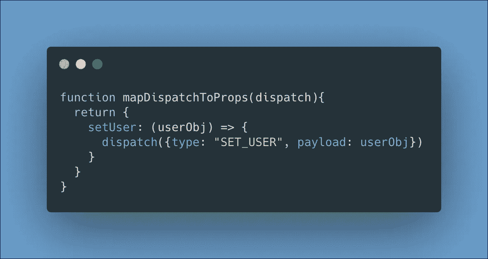
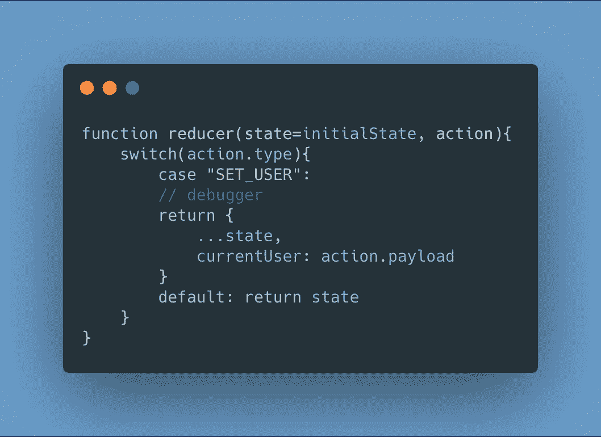
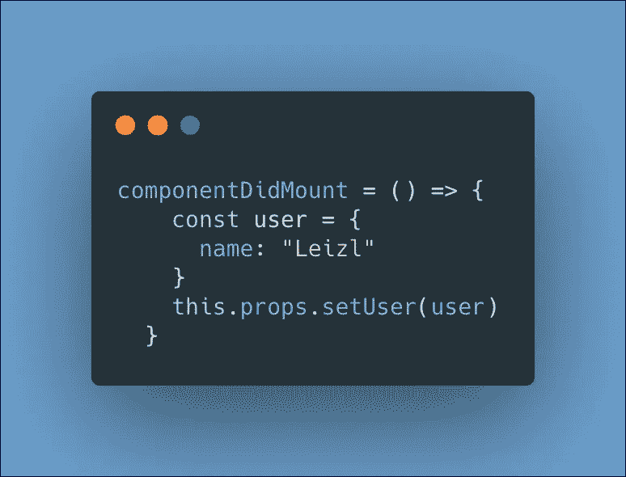
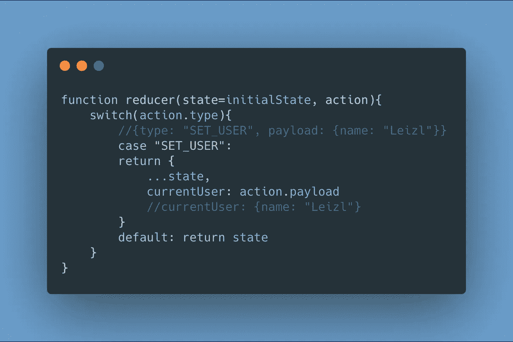
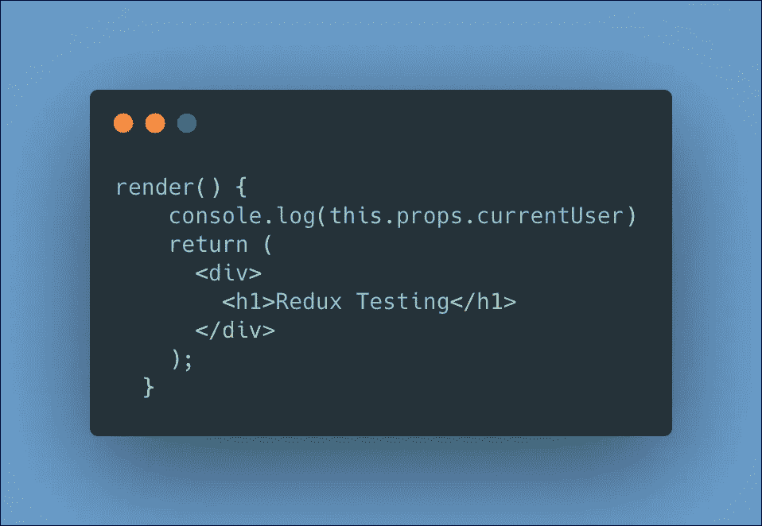
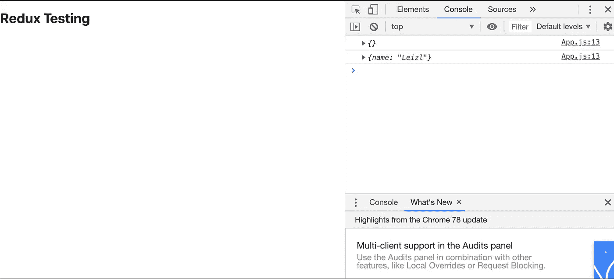

# React 应用程序的 Redux 设置

> 原文：<https://betterprogramming.pub/redux-setup-for-your-react-app-d003ec03aedf>

## 如何开始使用减速器


归功于[https://redux.js.org/](https://redux.js.org/)

本指南将涵盖你的[反应](https://reactjs.org/)应用的基本和简单的设置。本指南不会深入解释 Redux 的概念。让我们从安装几个库开始:

```
npm install reduxnpm install react-redux
```

# 1.创建一个教育工作者文件夹

在`src`文件夹中，创建一个名为`reducers`的文件夹。在 reducers 文件夹中，创建一个名为`reducer.js`的文件。



反应文件结构

在`reducer.js`文件中，我们将定义两件事:

1.  `defaultState`。
2.  `reducer`功能。

`defaultState`将包含我们想要存储的字段。在本例中，我们只想存储当前用户。

`reducer`函数将接受两个参数:

*   `state`，它将默认为我们定义的`defaultState`。
*   `action`，表示将要发送的派单。

动作本身将表示一个带有两个键的对象:

```
{ action: "SAMPLE",
   payload: data}
```

`switch`语句在减速器功能中是有益的。随着 app 变大，会有不同的动作类型。根据动作类型，将返回一个对象。

为了分解被返回的对象，它将包含前一状态的内容，改变一个键的值。在这种情况下，动作`“SET_USER”`将改变`currentUser`值。



reducer.js

# 2.在 index.js 文件中实现 Redux

我们将把以下内容导入到我们的`index.js`中:

```
import {Provider} from 'react-redux';import {createStore} from 'redux'import reducer from './reducers/reducer'
```


索引. js

# 3.连接组件

现在，我们将想要的组件连接到我们在`index.js`中创建的商店。我们将重点关注`App`组件。使用 [React Redux](https://react-redux.js.org/) 中的连接方法包装组件。

首先，我们导入:

```
import {connect} from 'react-redux'
```

并连接组件:

```
export default connect()(App)
```



App.js

# 4.将状态映射到道具

一旦我们建立了一个连接，让我们将状态作为道具添加到这个组件中。在`App`组件中，让我们创建一个名为`mapStateToProps`的函数。



mapStateToProps

我们将键`currentUser`添加到 props 中，并将其设置为状态值`currentUser`。我建议保持名字相似。

# 5.地图分派到道具

现在，让我们更改 state 中的值。我们在`App`内部设置了另一个函数，名为`mapDispatchToProps`。

类似于`mapStateToProps`，我们返回一个对象，但是`setUser`的键被设置为一个函数的值，这个函数将发送一个调度给 reducer。

在这个实例中，当我们通过 props 调用`setUser`时，它需要一个使用回调函数`dispatch`的用户对象参数。



这调用了*减速器功能*，我们在前面的`reducer.js`中设置了这个功能。



减速器功能

现在`App`组件已经连接，让我们通过在`App`加载时改变我们状态下的`currentUser`值来测试它。

在 app 中，我们添加`componentDidMount`，调用`setUser`函数。



组件安装

在页面加载时，`setUser`被调用，它接受定义的用户对象，并被重定向到`reducer.js`中的 reducer 函数。



减速器功能与动作内容

我们的初始状态`currentUser`被设置为一个空对象。要查看更改，让我们从`App`组件中注销状态。



应用程序组件呈现

让我们运行应用程序:

```
npm run start
```



从状态注销当前用户

现在你知道了。`App`组件连接到 [Redux](https://redux.js.org/) 存储。

在特定组件只需要*将分派映射到属性*而不需要*将状态映射到属性* **、**的情况下，连接的结构必须稍有不同。

```
export default (null, mapDispatchToProps)(App)
```

Connect 期望结构的第一个参数是`mapStateToProps`，第二个参数是`mapDispatchToProps`。不能将地图分派到道具作为唯一或第一个参数。

感谢您的阅读。代码请参考我的 GitHub 库:

[](https://github.com/reireynoso/react-redux-practice) [## reireynoso/react-redux-练习

### 这个项目是用 Create React App 引导的。在项目目录中，您可以运行:在…中运行应用程序

github.com](https://github.com/reireynoso/react-redux-practice)