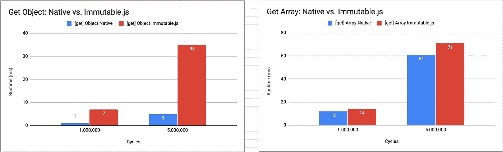
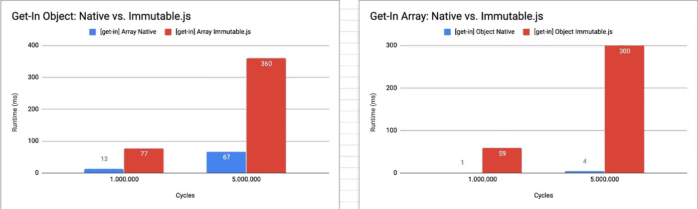
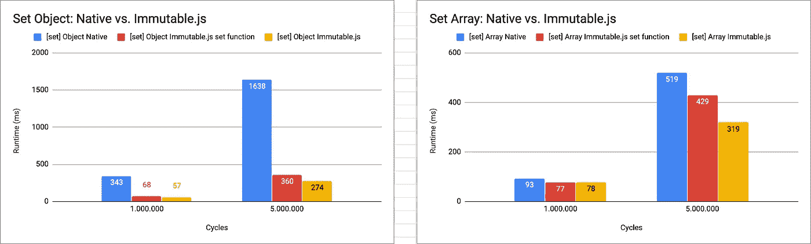
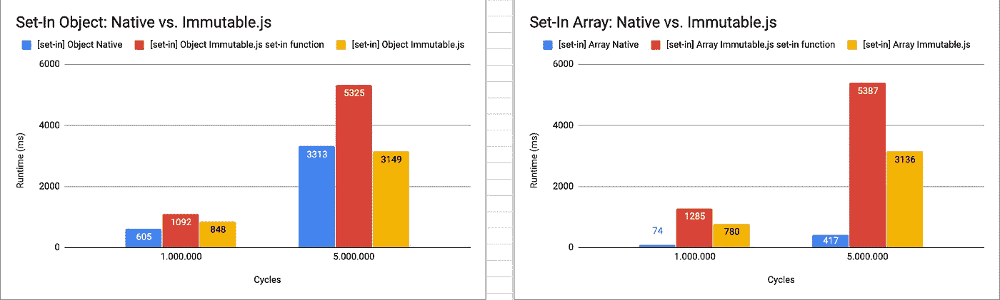
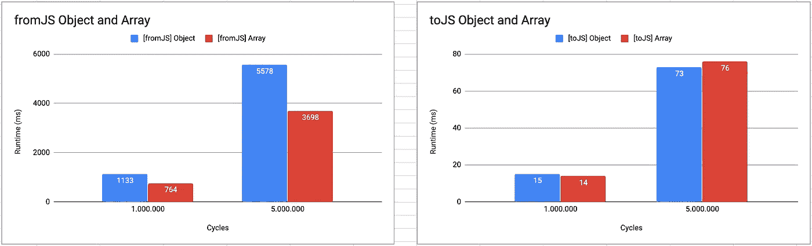
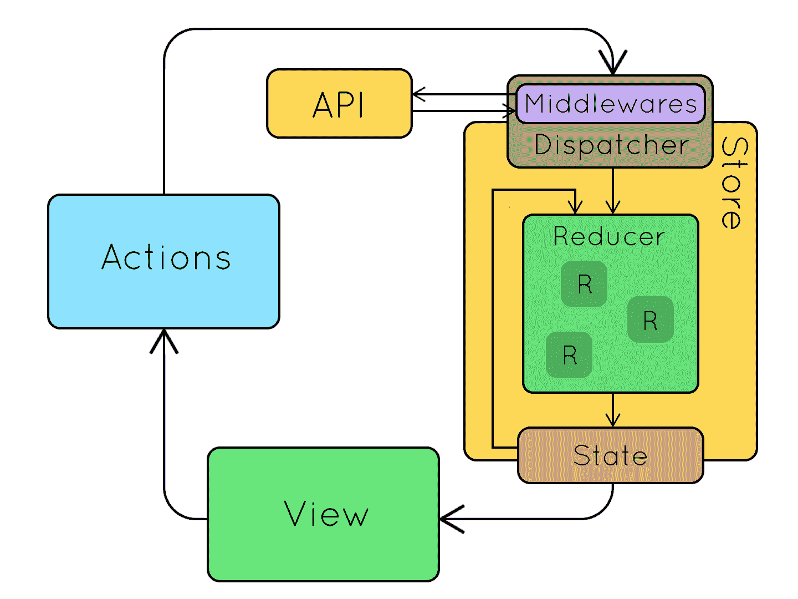

# 使用类型进行冗余状态管理

> 原文：<https://betterprogramming.pub/redux-state-management-with-types-3073b0fd0099>

## 用打字稿更好的状态


由[洛伦佐·莫奇](https://unsplash.com/@lordesigner?utm_source=unsplash&utm_medium=referral&utm_content=creditCopyText)在 [Unsplash](https://unsplash.com/s/photos/management?utm_source=unsplash&utm_medium=referral&utm_content=creditCopyText) 上拍摄的照片

本帖首发于 [***TK 的博客***](https://leandrotk.github.io/tk/2020/04/consistent-state-management-in-react-and-redux/index.html) 。

这是我研究如何构建可持续和一致的软件的一部分。

在本帖中，我们将讨论 React 和 Redux 环境下的状态管理。我将向你展示我试图解决的一个问题和我为工作提出的一个解决方案。

# 问题是

首先:问题！这部分真的很重要。我试图解决一个问题，而不是在我们的 pwa 上添加闪亮的技术。

在开发新的 Originals 清单时，我们从 API 获取数据来呈现页面。这个数据的一个重要部分是一个名为`specialConditions`的属性。它是一个房地产条件列表。

一份名单。是的，我们期望它总是一个列表，但是在代码库中的某个地方，我们分派了一个动作将这个值突变为一个`undefined`，导致了一个 bug 并需要一个 bug 修复。

从那天开始，我就一直在寻找一个解决方案，让系统更加一致。如果它是一个列表，它将永远是一个列表。不管我们作为开发人员有多有创造力。

随着代码库的增长，这个问题变得非常普遍。因为很容易产生你自己都没有意识到的隐性影响。它伸缩性很差。

于是，我想到了输入 Redux 的整个生命周期。如果我们键入状态和每个 Redux“生命周期代理”，我们可以使它具有弹性和一致性。

# 解决方案

想法是通过输入状态、动作、减少器、处理程序和选择器，使 PWA 架构在 Redux 生命周期中显式、有弹性和一致。

处理前端状态管理是复杂的。因为我们使用 Redux 作为几乎所有工作中的 pwa 的主要状态管理架构，所以构建一个框架来将类型化应用到 Redux 是一个很好的方法，可以制定一个带有最佳实践和约定的指南来扩展我们的 pwa。

约束是一个非常重要的概念，可以让我们避免犯简单的错误。通过键入我们的 Redux 生命周期，我们至少可以在编译时保护我们的主数据处理程序免受这类错误的影响。

通过输入我们的初始状态、归约器和处理程序[,我们可以免费获得关于 Redux 生命周期的良好文档](https://dropbox.tech/application/our-journey-to-type-checking-4-million-lines-of-python),从而更容易推断出每一步的预期细节。

# 这个提议

本提案中的一个重要注意事项是，我们在创建 it 时考虑了问题和环境(当前的技术堆栈和工具、开发人员的接受度、我们的 pwa 中可以扩展的内容)。我们将谈论这些话题:

*   选择工具。
*   Redux 生命周期代理。
*   不可变的数据。
*   使用我们的 pwa 之一进行概念验证。
*   赞成和反对。

# 选择工具

我们遇到了一些选择工具的问题:

*   真的解决问题了吗？
*   工作中的接纳。
*   技术社区中的工具。

可以解决问题的一些工具: [Flow](https://flow.microsoft.com/) ， [ReasonML](https://reasonml.github.io/) ， [Elm](https://elm-lang.org/) ， [ClojureScript](https://clojurescript.org/) ，TypeScript。(声明:ClojureScript 来自 LISP 家族。它没有静态类型系统。但是它有一些很酷的特性，比如不可变的数据结构。)

想想我们的代码库，都是 JavaScript。选择一种不同的语言，如 ReasonML、Elm 或 ClojureScript，对于学习一种新的语言和拥有最佳实践和约定的指导方针来说是一个缺点。

相反，Flow 和 TypeScript 是 JavaScript 的包装器或者超集。与全新的语言相比，学习新的 API 更容易。即使我们喜欢学习和尝试新事物，我认为我们应该有一个平缓的学习曲线，并仍然解决主要问题。

TypeScript 用于某些 pwa。有些使用类型脚本模型(类、接口、类型)来键入 API 和 app 数据协定。其他人将数据提取器用于房屋、搜索和邻居。相反，在我们的 PWAs 中没有使用 Flow。

TypeScript 是发展最快的语言之一，也是目前领先的编译到 JavaScript 语言。一些大公司——比如 Airbnb——也在大规模采用这个工具。

所以，我们从 TypeScript 开始做概念验证，看看效果如何。

# Redux 生命周期代理

提议背后的想法是键入 Redux 代理。对于几乎所有的 pwa，我们都需要输入动作、缩减器、处理程序和选择器。

*   动作:使用类型来键入动作契约——类型、承诺、元、`extraProperties`、属性等。
*   存储状态:为`initialState`签订合同，并使其在 Redux 生命周期中保持一致。
*   Reducers:通过使用处理程序，处理状态契约，只返回正确的类型契约——只改变数据，而不是类型。
*   处理程序:负责外部交互生命周期和状态映射。强制最终状态将具有与预期相同的契约——商店状态契约。使用 [redux-pack](https://github.com/lelandrichardson/redux-pack) 时，处理程序是一种常见的模式。
*   来自外部交互数据:来自 API 或 Firestore 或任何其他外部交互的数据合同。
*   要存储状态:使用存储状态契约——基本上是 reducer 初始状态契约。
*   选择器:用`mapStateToProps`获取商店状态并映射到组件状态——props。
*   类型:所有代理的类型库。

我们可以在容器组件文件夹中组织这些代理:

```
__ containers
    	|__ MyComponent
    		|__ actions.ts
    		|__ handlers.ts
    		|__ reducer.ts
    		|__ selectors.ts
    		|__ types.ts
```

# 不可变数据

## 不可变的. js

不可变数据是[的一个基本特性，使前端状态管理变得不那么复杂](https://medium.com/javascript-scene/the-dao-of-immutability-9f91a70c88cd#.9g51h5stk)。这是一个核心原则，使纯函数，一个数学函数的概念，给定的输入，它总是返回相同的输出，没有突变或副作用。

我们目前使用 [Immutable.js](https://immutable-js.github.io/immutable-js/) 来制作具有不可变数据结构的 JavaScript。它为 JavaScript 提供了新的数据结构，用全新的 API 来处理不可变数据。

可预测性对于理解代码非常重要。但是不可变的. js 并没有强迫我们总是在状态中使用它，所以我们不知道使用哪个 API——不可变的还是 JavaScript API——来获取选择器中的数据。

在商店里混合数据是很容易的。它的一部分是不可变的对象。另一个是普通的 JavaScript 对象。

Redux docs [提出了一些关于使用 Immutable.js](https://redux.js.org/recipes/using-immutablejs-with-redux/) 的问题。Redux 作者[建议避免在 Redux](https://www.reddit.com/r/javascript/comments/4rcqpx/dan_abramov_redux_is_not_an_architecture_or/d51g4k4/?utm_source=share&utm_medium=web2x) 中使用 Immutable.js。对于不可变的数据，[他们强烈推荐使用 Immer.js](https://redux.js.org/style-guide/style-guide/#use-immer-for-writing-immutable-updates) 。

为了保持一致性和可预测性，如果我们在编译时和开发中使用 [lint](https://github.com/jonaskello/tslint-immutable) 处理不可变数据，并且只使用一种语言 API，而不需要推理语言——JavaScript 和 Immutable.js，会怎么样？

## Typescript 只读和 TSLint 不可变

Typescript 有[只读属性](https://mariusschulz.com/blog/read-only-properties-in-typescript)来处理编译时的[不可变数据。它们是:](https://stackoverflow.com/questions/55905801/can-typescripts-readonly-fully-replace-immutable-js/55906256#55906256)

*   `readonly`:不可变的原始数据
*   `Readonly`:不可变对象
*   `ReadonlyArray`:不可变数组

**只读**

为原始值添加不可变的特性，如数字、字符串、布尔值等。

如果我们将这个特性添加到类型定义中，我们就强制数据在编译时是不可变的。如果你用的是 VS 代码，你的代码会有错误`“Cannot assign to ‘your property here’ because it is a read-only property”`。

**只读**

为[对象](https://stackoverflow.com/questions/41879327/deepreadonly-object-typescript/49670389#49670389)添加不可变特征。

如果您正在处理一个对象，您可能会使用 readonly 来使用映射类型将其所有属性标记为 Readonly。

**只读数组**

为列表添加不可变的特性。

如果你尝试在只读数组中添加新的条目，你会遇到一个错误`“Property ‘push’ does not exist on type ‘readonly Readonly<T>[]”`。

# 基准测试:不可变. js 与原生 API

我们做了一些[基准来比较有和没有不可变的 PWA。](https://github.com/leandrotk/javascript-immutable-data-benchmarks)

在第一个基准测试中，我们决定比较原生 JavaScript 和 immutable . js API:get、get-in、set 和 set-in。并且理解用`fromJS`和`toJS`函数转换一个数据结构是什么样子。

## [**获取—对象和数组**](https://github.com/leandrotk/javascript-immutable-data-benchmarks/blob/master/src/get.js)

对于 Immutable.js API 来说，获取对象的第一个属性代价更高。以一百万周期和五百万周期运行七次(以毫秒为单位)。与那些 API 相比，获取数组的第一个元素更接近。



## [**获取—对象和数组**](https://github.com/leandrotk/javascript-immutable-data-benchmarks/blob/master/src/getin.js)

对于 Immutable.js API 来说，获取对象的嵌套属性或数组的嵌套元素比获取原生属性的成本要高得多。一百万和五百万次循环。



## [**集合—对象和数组**](https://github.com/leandrotk/javascript-immutable-data-benchmarks/blob/master/src/set.js)

为对象属性设置一个新值对于原生 JavaScript API 来说代价更高。

但是使用 set 方法，我们仍然可以处理本地对象，并大大减少毫秒数。对于数组来说，比较接近，但是用 set 方法可以更好。



## [**设定-对象和数组**](https://github.com/leandrotk/javascript-immutable-data-benchmarks/blob/master/src/setin.js)

对于对象和数组，最好使用原生 JavaScript API，而不是不可变的. js 数据结构和方法。



## [**fromJS**](https://github.com/leandrotk/javascript-immutable-data-benchmarks/blob/master/src/fromJS.js) **和** [**toJS**](https://github.com/leandrotk/javascript-immutable-data-benchmarks/blob/master/src/toJS.js)

我们可以看到，在将原生 JavaScript 数据结构转换为不可变 DS 时，`fromJS`函数的开销会很大。

`toJS`成本更低，但是每次我们需要获取一个值时，比如在选择器中，我们使用`toJS`，它会影响性能。



# 类型化状态管理:生命周期



该组件使用缩减器中定义的初始状态进行渲染。它调度一个动作。该操作将有一个外部交互，因此它使用 promise 并发模型。

新数据作为动作的一部分到达 reducer，它将动作传递给处理程序来处理外部交互生命周期，如果成功，就向状态添加新数据。有了更新后的状态，选择器将获取并将其作为道具传递给组件`mapStateToProps`。

类型化状态管理的概念是确保这些代理之间的所有通信都具有一致且可预测的状态契约。

从初始状态到外部交互后的更新状态，具有相同类型的契约。

# 类型化状态管理 PoC

尝试将此概念作为 Photos PWA 概念验证:Photos PWA 是由一个小团队维护的小应用程序，这就是我们选择它作为 PoC 的一部分的原因。我们需要在生产中验证这个想法，但是不要太复杂。

我们应用到这个概念的容器组件叫做`NotStartedPhotoSessions`。它获取一个 API 端点来获取照片会话，并将其列在摄影师的日程中。

第一件事是构建商店状态契约作为初始状态:

因此，在第一次呈现时，组件将访问这些值作为道具。在呈现中，它将分派一个新的类型化操作:

减速器将接收这个动作。并确保最终结果将具有与初始状态相同的状态契约:

然后，reducer 调用处理程序，并将 API 响应有效负载转换为存储状态。只是数据映射而已。

既然存储状态已经更新，是时候让选择器获取新数据了:

我们回到组件，将状态映射到道具并接收新数据。

# 利益

*   可预见性:类型检查使代码更可预见，反过来，也使代码更不容易出错。
*   文档:在 Redux 生命周期中为每一个代理签订合同可以免费为我们提供良好的文档。
*   数据流的类型安全:因为我们的大部分数据流发生在 Redux 生命周期中，所以至少在编译时，我们的数据是类型安全的，这也是我们大多数错误的来源。
*   如果我们选择从 store 状态中移除 Immutable.js ( `fromJS`和`toJS`)，我们仍然可以使用像`[mergeDeep](https://immutable-js.github.io/immutable-js/docs/#/mergeDeep)`这样的很酷的函数，而不用不可变的 map/array/DS，只使用 Immutable.js 版本 4。
*   当移除不可变的以支持 TypeScript readonly 时的性能优化。
*   [不可变 vs. JS 基准](https://github.com/leandrotk/javascript-immutable-data-benchmarks) : Get，get-in，set，set-in，`fromJS`，`toJS`。
*   [Google Lighthouse](https://developers.google.com/web/tools/lighthouse) :在没有 Immutable.js 的情况下运行 Google Lighthouse 时略有改善。

# 资源

*   [前端开发的约束](https://www.youtube.com/watch?v=TqfbAXCCVwE&feature=emb_title)
*   [我们对 400 万行 Python 进行类型检查的旅程](https://dropbox.tech/application/our-journey-to-type-checking-4-million-lines-of-python)
*   [打字稿税](https://medium.com/javascript-scene/the-typescript-tax-132ff4cb175b)
*   [大规模采用打字稿](https://www.youtube.com/watch?v=P-J9Eg7hJwE)
*   [永恒之道](https://medium.com/javascript-scene/the-dao-of-immutability-9f91a70c88cd#.9g51h5stk)
*   [在 Redux 中使用 Immutable.js 的注意事项](https://redux.js.org/recipes/using-immutablejs-with-redux/)
*   [避免在 Redux 中使用 Immutable.js】](https://www.reddit.com/r/javascript/comments/4rcqpx/dan_abramov_redux_is_not_an_architecture_or/d51g4k4?utm_source=share&utm_medium=web2x)
*   [避免在 Redux 中使用 ImmutableJS 的 3 个原因](https://medium.com/better-programming/3-reasons-to-avoid-using-immutablejs-with-redux-b0109d0123e8)
*   [使用 Immer 编写不可变更新](https://redux.js.org/style-guide/style-guide/#use-immer-for-writing-immutable-updates)
*   [ts lint-不可变](https://github.com/jonaskello/tslint-immutable)
*   [只读打字稿](https://mariusschulz.com/blog/read-only-properties-in-typescript)
*   [Typescript 只读并不能完全取代不可变的](https://stackoverflow.com/a/55906256/11314146)
*   [深层只读对象](https://stackoverflow.com/a/49670389/11314146)
*   [原生 JavaScript 与不可变. js API](https://github.com/leandrotk/javascript-immutable-data-benchmarks)
*   [Io-ts](https://github.com/gcanti/io-ts)
*   [打字稿和笑话模仿](https://klzns.github.io/how-to-use-type-script-and-jest-mocks/)