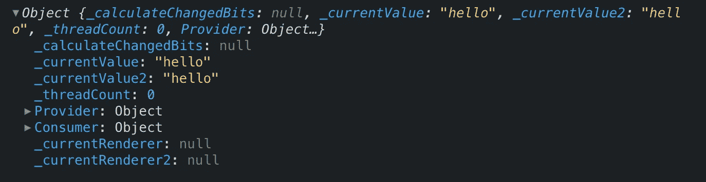
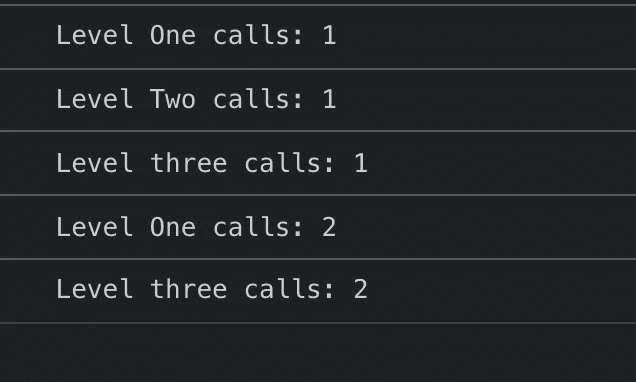
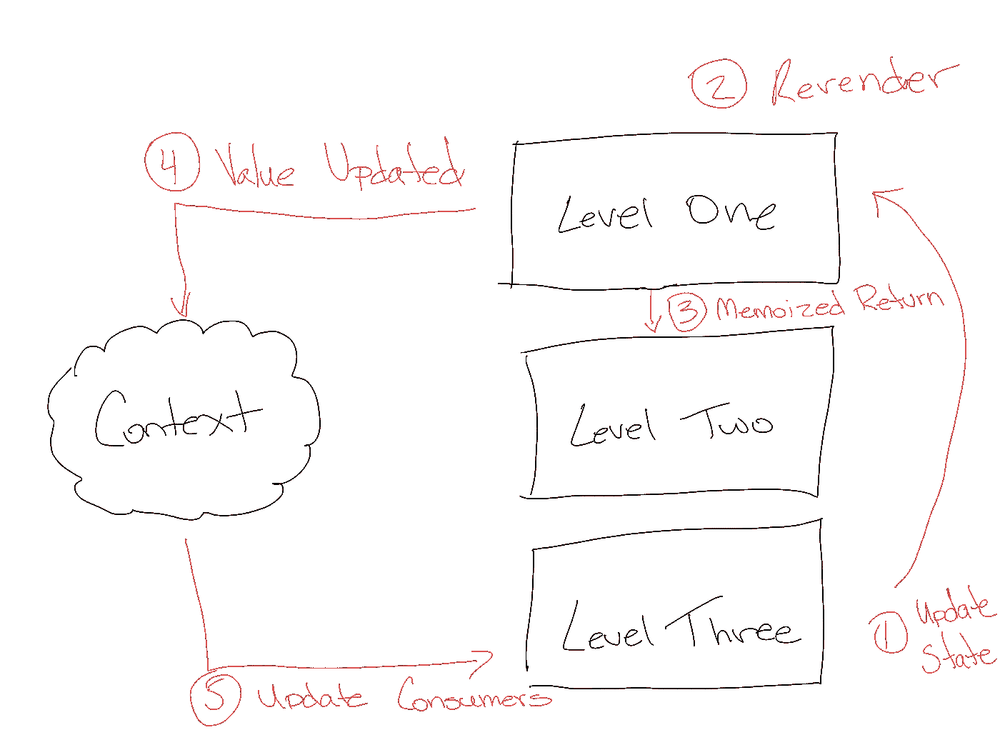
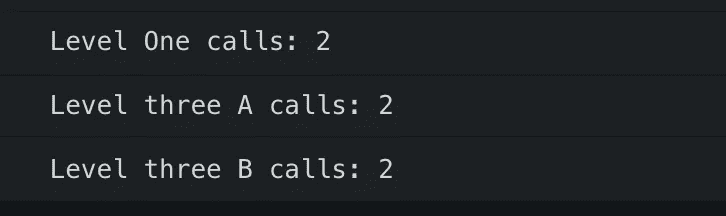
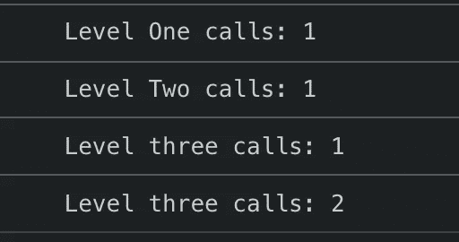
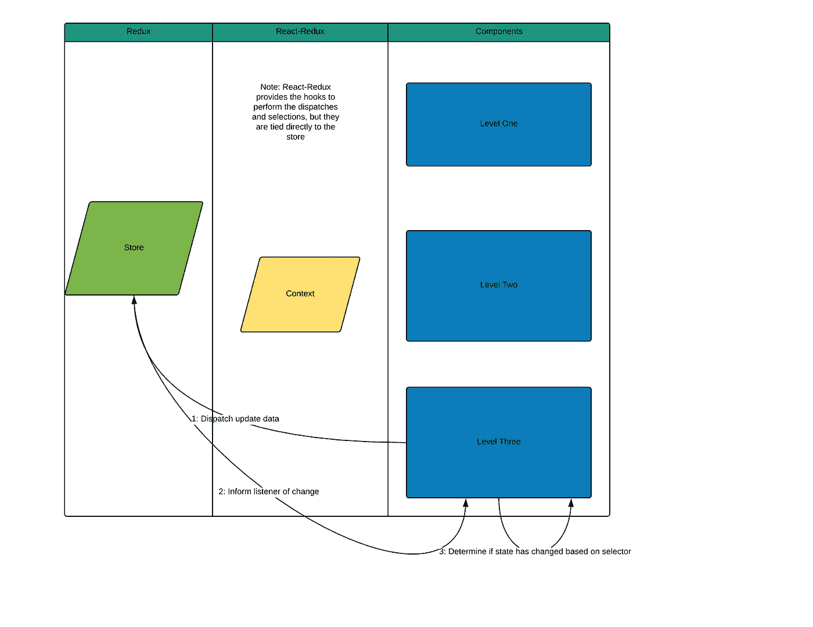
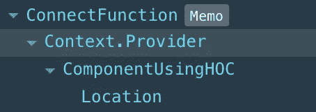
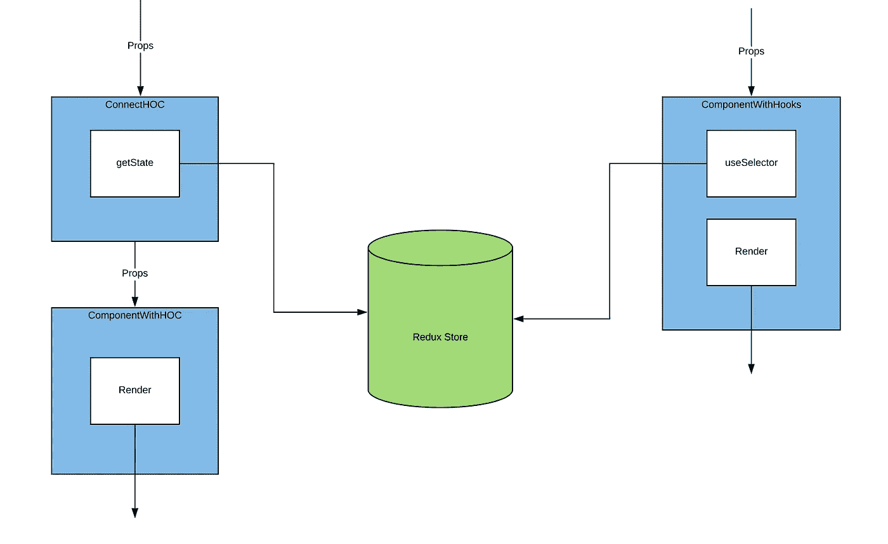

# 冗余对上下文对状态

> 原文：<https://betterprogramming.pub/redux-vs-context-vs-state-4202be6d3e54>

## React 中状态管理的深入研究

在过去一年左右的时间里，React 中的国家存储领域发生了巨大的变化。

推出了一个新的上下文实现，它更加简单易用。我们已经看到 React 钩子的发布，以及像功能状态和`useReducer`这样的东西，看起来像是替代 Redux 的选项。不甘落后的 React-Redux 加入了 Hooks train，给你一个用`useSelector`和`useDispatch`执行状态采集和调度的新方法。但是这些还需要吗？

尽管社区强烈反对我们脱离 Redux，或者说从整体上脱离状态管理库，但是解决方案并没有那么简单。我们需要分解应用程序中可能的架构决策，然后研究这些工具如何支持或破坏这个架构。

在我们继续之前，让我们后退一步，问一些关于我们选择的简单问题:

*   一些国家管理哲学是什么？
*   我们涵盖了哪些风格？
*   它们功能上的根本区别是什么？人们已经讨论了一个或另一个替代者。但在幕后，这是真的吗？
*   这些工具是干什么用的？不可避免地，我们最终得出的答案是“视情况而定”但是，让我们试着给出具体的例子，在这些例子中，您可能希望使用一种工具而不是另一种。

回答这些问题有望给你今后打下坚实的基础。然后，当您遇到问题并需要选择可用的最佳工具时，您可以做出明智的决定。

俗话说，[*拙匠总怪自己的工具*](https://getyarn.io/yarn-clip/e9108483-d8ee-4032-b3f9-2abe934c7d20) *。*

事不宜迟，让我们开始吧。

# 国家管理哲学

在过去的一两年里，反应状态管理的可接受模式发生了转变。为了讨论今天的内容，让我们稍微回顾一下 React 状态管理的时间表，看看我们为什么会做出这样的决策。

我将从通量架构开始。对于当时的许多人来说，Flux 架构是从其他框架移植过来的一个强大卖点。

我记得开始一份新工作时，我是新项目中唯一的前端开发人员。当我看到[我的第一个关于 flux 的视频时，我已经用 Angular 1(我的老框架)在上面编程了几个月。那个星期，我停下来重新写了一个项目来应对。我以前用过 React，我想和很多人一样，我从来没有真正关心过 JSX。但看到这种流动，一切都有了意义。](https://reactjs.org/blog/2014/05/06/flux.html)

不久之后，Redux 出来了，我也跳上了宣传列车。使用 Redux 的方式有很多——没有“真正的”公认模式。但是让我们以我相信大多数人使用它的方式来看待它。

***注意*** :上面的例子告诉我，不需要太多思考就可以跳到一个新的代码架构，或者一个新的框架。这些都是成功的，但是，正如我在这篇文章中试图展示的，这个*并不是最好的反应，这是我试图避免的。他们在这些案例中发挥了作用，但其他时候他们却在我面前吹了起来。*

例如，在我离开学校的第一年，我在一个创新工作室工作。不知何故，我在领导一个团队的位置上，发现了一个有趣的移动应用程序“混合”框架，它采用 CSS 矩阵来尝试获得与原生一样高性能的动画。当时我们的办公室正处于一场原生与混合的战争中，作为一个热爱网络的人，我说服我的老板我们可以用这个框架开发出可靠的应用程序。

不要介意这个框架中的所有东西是多么的不可读，因为实际上所有的东西都是通过这些矩阵计算得到的，我认为这很酷！所以我们把它用于我们所有的新应用程序，尽管这个框架还在 Alpha 中。有一天我收到一封电子邮件——我所赞美的框架突然关闭了，并从 Github 中删除了他们的代码。我不得不告诉我的老板，一切都需要重新开始。最终，项目被取消了，技术选择权(相当正确地)转移到了一个高级团队成员手中。

# 商店拥有一切的时代

Redux 为用户提供了一个中央存储器来存储他们的整个状态，只有“flux”架构风格才能访问。好家伙，他们拯救了整个国家。在最初的一两年里，将*的所有*状态数据存储在存储中似乎是一种规范，不管它是什么。

为了与这种状态管理风格相匹配，应用程序完全是围绕“哑组件”和“智能组件/容器”的概念构建的哑组件不能访问任何状态，只能是可视组件。您将拥有许多这样的组件，并且您的容器将收集您需要的数据。

很快，存储就变成了难以处理的数据，无法跟踪，需要深入了解代码才能理解所有东西都存储在哪里。此外,“哑/智能组件”的规则可能被过度使用了——许多代码库最终都处于每页只有一个容器的状态。为了填充页面数据，您通常必须从头到尾进行适当钻取，这造成了一片混乱。我们将称之为**百货店时代**。

*注意:我不是在取笑这些，也不是怀疑它们今天的用途。我们遇到的大多数问题都来自成长中的团队/代码库。这些阶段通常是社区驱动的解决这些问题的方式。*

# 特征自有数据时代

不久之后，有一股力量推动更多的代码共置，减少对存储中所有代码的依赖。通常，人们转向基于领域/特性的架构，在这种架构中，商店中的一个点代表一个特性。

哑组件仍然存在，但是你经常会把它们提取到某种全局哑组件中，在代码库中共享，或者甚至是一个外部 repo，然后你可以共享它的 UI 框架。

存储区被清理，应用程序的指定区域存储在存储区的属性中。这些区域可能与域或页面一致，也可能不一致。还有一种将 UI 状态从商店转移到组件本身的趋势。

为了防止钻牛角尖，有一种趋势是不再在页面的顶层只有一个容器。相反，一个页面会包含多个容器，每个容器都包含页面上的特性。

*我将避免讨论多个容器与单个容器的对错。每件事都有好的一面和不好的一面。*

此外，新的上下文系统(以及后来的钩子)也在这个时候推出。有趣的是，当时似乎没有很多人为了避免道具训练而使用上下文。这种趋势似乎与钩子使用的增加相一致。

*我确信大多数模式的流行可以与著名的开发人员推销这种风格联系起来。主要是丹·阿布拉莫夫。*

我们将把这个阶段称为**特征拥有数据**时代。商店仍然拥有这些数据，并且它们通常与一个整体的特性集相关。组件通常不知道数据是如何到达那里的，或者发生了什么，只知道它拥有存储的那一部分。

# 组件自有数据时代

这就把我们带到了今天，在这里*组件拥有数据*。这种风格越来越流行，可以由 Redux 处理，但更主要的是与 Apollo 相关。

这个想法通常是一个组件应该拥有自己的“生命周期”这包括知道获取数据，当它没有准备好的时候显示加载，知道什么时候需要重新收集数据，等等。

仍然有一个或多个商店，但是它应该足够聪明地知道哪些数据彼此相关。两个不同的组件需要相同的数据吗？他们可以共享数据，但是他们都知道如何收集数据。如果其中一个组件收集了新数据，那么另一个组件也会更新。

react 团队最近和即将推出的许多举措都很好地补充了这种风格，比如针对数据获取和组件初始化的悬念。它消除了“有人收集我的数据了吗”的想法，取而代之的是，组件可以自信地呈现自己。

组件所有权也补充了并发模式的思想，它将对组件生命周期的更多控制交给了组件本身。如果你还没有尝试过类似 Apollo out 的东西，我强烈建议你试试。脱离更经典的风格是一个挑战，但是我发现这个系统更耐用，尤其是对于更大的团队。有些人不需要知道你的组件/容器，你的 redux 存储的结构，以及其他依赖关系，就能理解他们如何使用它。相反，他们可以相信您的组件将始终处理自己。

也就是说，本文不会进入**组件拥有数据**阶段。这是一个相对深入的话题——这个话题可以留到以后再说。我强烈建议任何感兴趣的人去看看。我还想揭开 redux 和 context 之间的区别，在没有足够调查的情况下，将 Apollo 添加到混合中会添加太多噪音。

我们在本文开头强调的问题仍然是前两个阶段的基础(并且可以在第三个阶段使用)，我想进一步研究它们。我认为大多数中小型应用程序依赖于**商店拥有全部**和**功能拥有数据**策略，所以我们应该明白我们在做什么以及需要注意什么。

# 状态管理风格

抛开哲学不谈，让我们直接进入我们将要讨论的功能:

*   组件状态
*   实例变量和可变引用
*   语境
*   使用连接/挂钩进行 React-Redux

还有更多的选择，包括流行的库 Mobx 和 Apollo(如前所述)。不过，我将坚持使用这些，因为它们中的大多数与 Redux 有足够的相似之处，知识是可以转移的。

# 组件状态

让我们从基础开始:组件状态。在这篇文章中，我们将频繁地使用函数状态和钩子，但是这些信息也可以和类组件共享。

一个[组件状态](https://reactjs.org/docs/hooks-state.html#declaring-a-state-variable)是通过使用`useState`钩子来声明的，钩子将数据存储在给定的组件中，并在整个渲染过程中保持不变。这种状态是不可变的，这意味着如果您试图设置它，它将不会更新。要更新该状态，必须使用初始化时返回的`setState`函数。

*上面的代码块演示了使用状态钩子*的基本用法

那么使用状态变量和使用局部变量有什么区别呢？状态变量本质上与组件的生命周期相关联；而另一方面，局部变量将重新初始化——每次执行函数时，状态将保持不变。

*注意:如果你使用一个类组件，实例变量通过重新渲染来保存。稍后会详细介绍。*

局部变量和状态之间的一个显著区别是，改变任何状态都会导致函数再次执行。局部变量和即将到来的可变 ref 变量不会触发这种重新渲染。因此，如果您使用新值更新局部变量，并且该值应在 JSX 中输出，则不会看到更改。

需要注意的是，即使我们改变了状态，状态变量的值也不会更新，直到下一次运行我们的函数。这是因为组件不会立即停止并自己重新运行，这将导致内存泄漏。让我们更仔细地看看这一点:

[自己试试！](https://codesandbox.io/s/state-cleanup-z3e6m)

每次点击该按钮，屏幕都会显示一个比您的控制台注销的数字高的数字。为什么这很重要？这应该让您了解状态如何在 react 组件的幕后工作。它与 React 组件的生命周期或当前“状态”直接相关。

尽管 React state 可以用于数据存储，但在中型或大型应用程序中这样做可能会导致您的代码更加难以理解。

# 实例变量和可变引用

尽管名称复杂，但这两者是一回事。或者至少它们服务于相同的目的。让我们快速看一下带有实例变量的类组件，因为我相信它们看起来更容易理解。

[自己试试吧！](https://codesandbox.io/s/instance-variable-jtj43)

在上面的演示中，我们已经为这个类创建了一个变量。它将只存在于类的单个实例中(因此是“实例”变量)。如果点击`Inc Instance`按钮，状态变量的差异应该变得明显。它没有进行可视化更新。这是因为实例变量与组件的生命周期没有直接联系，不能导致组件重新呈现。

**组件当前视觉状态是给定组件当前内部状态和道具的混合**

这并不是说其他东西不能成为一个因素，实例变量就是其中一个因素的例子。一个好的经验法则是尽可能避免这些外部因素。给定组件添加的外部因素越多，组件的可预测性和纯度就越低。这是错误和代码的滋生地，很难推理。

现在，回到上面的例子，如果您在单击 instance 按钮时检查日志，您会注意到显示的是我们应该在的位置的正确数字。因此，数据被正确存储，如果我们单击`Inc State`按钮，我们实际上会看到，经过重新渲染，数据现在被正确显示。

现在，在一些罕见的情况下，这是有用的。让我们在下一节回到这些。

如前所述，实例变量不是功能组件中的一个东西。这是因为每次渲染组件时，这些变量都会被重新初始化。鉴于此，有一种机制允许这种功能— `useRef.`当然，`useRef`通常用于附加到 DOM 元素，但是我们也可以用它来创建可以通过呈现存在的可变值。查看 [Hooks API 参考–React](https://reactjs.org/docs/hooks-reference.html#useref)了解更多信息。

# 语境

事情开始变得有趣了。`Context`是一种设计用于存储数据的机制，当数据发生变化时会提醒用户。这听起来像是国家，但又不完全一样。`Context`没有任何规则告诉`Provider`组件自己什么时候发生了变化。相反，它的机制是当它注意到提供者的值已经改变时，通知消费者。

一开始，使用上下文可能会使阅读和理解变得混乱。所以让我们来看一些例子。

[*自己试试吧！*](https://codesandbox.io/s/sample-context-without-state-xw11b)

第一个例子是一个简单的上下文，没有使用任何状态。我们向上下文提供数据，在作为提供者的 LevelOne 组件和作为消费者的 LevelThree 组件中使用这些数据。数据正确地显示在那里，并概述了这种类型的上下文的一个很好的用例——在我们的组件中传递的某种静态数据。

但是如果你希望这些数据是动态的，不断变化的呢？您会注意到，我们示例中的按钮被设置为更改上下文数据对象——但是，单击按钮会更改数据，但不会更改页面上的上下文。

现在，如果您习惯于 React 或 Javascript，那么很明显，改变这些数据不会改变我们的上下文值。该代码仅在模块初始化时运行。但是如果您开始逐步将它包含在组件生命周期中，您将不可避免地开始使用状态。这很重要。

看一下`Context`对象本身，您会发现没有公共函数来更新我们的值:

这是因为，尽管`context`对象的主要目的是更新消费者关于提供者的值变化的机制，但它不提供工具来重新呈现包含提供者的组件。相反，它类似于一个 Pub/Sub 模式，当值发生变化时通知它的订阅者。

我们需要一个不同的工具来存储数据，并通知我们的组件在数据改变时重新呈现。React 已经为我们提供了工具，即状态。

在我们之前介绍的基础上，为了控制`Provider`的生命周期，我们需要结合`state`。让我们通过一个例子来看看如何做到这一点。

*同样，从技术上讲，我们可以使用实例变量，但对于* `*context*` *来说，这是一个奇怪的选择，因为它需要等待不同的事件(状态或父级)来重新呈现并通知消费者这一变化。*

[自己试试！](https://codesandbox.io/s/context-using-state-whjw4)

注意，我们现在将数据存储在我们的`LevelOne`州。该数据及其设置器被放入`Context`提供者的值中。现在，当我们单击该按钮时，将会发生以下事件:

*   用`goodbye`更新一级的状态值。
*   导致`LevelOne`组件的重新渲染。
*   重新呈现的`LevelOne`组件现在将值`goodbye`及其设置器传递到`Provider`。
*   `LevelTwo`被重新渲染。
*   `LevelThree`被重新渲染。当从上下文中提取值时，它现在读作`goodbye`。

*注意:这并不是 Reacts 渲染顺序的精确工作方式，但它符合我们的目的。*

如果你是第一次使用`Context`，你可能想知道为什么你会使用它，因为你可以简单地将值作为道具传递。这是一个我们稍后会回来讨论的问题，但是让我们再看一个例子来展示上下文的力量。

[自己试试！](https://codesandbox.io/s/context-memoization-uojgx)

在这个例子中，我们已经记忆了我们的组件，并添加了一个`console.log`来在组件被重新呈现时进行打印。如果您尝试这种情况，您将看到每个组件只执行一次。现在单击“更改上下文”按钮，您将看到只调用了第一级和第三级。

那么这意味着什么呢？它展示了`Context`系统采用的类似发布/订阅的模式。让我们画一张图来浏览这些事件。

让我们按照上图中的事件链来看。用户点击了按钮来更新上下文数据。如果数据发生变化，上下文本身会通知其所有消费者。我们没有必要重新渲染第二层，因为一切都没有改变。

这是一个非常简单的例子，但是你可以想象对于深度嵌套的组件，这是非常方便的。这就是“替换 Redux”的想法的来源。我们将回到这一点！

# React-Redux 连接/使用选择器

为了更好地理解这个系统，让我们深入了解 Redux 的一些内部结构以及 React-Redux 如何使用它们。

## Redux 是什么？

Redux 是 JavaScript 应用程序的状态容器。虽然它最初是为了与 React 一起使用而构建的，但它并不与 React 绑定。相反，我们使用来自同一个团队的名为 React-Redux 的库来连接 Redux 以进行 React。

Redux 商店的实际结构和形状完全取决于用户。它必须符合与原始传入状态相同的形状，他们称之为[预加载状态](https://github.com/reduxjs/redux/blob/master/src/createStore.ts#L67)。传统上，这是一个对象，放在变量`[currentState](https://github.com/reduxjs/redux/blob/master/src/createStore.ts#L133)`中。此时，没有任何复杂的事情发生，我们只有一个存储数据的变量。现在我们想把这里变成酒馆。

`PubSub`模式是一种观察者模式，在这种模式下，用户可以向中央系统“发布”更新，任何收听这些事件的订阅者都会得到相应的更新。

那么这些步骤在我们的系统中是什么样的呢？让我们按顺序来看看这些事件:

1.  系统中发生了一个事件，该事件向商店分派一个操作。
2.  存储采取该动作，并通过状态缩减来更新存储。
3.  存储更新后，我们通知存储的所有侦听器数据已经更改。

注意:如果在一个订阅发生后添加了任何新的订阅，那么在遍历侦听器时，它们不会被通知系统内的更改。在#3 更新完成后，我们将任何新订阅移入我们的`[currentSubscriptions](https://github.com/reduxjs/redux/blob/master/src/createStore.ts##L250)`。

那么，谁是听众呢？在 Redux 的例子中，他们是任何一个有[订阅](https://github.com/reduxjs/redux/blob/master/src/createStore.ts#L137)的实体。您可能以前见过它的语法，但它发生在您创建存储之后:

中间件是使用这个 API 以及 React-Redux 构建的。同样，它不是 React specific——任何东西都可以绑定到这个发布-订阅并了解状态变化。

这里您可能会注意到，对商店的每一个更改都会调用我们订阅的事件。这是在我们的 React 组件下发生的吗？那岂不是很沉重，因为不管发生什么变化，每个组件都将被更新？嗯，这是一个深入 React-Redux 的绝佳机会！

## 什么是 React-Redux？

React-Redux 是一个绑定库，用来连接 React 和 Redux。然而，这并不是它的全部功能；它还为我们提供了一些经常被忽略的增强功能。在我们查看这些增强之前，让我们看看它是如何将 Redux 发布-订阅连接到我们的组件的。这可以用两种方法之一来实现:用传统的`Connect`语法或者用新的`useSelector`和`useDispatch`钩子。

首先，我们来谈谈他们的相似之处。这两种方法都使用 React `Context`系统将 store 实例传递给 React 树中的任何子组件。注意，这不是商店状态本身——这是稍后收集的。

除此之外，对于如何在 React-Redux 中使用`Context`,还有一些误解。我们之前看到过,`Context`系统确实有一种机制来通知子组件我们的值已经更新了。但是 React-Redux 没有使用这个机制。相反，它们直接订阅存储本身，并使用存储发布-订阅来通知可能的状态更改。这就是我们之前提到的`store.subscribe()`。

[*代码可以在这里找到*](https://github.com/reduxjs/react-redux/blob/master/src/hooks/useSelector.js#L72)

*注意:这是* `*useSelector*` *的例子。* `*connect*` *的订阅逻辑非常类似，在这里可以找到***。**

*当存储状态改变时，它将调用`checkForUpdates,`来确定状态改变是否对该组件有任何影响。如果是，它调用`forceRender,`重新呈现这个组件。在整个流程中，从未使用过`Context`。那么它的目的是什么呢？*

*特别感谢 Mark Erikson，他帮助我完成了 React-Redux/Context 方法。他在这里写了一篇精彩的 [*帖子*](https://blog.isquaredsoftware.com/2020/01/blogged-answers-react-redux-and-context-behavior/) *，对这些原因进行了更深入的探讨。**

*这个系统中的`Context`的目的就是按照我们上面说的去做。我们使用`Context`提供者告诉 React 这个商店在 React 树的层次结构中的位置。该提供程序的任何子组件都可以访问该存储实例。这使我们能够拥有多个存储、嵌套存储，并以更简洁的方式传递存储实例。*

*React-Redux 为什么不使用上下文来更新子组件？Github 有一个问题[概述了原因，但我想看看我们在这篇文章中已经描述过的一个目的。还记得我们在](https://github.com/reduxjs/react-redux/issues/1177)之前[使用的上下文示例吗？我们能够将系统中的重渲染数量减少到两个。他们是:](https://codesandbox.io/s/context-memoization-uojgx)*

1.  *重新呈现提供者所在的组件，以更新值*
2.  *重新渲染容纳消费者的任何组件。*

*`LevelTwo`(既没有提供者也没有消费者的组件)未被重新呈现，因为它已被记忆并且没有需要更新组件的已更改属性。*

*这意味着，对于提供者的任何孩子，以及消费者的任何孩子，您的组件应该被记忆，以便减少不必要的重新呈现——特别是不需要来自所述状态更新的道具的孩子。*

*我并不反对记忆化。记忆是你腰带上的一个重要工具，它没有被充分利用，而且经常被误解(也许下一篇文章会讨论)。但这对您的组件和任何未来的组件都是一个相当大的要求。*

*我们还遇到了另一个问题，我在上面的列表中故意含糊其辞。*

****渲染任何容纳消费者的组件。****

*在上面的例子中，我们只有一个消费者，因此看不到这意味着什么。让我们构建一个包含两个消费者组件的案例。*

*[自己试试吧！](https://codesandbox.io/s/context-with-multiple-consumers-j7mh2)*

*因此，我们已经更新了我们的上下文，有了两个消费者，这两个组件都显示在`LevelTwo`中的兄弟级别。现在，当您单击任一按钮来更新它们的状态时，您应该会看到以下内容:*

**

*无论如何，这两个组件都被重新呈现，尽管它们都被记忆，并且处于兄弟级别。这是因为`context`只通知他们的消费者发生了变化。它不知道该更改是否会影响使用该消费者的组件。*

*随着我们应用程序的增长，这个问题也在增长。围绕这一点有一些策略，我们将在后面详细讨论，但这也是 React-Redux 不使用上下文来更新其组件的原因。相反，React-Redux 依靠它的内部发布订阅来通知孩子。*

*那么当我们使用 React-Redux 时，重新渲染看起来怎么样呢？让我们从一个代码示例开始，然后通过一个图表来解释这些步骤。*

**本例仍将使用* `*useSelector*` *，但订阅式类似于* `*connect*` *。**

*[自己试试吧！](https://codesandbox.io/s/useselector-jn55f)*

*这是我们现在使用 Redux 存储的代码，通过 React-Redux 提供者和钩子连接。注意，还有一些额外的样板文件，比如 reducer 和 actions，这里没有。您可以查看上面的代码示例以了解更多信息。*

*当我们点击`Change context`按钮时会发生什么？我们的输出应该如下所示:*

**

*每个组件在初始渲染时被调用一次。现在，当我们更新我们的第三级组件时，它只重新呈现那个组件。甚至我们的提供商组件也没有更新。*

*您将会看到，如果我将我们的树分成两个`LevelThree`组件，就像我们的上一个例子一样，只有一个组件会更新(假设它们是不同的状态值)。这是怎么回事？*

*部分原因是 Redux 订阅。但是您可能还记得上面的 Redux 分解，存储中的每个变化都会调用一个订阅。这里确实发生了这种情况，但是 React-Redux 为我们提供了更多的工具来帮助提高性能。以下是需要采取的步骤:*

1.  *发布状态更新。*
2.  *所有的监听器，在这种情况下，每一个使用`useSelector,`的渲染组件都将调用它们的`checkForUpdates`函数。*
3.  *每个组件都接受先前从上下文传递给它们的存储实例，以获得存储的当前状态。*
4.  *使用传入的选择器为该组件派生一个新的状态值。*
5.  *如果该组件使用的新派生状态与之前有所不同，请重新呈现该组件。如果不是，什么都不做。*

*这个流程可以在[这里](https://github.com/reduxjs/react-redux/blob/master/src/hooks/useSelector.js#L54)看到:*

**注意:等式检查是 connect 和* `*useSelector*` *开始有一些差异的地方。我们一会儿会深入探讨这些问题。但是，在高层次上，这些工作方式是相似的。**

*此图中分解了一个更加简化的版本:*

**

*请注意，组件 3 的任何子组件仍将被重新呈现，因此，如果不希望这样，开发人员仍有责任确保子组件被正确记忆。*

## *mapStateToProps 和 useSelector 之间的区别*

*虽然`useSelector`和`mapStateToProps`的总体思路是一样的，但是如果你没有准备好，它们之间还是有一些关键的区别。然而，根据我的经验，这些差异，或者至少它们对使用这些工具的开发人员的意义，被大大夸大了*

*为了帮助打破差异，我们首先需要对每种方法的结构有一个高层次的理解。一旦知道了建筑上的区别，风格上的区别应该就更清楚了。首先，让我们检查一下每个签名。*

*[自己试试！](https://codesandbox.io/s/hoc-vs-hook-olqy4?fontsize=14&hidenavigation=1&theme=dark)*

**注意:我们将要做一些我通常不会构建的选择器。这是为了尝试和检查风格之间的差异。**

*以上是钩子样式，使用 react-redux 的`useSelector`钩子。现在让我们来看看经典的`mapStateToProps`。*

*[自己试试吧！](https://codesandbox.io/s/hoc-vs-hook-olqy4)*

*正如我们在上面看到的，钩子可以直接绑定到数据中，并提取出所需的内容。另一方面，我们的 HOC 要求我们创建一个`mapStateToProps`函数，并将其与最终组件一起传递到我们的 HOC 中。然后，该组件将接收所有状态数据作为道具。*

*DOM 输出是相同的，但是 React 文档的结构有所不同。*

****

## *具有热反应结构的组件*

*看起来我们的 Hook 组件与代码中出现的元素非常相似。connect HOC 组件稍微复杂一点。现在，我们知道 connect 是一个特设，如果您以前使用过特设，您应该对它有一些概念，但是让我们用图表来表示它。*

**

*现在我们有了这个额外的组件来包装我们的组件。它负责收集状态数据，并将其作为道具传递给我们的组件。现在，因为我们的组件是用这个更高级别的组件包装的，所以一些额外的优化是开箱即用的，这对于钩子是不可用的。也就是说，我们可以渲染[组件创建](https://github.com/reduxjs/react-redux/blob/master/src/components/connectAdvanced.js#L385)以及[记忆我们实际的连接特设](https://github.com/reduxjs/react-redux/blob/master/src/components/connectAdvanced.js#L411)。*

*这对使用或迁移到 Hooks 的人来说意味着什么？这意味着，以前由 connect HOC 引起的“自由”记忆，现在必须自己处理。大多数情况下，这就像将组件包装在`React.memo`中一样简单。*

**注意:mapDispatchToProps 有一些有趣的区别，您可能想在我的文章* [*了解一个 useEffects 依赖数组*](https://medium.com/better-programming/understanding-the-useeffect-dependency-array-2913da504c44) *中了解更多。**

*平等的比较方式也有所不同。之前，connect 使用[浅层相等检查](https://github.com/reduxjs/react-redux/blob/master/src/utils/shallowEqual.js#L9)来确定是否发生了变化，而`useSelector`使用[严格相等检查](https://github.com/reduxjs/react-redux/blob/master/src/hooks/useSelector.js#L7)。这听起来可能比你想象的更有意义，但是你可以在上面的例子中看到它并没有你想象的那么大的影响。通过适当的记忆来避免重复渲染，你可能会没事。如果你需要一个更严格的相等检查，那么`useSelector`的第二个参数可以让你指定相等检查。*

# *那我该用哪个呢？*

*那么应该使用哪种解决方案呢？正如我在开始时所说的，显而易见的答案是“视情况而定”但这取决于什么？事实是，你应该把它们都用上。使用它的想法会阻碍而不是帮助你的应用程序。*

*让我们快速地看一下它们。*

## *反应状态*

*这应该仍然用于您的 UI 状态。除非您的 UI 状态需要全局了解，否则我强烈建议您将数据保存在这里。对于那些不知道用户界面状态的人来说，类似于“popover 是打开的吗？”*

*如果将状态放在组件本身没有意义，那么将它放在父组件中可能有意义。在你的商店中放置太多的用户界面状态会让人迷惑，难以理解。此外，它告诉团队中的其他开发人员，可能有其他东西依赖于该状态，这使得您的代码更难使用。*

*也就是说，如果您的应用程序足够小，React state 可能足以处理您的用例。有一些新的工具可以让你更容易做到这一点，比如`useReducer`，但是请尽早了解我们的测试。如果您的应用程序开始伸缩，redux(或其他状态管理库)也将帮助代码伸缩，并在性能和调试方面为您提供帮助。*

## *useRef 和实例变量*

*这是一个方便的工具，但我认为人们对它的了解还不够。这并不是说你应该立即去做，因为一个可变的状态是潘多拉的错误之盒。但是，如果您有某种需要存储的数据，并且该数据是该组件的核心，但是您不希望从它重新呈现，这可能是一个很方便的技巧。*

*奇怪的是，我发现它的一个地方是在使用旧的图书馆。也许我们需要记住，一个库已经被调用，并在页面的某个地方打开(想象一个旧的 popper 弹出窗口)。这是一种跨渲染访问的好方法，但不会改变实际的元素本身。我还见过通过效果传递数据的情况，其中可以有来自其他值的渲染，但是传递的值不应该触发重新渲染。*

*再次，小心这些，但它们放在你的后口袋里很方便。话虽如此——*从未*将其作为实际状态管理。*

# *语境*

*我认为 Sebastian Markbage(react 开发人员之一)说得最好:*

> *我个人的总结是，新的上下文已经准备好用于低频率的不太可能的更新(比如 locale/theme)。用与旧上下文相同的方式使用它也很好。即静态值，然后通过订阅传播更新。它还不能替代所有类似通量的状态传播。*

*话虽如此，我已经看到几个地方说，“我们正在使用 Redux，所以我们永远不应该使用上下文。”如果你正确使用了`context`，我不一定同意。我认为`context`通常应该用于在应用程序中传递的静态数据，比如主题化，它在这方面做得特别好。它不会污染商店，而且收集起来非常简单。*

*如果你有兴趣了解如何使用上下文来做这些事情，我确实使用上下文创建了一个简单的 [react auth 教程。我不建议将它用于生产应用程序，但您可能会感兴趣。](https://medium.com/better-programming/building-basic-react-authentication-e20a574d5e71)*

# *Redux*

*我认为 Redux 仍然非常有用。还有其他很棒的工具，我个人也越来越多地使用 Apollo，但是当我的应用程序需要状态管理或者我没有使用 graphQL 时，Redux 是我首先使用的工具。*

*Redux 非常容易阅读，尽管样板文件可能会令人讨厌，但随着您更多地使用 Apollo，您会渴望有一天能够看到“所有的魔法”*

*我已经将几个应用程序从 Redux 转移到使用状态和上下文，因为我开始好奇是否会有明显的收益。再次，有一个体面的样板损失。这在较小的应用程序中更为明显，redux 样板文件会占据代码库的较大部分。*

*在迁移其中一些项目后不久，我让其他开发人员加入团队并使用该应用程序。他们能够推断出系统是如何工作的，但是我们注意到有比我们的系统通常能处理的更大量的渲染。我们对 context 的发布订阅和 Redux 的不同之处没有很好的理解。那个调查最终导致了这里的学习。*

*此外，出现了一些问题，我们无法像过去那样正确地调试。这是因为像 Redux 和 Apollo 这样的伟大工具有惊人的开发工具来帮助你。一旦你错过了简单的状态检查、时间旅行和派遣，事情会变得更加令人沮丧。*

*这还不包括中间件。有一整套库供您使用，可以连接到您的 Redux 中间件，您会发现您很快就会错过这些。我们想直接挂钩应用程序中发生的动作，但是没有 Redux，我们必须将它更直接地绑定到组件本身。*

*我的真实感受是，在一个小应用程序之外，人们对 Redux 的问题更多地与他们如何使用它有关，而不是工具本身。你还在商店拥有一切的地方使用它吗？你能迁移到一个更领域的、特性拥有数据的结构吗？甚至，你能尝试一个组件拥有数据的结构吗？这些是我们需要问自己的问题。常言道，拙劣的工匠总是抱怨他的工具。*

*就像我上面说的，我的习惯是使用 Redux 或者 Apollo 这样的工具进行我的数据管理，我的 React 状态处理本地信息，经常是 UI 状态，context 处理静态数据，比如主题化。在各有所长的情况下，我认为将这些工具结合使用没有任何问题。*

# *真相的一个来源呢？*

*这是一个术语，当你开始将这些不同的工具相互结合使用时，它会被大量抛弃。“你应该只有一个单一的真理来源！”*

*但是这不是这个短语的意思。其意图是，对于单个数据，您应该只有一个来源，即真正的“数据”俗话说的也对，即使是单店。你不应该让 Redux 存储的多个区域包含相同的数据，因为你最终会在某个地方失去同步，使你的代码库更加难以理解。*

*举个简单的例子，考虑一个道具进入一个组件。将这个道具与你所在的州联系起来是很不鼓励的，就像这样:*

*有充分的理由可以这样做吗？是的，当然。但是现在你已经为这个元素创建了两个真实的来源，状态和道具。如果您将该值放入 React 状态，您可能会使用该版本。但是如果道具更新了会怎么样呢？或者当国家重新安装？您可以处理这些边缘情况，但这会使您的代码更容易出错，并且更难推理。*

*另一方面，在这个例子中，我们有两个真理的来源。一个是内在状态，一个是道具。这完全没问题，而且可能是你一直在做的事情。但是如果你观察每一份数据，它们都有一个真实的来源。*

*所以我对多个数据存储没问题。我甚至见过许多成功使用多个 Redux store 的例子，经常被用作“每页”Redux store。这类事情实际上使得每页的调试更加容易，因为您的存储中只有相关的信息。*

*当然，您希望在这一切与确保您的代码易于理解之间取得平衡，但是不要仅仅因为您试图遵循针对不同问题的规则而回避这些工具之一。*

# *什么时候不应该使用状态管理库？*

*这里的简短回答是用一个小应用程序。这仍然是你自己可以做的一个选择，因为 Redux 非常小，但是如果你只有几个简单的页面，它会使你的代码变得复杂。*

*让我们通过应用程序的大小来了解更多。*

## *小型应用程序*

*如果你在网上听教程，这里的答案似乎是上下文。社区中有相当多的人呼吁放弃 redux，转而通过上下文处理状态。*

*正如我们上面讨论的，我会鼓励你不要这样做。*

*在一个小的应用程序中，这是可能的，但是正如我们在测试中看到的，这可能会很快失控。远离 Redux 样板文件可能很吸引人，但您迟早会发现拥有样板文件会更方便。*

*还有，虽然现在传道具可以坏名声，但是不要低估它。传递 props 是你的组件的 API，你放入你的 API 越多，那个组件就越可以重用。这并不是说你不应该使用其他手段，而是说，不要试图强迫一个方钉穿过一个圆孔。如果一个元素有一两个级别的子元素，那么传递这些子元素仍然是一个明智的结构。*

*此外，如果你真的有深支柱钻井的问题，上面的解决方案都不可能解决问题——你需要一个变通办法。很可能您有太多的组件，需要在代码中引入更好的可组合性。我强烈建议你看看 [Material UI 的代码库](https://github.com/mui-org/material-ui)或者看看这个由 Micahel Jackson 制作的[视频。](https://www.youtube.com/watch?v=3XaXKiXtNjw&feature=youtu.be)*

## *大中型应用*

*我真的可以把这些分成两类，因为答案在这里很明显。上下文不应该是你的解决方案，我强烈建议你使用状态管理系统。*

*我发现在中型应用中，更重要的架构问题开始发挥作用。此时，您应该使用 Redux 检查更强的“领域”驱动风格，或者开始查看拥有数据的组件。你可以用 React 做到这一点，但是 Apollo 将是我建议你阅读这种风格的第一个地方。他们有[精彩的文件和文章，所以请查看](https://www.apollographql.com/)。*

# *结论*

*这是一篇相当大的文章，但我希望通过阅读它们，您不再将这些状态管理风格视为不同的选择，而是过多的工具。它们各自都有好处，可以而且应该一起使用。*

*作为一名开发人员，您的工作就是了解每一种技术的优缺点。这些工具不应该是“选择一个，忘记其余的”，而是每一个都应该是你腰带上的工具。然后，当有人告诉你“x 工具不好”时，你可以试着帮助他们理解这个工具真正的闪光点在哪里。*

*你不仅要创造一个伟大的特性，还要写出可读和可理解的代码。开发人员应该能够找到您的代码，通过查看您使用的代码，快速确定系统作为一个整体是如何工作的。*

*这些通常是假设，但是如果有人一眼就能读懂你的代码，并正确地假设系统是如何工作的，那么你已经做了一件了不起的工作！*

*感谢您今天的阅读！*