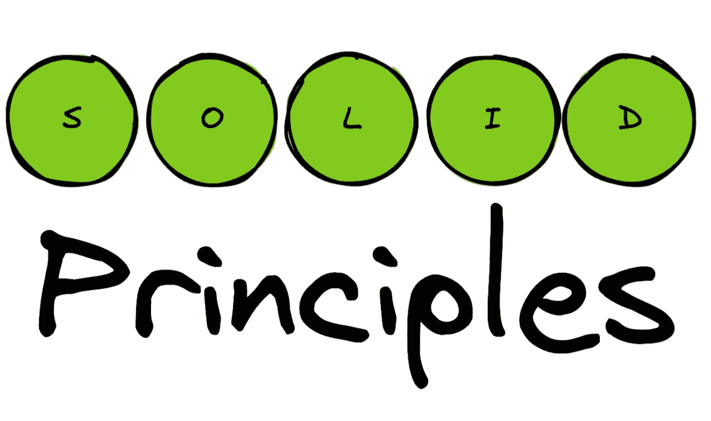
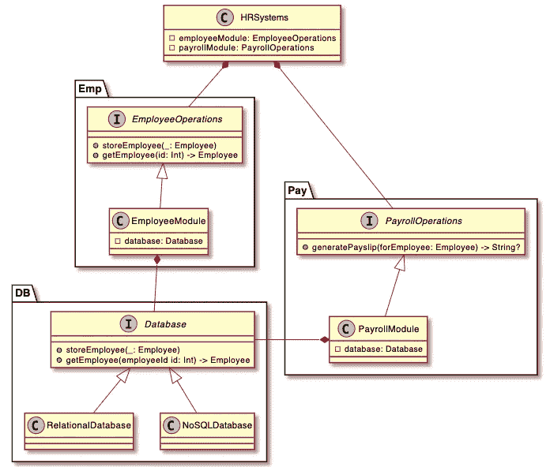

# 遵循坚实原则的 Swift 通过迭代改进

> 原文：<https://betterprogramming.pub/refactor-with-solid-principles-a-swift-use-case-91bc448eb0ff>

## 让我们在 Swift 中构建一个虚拟的人力资源系统



软件术语中的坚实原则不仅仅是一个时髦词，而是可伸缩软件开发离不开的东西。

在软件的生命周期中，软件开发的大部分成本都花费在软件的维护上。因此，作为开发人员，我们希望构建一些不易碎但易于维护的东西。

当你第一次听说这些原则时，它们可能看起来很学术，但是在团队中花时间开发软件后，你会很快意识到它们的重要性。我们中的一些人可能甚至没有听说过这些原则，但可能已经以某种形式遵循其中的一些原则。

在本文中，我们将尝试构建一个虚构的人力资源系统，我们将像在现实世界中一样迭代其开发生命周期。每一次迭代都将通过实现一个坚实的原则来改进代码。完整的例子可以在这里找到[。](https://gist.github.com/mvemjsun/f207d90aead162b398fcaa02a6e5d5a8)

# 怎么开始的

一天，丽莎走进了春田科技公司。经理召集了团队，并宣布他们将建立一个内部人力资源系统，这将是一种管理公司人力资源流程的开创性方法。

经理希望系统能够做到以下几点:

*   它应该能够存储和检索雇员的详细信息
*   它应该能够通过电子邮件发送工资单

丽莎在激动中支持自己去做这项工作，第二天她想出了下面的话:

Lisa 将此提交给同行评审，她的同事提出了一个问题，她的代码*违反了单一责任*原则。

Lisa 构建的模块目前有两个利益相关者:维护员工的 HR 和生成工资单的 Payroll。

想象一下，如果人力资源部想要改变工资单的生成方式(他们想要的不仅仅是通过电子邮件发送工资单，他们还想打印工资单并通过蜗牛邮件发送)。

这将意味着在目前的设计下，整个模块将需要重新编译，从而影响工资。同样，如果 IT 部门想要改变数据库的内部工作方式，整个模块将需要重新编译，这会影响人力资源！

# 单一责任原则

这一原则有几层含义，其中最突出的是:

> 一个函数或模块应该只有一个改变的理由。
> 
> 一个功能或模块应该只有一个利益相关者(例如:人力资源，工资等)。

丽莎回到绘图板，想出了下面的内容:

我们已经可以看到代码现在好多了。`EmployeeDatabase`和`Payroll`的内部工作原理是从`HRSystems`中提取出来的。

需要对它们进行的任何更改都不会直接影响`HRSystems`模块。

# 开闭原则(OCP)

这项原则规定:

> 软件产品应该对扩展开放，但对修改关闭。

当 Lisa 对她最后一轮重构感到满意时，她的老板走过来对她说，他希望 Payroll 模块能够打印工资单，并将其与生成的现有电子邮件一起发送给员工。

所以丽莎想出了以下的变化:

我们可以看到，由于采用了 SRP，我们能够在不影响`HRSystems`模块的情况下修改`Payroll`模块。*我们能够扩展* `*HRSystem*` *模块的功能，而不必直接修改它*。

# 利斯科夫替代原理

完成之前的更改后，Lisa 的同事 Moe 对她的同行评审请求做出了评论，他从经理那里听说，他们希望能够更换到不同的数据库系统，以防与现有数据库供应商的谈判不尽如人意。

这意味着 Lisa 将需要构建她的代码，以便与数据库无关的模块应该与数据库的任何更改和数据库层的实现隔离开来。

> 利斯科夫替代原理指出，如果有两个 T 类型的对象 O1 和 U 类型的 O2，那么当 U 是 T 的类型时，根据 O1 定义的函数 F 在 O1 被 O2 替代时应该表现不变。

Lisa 和 Moe 组合在一起，提出了以下重构代码:

丽莎和莫伊第一次介绍了一个`Database`应该做的`protocol`。

类似地，`EmployeeDatabase`的任何引用都被它的抽象`Database`所取代。我们已经使`RelationalDatabase`和`NoSQLDatabase`T17 采用和*符合*协议。

这使我们能够用我们选择的数据库实现(RDBMS 或 NoSQL)初始化`HRSystems`模块，而不影响系统行为。

我们能够用 RDBMS 或 NoSQL 代替数据库，而不影响系统行为。

# 接口隔离原则(ISP)

该系统现在运行良好，仍有一些改进可以对`HRSystems`模块进行，以满足 ISP 的要求。

这个模块可能被那些只对“员工操作”感兴趣的人使用，同样，也可能有另一组人只对生成“工资单”感兴趣。

目前的情况是，如果任何员工操作需要更改，也会影响到工资操作，因为模块需要重新构建，反之亦然。

为了克服这个问题，我们将不得不从单个模块中组合出 `*HRSystems*` *模块。这些模块要么做`EmployeeOperations`要么做`PayrollOperations`。*

我们现在已经能够将员工操作和工资操作隔离到它们自己的模块中，这样它们中每一个的变化都不会直接影响`HRSystems`模块(甚至模块本身也是解耦的)。

这有助于满足 ISP。`HRSystems`模块由`EmployeeOperations` & `PayrollOperations`组成。

`HRModuleBuilder`帮助我们构建一个`HRSystems`模块，在运行时将雇员和工资模块注入其中。

# 依存倒置原则

如果你一直坚持到现在，你会很高兴地知道我们已经满足了依赖倒置原则

源代码模块应该依赖抽象，而不是实现。`HRSystem`模块只依赖于抽象类型(协议)`EmployeeOperations`和`PayrollOperations`，因此颠倒了我们本来会有的依赖关系。

类似地，`EmployeeModule`和`PayrollModule`依赖于`Database`抽象，而不是实际的`Database`实现。

如果我们画一个从一个模块到它的依赖关系的箭头，我们会看到反转。

```
HRSystems → EmployeeOperations ← EmployeeModule (inverted dependency)HRSystems → PayrollOperations ← PayrollModule (inverted dependency)
```

# 结果呢

下面是我们在实现了坚实的原则后最终得到的类关系图。完整的例子可以在[这里](https://gist.github.com/mvemjsun/f207d90aead162b398fcaa02a6e5d5a8)找到。



坚固的系统

## 观察

*   该系统被分成多个模块，每个模块有一个单独的职责(SRP)。
*   像 Emp，Pay & DB 这样的模块可以独立扩展而不影响其他模块(OCP)
*   这些模块依赖于数据库的抽象，因此它们可以用任何选择的实现(LSP)来实例化。
*   HRSystems 模块*由员工和薪资模块*组成，对其中任何一个模块的更改都可以独立完成，不会相互影响(ISP)。
*   在系统中很好地使用了协议，因为模块依赖于*抽象，而不是实现*。HRSystems 模块依赖于`EmployeeOperations` & `PayrollOperations`。类似地`EmployeeModule` & `PayrollModule`依赖于`Database`，后者是数据库系统的抽象。这有助于实现依赖性反转(DI)。

# 结论

对于任何相当复杂的代码库来说，采用可靠的原则不是一种选择，而是一种必要。它允许我们

*   建立一个模块化的系统。
*   系统组件具有低耦合性。
*   单个模块变得易于理解和推理。
*   对系统一部分的改变不会轻易影响到其他部分(模块隔离)。
*   单个模块的单元测试变得更加容易(因为模块依赖于抽象而不是实现，所以能够将模拟实现注入到模块中)。
*   可以放心地进行更改(因为在测试金字塔中，较低层次的代码比较高层次的代码耦合性更低，可测试性更强)。
*   软件维护成本很高，所以我们希望能够拥有上述功能。