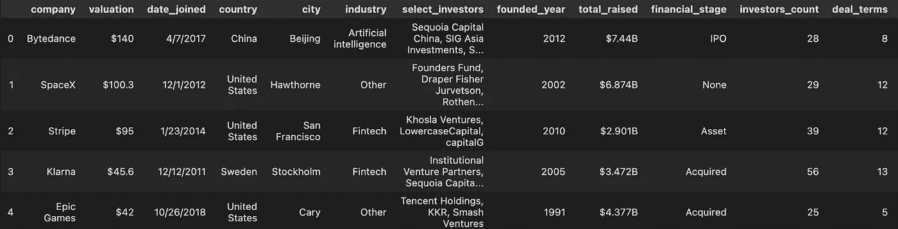
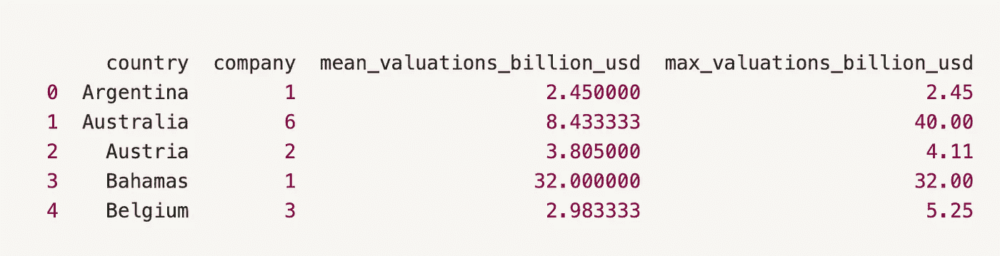
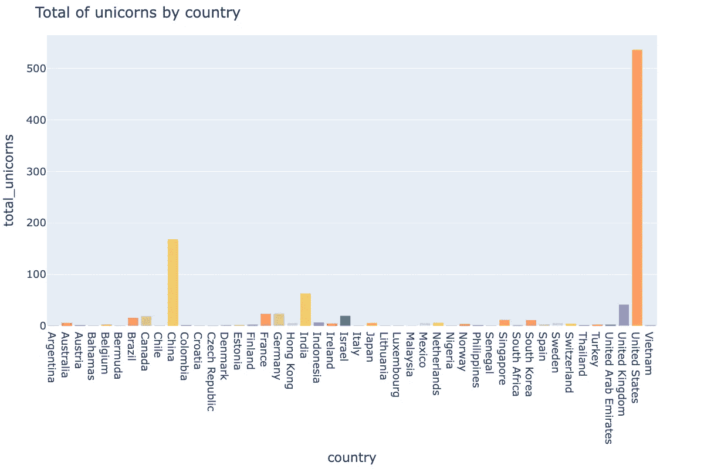
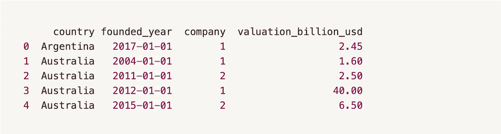
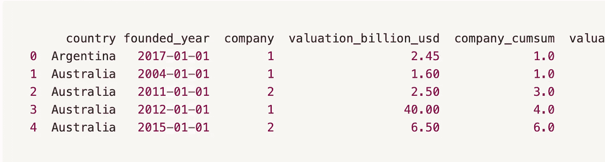
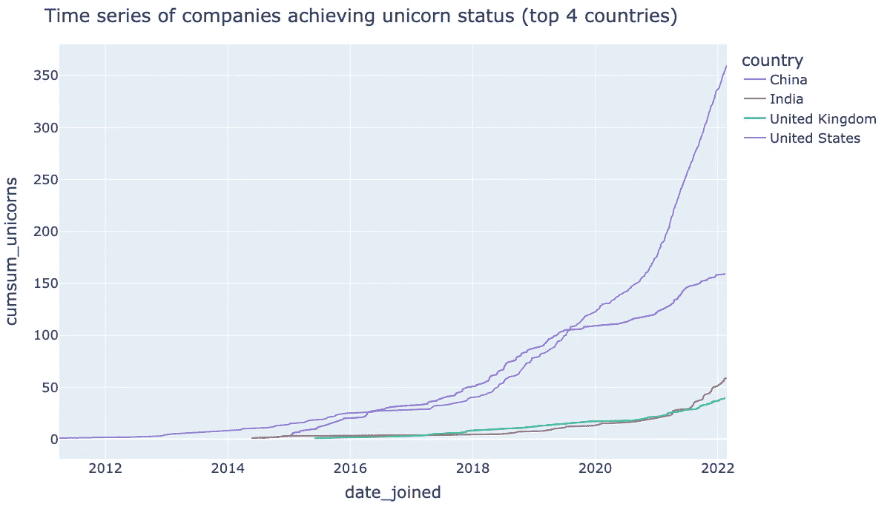
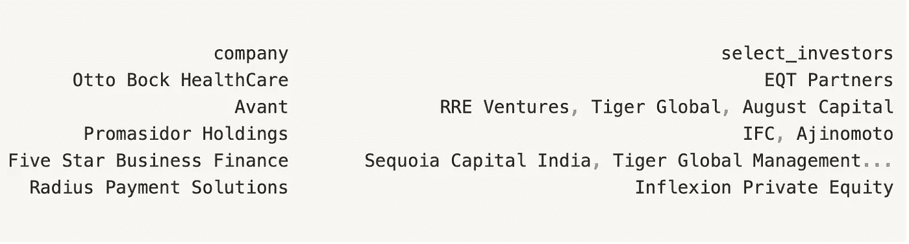
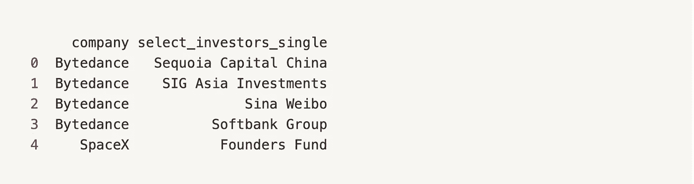
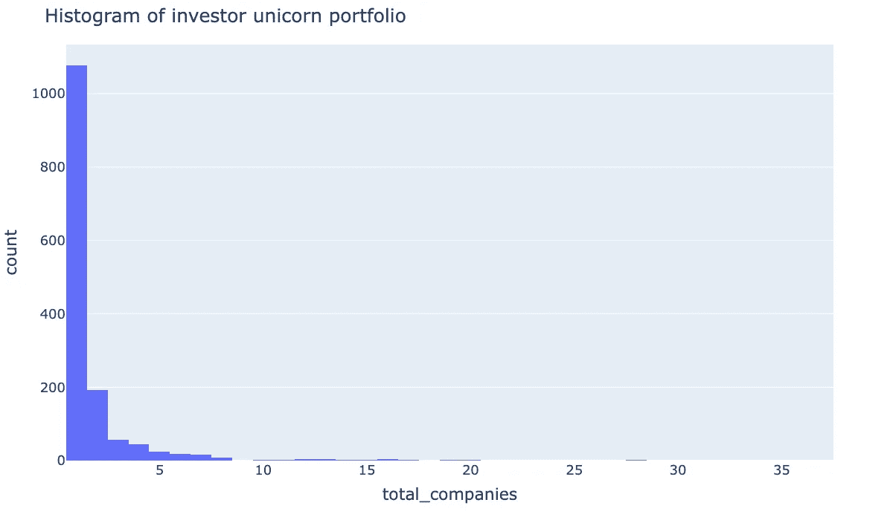

# 用 Pandas 重构可伸缩 Python 代码

> 原文：<https://betterprogramming.pub/refactoring-for-scalable-python-code-with-pandas-727d15f14852>

## 用于编写可伸缩数据争论管道的 Python 设计模式


照片由 [Siora 摄影](https://unsplash.com/@siora18?utm_source=medium&utm_medium=referral)在 [Unsplash](https://unsplash.com?utm_source=medium&utm_medium=referral) 拍摄

Python 的一些优点是它的灵活性和简单性。然而，这些能力是一把双刃剑。如果您没有在早期投入工作来设计可重用、可管理和可测试的代码，那么当您的代码库扩展时，您将会遇到进度问题。

当使用 Python 的 Pandas 模块时，很容易脱离面向对象的编码风格。一个常见的陷阱是编写快速代码，这变得难以测试和难以扩展。

这篇文章展示了在与熊猫争论数据时，可重用和低维护代码的设计模式。

# 🪖员额目标

1.  与熊猫一起建立度量管道

2.重构管道，使其易于扩展和测试

🐍代码库在这里找到了。

# 🦄资料组

我们将使用来自 Kaggle 的一个免费数据集，其中包含:*“世界上* ***独角兽公司*** *的完整列表。”*



**上下文**

> “独角兽公司，或独角兽创业公司，是估值超过 10 亿美元的私人公司。截至 2022 年 3 月，全球共有 1000 家独角兽。受欢迎的前独角兽包括 Airbnb、脸书和谷歌。变体包括价值超过 100 亿美元的十粒玉米和价值超过 1000 亿美元的百粒玉米。

📊Kaggle 独角兽公司数据集在这里找到了。

# 🧱建立指标管道

我们将使用熊猫构建 3 个独角兽统计表。

1.  国家级指标
2.  国家一级的时间序列指标
3.  投资者指标

## 🏆熊猫制胜组合方法

我们将使用 Pandas 方法的组合，轻松处理数据并保持我们的管道整洁。

*   `pandas.DataFrame.[explode](https://pandas.pydata.org/docs/reference/api/pandas.DataFrame.explode.html)`或`pandas.DataFrame.[melt](https://pandas.pydata.org/docs/reference/api/pandas.DataFrame.explode.html)`
*   `pandas.DataFrame.[groupby](https://pandas.pydata.org/docs/reference/api/pandas.DataFrame.groupby.html)`
*   `pandas.DataFrame.[reset_index](https://pandas.pydata.org/docs/reference/api/pandas.DataFrame.reset_index.html)`
*   `pandas.[merge](https://pandas.pydata.org/docs/reference/api/pandas.DataFrame.merge.html)`

## 🌍国家级统计

首先，我们将计算每个国家的独角兽数量和每个国家的平均独角兽估值(以十亿计)。



输出

**📈使用 *country_stats* 输出表**的示例图

下面的图是用我们的`country_stats`表制作的图的一个例子。我们可以很快看到美国在独角兽公司总数上领先世界。



## ⏳国家一级时间序列

对于这些指标，我们按*国家*和*日期加入*列分组，以计算一段时间内独角兽的数量，并对估值求和。

💡*注意，我之前按照日期加入对数据帧进行了排序。*



输出

## ➕累积时间序列

到目前为止，我们只生成了该时间点的时序指标。然而，查看一段时间内的累计总和更容易。

这些步骤采用生成的`time_series`表，并使用一个扩展窗口来计算累积和。



输出

**📈使用*时间序列*输出表**的示例图

下面的时间序列图是根据我们对每个国家独角兽数量的累积结果绘制的。我们可以看到，自 2020-2021 年以来，美国已经达到了一个生产独角兽的轨迹，这是中国无法比拟的。与此同时，印度和英国可能刚刚开始它们的增长阶段。



## 🧑‍💼投资者统计

生成投资者指标更加复杂。每家公司的投资者都存储为一个用逗号分隔的字符串。

比如，《Avant》有*select _ investors*“RRE 创投、老虎环球、八月资本”。

我们希望重用相同的代码格式，就像国家级指标一样，以利用`pandas.DataFrame.groupby`方法。这将有助于我们以后的重构。



示例输出

## 🏗非中枢投资者

Un-pivoting 是这种设计模式的关键，因为我们希望对个人投资者使用`groupby`方法。

使用`pandas.DataFrame.explode`，我们为个人投资者生成一个额外的列。注意，现在我们的表中每个公司有多行。

💡*这里我使用了* `[explode](https://pandas.pydata.org/docs/reference/api/pandas.DataFrame.explode.html)` *来取消透视。另外一种结账方法是* `[melt](https://pandas.pydata.org/docs/reference/api/pandas.melt.html)` *。*



输出

下一步是在每个投资者的投资组合中生成简单的投资者统计数据、公司数量和公司估值。

**📈示例图使用 *investors_stats* 和**

下面的柱状图显示了投资者投资组合中独角兽总数的分布情况。我们看到幂律型分布，其中大多数投资者只有一只独角兽，而很少有人投资了很多只。这种类型的分布也可以在人口、货币财富和社会网络中找到。



# 🔧迄今为止的管道

到目前为止，我们有一个看起来相当整洁的指标管道，但是我们总共只生成了 8 个指标。如果我们将它扩展到 20-30 梅蒂克，我们的脚本将开始出现大量重复。

到目前为止，我们代码的格式是一个简单的 python 脚本。因此，我们的代码不能被隔离和单元测试。

我们唯一的测试选项是运行整个脚本，并在端到端的风格测试中评估输出。这不是很好，因为它可能需要很长时间来运行。

# 🚧管道重构

## 🚪开闭原理

> *“*打开进行扩展，关闭进行修改。”

重构我们的代码，尽可能遵循开闭原则。

1.  将度量函数移动到度量类中，并使用`pandas.DataFrame.[apply](https://pandas.pydata.org/docs/reference/api/pandas.DataFrame.apply.html)`方法。
2.  使用 Python 内置的`[getattr](https://docs.python.org/3/library/functions.html#getattr)`函数，用一个`generate_metrics`函数删除对`pandas.DataFrame.groupby`的重复调用。
3.  创建一个度量配置文件，该文件被传递给我们的`generate_metrics`函数，其中包含生成度量所需的元数据。

💡*查看立体设计原理* [*此处*](https://www.digitalocean.com/community/conceptual_articles/s-o-l-i-d-the-first-five-principles-of-object-oriented-design) *。*

## 🧑‍🎓度量类别

通过将我们的度量转移到一个类，我们可以隔离度量，并为每个度量构建单元测试。通过使用熊猫。DataFrame.apply 方法，我们可以添加个性化的指标，并利用 Pandas 中不包含的其他 python 包。

遵循开闭原则，如果我们想要添加度量，我们将创建一个继承我们的类度量的新类。

## 📂配置文件

配置文件为我们想要生成的每个表提供了一个指标列表。如果我们想添加或删除指标或更改命名等，我们只需更改配置文件。这样我们就不会编辑我们的代码库本身。

## ⚙️生成度量函数

这个函数接收我们的 Unicorn 数据、我们的 metrics 类的一个实例和我们的 metrics 配置，并返回一个 Metrics 数据帧。

步骤:

1.  使用`getattr`创建一个`pandas.DataFrame.groupby.apply`对象
2.  使用`getattr`创建一个度量类方法对象(例如`Metrics.count`
3.  调用传递度量方法对象的`pandas.DataFrame.groupby.apply`对象

## 🪄重构的管道

最后，我们到达重构的管道。通过定义新的度量类并将它们添加到我们的配置文件中，我们可以很容易地将度量添加到现有的表中。

# 👀概述

*   标准化管道中的代码，使用`pandas.DataFrame.groupby.apply`，对我们的数据进行转换。
*   取消数据透视以给出唯一的行(与`pandas.DataFrame.groupby`一起使用)。
*   在一个类中托管我们希望生成的度量，并将它们传递给`pandas.DataFrame.groupby.apply`。
*   使用 Python 的内置函数`getattr`和元数据字典，循环遍历我们的指标，而不是重复调用`pandas.DataFrame.groupby.apply`。

# ✅ 🔀好处和权衡

**好处**

*   代码是模块化的，并且更易于管理，以便按比例增加我们的度量。
*   一个配置文件给了我们更多灵活性来添加和取出度量，而不需要接触代码。
*   更容易测试我们的代码的功能，因为它已经被隔离。

**权衡**

*   小型管道需要维护更多代码。
*   我们代码的可读性降低了。
*   对于小管道来说更难调试。

# 📚资源

🐍代码库在这里找到了。

📊Kaggle 独角兽公司数据集在这里找到了。

## 第三方库:

*   `pandas.DataFrame.[explode](https://pandas.pydata.org/docs/reference/api/pandas.DataFrame.explode.html)`
*   `pandas.DataFrame.[groupby](https://pandas.pydata.org/docs/reference/api/pandas.DataFrame.groupby.html)`
*   `pandas.DataFrame.[reset_index](https://pandas.pydata.org/docs/reference/api/pandas.DataFrame.reset_index.html)`
*   `pandas.[merge](https://pandas.pydata.org/docs/reference/api/pandas.DataFrame.merge.html)`
*   Python 内置于`[getattr](https://docs.python.org/3/library/functions.html#getattr)`

```
**Want to Connect?**I'm just starting out my blogging journey. Let's Connect on [Twitter](https://twitter.com/charlieshelb)!
```