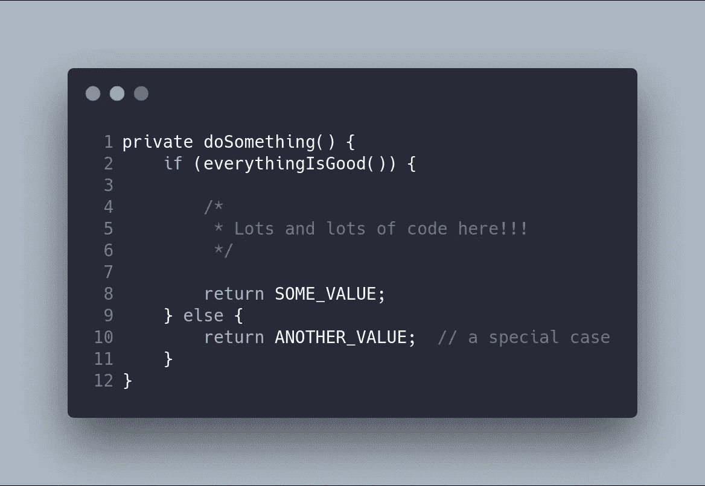
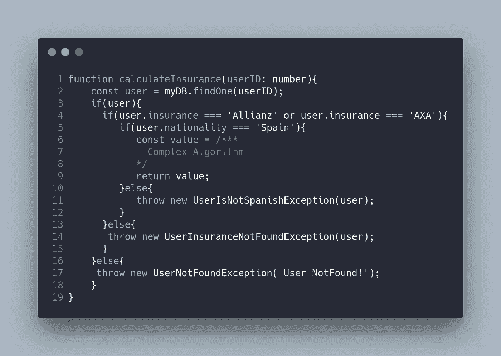
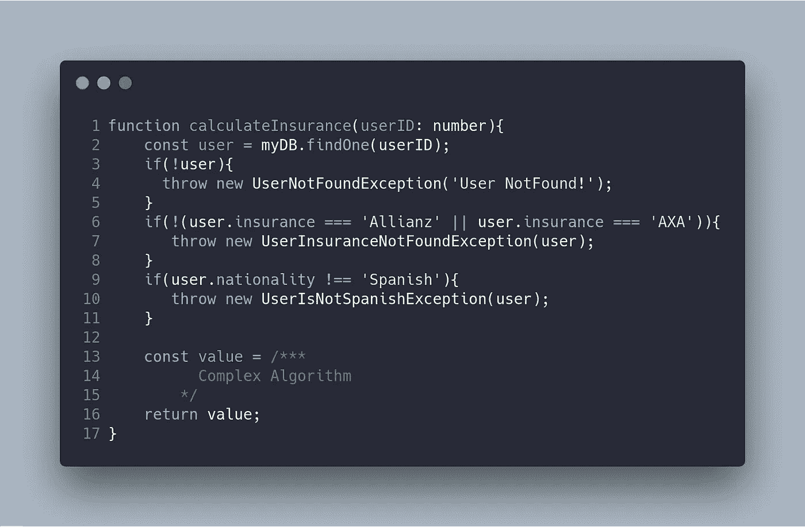
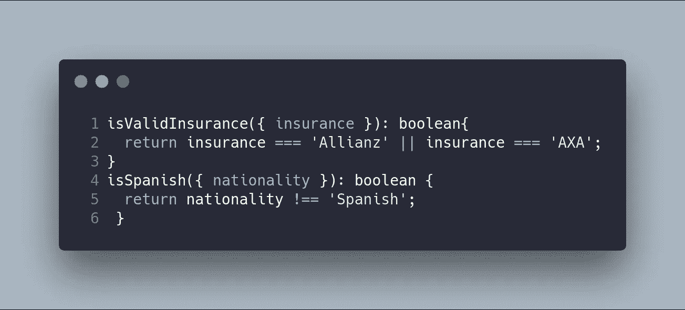
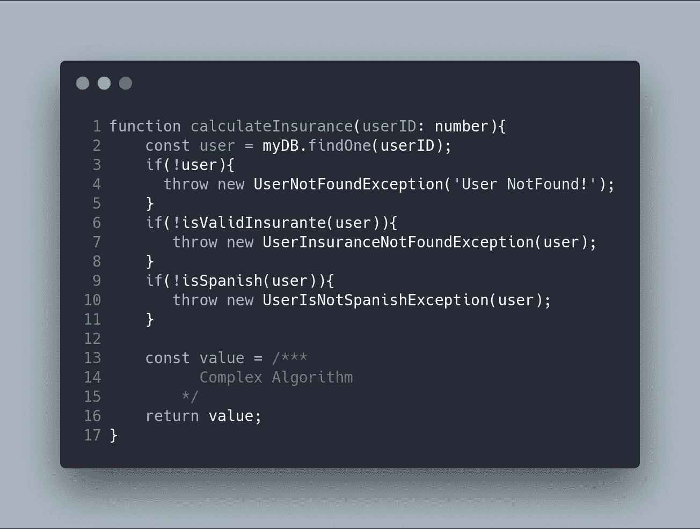

# 重构:保护子句

> 原文：<https://betterprogramming.pub/refactoring-guard-clauses-2ceeaa1a9da>

## 成为更好的开发人员的技巧

由 [Kutan Ural](https://unsplash.com/@kutanural?utm_source=unsplash&utm_medium=referral&utm_content=creditCopyText) 在 [Unsplash](https://unsplash.com/s/photos/guard?utm_source=unsplash&utm_medium=referral&utm_content=creditCopyText) 拍摄的照片

> *“在计算机编程中，一个保护是一个布尔表达式，如果程序要在所讨论的分支中继续执行，它的值必须为真。无论使用哪种编程语言，保护代码或保护子句都是完整性检查的前提条件，用于避免执行过程中的错误。”—* [*百科*](https://en.wikipedia.org/wiki/Guard_(computer_science))

未应用保护子句技术的代码中出现的主要问题如下:

1.  过度缩进—过度使用控件结构(如果是嵌套的),意味着有很高的缩进级别，这使得代码阅读很困难。
2.  if-else 之间的关系——当 if-else 之间有大量独立的代码片段(它们在概念上彼此相关)时，有必要通过在不同部分之间跳转来执行代码读取。
3.  脑力劳动——源代码中不同跳转的结果导致在代码生成中产生额外的劳动。

# 实际应用

保护条款的实际应用是以下情况:

在这种情况下，大多数时候，您必须颠倒逻辑以避免使用保留字`else`。前面的代码将重写如下:

因此，导致退出该方法的特定情况将被放置在该方法的开始处，并且以避免继续通过该方法的令人满意的流程的方式充当守卫。

通过这种方式，该方法易于阅读，因为特定的情况在相同的开始，并且令人满意的流量使用的情况是该方法的主体。

有反对保护条款的人指出，在每种方法中应该只有一个出口点，使用这种技术，我们可以找到几个出口点。它不应该与无处不在的回归和不受控制的方法相混淆，这将使我们付出更大的精神努力。但是所有的返回都是明确控制的，因为它们将在保护装置中或在方法的结尾被发现。

下面我们将看到更复杂的保护条款的例子，其中代码的阅读和理解得到了很大的提高。

假设您必须创建一个方法来计算健康保险的成本，其中用户 ID 作为一个参数被接收。

数据库中的搜索是使用这个 ID 来检索用户的。如果用户不存在，将抛出一个名为`UserNotFoundException`的异常。如果用户存在于系统中，下一步是验证用户的健康保险是否对应于对该算法有效的保险之一:Allianz 或 AXA。如果保险无效，必须返回一个名为`UserInsuranceNotFoundException`的异常。最后，这个算法只对西班牙国籍的用户有效。因此，您应该再次检查用户是否是西班牙人，以执行保险计算或返回一个名为`UserIsNotSpanishException`的异常

如您所见，代码有许多级别的缩进。下面显示了先前算法的相同版本，但是应用了保护子句技术。这种技术使得代码更具可读性。注意，已经应用了三个保护子句，允许生成不干扰算法结果的替代路径(抛出异常)。

一些必须解决的问题:

1.  为什么没有`if-else if`的案例？
2.  别想了！如果你的代码需要像`else if`这样的案例，那是因为你打破了单一责任的原则，代码做出了更高层次的决策，这些决策应该使用技术进行重构，比如划分为子方法或设计模式，比如命令或策略。
3.  负面条件不太好理解。
4.  为此，我们有另一种重构技术，称为*提取方法*，它包括将代码提取到函数中，以便重用或阅读理解。在下面的示例中，我们修改了前面的示例，以创建允许更好地阅读和理解代码的方法。

在使用子句保护时，条件的逻辑通常是颠倒的，并且根据条件的复杂性，理解该条件中所评估的内容是相当复杂的。

这就是为什么在小函数中提取条件的逻辑是一种好的做法，这样可以提高代码的可读性(当然，也可以发现其中的错误)，因为评估条件的责任被委托给了特定的函数。

对于我们的医疗保险示例，我们可以生成以下方法:

没有必要创建一个函数来检查用户是否存在，因为只检查用户是否不同于 null 或 undefined 就足够了。因此，生成的代码如下所示:

# 摘要和资源

有许多提高代码质量的实践。在应用重构技术时，要学习的最重要的事情是，它们应该集中在两点上，主要是:

1.  解耦代码——这允许在整个软件项目中不会引起大的连锁变化的小变化。
2.  可读性——非常重要的一点是，开发人员要明白，他们工作的大部分时间都是基于阅读代码，而且很可能是其他开发人员编写的代码。开发人员不花时间理解基本逻辑是非常有益的，因为它不容易阅读。

重构从最基本的点开始，从简单的 *if* ，到架构模式。关注我们软件开发的所有方面是很重要的。

【Refactoring.com
T2[卫士—维基百科](https://en.wikipedia.org/wiki/Guard_(computer_science))