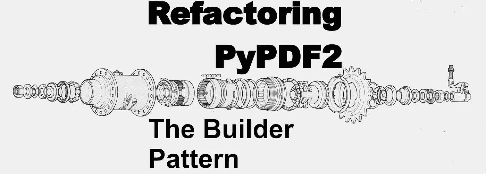
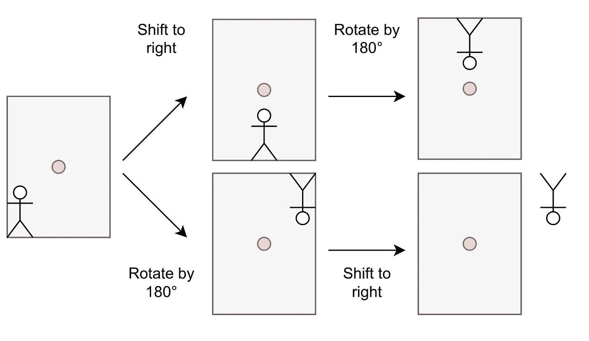

# 重构 PyPDF2 的转换接口

> 原文：<https://betterprogramming.pub/refactoring-pypdf2s-transformation-interface-34db1c1c2fae>

## 创建一个更容易维护的系统



图片来自[维基共享](https://commons.wikimedia.org/wiki/File:Internal_hub_3_speed_Shimano.jpg)(西尔斯体育中心，公共领域)

我喜欢写好的软件。可靠的、用户直观理解的、易于维护的软件。学习和教授好的软件是什么样子是超级辛苦的，但我希望用这篇文章植入一些想法。

读完这篇文章后，你将会学到好软件的两个方面以及一个设计模式。

# PyPDF 是什么？

PyPDF2 是一个免费的开源纯 python PDF 库，能够拆分、合并、裁剪和转换 PDF 文件的页面。它还可以向 PDF 文件添加自定义数据、查看选项和密码。PyPDF2 也可以从 PDF 中检索文本和元数据。

2011-2016 年积极研制。它适用于许多用例，因此 Python 社区仍然大量使用该库——尽管它直到 2022 年才得到任何更新。2022 年 4 月，我成为 PyPDF2 的维护者。

PyPDF2 是 PyPDF 的一个分支——一个更老的项目。PyPDF2 的开发者总是希望保持向后兼容性。我不觉得有这个必要。如果我认为破坏兼容性对整个项目有利，我会这样做。

# 对稳定界面的需求

接口是系统的边界。它允许用户与之互动。这些用户本身可能就是开发人员。用户不应该需要了解系统的内部机制。

汽车修理工可以成为司机——但你不一定要成为一名机械师才能开车。公共接口是方向盘、油门踏板、刹车和其他一些东西。专用接口是用于汽车电子元件的内部 CAN 总线，以及定义使用哪些档位的标准。

> 用户期望界面保持稳定——或者当它们改变时至少有一个明确的声明。

这意味着你可能需要支持你几年前做出的次优决定。在某些情况下，很多年——想想 Python 2 或者美国仍然使用英制单位的事实。

# 对小界面的需求

维护者想要小接口:公共接口越大，开发者需要支持的就越多。它更容易出现错误和不一致。

但是用户也从小界面中获益:发现的东西更少，而且希望只有一种方法可以做他们想做的事情。消除重复使得使用同一个库的代码更加一致。

# 界面蠕变

任何开发人员都很难对一个特性请求说“不”，尤其是当它很容易实现的时候。我们想让人们快乐。只是在这里添加一个参数或者在那里添加一个新的方便函数/类/方法不会有什么坏处，对吗？

这就是你如何得到臃肿的界面。我已经简要地指出了为什么你想要小界面。如果软件使用定义良好的接口，您可以猜测函数名和参数的名称/顺序。你可以看到用来设计它的模式。

# PDF 转换

考虑您可能想要对 PDF 页面进行的转换。旋转，移动，缩放，裁剪，将一个 PDF 叠加到另一个 PDF 上。你能想到的可能还有很多，但这五个是我们目前关注的。

PyPDF2 `PageObject`类有以下方法:

让我们检查一下这八种方法中我们不喜欢的地方:

1.  不符合 PEP-8:我首先想到的是不遵循预期的命名方案。可能是我最不在乎的一个，但也是最明显的一个。
2.  提供不止一种方式:`mergeRotatedTranslatedPage`可以旋转和平移——那么我们为什么需要`mergeRotatedPage`？`mergeRotatedScaledTranslatedPage`似乎能做所有的变换。我们还需要其他人吗？
3.  结果的不确定性:假设你想做两个操作。(a)您想要将图像旋转 90 度,( b)将其向右移动 10 厘米。先做(a)再做(b)与反过来不同，假设旋转中心是相对于画布的。

# 想法 1:使用带有多个参数的单一方法

我可以只用`mergeRotatedScaledTranslatedPage`,其他的都弃用。

这有一个很大的缺点:操作的顺序很重要！



运算的顺序很重要:如果坐标系的中心在红点，你(1)将页面上的图形向右移动(2)旋转 180 度，你会得到不同的结果。图片由马丁·托马斯提供。

# 想法 2:拆分、合并和转换

上面提到的方法有一个非常明显的缺点:如果你想只做其中一个操作而不与另一个页面合并，你就做不到。因此，有三个方法直接在页面上操作，一个方法进行合并是有意义的:

```
class PageObject:
    def merge_page(self, page2, expand=True): ... def scale(self, scale, expand=True): ...
    def rotate(self, rotation, expand=True): ...
    def translate(self, tx, ty, expand=True): ...
```

现在你可以独立地应用操作和合并，以任何你想要的顺序。

# 想法 3:创建一个转换构建器

如果合并两个有许多页面的文档，您可能会反复执行相同的操作。所有这三种操作都用矩阵来表示。一个接一个地执行它们是一个矩阵乘法。因此，当你有 100 页，你做一个旋转，缩放操作，和一个转换，这将做 100 x 3 矩阵乘法或 300 矩阵乘法。

当你第一次把组合运算表示成一个矩阵时，你需要做两次矩阵乘法。之后，你有 100 个矩阵乘法。总共 102 次矩阵乘法。

想法二的另一个特性是，你不能有一个流畅的界面:这些操作应该就地发生，因为复制一个页面可能是一个相当繁重的操作。所以`page.scale`操作应该返回`None`。这意味着你不能做`page.scale(2).rotate(180)`。

为了消除这个缺点，我们添加了一个转换对象:

```
class Transformation:
    def scale(self, sx, sy) -> Transformation: ...
    def rotate(self, degree) -> Transformation: ...
    def translate(self, tx, ty) -> Transformation: ...class PageObject:
    def merge_page(self, page2, expand=True): ...
    def transform(self, transformation): ...
```

这是构建器模式:`[Transformation](https://pypdf2.readthedocs.io/en/latest/modules/Transformation.html)`类封装了用户想要应用的`transformation`，并帮助他们创建矩阵。`transformation`矩阵是 PDF 格式和 PyPDF2 实际需要的，但是对 PyPDF2 用户是隐藏的。用户只需使用`Transformation`构建器类:

```
transformation = Transformation().scale(2).rotate(180)
```

由于`transformation`类保存的数据很少，我们可以使它不可变，并且总是返回一个副本。这使得流畅的界面成为可能。具有自动完成功能的现代 ide 现在可以告诉用户他们可以做哪些操作。由于`PageObject`的方法更少，所以更容易测试，用户也更容易发现他们需要什么。

# 摘要

您已经看到了如何应用 builder 模式来实现流畅的界面，并将核心对象的公共方法从八个减少到两个。同时，用户变得更加灵活，测试变得更加容易。

您已经注意到，可维护性和用户需求有时是密切相关的。小巧且定义良好的界面只是让每个人的生活更轻松。