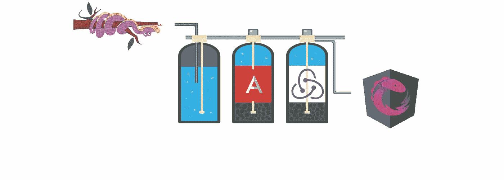
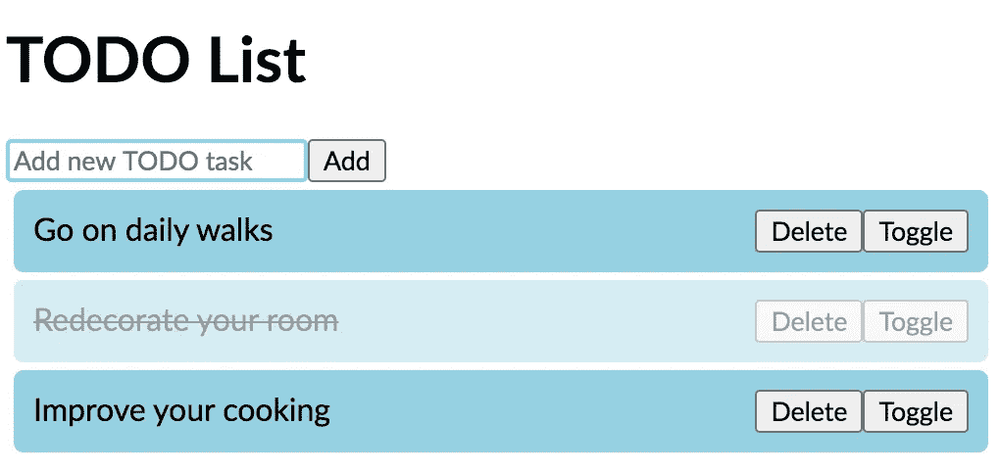
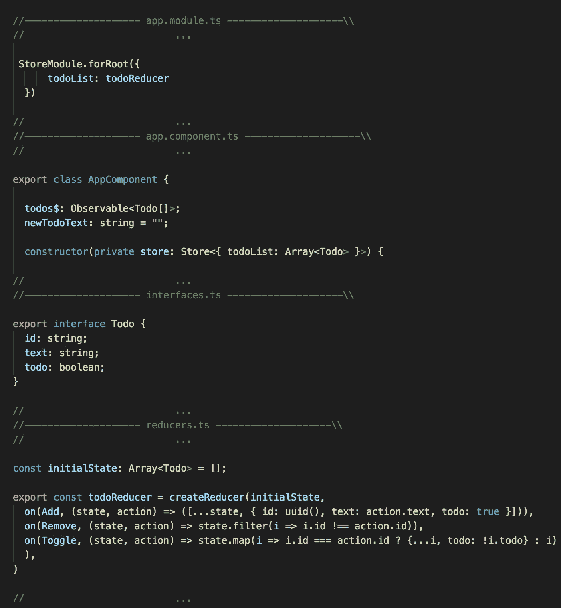
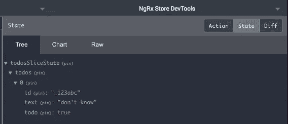
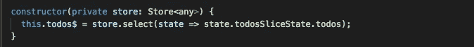
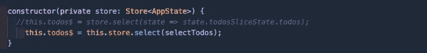
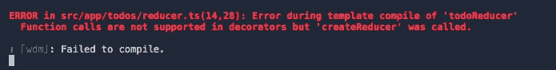
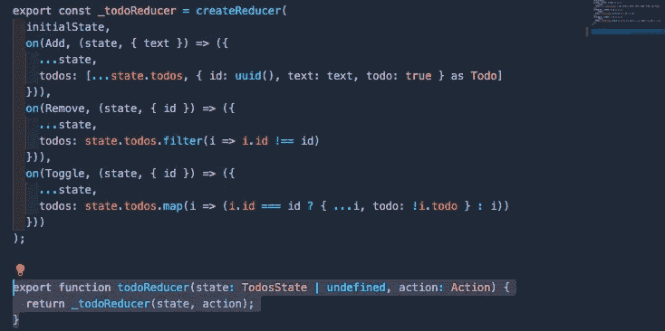
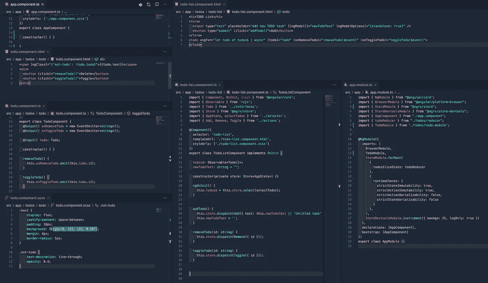

# 重构归约器和状态以获得更好的存储

> 原文：<https://betterprogramming.pub/refactoring-reducers-states-for-a-better-store-cdb355632fbf>

## 改进 NGRX 项目的综合指南(第 1 部分)



图片来源:作者

文档很棒，但有时你并不真正了解如何参与一项新技术，或者你甚至看不到使用它的真正优势。每当我开始一个新项目或在 NGRX 中检查任何项目时，有一件事让我感到困惑，那就是如何初始化存储和状态。

我们将介绍一些可以在管理其 reducers 的基本项目(已经在 NGRX 中完成)中完成的改进。我们将了解关于 [NGRX 减速器](https://ngrx.io/guide/schematics/reducer)的文献的最新进展。最后，您将看到我们如何模块化我们的项目，获得抽象某些特性的好处。

用例是别人用 Angular 和 NGRX superpower 构建的一个简单的待办事项列表(非常感谢构建它的人)。

# 使用案例

这里我们的起点是一个基本的 NGRX 项目，有三个动作:添加`Todo`，删除`Todo`，切换`Todo`来标记任务是否完成。



花点时间熟悉一下代码，并对待办事项列表做一点小小的改动。

# 介绍

尽管我们的待办事项列表工作得很好，但我们可以看到快速而简单的性能改进是使其更具可伸缩性和模块化的下一个合理步骤。

从这里开始，让我们开始工作。



[https://github . com/ack user/ngrx-custom-reducers-todo-list/tree/feature/start point](https://github.com/ackuser/ngrx-custom-reducers-todo-list/tree/feature/startPoint)

此时回购: [StackBlitz](https://stackblitz.com/edit/ngrx-custom-reducers-todo-list) 或[GitHub](https://github.com/ackuser/ngrx-custom-reducers-todo-list/tree/feature/startPoint)on branch feature/start point。

# **关键概念**

减速器是商店应用程序的基础。由于应用程序存储维护状态，reducers 是在调度动作时操纵和输出新状态表示的主力。每一个缩减器都应该专注于一个特定的部分，或者状态的一部分，类似于数据库中的一个表。

## 定义状态形状:`reducer.ts`

```
export interface State {
   todoList: Array<Todo>
}
```

## 设定初始状态:`reducer.ts`

```
export const initialState: State = {
   todoList: []
};
```

很简单。但是，拥有一个坚实的结构让我们能够解决我们的应用程序，使它更容易理解和扩展。

## 注册根状态:`app.module.ts`

```
StoreModule.forRoot({todosSliceState: todoReducer}
```



某一时刻的状态快照

好吧，但我不太喜欢物体内部的物体。而现在的问题是，我还得把这种东西写进我的组件里:



应用程序组件

只要你的应用程序不断增长，整个州就会被分成不同的部分，所以选择器可以拯救你:

`**selectors.ts**`

```
export interface AppState {
    todosSliceState: TodosState;
}export const selectTodosSliceState = (state: AppState) => state.todosSliceState;export const selectTodos = createSelector(
selectTodosSliceState,
(state: TodosState) => state.todos
);
```

基本上，我们对状态做了一个抽象，说:“我们想要得到我们的`todos`的切片。一旦我们有了，那么请通过选择器使它们可用。”

这极大地美化了我们在大型应用中的控制器，同时也将它们与 Observables 的所有功能共享。



应用程序组件

让它在生产模式下编译(ng < 9.x).

Reducers probably look like 【 :

```
export const _todoReducer = createReducer(
initialState,
                       ...
```

And you will get this in Angular versions lower than 9:



Error during compile the project

The approach to get rid of this error and make your project AOT-compilable would be to [像这样包装你的 reducer 函数调用](https://ngrx.io/guide/store/reducers#creating-the-reducer-function):



此时的回购:分支特征/形状状态上的 [StackBlitz](https://stackblitz.com/edit/ngrx-custom-reducers-todo-list) 或 [GitHub](https://github.com/ackuser/ngrx-custom-reducers-todo-list/tree/feature/shapeState) 。

# **使其成为一个模块(重构)**

我们不会做一个只有一个功能的 NGRX 应用程序，因为在这样的情况下，它甚至不配用 Angular 做这个应用程序。这是一个基本的例子，对吗？

所以还是那句话，只要你的 app 成长了，你就会把你 app 的这部分/特性开发成[模块特性](https://ngrx.io/guide/store/reducers#register-feature-state)。

让我们将待办事项列表块模块化:

1.  从根中移除`todo`状态。我们把它放在新的模块中。

`app.module.ts`(《前传》):

```
StoreModule.forRoot({todosSliceState: todoReducer}
                              ...
```

变成了`app.module.ts`(“现在”):

```
StoreModule.forRoot({}
                             ...
```

2.抽象特征键。

`reducer.ts`

```
export const featureKey = 'todosSliceState';
```

注意:注册特性状态和调用`[createFeatureSelector](https://ngrx.io/api/store/createFeatureSelector)`时，建议抽象一个特性键字符串，防止硬编码字符串。

3.[创建一个新模块](https://ngrx.io/guide/store/reducers#register-feature-state)。

`todo.module.ts`

```
import * as fromTodos from './reducer';@NgModule({imports: [
...
StoreModule.forFeature(fromTodos.featureKey, fromTodos.todoReducer)
...
]})
```

总而言之，这是塑造我们国家的另一种方式。唯一的区别是我们是通过一个模块来完成的，因此加载这个新模块是至关重要的——别忘了！

```
@NgModule({imports: [
...
TodoModule,
...
```

注意:我急切地加载`Todo`模块*，但是你也可以懒洋洋地加载*。您的特性状态是急切加载还是延迟加载取决于您的应用程序的需求。**

**4.[选择器](https://ngrx.io/guide/store/selectors)**

**现在我们改变`selector.ts`(“之前”)**

```
***export const selectTodosSliceState = (state: AppState) => state.todosSliceState;*export const selectTodos = createSelector(selectTodosSliceState,(state: TodosState) => state.todos);...**
```

**到`selector.ts`(“现在”)。**

```
**export const selectTodosSliceState = createFeatureSelector<AppState, TodosState>(featureKey);export const selectTodos = createSelector(selectTodosSliceState,(state: TodosState) => state.todos); ...**
```

**就这么简单。(有一些区别，我可能会在其他文章中解释。)**

**我还做了一些与 NGRX 无关的事情。其中，我创建了组件，使它们变得聪明和愚蠢。如果我还没有说服你，看看他们。它们可能对你构建一个模块更有意义。**

****

**主要组件的快照**

**此时回购:分支特征/模块上的 [StackBlitz](https://stackblitz.com/edit/ngrx-custom-reducers-todo-list) 或 [GitHub](https://github.com/ackuser/ngrx-custom-reducers-todo-list/tree/feature/module) 。**

# **结论**

**我从 NGRX 中已经完成的一个例子开始这篇文章，因为我认为专注于提供快速扩展应用程序的工具比从头开始一个 NGRX 项目更有趣(非常无聊)。**

**我希望它能对任何开始向 NGRX 介绍自己的人有用。**

# **后续步骤**

**我们将讨论 NGRX 的其他主题，比如 reducers、selectors、`metaReducers`、facades 中的依赖注入，也许还有这个框架的其他部分，比如`ngrx/entity`或`ngrx/data`。**

**如果你读完了，谢谢。**