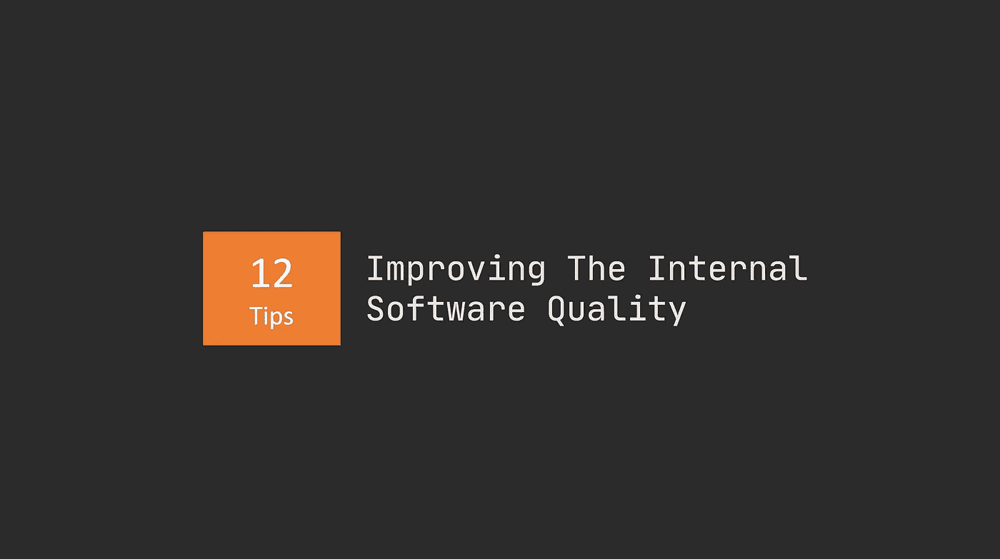

# 12 重构经验法则

> 原文：<https://betterprogramming.pub/refactoring-rules-of-thumb-for-beginners-to-become-experts-70161c3c4f20>

## 一旦你遵循一些简单的指导方针，就很容易重构混乱的代码

作者照片。

我将从提供你想要的东西开始:经验法则。

你好奇为什么这些试探法有用吗？然后阅读列表后面的附加信息。

# 初学者成为重构专家的 12 条启发

让我们一头扎进这件事。当我冒险参加重构会议时，我脑海中总会有一个混合的启发列表。

1.  你的类的参数列表开始变得太大了吗？那么它可能做得太多了。它的职责不明确，测试和调试起来可能很痛苦。它是重构的主要候选对象。
2.  你的类中有只使用一个类依赖关系的方法吗？您最好将该方法放入它自己的类中——即使该类只包含一个方法。
3.  你的方法是根据一个布尔参数值做两件不同的事情吗？为什么不创建两个不同的方法，并明确各自的职责呢？
4.  你的方法在一个值上分支了吗？比方说，你正在检查一个对象的类型，并根据它的类型执行不同的操作。这是把你的`if-else`或`switch`变成字典或地图的好时机。
5.  你在代码中广泛使用了`if-else`或`switches`吗？尝试使用多态性，并应用久经考验的设计模式，如策略、中介等。
6.  你的类构造函数或者方法有一个“神奇的”数字或者字符串吗？这是代表某种内在商业价值的任意值。用枚举代替魔法。
7.  你有硬编码的值(数字或字符串)吗？取值为参数，让它们可配置。在新环境中重用或部署应用程序或更改设置变得更加容易。
8.  不要使用像`i, j, k, m, n, x`这样的变量名。别说了。
9.  您是否发现自己在多个地方实现了同一个逻辑？将逻辑移到它自己的类或方法中。
10.  有没有`Service`或者`Manager`的课？它们就像瑞士军刀。责任多，凝聚力低。花点时间思考一下他们提供哪些服务，然后将每种不同的服务归为一类。
11.  你是否发现测试一个方法很有挑战性，因为它所在的类需要很多构造函数参数？将该方法从其类中分离出来。
12.  你需要添加一个新的`else-if`或者`switch`用例来实现一个新的需求或者特性吗？尝试使用接口和反射来自动发现类型。

# 为什么值得花时间学习重构

你是一个有抱负的开发人员，正在走向精通。学习重构代码——更重要的是，识别何时重构代码——是一项基本技能。

知道什么时候重构是最重要的。太早了？这只是不成熟的优化。太晚了？你的代码库很难处理。

我见过伟大的开发人员在不应该的时候跳过重构。他们的代码给人的印象是平庸的，因为职责混乱，可读性差。

重构是有时间和地点的。有时候，根本不需要。我们需要的是彻底销毁代码，从头开始。

# 重构到底是什么？

让我们花点时间达成共识。

从根本上说，重构是保留对代码库的更改的行为。然而，它通常可以与修复 bug、添加新特性和调整性能互换。

没有经验的开发人员经常滥用重构会话来调整和改变行为——甚至让它工作。那不是重构。这是错误修复和性能优化。

# 重构如何提高内部软件质量？

重构代码是为了提高应用程序的内部软件质量。您正在改善七种不同质量特征中的一种或多种:

1.  可维护性——提高对软件进行修改的容易程度。可维护性包括添加新功能、调整性能、易于修复错误。
2.  灵活性—您可以为其他用途修改软件的程度。想想你可以多么容易地旋转软件。
3.  可移植性——让软件在另一个环境中运行的难易程度。想想本地开发与在生产环境中的服务器上运行。
4.  可重用性——你在其他系统中使用你的部分软件的容易程度。
5.  可读性——你阅读和理解源代码的难易程度。不仅在接口层面上，而且在实现的本质细节上。
6.  可测试性——编写单元测试、集成测试等的难易程度。
7.  可理解性——从总体上理解你的软件有多容易。你的代码库是以一种有意义的方式构建的吗？

这些特征中的一些实现了相互冲突的目标。这就是生活。

考虑一下你的重构会议旨在提高哪些品质，因为它不可能提高所有这些品质。

记住这些特征，测试你的知识，看看你是否能把它们映射到启发式列表中。

哪种启发法改进了哪些质量特征？

# 资源

*   史蒂夫·麦康奈尔的《代码全集 2》
*   [是优化重构](https://martinfowler.com/bliki/IsOptimizationRefactoring.html)作者马丁·福勒

**Nicklas Millard** 是一名软件开发工程师，供职于一家发展最快的银行，负责构建任务关键型金融服务基础设施。

此前，他是 Big4 的高级技术顾问，为商业客户和政府机构开发软件。

> [新的 YouTube 频道(@Nicklas Millard)](https://www.youtube.com/channel/UCaUy83EAkVdXsZjF3xGSvMw)
> 
> *接通*[LinkedIn](https://www.linkedin.com/in/nicklasmillard/)