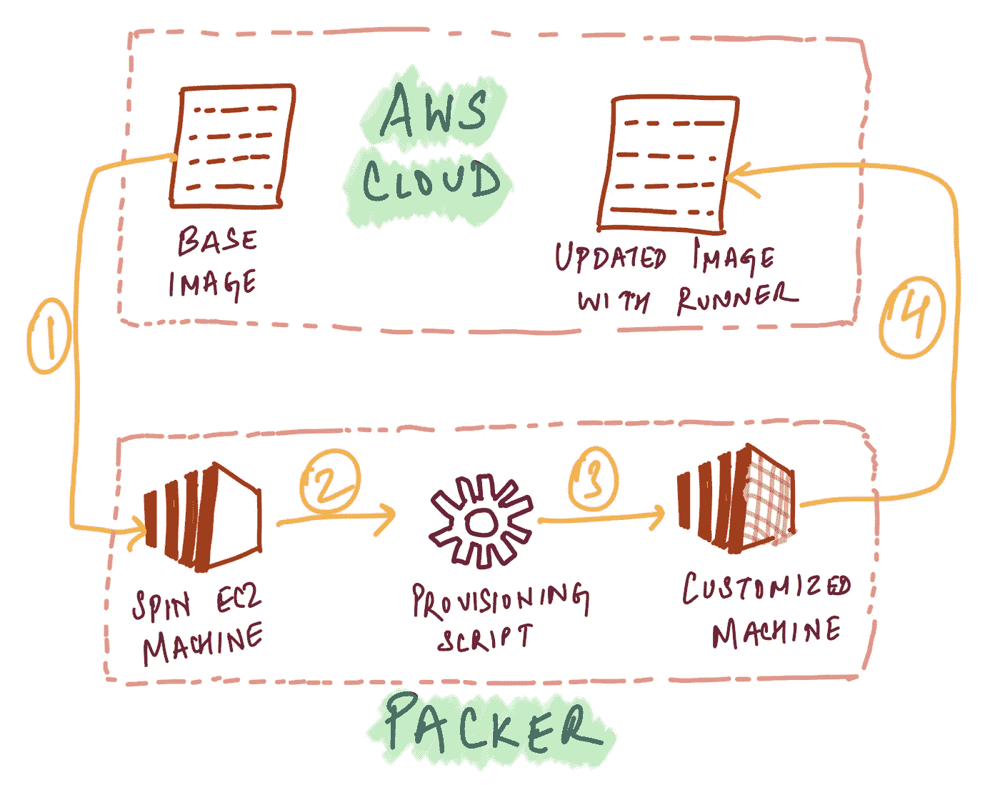
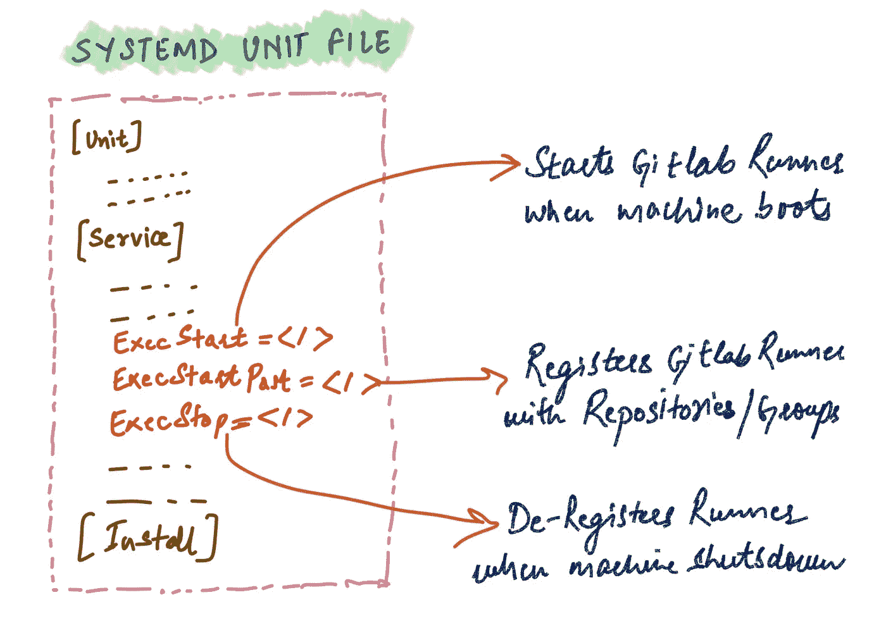
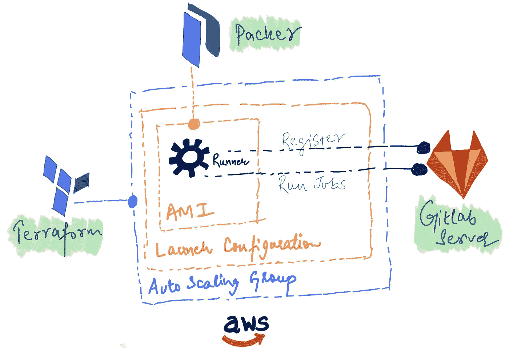

# AWS 中 GitLab 运行程序的参考架构

> 原文：<https://betterprogramming.pub/reference-architecture-for-gitlab-runners-in-aws-829c45f857ed>

## 建立一个经济高效的自动化 GitLab Runner 设置


照片由[沙哈达特·拉赫曼](https://unsplash.com/@hishahadat?utm_source=unsplash&utm_medium=referral&utm_content=creditCopyText)在 [Unsplash](https://unsplash.com/s/photos/software?utm_source=unsplash&utm_medium=referral&utm_content=creditCopyText) 拍摄

在本文中，我希望分享一个在自动缩放环境中运行 AWS 中的[git lab](https://about.gitlab.com/)runner 的参考架构。下面的内容假设您对 [Terraform](https://www.terraform.io) 、 [Packer](https://www.packer.io) 、AWS EC2 和 GitLab CI 有所了解，但是如果您不知道其中的一些内容，那么这个想法应该还是很容易理解和实现的。

到本文结束时，您将能够构建一个经济高效的自动化 Gitlab Runner 设置，它可以根据需求进行伸缩，还可以在预定义的时间间隔关闭整个堆栈以节省成本。

# 设置 Amazon 机器映像

在这种情况下，最小的可部署单元是 Amazon 机器映像(AMI)，AWS 中的 EC2 机器需要启动它。

为了从小处着手，可以使用`cloud-init`脚本来安装 GiLlab Runner，设置 Runner 配置，并在机器启动时安装管道作业所需的附加用户域组件。然而，随着依赖性的增加，最初的预热时间可能会受到影响，并导致跑步者在机器准备就绪后的一段时间内不可用。

为了节省时间，我们可以用 Packer 这样的外部工具来自动化 AMI 配置部分。Packer 进一步支持各种构建器——帮助配置管理的供应器。对于这个用例，我们可以简单地使用`shell` provisioner/builder。



带封隔器的定制 AMI

Packer 需要一个 JSON 模板来定义创建定制 AMI 映像的整个周期。在这种情况下，我们可以使用类似于:

packer-build . JSP

```
$ packer build packer-build.json
```

运行上面的命令，然后引导一个临时 EC2 实例，用一个配置脚本(在本例中是`./provision.sh`)对其进行配置，接着将 EBS 卷保存为一个新的 AMI，并销毁临时资源(如 EC2 实例、安全组、SSH 密钥等)。).为了避免连接问题，不要试图在公共子网中启动这个临时 EC2 实例，这一点很重要。

# 安装和配置 GitLab 转轮

为了在这些 EC2 机器上成功运行 GitLab 运行程序和后续的管道作业，我们需要一些基本的二进制依赖、环境设置、配置等。

为了保持事情的可重复性，我们可以在一个 shell 脚本中定义所有的步骤，然后由`Packer`用来准备我们的定制 GitLab Runner AMI，`provision.sh`。它将获得下面的命令列表来安装、配置和准备运行程序——以及它们将注册的存储库。

以上脚本中值得讨论的部分是`SystemD`单元文件中的触发器`ExecStart`、`ExecStartPost`、`ExecStop`。

这些作为机器事件的钩子，我们用它来启动、注册和取消注册 GitLab 组/项目的运行者。这很重要，因为稍后我们将添加在下班时间关闭整个运行器集群的功能(通过使用自动缩放组中的调度)，并且实例需要从 GitLab 中删除运行器绑定(否则，它们将留下陈旧的关联)。



# 具有 Terraform 的计算基础架构

既然定制的 AMI 已经准备好从管道中启动和执行 GitLab 作业，那么是时候用启动配置和使用 Terraform 的自动缩放组来包装我们到目前为止创建的对象了。

首先，我们可以将启动配置定义为:

启动 Packer 创建的 GitLab AMI 的配置

上图中的`image_id`是指 Packer 生成的 AMI。

接下来，我们可以定义基于启动配置的自动扩展组。

地形结构

# 成本优化

你可能不需要跑步者一直在跑。为了节省一些钱，可以在预定义的时间关闭集群。

自动缩放计划的地形配置

这样，跑步者将在工作日晚上 7:30 停止跑步(并在周末继续下降)，然后在周一早上 6:30 再次开始跑步

此时，体系结构/工作流的完整概述如下所示:



完成工作流程

我希望这能为您提供一个思路和参考架构，以进一步扩展您的特定用例/需求。

进一步的改进可以基于由 CPU 使用等负载需求驱动的自动伸缩功能。

本文到此为止。下次见， *tschüss！*