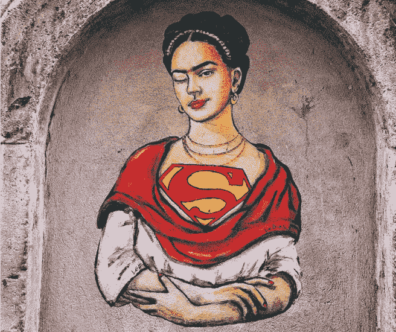

# 关于性别平等的思考

> 原文：<https://betterprogramming.pub/reflection-on-gender-equality-3c557bb4bd77>

## 态度的形成

维罗妮基·忒提丝·切里奥提在 T2 的 Unsplash 上拍摄的照片。

最近，我作为小组成员参加了阿达·洛芙莱斯日的在线网络研讨会，庆祝女性在科学、技术、工程、艺术和数学(STEAM)领域取得的成就。这个活动是由当地的一所大学组织的，我被邀请和其他同事一起参加。该活动的目的是提高 STEAM 女性的形象，并在此过程中树立新的榜样，鼓励更多女孩投身 STEAM 事业。我们的观众主要是大学生，尤其是年轻女性。

在网上研讨会结束前的公开提问环节，学生们希望更多地了解工作场所的性别平等。他们问了一些问题，比如“在一个大多数成员都是男性的团队中，你是如何应对工作的？”以及“你如何在一个由男性主导的领域取得成功？”

老实说，我不知道如何回答这些问题，也从未想过这些年来我是如何度过的。是的，作为一个公司中为数不多的女性之一(曾经是一个超过 72 名男性的公司中的三分之一)以及一名外国人，我有着丰富的经验。只是在过去几年里，我才接触到工作中的性别平等。然而，我努力回答这些问题。谢天谢地，小组的其他成员救了我。

所以，让我后退一步，反思这个特殊的主题，并试图找出为什么这个问题困扰着我。

我来自拉丁美洲。我在“大男子主义”的文化中长大。小时候，许多人告诉我，女人不需要学习，因为她们的角色是在家照看孩子，而男人出去工作以养家。尽管许多妇女获得了大学学位，但文化上的共识是妇女应该呆在家里，最好是丈夫养家糊口。

然而，我的母亲从小就教导我和我的姐妹们挑战女性的那些期望。她鼓励我们学习，以便成为独立的女性，不让任何人控制我们的生活。因此，我在面对和挑战大男子主义文化的环境中长大，周围都是非凡的女性，比如我的母亲、朋友和老师，她们鼓励我超越大男子主义文化的刻板印象。

我妈妈是我的榜样。她是一个坚强而鼓舞人心的女人，经历了起起落落，但最终证明了——不仅向男人，也向所有人——她也可以成为一个独立、成功的女人。

我妈妈的故事就是一个坚持不懈努力的例子。18 岁时，她嫁给了她的第一个男朋友，随后怀上了她的第一个孩子，但她仍然设法从国立大学获得了特殊教育教师学位。不幸的是，她从来没有机会在她的研究领域工作，因为在与她的第一任丈夫分开后，她遇到了我的父亲，我也差不多在那之后出生了。因此，我妈妈成了全职妈妈，最终在我爸爸去工作的时候照顾了四个孩子。我父母的婚姻有起有落，但随着时间的推移，很明显他们不能再生活在一起了。这种情况变得更加糟糕，我母亲决定离开。我父母在我八岁的时候离婚了。

那年夏天，我妈的理想家庭毁了。但同时，她看到了重塑生活的机会。她上了一所夜校，获得了两个文凭:一个是商业管理文凭，另一个是人力资源文凭。她找到了一份秘书的工作，并一步步升到了最高层。

我母亲鼓励我，但我在与我的文化冲突中长大。我从来都不符合大男子主义文化对女性的刻板印象，很多人对此并不认同。我被推开了。所以，我开始梦想能够去看看这个世界，去一个不同的地方旅行——也许是一个和我观点相同的地方。

最终，我的职业生涯给了我在不同国家旅行、生活和工作的机会，但我看不出性别平等仍然是一个问题。在职场上，我从来不觉得自己是为数不多的女性之一很奇怪。我觉得这很正常。也许是因为我习惯了吗？还是因为这足以让我觉得我属于某个地方，远离大男子主义文化？在我看来，对我的家人来说，我能够在我的留学领域工作已经是一个成功了。也许这种成就感帮助我克服了作为女性在工作中遇到的许多挑战。我总是想，“如果我在这里，那是因为我和这些人一样好。我们都是人。我们俩都有能力。”

当然，很多时候我的同事穿在我身上。几年前，在一家工程公司工作时，我在午餐时提到我正在与严重的偏头痛做斗争，我的一位男同事说:“那是因为你是女人，你没有孩子。生个孩子，然后偏头痛就好了。”他笑着走开了。我站在那里想他是个多么白痴的人，而我的其他男同事则绝望而匆忙地吃完了午饭。我从来没有让这个评论和其他许多评论让我失望。我一直努力成为一名职业球员。

我愿意认为生活已经让我做好了最坏的打算，但事情并没有那么糟糕。

回到最初的问题:在一个大多数成员都是男性的团队中，你是如何应对工作的？你是如何在一个历来由男性主导的领域取得成功的？

这是我希望那天给学生的答案:最终，唯一重要的事情是你有正确的态度，你相信自己，并努力接受摆在你面前的好建议，同时忽略那些反对者和那些坚持过去想法的人的消极态度，就像新的明天的曙光一样。