# 回归、机器学习和 Python

> 原文：<https://betterprogramming.pub/regression-in-machine-learning-c733cac6fcbc>

## 让我们建立一个使用回归的模型

里卡多·戈麦斯·安吉尔在 [Unsplash](https://unsplash.com/s/photos/pattern?utm_source=unsplash&utm_medium=referral&utm_content=creditCopyText) 上的照片

一、什么是*回归*？

**回归**是一种用于金融、投资和其他学科的统计方法，试图确定一个因变量(通常用 Y 表示)和一系列其他变量(称为自变量)之间关系的强度和特征。你可以查看[这里](https://www.investopedia.com/terms/r/regression.asp)更深入的定义。

在统计学中，线性回归是一种建模标量响应(或因变量)与一个或多个解释变量(或自变量)之间关系的线性方法。只有一个解释变量的情况称为简单线性回归。

# **学习目标**

在本文结束时，您将了解到以下内容:

1.  回归中的一些术语
2.  对回归背后理论的深入探究
3.  如何做一些基本的预处理和数据探索
4.  回归算法的类型以及如何实现它们
5.  回归问题中使用的一些评估指标

# ***先决条件***

1.  你有机器学习的基础知识。可以查一下我之前的[文章](https://medium.com/@Koikibabatunde1/introduction-to-machine-learning-7697477a5e40)了解一下机器学习的基础知识。
2.  良好的 Python 基础知识，直到函数，是必需的。可以看看这个 [w3 schools python 教程](https://www.w3schools.com/python/default.asp)。
3.  还需要 Numpy 和熊猫的基本知识。你可以看看这个关于熊猫的[黑客地球教程。](https://www.hackerearth.com/practice/machine-learning/data-manipulation-visualisation-r-python/tutorial-data-manipulation-numpy-pandas-python/tutorial/)
4.  高中代数和统计的基础知识是必须的。不要担心，如果你有数学恐惧症，这篇文章会尽可能简单，让任何人都能理解。

# **回归术语**

1.  **功能:**从一组输入到一组可能的输出的关系，其中每个输入恰好与一个输出相关。
2.  **关联**:两个或两个以上事物之间的相互关系或联系。也是变量的相互依赖。
3.  **特征/独立变量:**我们传递到函数中进行预测的变量。
4.  **目标/因变量**:被预测的变量。
5.  统计测试:提供了一种对一个或多个过程进行定量决策的机制。
6.  **简单线性回归:**具有一个特征的回归问题，其中特征和目标之间的关系是线性的。
7.  **多元线性回归:**具有多个特征的回归问题，其中特征和目标之间的关系是线性的。
8.  **非线性回归:**特征和目标之间的关系不是线性的回归问题。
9.  **斜率/权重:**斜率是函数生成的线的“陡度”，也就是俗称的*上升超过运行*。统计权重是增加或减少项目重要性的数量。
10.  **截距/偏差:**是统计技术或其结果的一个特征，由此结果的期望值不同于被估计的真实潜在定量参数。
11.  **回归残差:**在回归分析中，因变量的观测值(y)与预测值(ŷ)之差称为残差(e)。残差=观察值-预测值。e = y — ŷ.残差的和与均值都等于零。

# ***简单线性回归***

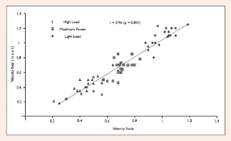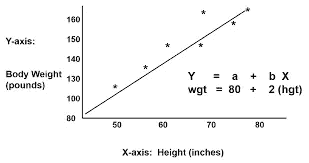

简单线性回归信用[研究门](http://researchgate.net)

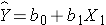

简单线性回归方程

在简单的线性回归中，只有一个独立变量 x1。b 是权重，b0 是偏差。从上面的图表中，我们可以看到，并不是所有的数据点都直接符合这条线；因此，我们有所谓的残余误差。我们知道这个误差的和与均值等于 0。

那么，我们如何知道我们的预测/模型是否是好的呢？我们将在本文的后面讨论这个问题。

# **多元线性回归**

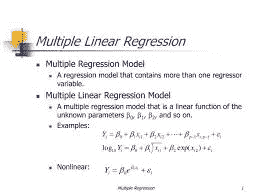

多元线性回归

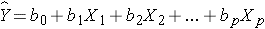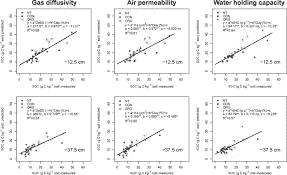

多元线性回归方程

多元线性回归中，自变量 x1，x2，x3，…，xp 不止一个。b 是权重，每个特征分别有自己唯一的权重 b1，b2，b3，…，bp，b0 是偏差。从上面的图表来看。我们可以看到，并不是所有的数据点都直接符合这条线；因此，我们有所谓的残余误差。我们知道这个误差的和与均值等于 0。可以通过这篇[文章](http://sphweb.bumc.bu.edu/otlt/MPH-Modules/BS/BS704-EP713_MultivariableMethods/BS704-EP713_MultivariableMethods2.html)更好的学习 MLR。

在本文的其余部分，我们将使用 scikit learn 库中的波士顿数据集。

我们将使用一些特征来预测房子的价格。这里的目标不是获得非常高的准确性，而是学习如何使用不同的模型进行预测。最后，我们将看看评估指标。

## **1。导入数据**

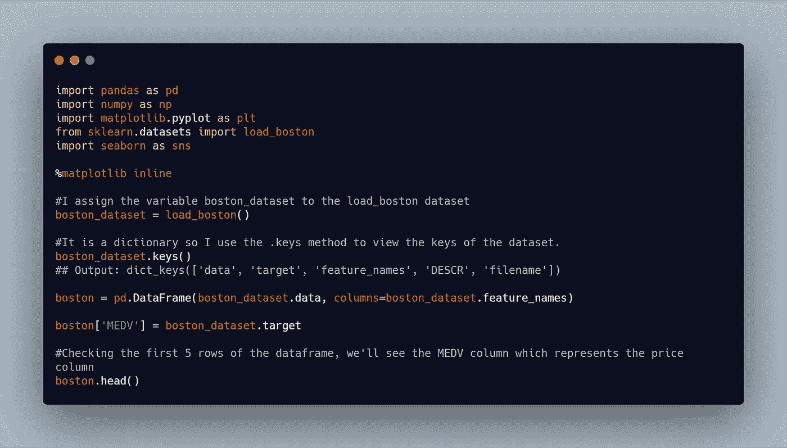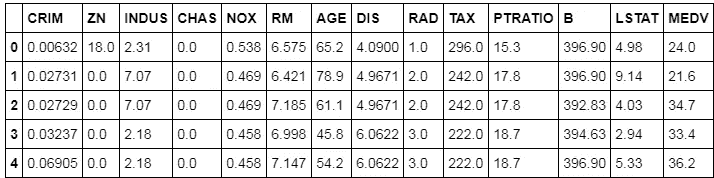

从 **boston_dataset.keys()，**的输出中，我们看到四个值，分别是数据、目标、特征名和描述。所有 sklearn 数据集都是这样构建的。数据代表特性的值，而目标是我们想要预测的值。feature_names 是功能的名称。描述是数据集的一般描述。

描述方法

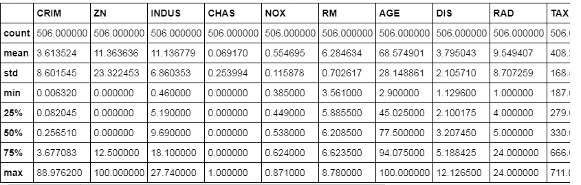

从这个图表中，我们可以大致了解我们的数据是如何分布的。我们可以看到数据的平均值、标准差、计数、最小值、最大值和分位数。这有助于我们确定数据中是否有异常值和其他一些基本数据。

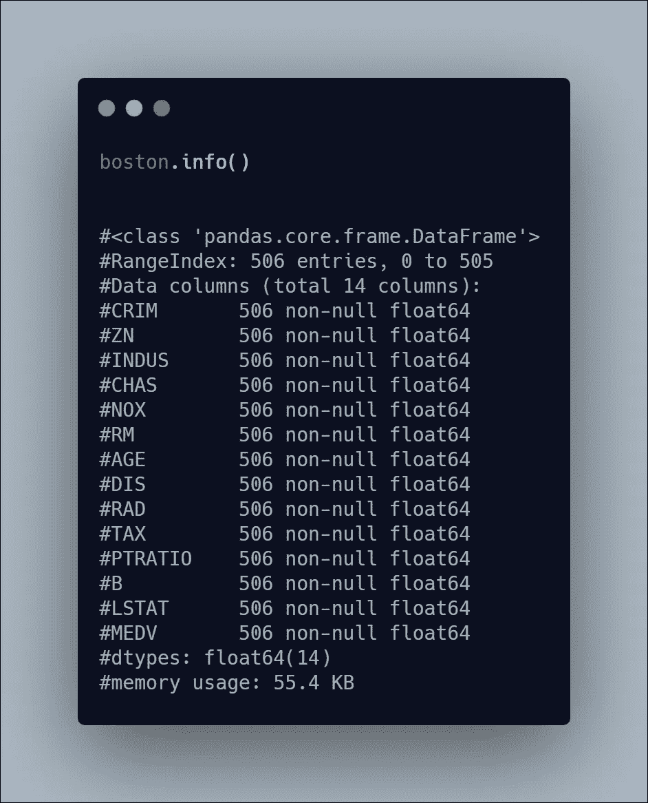

info 方法用于检查是否有缺失值以及数据框的数据类型。它返回非缺失值的计数。注默认情况下，空值由 nan 表示。

# 特征选择和模型选择

从信息中，我们可以看到数据没有任何空值，它们都是浮点型的，因此，回归模型将是此数据的一个好模型。

我将使用海运库中的热图方法来绘制特性和目标变量的相关性图，以了解与我们的目标变量最相关的特性。

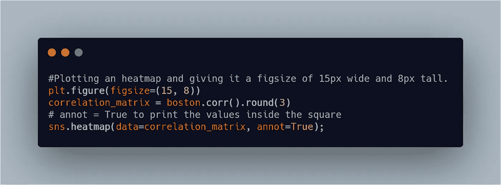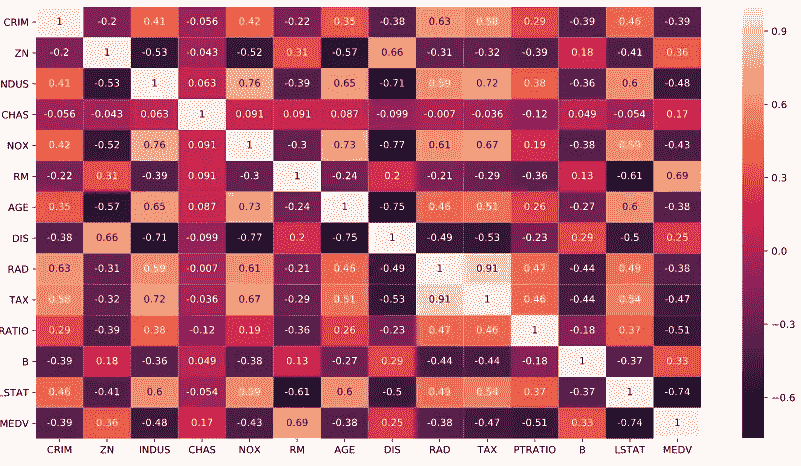

从上面的图中，我们看到特征:RM，LSTAT 与我们的目标变量有很好的相关性。然而，以下特征 CRIM、INDUS、NOX、PTRATIO 也具有相关性，尽管其在 0.3 和 0.49 之间很小。

我们将使用简单的线性回归。

## 回归模型的示例:

1.  [线性回归](https://scikit-learn.org/stable/modules/generated/sklearn.linear_model.LinearRegression.html)
2.  [套索](https://scikit-learn.org/stable/modules/generated/sklearn.linear_model.Lasso.html)
3.  [山脊](https://scikit-learn.org/stable/modules/generated/sklearn.linear_model.Ridge.html)
4.  [随机森林回归器](https://scikit-learn.org/stable/modules/generated/sklearn.ensemble.RandomForestRegressor.html?highlight=random%20forest%20regressor#sklearn.ensemble.RandomForestRegressor)
5.  [决策树回归器](https://scikit-learn.org/stable/modules/generated/sklearn.tree.DecisionTreeRegressor.html?highlight=decision%20tree#sklearn.tree.DecisionTreeRegressor)
6.  [随机梯度下降回归器(SGDRegressor)](https://scikit-learn.org/stable/modules/generated/sklearn.linear_model.SGDRegressor.html?highlight=sgdregressor#sklearn.linear_model.SGDRegressor)
7.  [xgb 回归器](https://xgboost.readthedocs.io/en/latest/python/python_api.html)、 [Cat Boost 回归器](https://catboost.ai/docs/concepts/python-reference_catboostregressor.html)、 [Light GBM 回归器](https://lightgbm.readthedocs.io/en/latest/pythonapi/lightgbm.LGBMRegressor.html)等。

注意:所有这些算法都以类似的方式使用；在本教程中，我将使用其中的三个。

***选择我们的特征和一个目标变量***

接下来，我们将使用简单的线性回归来训练我们的模型，在本文的这一部分，我们将在 sklearn 的 linear_model 模块中实现线性回归、Ridge 和 Lasso。

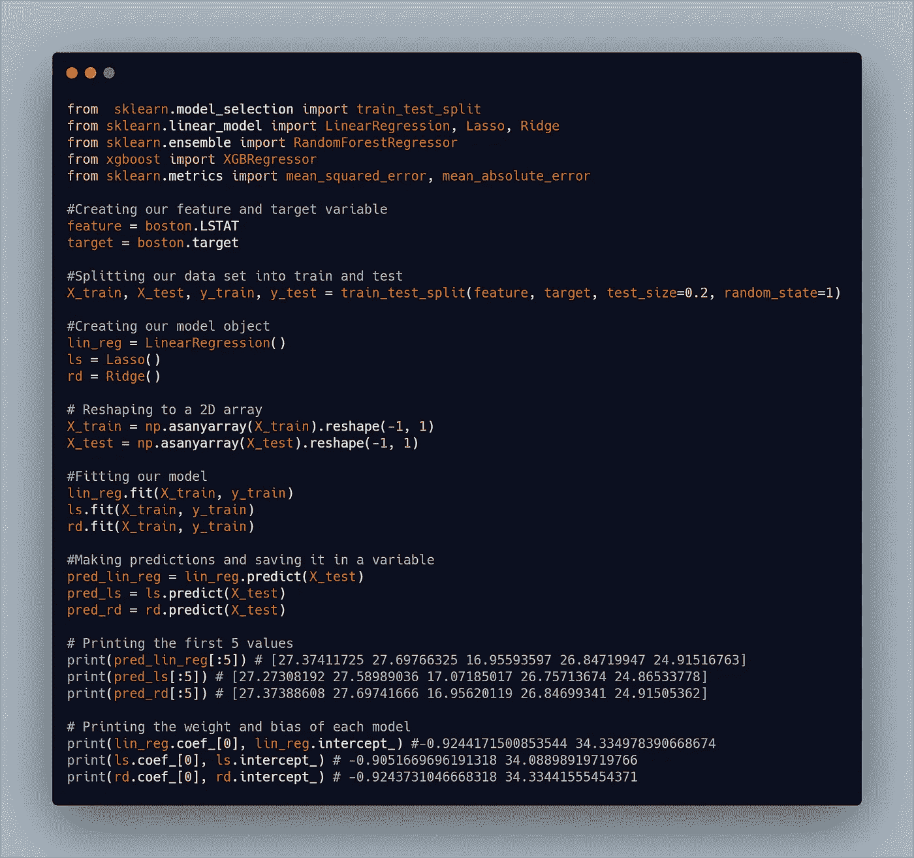

有了这个，我们就建立了我们的模型。为了预测特征为 30 的目标变量，我们需要做的就是 **lin_reg.predict([30])。**如果我们想用套索来预测，我们会有 **ls.predict([30])** 或者 **rd.predict([30])** 如果我们用的是 Ridge。

最后三行返回每个模型的权重和偏差。Sklearn 约定在训练后对对象使用尾随下划线。你可以看到我们从创建我们的对象开始，这个对象接受一些[超参数](https://en.wikipedia.org/wiki/Hyperparameter_(machine_learning))；它有一些默认值，这就是我在这个例子中使用的。然后我们使用**拟合**方法训练模型，然后我们使用**预测**方法进行预测。t 这里还有[分数](https://en.wikipedia.org/wiki/Coefficient_of_determination)，是决定系数。

接下来，我们将使用多元线性回归。

在这种情况下，我将使用 Spearman 等级相关性选择最佳的五个特征。

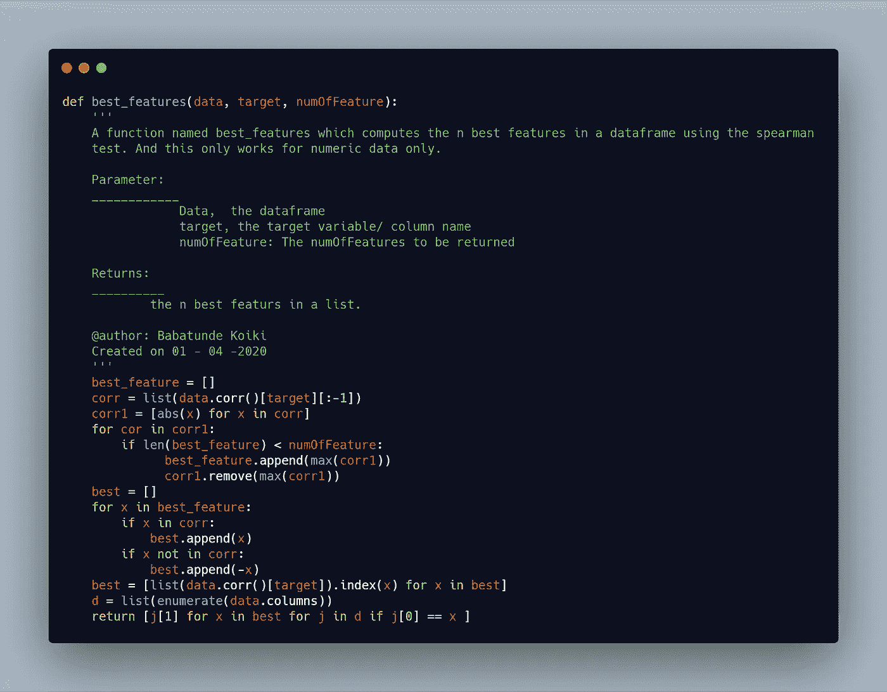

这些函数返回最佳特性。

接下来，我将调用此函数并将其保存为名为“要素”的名称，然后从主数据框创建一个新的数据框。

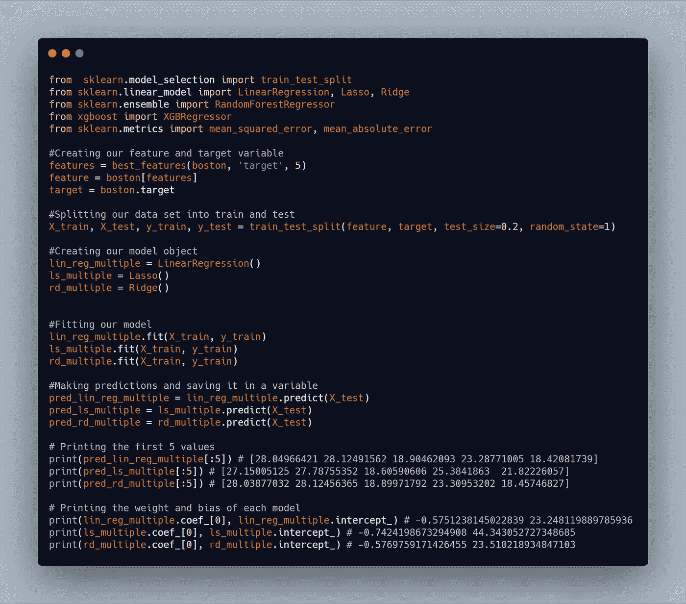

从上面的图表中，我们可以看到预测发生了变化。每当我们建立一个模型时，我们总要做的一件事就是评估我们的模型。我们已经用六种不同的模型做了同样的事情。然后，我们需要从模型评估中选择最佳模型。

## **非线性回归**

在这里，我们将建立非线性回归模型。我将使用随机森林回归和二阶多项式回归。

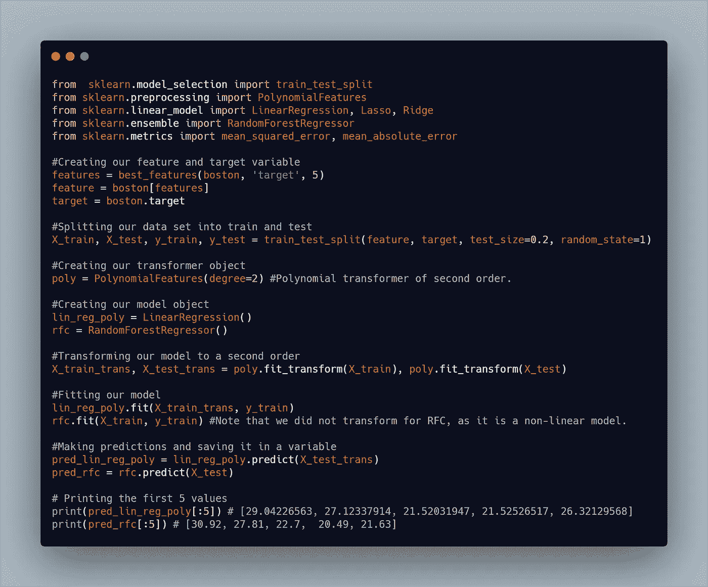

从上面的代码中，我们做了一些类似于我们之前一直在做的事情，但是我们做了一些不同的事情。我们将 X 变量转换为二阶数据，这是我们在训练模型和进行预测时使用的数据。

最后，我们将评估我们的模型并选出最佳模型。

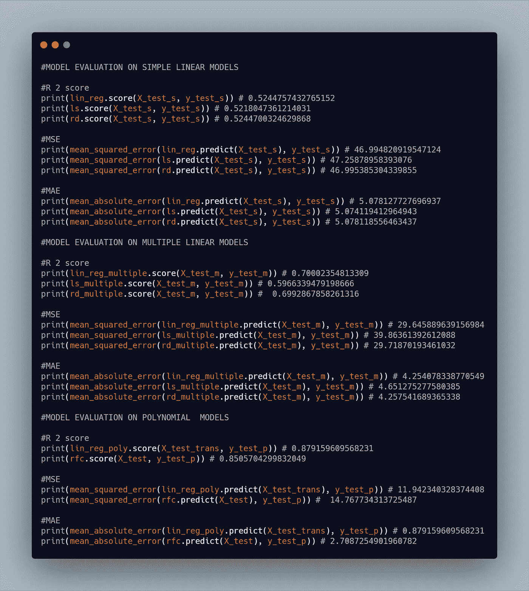

我使用了三个评估指标:均方误差、平均绝对误差和 R2 分数。R2 分数被称为决定系数，最佳值是 1，也可能是负数，但理想情况下，它的范围在 0 到 1 之间。均方误差是预测值和实际值偏差的平方和。最佳值为 0。平均绝对误差是预测值和实际值的绝对偏差之和。最佳值是 0

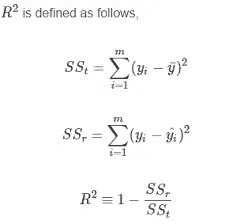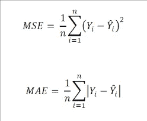

r2 分数、mse 和 mae 的图像。

**根据我们的评估，哪个型号性能最好，哪个性能最差？**

1.  我们最好的模型是使用二阶多项式特征的线性回归。
2.  我们最差的模型是带有一个特征的套索。

# **结论**

本文带您构建了八个模型，并从中挑选出最好的。模型评估是模型开发中的一项重要工作。

本文的目标不是调优模型使其变得更好；因此，我使用了默认的超参数。

感谢阅读！