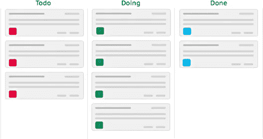
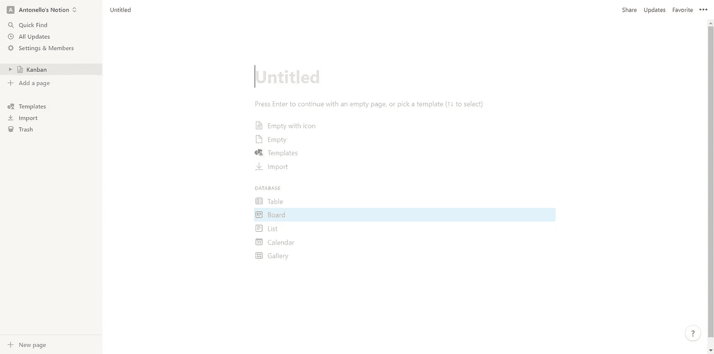
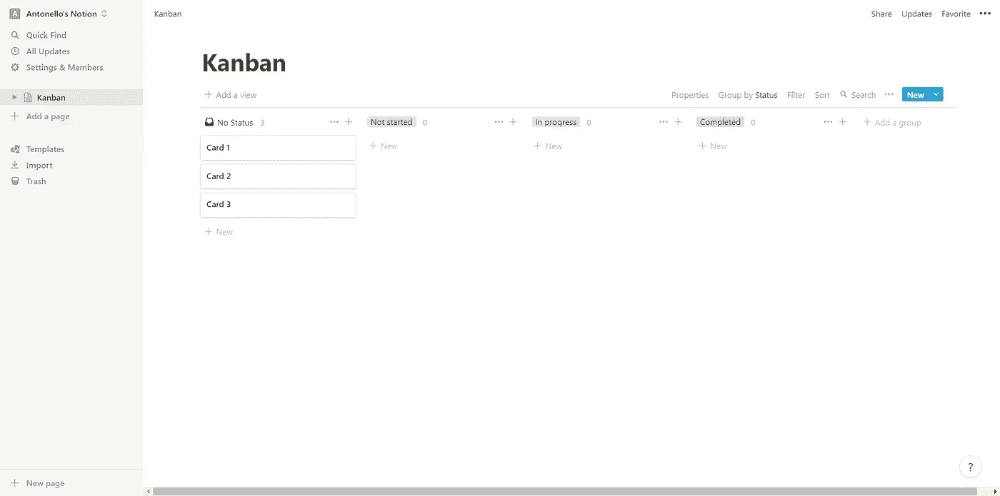
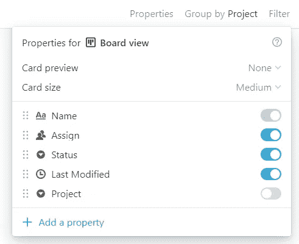
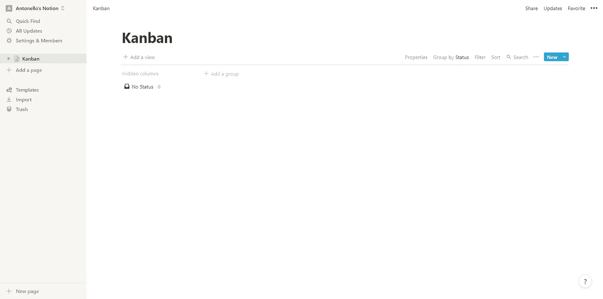
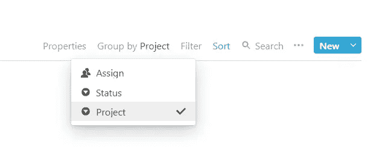
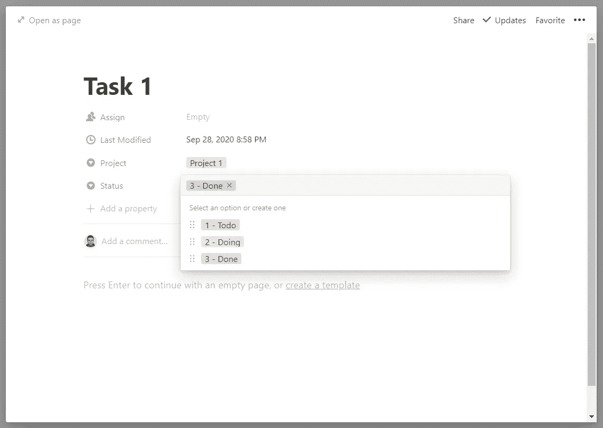
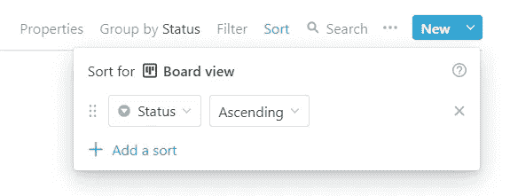
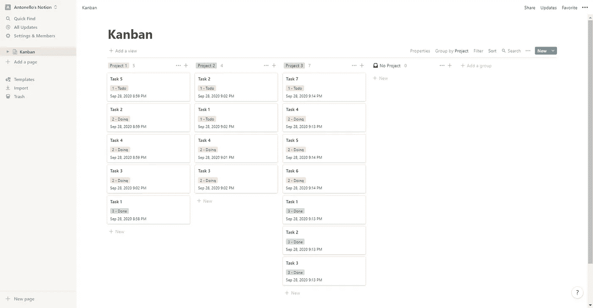

# 用概念重塑看板

> 原文：<https://betterprogramming.pub/reinventing-kanban-with-notion-2586bb187638>

## 使用这个基于看板的模板提高您的生产率

在 [Unsplash](https://unsplash.com/s/photos/productivity?utm_source=unsplash&utm_medium=referral&utm_content=creditCopyText) 上由 [Mounzer Awad](https://unsplash.com/@mounzaw_?utm_source=unsplash&utm_medium=referral&utm_content=creditCopyText) 拍摄的照片

自从我开始我的数字业务，我一直在寻找方法来成功地组织我的工作。互联网上有很多帮助你完成工作的工具，但只有少数是有效的。我已经使用[观念](https://www.notion.so/259633f812a34126982c28b6cea10fbe)好几个月了，现在我可以说我的工作日程比以往任何时候都更有条理、更整洁。

conception 提供了多种组织项目和任务的方法，但是基于看板的模板改变了我的一切。

在本教程中，我将与你分享如何建立和使用这个模板。我希望你能利用我的建议，并把它们整合到你自己的工作安排系统中。

# 什么是看板？

看板是一个日语单词，意思是招牌或广告牌，最初代表一个工业工程师为提高生产效率而设计的调度系统。看板在软件开发中被广泛采用，现在是最流行的敏捷方法之一。

> “看板是一种敏捷项目管理工具，旨在帮助可视化工作、限制在制品并最大化效率(或流程)。看板使用卡片、专栏和持续改进来帮助技术和服务团队投入适量的工作，并完成工作！”— [亚特兰蒂斯](https://www.atlassian.com/agile/kanban/boards)

简而言之，看板是一种简洁明了的方式，可以直观地表现要管理的业务或个人任务，让你更有效率。

# 传统看板是什么样子的？

调度系统中的每个任务都应根据以下三种状态之一进行分类:

*   **待办事项** →想法或计划任务
*   **做** →你正在做的任务
*   **完成** →完成任务

看板板概述

传统的看板非常简单。每个任务由一张卡片表示，在开发过程中，根据其状态，卡片将在三列中移动。

如果你想了解更多关于如何使用看板的知识，我推荐你阅读这篇文章。

# 使用概念设置基于看板的模板

## 1.概念入门

首先，你需要一个概念账户。你可以在这里免费报名:[https://www.notion.so/](https://www.notion.so/)。

如果你不知道如何使用概念，你应该读一读这篇伟大的文章。

要创建新的工作区，请单击“添加页面”给新创建的工作区命名(我称之为*看板*)，我们就可以开始了！

## 2.设置模板

从`DATABASE`选择电路板选项，初始化模板。

选择纸板选项以初始化模板

您的页面应该是这样的:

默认概念的纸板模板

你会注意到，这是看板的完美模板。别忘了我们的目标是彻底改造它，所以让我们开始学习教程吧。

## 3.定义自定义属性

为了成功地改造看板，我们需要两个额外的[属性](https://www.notion.so/Intro-to-databases-fd8cd2d212f74c50954c11086d85997e#a147fc60e45241f58d02dcde5431a577):

*   项目(选择)
*   状态(选择)

我还建议添加以下附加属性:

*   上次修改时间(上次编辑时间)

清理模板，准备重新发明看板！

我们基于看板的模板

# 重塑看板

作为一名自由职业者，我经常同时做几个项目。为了全面了解这些项目的进展，我开始以一种非常规的方式使用看板。

我现在每个项目只有一列，而不是传统的每个项目有三列看板。

如何在一个专栏中总结看板？

感谢观念！让我们看看怎么做。

首先，你要按照项目属性对你的任务进行分组。

按项目属性分组

这意味着每次你点击“添加一个组”来创建一个新的栏目，你就定义了一个新的项目。本质上，每一列代表一个不同的项目。

然后创建您的第一列，并添加一个新任务。定义以下三种状态:

*   **1 -待办事项**
*   **2 -做**
*   **3 -完成**

定义状态值

我建议每个状态值以一个数字开始，代表它的优先级。越低，越高。也可以用颜色来强调。另外，按顺序定义它们是非常重要的，因为概念是按顺序排序的，而不是按值。

现在可以使用 status 属性，而不是根据任务的当前状态将任务分配给三列。按状态升序排列任务，瞧！您刚刚将看板变成了一个单一的概念组。

按状态属性对任务排序

这是最终工作空间的外观:

最终改造的看板板

请注意，如果您只对特定状态的任务感兴趣，您可以使用概念的过滤功能。

我刚才展示的只是一个例子，但是你可以把这个工作安排系统应用到许多其他不同的领域。例如，我用它来组织我的博客，每篇文章用一个专栏。我也在大型项目中使用过，按组件而不是按项目分配任务。

 [## 学习英语如何让我成为一名作家

### 我花了 474 天，但这是值得的

medium.com](https://medium.com/inspired-writer/how-learning-english-turned-me-into-a-writer-19db8e6933f3) 

# 结论

迷失在自己的混乱中会令人沮丧。学会如何有效地使用日程安排系统可以永远改变你的工作习惯。看板是一个非常有用的工具，由于有了这个概念，你可以把它带到下一个层次，正如我已经展示的。

我希望这能帮助你变得更有条理，更整洁，更有效率。如果你有任何意见或建议，请告诉我。