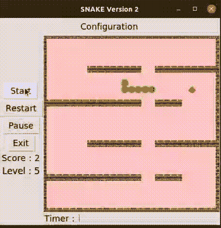

# 重构我 5 年前写的 Python 蛇游戏

> 原文：<https://betterprogramming.pub/reinventing-the-snake-game-on-consistency-best-practices-for-programmers-e457fbb7553b>

## 关于一致性和最佳实践的经验教训

洛伦佐·埃雷拉在 [Unsplash](https://unsplash.com?utm_source=medium&utm_medium=referral) 上的照片

我在 2017 年编写了这个贪吃蛇游戏，大约是在我用 Python 编写第一个 [hello world](https://en.wikipedia.org/wiki/%22Hello,_World!%22_program) 的时候。

5 年后重温这个旧代码库非常有趣。在过度重复的编码模式中混合了模糊的法语变量，更不用说在停车标志上写着“这是一个停车标志”之类的评论了——还记得那个模因吗？为了不背叛年轻时的自己，我发现有相当多的代码不一致和有问题的工程决策。也许我会在 5 年后回顾这篇文章时说同样的话，希望这是以后更多文章中的第一篇。

随着编程成为我的爱好之一，我很快从玩游戏转向了自己开发。这更有趣！我并没有真正发明一个新游戏，大部分是在现有游戏的基础上编写自己的版本。但是为游戏编程意味着深入理解规则，编写规则，甚至有意或无意地(带着 bug)篡改规则。

有时，当我向我的兄弟姐妹展示时，游戏会中断，然后我不得不一次又一次地修复它。这是我的第一步。我仍然相信这是学习编程的最好方法，不是开发游戏本身，而是开发你感兴趣的东西。

解决小问题，然后转向更大的问题，这些问题通常只是一堆小问题的组合。就我而言，我从编写这些小游戏转向了自动化工具、商业软件和网站，现在在 [mdoc](http://mymdoc.com) 探索数据世界。

够了，漫长的前奏。在第一篇文章中，我们将回顾我以前的贪吃蛇游戏。这是我成长过程中的最爱之一。规则很简单:移动一条蛇吃一些水果，避免墙壁，获得积分和增长。要对此进行编程，您只需:

*   一张空画布
*   一堆图像来组成你的蛇、墙壁和食物
*   一种移动蛇的方法(一堆图像同步移动)
*   一种方法来判断你的蛇的头(一个特殊的图像)是否撞到砖块或它自己，在这种情况下，用户失败
*   一种判断头部是否撞到水果的方法，在这种情况下，蛇吃了水果，另一个水果出现。这里还需要长蛇，可能每吃 2 个水果，蛇就长一个单位。

把所有这些放在一起，我得到了这个:一个非常简单的多层次的贪吃蛇游戏。

当然，这不是最好看的贪吃蛇游戏，但是，嘿，它很有效！现在你可能会问，如果这个游戏有效，它有什么问题？这不就是目标吗？有时候，这是唯一的目标。写一些有用的东西，然后就再也不回来了。然而，在大多数情况下，你需要回来。你会想要添加一些新的很酷的特性，比如一个额外的水果，一个暂停按钮，一个蛇颜色的改变，等等。如果代码基础写得很差，就很难做出任何改变，甚至更难与朋友合作开发你的酷酷的贪吃蛇游戏！

作为一名软件工程师(或任何涉及编写程序的工程职位)，你需要确保你的程序是可维护的:你或其他任何人都可以回来对它进行更改，而不必花一年时间试图理解单个函数的作用。

我在 GitHub 上提供了游戏的旧版本( [snakev1.py](https://github.com/Emmastro/tutorials/blob/master/snake/snakev1.py) )和更新的重构版本( [snakev2.py](https://github.com/Emmastro/tutorials/blob/master/snake/snakev2.py) )。我尽量不改变太多的核心逻辑。我主要改变了架构和模式，使程序更易于维护。我还在途中修复了几个 bug，并将整个源代码翻译成了英语——这并不是说用法语写作是一个糟糕的决定。我在旧代码中发现的一些主要问题是一致性、模式、遵循惯例和使用最佳实践。

> ***你不该记住小事。***

我甚至不能开始思考我在小学的时候把校服放错了多少次。我的脑子就是不明白，如果制服可以放在椅子上，桌子上，甚至是我妈妈的缝纫机上，为什么要大费周章地把它放在壁橱里。除了因为我的衣服到处都是而惹上麻烦之外，第二天早上找到它们变成了寻宝。有一个地方放我的制服不仅让房子变得更有条理，或者至少让我和爸爸妈妈相处得更好，它还让我省去了记着我把它们放在哪里的麻烦。

你不应该记住一些小事。任何人都不应该。你不需要记住你的变量名或大小写，文件位置，函数大小写等等。你不应该问自己这样的问题:我给蛇头起的名字是`HEAD`还是`head`？或者是`head_image`还是`headImage`？或者甚至从`head`开始，我发现用 *h* 指代`head`更容易吗？

与这些小事和平相处的一个方法是遵循惯例。我记得在我早期的时候，我经常跳过这些，它们对我来说很无聊。我以前只看这本书有趣的部分。

不遵循惯例意味着创造习惯和模式，不管是好的还是坏的，但是很可能与*“行业标准”*——基本上是其他开发人员所做/使用的东西不一致。遵循惯例，或者至少不要偏离太远，即使你有很好的理由这样做，会让你避免很多麻烦。

给你的变量取一个你不需要记住的名字。

旧代码片段:

snake1.py

从这个片段，到现在，我都分不清`self.flmenu`上的`fl`是什么意思，好尴尬！还有你看到`men`了吗，是`Menu`的简称？你看到那个骆驼案试图在蟒蛇案中找到自己的位置了吗？

重构版本:

snake2.py

在这个版本中，我们不需要记住`men`代表`menu`，我们有这个菜单用于配置的上下文。

另外，我们的配置菜单按钮现在是`config_menu_button`，而不是`flmenu`。现在，有了一个带自动完成功能的好的编码编辑器，当你需要你的配置菜单按钮时，你可以肯定它会准确地推荐你在写配置或菜单的前几个字母时选择的变量。如果适合你的上下文，你可以构建更多的模式，比如用`menu_`作为你所有菜单的前缀。

在你的命名中创造一致的模式。

旧代码:

snake1.py

重构版本:

constants.py

在这里，我不仅减少了与案例和文件名的不一致，而且代码也更简洁了！我用 2 行而不是 10 行来加载我所有的图像，并且可以通过在列表中添加图像名称来轻松加载更多的图像，只要我与文件名和扩展名保持一致。

在新版本中，我使用 [dictionary comprehension](https://towardsdatascience.com/10-examples-to-master-python-dictionary-comprehensions-7aaa536f5960) 来填充一个字典，它将保存我的图像对象的所有实例，并以文件名(不带扩展名)作为字典键。

现在，要访问一个图像，而不是像前面的方法那样引用它的变量，我需要引用带有图像名称作为键的`photo_images` 属性。

第一种方法并不太坏，尤其是加载的图像数量很少。简单的变量声明，仅此而已。然而，第二种方法强化了一致性的思想，并在不牺牲可读性的情况下使代码更短。

它还为将图像名称的声明从主程序逻辑中分离出来提供了空间。这里，我们在 constants.py 上将它们声明为常量，使程序[更加模块化](https://medium.com/@scott.waring/use-modular-programming-to-improve-your-code-and-life-5a25c98feaa0)。

> 编写单一用途的函数

旧代码:

重构版本:

在这里，编写函数的最佳实践有一个明显的中断。该函数的第一部分是初始化棋盘，第二部分试图在棋盘的空白处放置一个水果。

一个好的函数应该只完成一项任务。在这种情况下，它应该只准备板。如果你仔细检查整个代码库，你会发现还有一些地方需要重新设置水果的位置，比如当蛇吃水果的时候或者当你重启游戏的时候。

这意味着我必须重复这个特殊的逻辑。准确的说是 4 次。这不仅使代码库不必要地变大，而且也使维护变得更加困难。当我需要改变水果摆放的方式时，我需要在 4 个不同的地方进行改变！这里的最佳实践称为 [DRY(不要重复)](https://en.wikipedia.org/wiki/Don%27t_repeat_yourself)鼓励编写没有重复逻辑的代码。

希望你能注意到新版本中更多的改进，或者更好地，在新版本中找到改进的机会。几乎总是有可以改进的地方，可以添加的东西。一些需要阅读和理解的东西。

一些需要可读性和可理解性的东西——最好是容易理解的。我希望，如果那时你是一名开发人员，你有一个不会给你带来太多麻烦的代码库。如果你不是一名开发人员，并且已经做了这么多，希望这也能应用到你的工作中。

也许让你的孩子或弟弟妹妹不要乱放他们的校服，或者在你做的任何事情上创造更多的模式，让世界变得更美好，希望有更少的事情需要记住。毕竟，谁喜欢记东西呢？