# 隆重推出 Aurora 无服务器 V2——关系数据库 API

> 原文：<https://betterprogramming.pub/relational-database-apis-on-steroids-8f31c0ea58dc>

## 极光无服务器 V2 初探


AWS 终于发布了姗姗来迟的极光无服务器 v2！最新和最伟大的随需应变关系数据库来统治他们。

该数据库非常适合高度不可预测的工作负载，这些工作负载需要快速增加和减少。

我决定使用 Aurora 无服务器 v2 有两个主要原因，第一是它可以*扩展*。当你知道它能处理你扔给它的任何东西时，你内心的平静值得一文。

在我们的案例中，作为一家初创公司，您需要提供企业级的质量，以有效地与拥有更多劳动力和资源的公司竞争，Aurora 无服务器 v2 的出现恰逢其时。

受增强的扩展能力直接影响的第二个优势是更细粒度的支出。此外，与 Aurora v1 相比，v2 可以在运行 SQL 语句的同时进行扩展，这在自发的连续工作负载期间非常有用。

# 无服务器堆栈框架

为了补充 Aurora v2 的高度可伸缩性和连续可用性，我们使用了一个有些被低估的框架，即无服务器堆栈框架。

它建立在 CDK 之上，该框架的核心优势之一是允许开发人员在开发过程中进行热重装。该框架的底层机制将在本文后面详细解释，但是为了让 SST 能够很好地与 Aurora Serverless v2 配合，您需要部署一些额外的基础设施，以便它能够正确地(并且安全地)与托管在私有 VPC 中的资源一起工作。

# 建筑

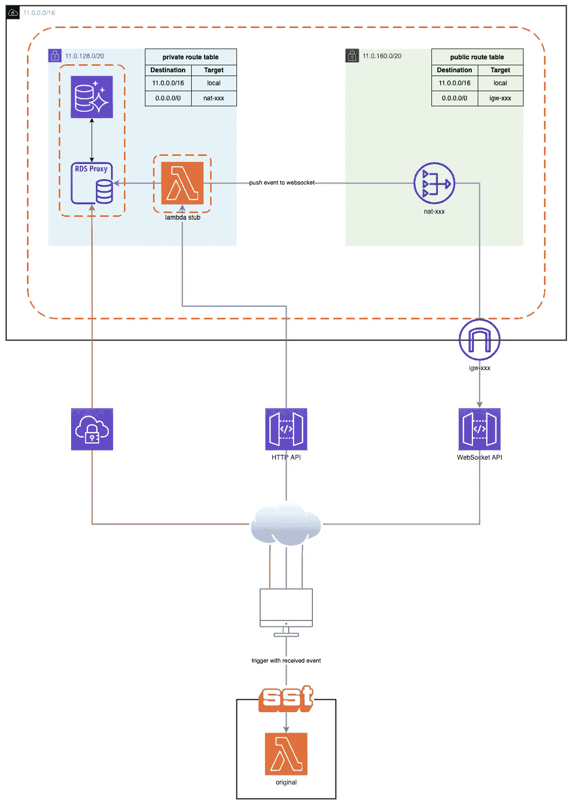

高层架构

# 使用 SST 创建新项目

```
$ npm init sst
```

选择一个模板(我选择了 JavaScript starter)并安装依赖项。

```
$ cd my-sst-app && npm i
```

打开位于项目文件夹根目录下的`sst.json`文件，修改区域(如果需要)，并部署应用程序。

```
$ npm start
```

将 stage 设置为 dev，选择一个 profile，或者设置`AWS_PROFILE`，就可以了！

## 调试堆栈

除了部署 starter 应用程序(如`MyStack.js`中所定义的)，SST 还将部署一个 stub Lambda 和一个 WebSocket API。这个 Lambda 函数通过 WebSocket API 将事件从云中转发到本地环境。图中的蓝色和绿色路径显示了这个开发周期的流程。

部署完成后，您应该会在终端上看到以下提示。

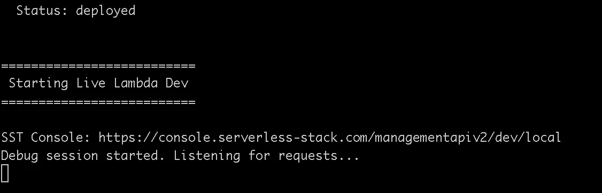

这意味着一切都已成功部署，SST 正在监听来自存根的传入请求。

在 AWS 控制台中，导航到新部署的 API 并调用它，您应该会在浏览器中看到以下消息。

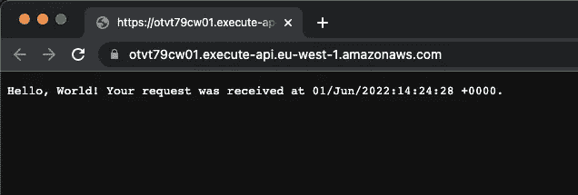

打开您的终端，您应该会看到以下传入消息。

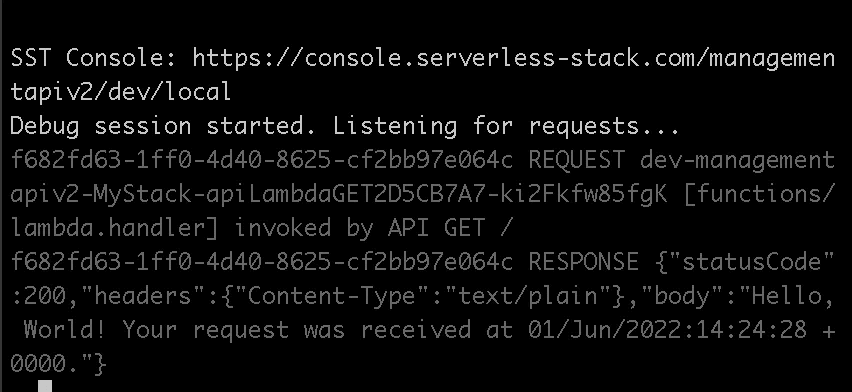

显示在终端上的日志是通过用一个源自存根的事件在本地调用 Lambda 而生成的。

恭喜你！简单的部分已经完成，是时候用 **Aurora 无服务器 v2** 设置我们的 VPC 了。

# 创造一个 VPC

我们正在建立一个至少有两个**私有**子网的 VPC，两个子网都在不同的可用性区域。在私有子网中部署 RDS 实例是保证数据库安全的最低要求。

**名称:** myVPC

*   **VPC CIDR 范围:** 11.0.0.0/16 = 65536 个 IP 地址。
*   **范围:** 11.0.0.0 到 11.0.255.255

# 创建子网

创建两个专用子网并将其连接到 VPC，两个子网需要位于不同的可用性分区中。

两个子网的 CIDR 范围都是/20，这意味着每个子网可以有(2^(32–20))= 4096 个 IP 地址。

**子网 A**

*   **名称:** myVPC-subnet-private1- <区域> -1a
*   CIDR
*   **范围:** 11.0.128.0 到 11.0.143.255

**子网 B**

*   **名称:** myVPC-subnet-private2- <区域> -1b
*   CIDR
*   **范围:** 11.0.144.0 到 11.0.159.255

# 创建安全组

为您的 Lambda 函数创建一个新的安全组，将其链接到 Aurora 的安全组(稍后将创建)。创建一个允许所有流量进出安全组的规则，并导航到相应的 Lambda 函数。

# 创建无服务器 Aurora V2 实例

**数据库创建方法:**标准创建

## 发动机选项

*   **引擎类型:**亚马逊极光
*   版本:我用的是 MySQL，但是你可以用任何你想用的。
*   **复制:**我选择了单主机设置，因为在我的用例中不太需要连续写入。
*   **引擎版本:**在撰写本文时，Aurora MySQL 3.02.0(兼容 MySQL 8.0.23)是唯一可用于 MySQL 的无服务器 Aurora v2 的版本。

## 设置

命名您的数据库集群，选择/生成您的数据库凭证，并将它们存储在 AWS Secrets Manager 中(RDS 代理需要)。

## 实例配置

**数据库实例类:**无服务器

## 容量范围

在撰写本文时，0.5 是您需要为无服务器 V2 配置的最小容量。

确定您的应用程序所需的容量范围，对于我的使用案例，我预计不会有大量自发的传入流量，因此我将使用最低的 ACU 容量。

这意味着 Aurora 将向下扩展到 0.5 个单位，并向上扩展到最大 16 ACU，鉴于 Aurora v2 的快速扩展能力，这完全没问题。

## 可用性和耐用性

一般来说，建议在不太可能发生的可用性区域中断或故障的情况下，为生产准备一个多 A-Z 设置，但我不会将此功能用于一般开发，因为这会产生较高的月成本。

## 连通性

*   **VPC:** 选择之前创建的带有相应私有子网的 VPC。
*   **公共访问:**选择“否”。
*   **子网组:**创建或选择一个现有的子网组。
*   **VPC 安全组:**创建一个特定于您的 Aurora 实例的新安全组。
*   **可用区域:**无偏好

# 数据库认证

我启用了密码*和* IAM 数据库认证，因为我将对我们稍后部署的 RDS 代理使用 IAM 认证。

# 附加配置

您可以在很大程度上保留默认配置，但是我强烈建议启用审计/错误/常规和慢速查询日志。

创建数据库！

# 更新安全组配置

我们需要更新安全组，以允许 Lambda 与实例通信。添加入站规则，如下所示。

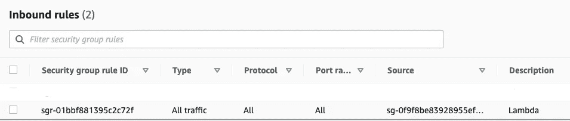

# 创建 RDS 代理

## 为什么要使用 RDS 代理

鉴于 AWS Lambda 的无状态和短暂特性，让 RDS 代理管理数据库连接池是一个最佳实践。如果没有必要，我们不想在 Lambda 函数中管理它。

## 代理配置

*   **代理标识符:**命名代理(实例的名称)。
*   **引擎兼容性:** MySQL
*   **TLS:** 真
*   **空闲客户端连接超时:**高度依赖于您的应用程序的需求，但我已经将我的设置为 2 小时。

## 目标组配置

*   **数据库:**选择之前创建的数据库。
*   **连接池最大连接数:** 100%

## 连通性

*   **机密:**使用数据库凭证选择先前创建的机密。
*   **IAM 角色:**创建一个 IAM 角色(这是用于访问机密的 IAM 角色)。
*   **IAM 认证:**必需(这意味着您只能使用 IAM 认证通过代理访问数据库)。
*   **子网:**选择之前创建的私有子网。
*   **VPC 安全组:**选择之前创建的安全组。
    启用增强日志记录。

# 设置客户端 VPN 端点

与 VPC 中的私有托管资源进行安全通信的最佳方式之一是设置客户端 VPN 端点。

## 创建用于相互身份验证的证书

就本文而言，我将使用基于证书的双向认证方法。这很容易设置，但是如果您想要管理大量用户，这可能会很麻烦。

在创建 VPN 之前，我们需要创建证书并将它们存储在 ACM 中。→[https://docs . AWS . Amazon . com/VPN/latest/client VPN-admin/client-authentic ation . html # mutual](https://docs.aws.amazon.com/vpn/latest/clientvpn-admin/client-authentication.html#mutual)

## 细节

**名称:**客户端-VPN-端点-1

## CIDR 山脉

这不能与为 VPC 设置的 IP 范围重叠。

例子

*   CIDR
*   **范围:** 192.168.128.0 到 192.168.131.255

## 连接日志记录

建议记录客户端的连接详细信息，但这不是必须的，日志显示入口和出口、客户端 IP 和设备 IP，非常有用，但不是强制性的。

创建一个日志组并将其附加到 VPN。

## 证明

客户端和服务器证书应该已经在前面的部分中创建好并上传到 ACM。选中相互身份验证选项，并从下拉列表中选择服务器和客户端证书。

**传输协议:**选择 UDP
启用分割隧道(不允许所有流量通过 VPN)。

## 联想到 VPC

选择以前创建的 VPC。
**VPN 端口:** 433

就是这样！创建 VPN 端点。创建后，它将处于待定关联状态，但会很快变为可用状态。

## 关联子网

转到目标网络关联选项卡，关联之前创建的专用子网。

# 创建安全组

*   创建允许来自连接客户端的所有 UDP 通信的入站规则。
*   创建允许连接到安全组的所有网络接口之间的 TCP 连接的入站规则。

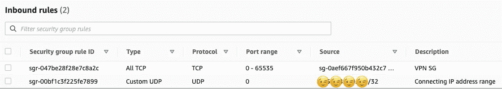

# 授权规则

由于我们使用相互认证，我们只能允许所有用户访问。

定义通过此 VPN 连接的客户端可以访问的 CIDR 范围。

*   11 . 0 . 0 . 0/16(VPC 的所有资源)

# 下载 VPN 客户端

**AWS 客户端:**[https://aws.amazon.com/vpn/client-vpn-download/](https://aws.amazon.com/vpn/client-vpn-download/)

# 设置您的个人资料

从控制台下载客户端配置文件，并将它们存储在安全的地方。

在您的编辑器中打开配置文件，并将证书和密钥(在证书下方，紧接在标签之后)添加到文件中。

例子

*   `cert ~/.vpn/certificates/client1.domain.tld.crt`
*   `key ~/.vpn/certificates/client1.domain.tld.key`

保存并添加配置文件到 VPN 客户端和连接！

# 测试您的 VPN

第一阶段已经完成，您应该能够使用数据库客户机连接到您的数据库。

# 允许来自 VPC 内资源的出站流量

默认情况下，存根不会部署在您的 VPC 中。我们需要对它进行配置，以便它可以访问数据库，并从您的私有子网内将事件推送到 WebSocket。

# NAT 网关

## 创建公共子网

**VPC:** 选择之前创建的 VPC

**公共子网 A**

*   **名称:** myVPC-subnet-public1- <地区> -1a
*   CIDR:11 . 0 . 160 . 0/20
*   **范围:** 11.0.160.0 到 11.0.175.255

## 互联网网关

创建一个 internet 网关并将其连接到您的 VPC。

## 创建 NAT 网关

*   **子网:**选择之前创建的公共子网
*   **连接类型:**公共
*   **弹性 IP 分配 ID:** 关联新的或现有的弹性 IP 地址

## 路由表

为您的公共子网创建一个自定义路由表，其中包含到 internet 网关的路由。

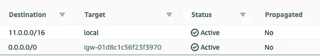

更新您的专用 VPC 子网的路由表，以将互联网流量指向您的 NAT 网关(需要与 NAT 网关在同一个可用区域中)。

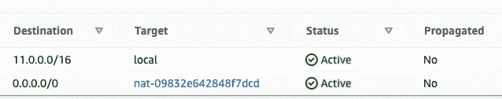

# 最后一程

我们差不多完成了，唯一剩下的事情就是在准备好之前配置一些资源。

## 配置 Lambda 存根

我们需要创建一个具有单一规则的安全组，允许所有流量。

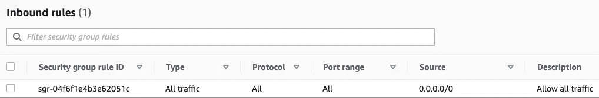

## 添加 VPC 配置

连接之前创建的 VPC 和安全组，并仅添加**一个**专用子网(因为我们只有一个 NAT 网关)。

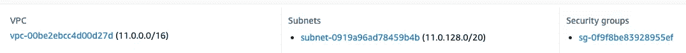

## 更新 Aurora 的安全组配置

使用以下两个入站规则更新连接到 Aurora & RDS 代理的安全组，以允许 Lambda 和连接的 VPN 客户端与数据库实例通信。

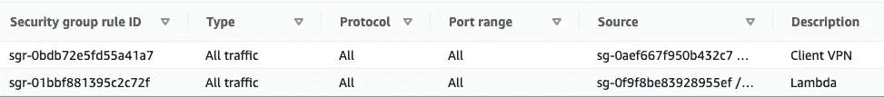

# λ代码

创建数据库连接器。

**Lambda.js**
导入数据库连接器，定义一个简单的处理程序，列出数据库。

## 安装和部署最新的更改

```
$ npm i mysql2 aws-sdk && npm start
```

# 搞定了。

再次调用你的 API，看看这个魔术。