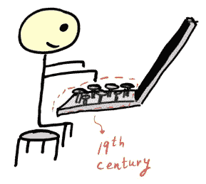
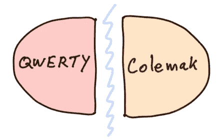
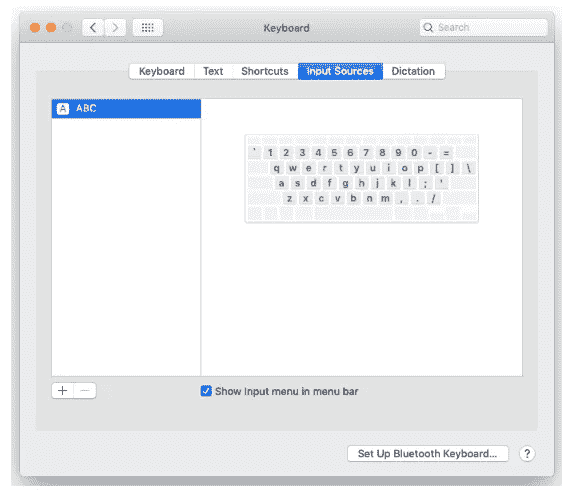
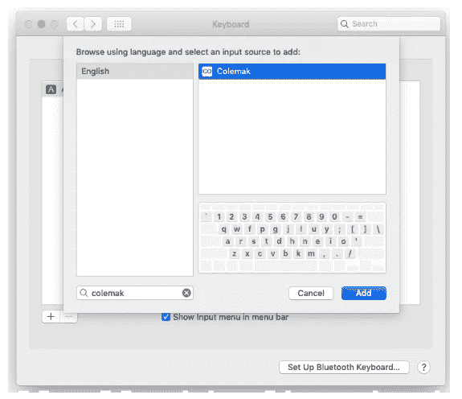

# 重新学习类型

> 原文：<https://betterprogramming.pub/relearning-to-type-3cc9123f7ef0>

## 关于学习新键盘布局的故事

这篇文章最初发表在我的[个人网站](https://gryphon.dev/2019/10/04/relearning-to-type/)

# 简短的历史

超过 99%的计算机用户使用 QWERTY 布局，但您知道 QWERTY 布局是在 1878 年推出的吗？

对，不是错别字。现在是 1878 年！19 世纪。

*   维多利亚女王在位(还剩 20 多年)。
*   计算机那时还不存在。
*   人们家里没有电。
*   忘记家里的电和电脑。
*   人们仍然骑马，因为他们没有汽车。

看看你放在手中的闪亮的 QWERTY 键盘。你看到的是 140 多年前的布局！自从读了那篇文章，我脑海中就浮现出一幅自己用 19 世纪键盘布局的 Mac 电脑工作的画面。

网络上有许多关于 QWERTY 键盘的故事，它们被设计用来减慢打字员的速度。真正的原因可能是由于机械原因，试图通过将流行的英文字母对作为远距离 QWERTY 字符来避免堵塞。

无论 QWERTY 背后的确切故事是什么，它幸存了这么多年，这确实令人惊讶，而且很明显它并不完美…

我不知道如何计算累计的全球生产率损失，但这无疑是相当可观的。

# 为什么？

当你打字时，你有时会有不舒服的感觉吗？你有没有发现你的手指在角色之间变戏法？打字多了会痛吗？(参见 [RSI](https://en.wikipedia.org/wiki/Repetitive_strain_injury) )

我知道我做了，但我一点也不喜欢那样。我一直知道还有其他键盘布局的选择。我甚至知道 QWERTY 的第二大流行替代品是[德沃夏克](https://en.wikipedia.org/wiki/Dvorak_Simplified_Keyboard)。

但是，我一直没有找到一个好的借口去尝试学习德沃夏克。学习德沃夏克似乎是唯一有效的选择，但这似乎是一个不可能的努力。学习曲线似乎太陡了。

我怎样才能做到这一点而不牺牲几个月的工作效率呢？

要选择德沃夏克，我必须有一个非常好的动机来说服我。那没有发生。但是一年前确实发生了一些别的事情…

# 什么时候？

大约一年前，我偶然发现了一种相对较新的(2006 年由 Shai Coleman 发明)键盘布局，名为 [Colemak](https://colemak.com/) ，现在被认为是仅次于 QWERTY 和 Dvorak 的第三大流行键盘布局。

在做了一些关于 Colemak 的研究后，它感觉像是一个与德沃夏克不同的故事，主要原因是与 QWERTY 相比，Colemak 只有 17 个移动键！

事实上，至少我是这样认为的，这意味着学习 Colemak 会容易得多。

来自 Colemak 官方网站:

*   “你的手指在 QWERTY 上移动的速度是在 Colemak 上的 2.2 倍。”
*   *“QWERTY 比 Colemak 多 16 倍的同手划行跳跃。”*
*   *“在 Colemak 上，只用首页就能多打 35 倍的字。”*

所以，我决定争取一下。但我不想突然戒掉。我想要一个渐进的过程。几个月来，我无法显著降低我的工作效率。

# 怎么会？

我想出的计划是每天练习几分钟 Colemak，当我觉得准备好了的时候，我会交换。

我在谷歌上搜索了一款支持 Colemak 的打字训练应用，找到了[Fu](https://type-fu.com/)类型。我强烈推荐这款应用。我已经开始复习功课了。每一课都在前几课的基础上增加了新的练习元素。

大约九个月后，断断续续地练习，我突然发现我的 QWERTY 打字开始变差了。问题是我对 Colemak 也不太熟悉。

你可以想象这有多令人沮丧。就像大脑分裂一样。但不是分布式系统[背景下的那种分裂大脑，而是真正的物理分裂。](https://en.wikipedia.org/wiki/Split-brain_(computing))

当危机出现时，我正在业余时间读一本名为[超学习](https://www.scotthyoung.com/blog/ultralearning/)的书。关于如何在更短的时间内更有效地学习，这本书发人深省。

书中讨论的技巧之一是在面临障碍时，突然停止并拥抱随之而来的挫折。

这本书明确地给了我一种形式的确认，是时候抛弃 QWERTY，只开始 Colemak 了。另一个选择是放弃 Colemak 培训，再次强化我的 QWERTY。那种选择是不可能的。

我知道机不可失，时不再来。我决定全力以赴。至于那本*超学习*的书，我不会在这个帖子里多说，只是鼓励你去读一读！

# 进行交换

我是 Mac 用户。令人惊讶的是，macOS 内置了 Colemak 支持。要配置 Colemak，只需进入*系统首选项*->-*键盘*。

现在，点击+按钮添加一个新的输入源，搜索 Colemak 并点击 *Add* (如图所示)。

如果你是 Linux 用户，我听说它也有现成的 Colemak。Windows 用户应该手动下载 Colemak 键盘布局。(未来的 Windows 版本可能也会有 Colemak)。

所以，我把 Colemak 作为我唯一的英语键盘，开始了一段不知道会有什么结果的旅程。

## 头两天

前两天百分百纯自虐。我几乎打不开文件。我做的一切都太慢了！

我一直对自己说:“我做了什么？”或者“也许 QWERTY 并没有那么糟糕？”甚至有可怕的时刻，我有可怕的想法，我永远也不能做任何工作(至少不能以我习惯的速度)。

我承认，我甚至考虑过放弃这一点，得出实验失败的结论(但至少病人活了下来……)。

但我不是那种轻易放弃的人。我不停地在脑海里念叨着这句老话:

> “永远，永远，永远不要放弃”——丘吉尔

每一个退缩的想法之后，都有新一波的复苏。我不停地对自己说，我至少需要在游戏中坚持三天。

我曾希望，一旦我的潜意识掌控一切，事情就会开始运转。在这样的时刻，你真的会欣赏人类的大脑和我们日常习惯中潜意识的力量。

此外，我的大脑能量电池消耗得很快，因为我不得不思考那些我一直认为理所当然的事情。因此，我在工作日休息了很多次来充电。工作 30 分钟后，我感觉和健身房锻炼后出汗一样。

## 第三天

第三天，事情终于开始有了转机。我更有能力工作。我并没有像前两天那样感到失落，但我仍然要发挥很大的精神能量来打字。

一方面，我有点乐观，但另一方面，我也有点担心这次冒险。我一直祈祷我能平安度过这些日子。

当过渡到 Colemak 时，我开始明白的一件令人震惊的事情是，除了布局上的“字母 X 所在的位置”，我们的潜意识还存储了许多许多不同的神经元路径。

这意味着我可以盲目地键入每个字母，但当试图一个接一个地键入一对字母时，我的手有时会自动神奇地找到自己的位置，就好像回到了 QWERTY。

这让我明白，我还需要专门练习字母元组。

## 前两周

我设法保持它。日复一日，适应 Colemak 变得更加容易，我的信心也增加了。我一天比一天好。我的潜意识再次控制了我的打字。

我不再那么沮丧和疲惫。我知道这只是几天的问题，直到我完全停止思考我的打字。

## 第一个月

现在，距离做出这个大动作已经过去一个月左右了。我接受了一项挑战，我非常关心它的结果。令人高兴的是，我现在称之为成功。

当我打字的时候，我感觉更愉快。我的手不像在 QWERTY 中那样动，打字也不像预期的那样费力。我仍然有一些具体的元素需要完善，但总的来说，我对现在的打字方式感到满意。

此外，我一直在练习打符，而且我还能在[打字机](https://play.typeracer.com/)上每分钟打 50-70 个字。

TypeRacer 会在每次会话中抛出不同的文本供您键入，因此它比 Type Fu 更准确，我认为后者对于练习 Colemak 布局的子集非常有用。

一部分练习强调尽可能以最快的速度打字，另一部分练习强调打字慢一些，但尽可能避免错误。

# Vim 呢？

如果您不是 Vim 的用户，请随意跳到下一部分。

作为 Vim 用户对我没有帮助。类似地，对于我上面描述的成对字母的神经元路径，我发现我的肌肉记忆有许多 Vim 特定的路径我必须重建。

比如在 Vim 正常模式下复制当前字就是`yw`。我的大脑有一条专门的路径。当我想抄写一个单词时，我的手知道去哪里。但是现在，`y`已经移到了另一个位置。我不得不重新连接`yw`肌肉记忆。

有些人用许多 Colemak 定义编辑他们的 Vim 设置，以方便迁移到 Colemak。我已经决定我不想做那件事。我想继续思考 Vim 的助记命令。

我的 Vim 配置的唯一变化是在正常和可视模式下将字母`n`重新映射为`j`。(QWERTY 字母`j`重新映射到 Colemak 中的字母`n`)。这让我的导航生活变得轻松多了。

# 值得吗？

一个字:是！

对我来说，QWERTY 打字从来都不优雅。总觉得有些事情不对劲。打字应该是有趣的，有了 Colemak 就有趣多了。动机不是比 QWERTY 打字更快，而是让打字更有趣、更省力。

我现在打字可能比用 QWERTY 时更快，如果不是这样，这将是使用 Colemak 的副作用之一。

学习 Colemak 让我想起了拿起 Vim 时的感受。
Vim 和 Colemak 一样，有一个陡峭的学习曲线，但是一旦我克服了最初的困难，这是一个巨大的生产力提升。

除此之外，重新学习打字是一个非常有益的挑战。它要求你[放弃](https://gryphon.dev/2019/06/27/the-importance-of-unlearning/)你习惯的打字方式。

重新连接大脑的这一部分令人伤脑筋、沮丧、疲惫，但最终完全值得。我们的大脑是灵活的，具有惊人的适应变化的能力。我真的认为任何人都应该偶尔接受一些挑战，这将迫使他们的大脑伸展和转变。

如果你患有 RSI，或者正在寻找 QWERTY 的替代品，你应该考虑使用 Colemak

# 参考

*   [科尔马克](https://colemak.com/)
*   [QWERTY](https://en.wikipedia.org/wiki/QWERTY)
*   [RSI](https://en.wikipedia.org/wiki/Repetitive_strain_injury)
*   [忘却的重要性](https://gryphon.dev/2019/06/27/the-importance-of-unlearning/)
*   [超极本](https://www.scotthyoung.com/blog/ultralearning/)
*   [傅式](https://type-fu.com/)
*   [TypeRacer](https://play.typeracer.com/)