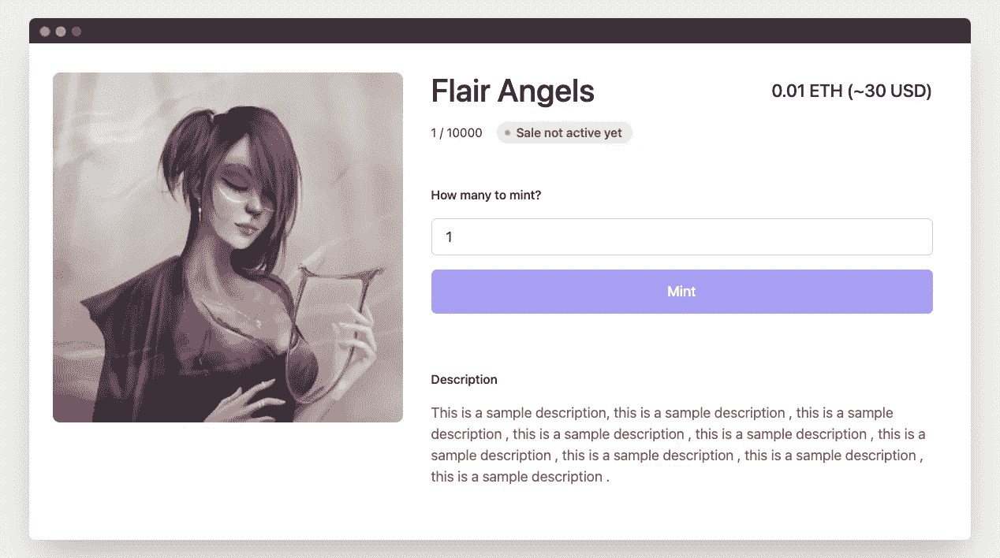
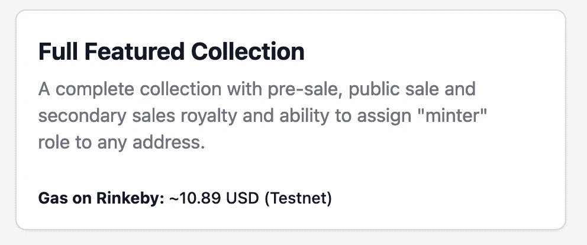
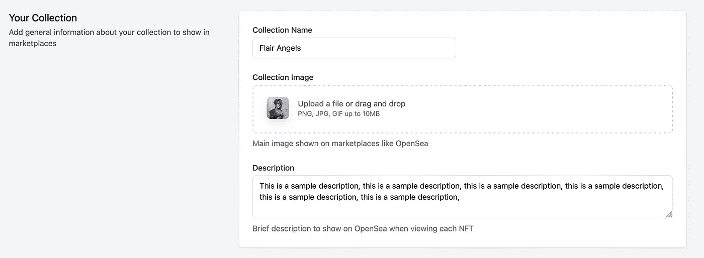
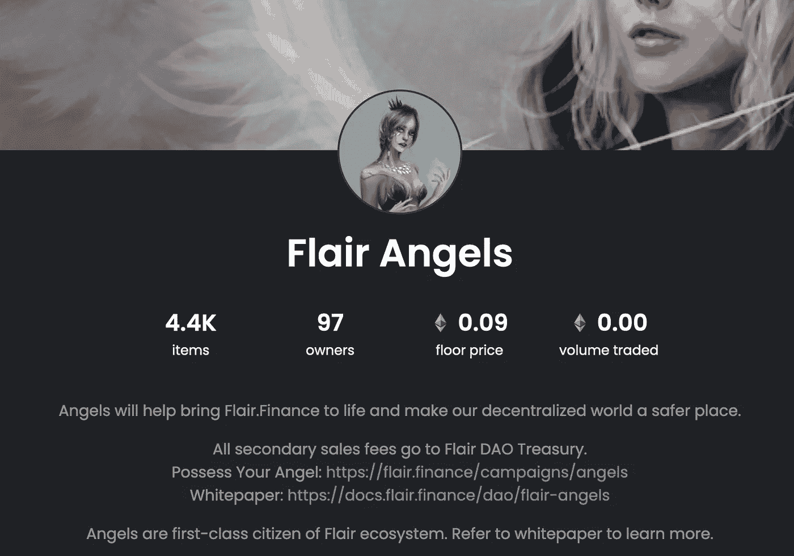
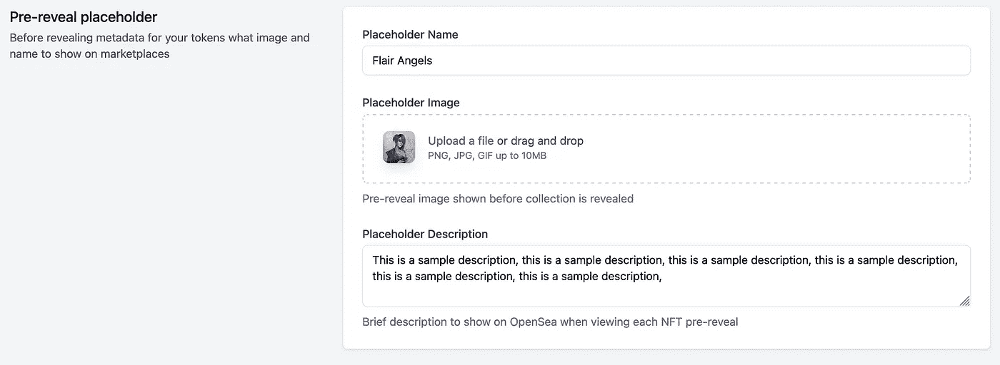
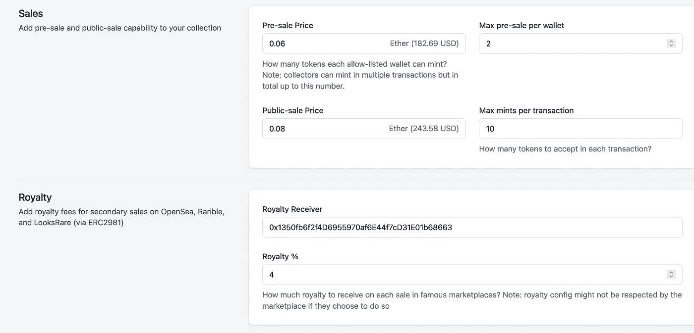
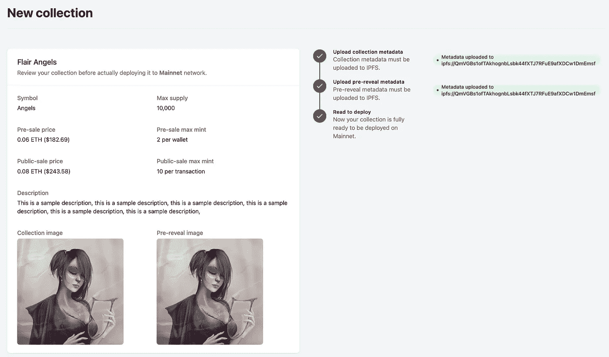
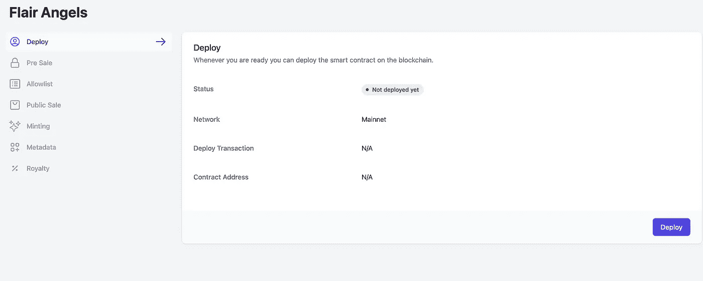
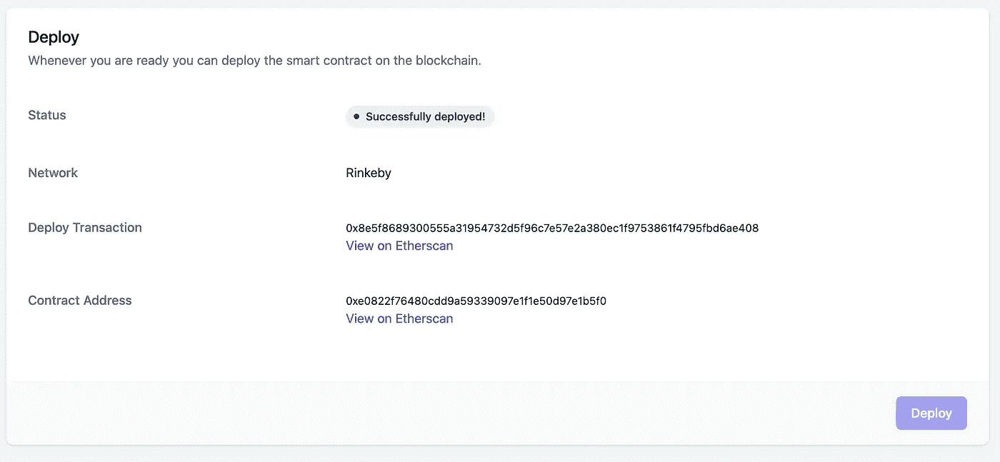
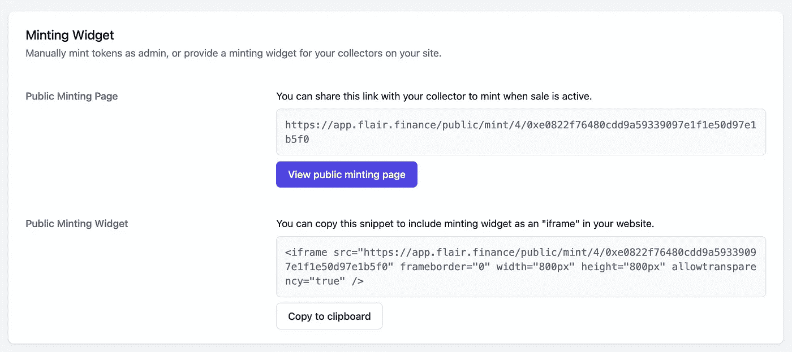

# 无需编写任何代码，即可在您的网站上发布 NFT 作品集

> 原文：<https://betterprogramming.pub/release-an-nft-collection-on-your-site-without-writing-any-code-cbf21e0a306c>

## 如何使用 Flair 仪表板减少对 web3 开发的依赖

[https://flair.finance/](https://flair.finance/)

在这篇博文中，我将向你展示如何在不了解智能合约和 Web3 开发的所有复杂性和最佳实践的情况下，在你的网站上发布 NFT 收藏；同时对您正在部署的代码拥有完全的所有权和可见性。为了获得所有这些功能和优势，我们将使用[风格](https://app.flair.finance/)仪表板。

# 创建新收藏

我们旅程的第一步是在[风格](https://app.flair.finance/)仪表盘上创建一个 NFT 系列。

您可以将集合视为区块链上的一个特定实体，它有自己唯一的地址和属性。有了这个 NFT 收藏，你将能够以一种不变的方式发行数字资产。E.x 如果你发行 5K 游戏资产作为你下一个游戏项目的 NFT，这些 5K NFTs 将在区块链上保持不可触及，每个人都可以验证它们的真实性。

此外，为开发人员创建和部署 NFT 集合的另一个重要方面是确保他们完全拥有 NFT 合同，这是 Flair 的智能合同的情况。

点击 [**【创建新收藏】**](https://app.flair.finance/collections) 后，您可以选择您喜欢创建的收藏类型。现在，我们将选择**“全功能系列”**。请注意，对于这个集合，您将部署一个 [ERC721](https://eips.ethereum.org/EIPS/eip-721) 智能契约，这意味着这个集合中的所有 NFT 都将是唯一的。

具有预售和版税管理功能的全功能系列

这是一个集合，它为我们提供了发布 NFT 所需的所有必要的构件。其中一些构建模块是预售和公开销售功能，我们将在后面讨论。此外，在部署该合同时，您还可以估算出将要花费的汽油量。由于本例中我们在 Rinkeby testnet 上，因此我们得到本次部署的天然气费用的估计值为**~**10.89 美元。如果你只是在测试东西，确保在仪表板的顶角选择一个测试网，这样你就不必实际支付汽油费。

选择此选项后，我们需要为 NFT 系列填写几个部分。

**你的收藏**

你的收藏区

在这里，我们试图定义将出现在 OpenSea 等市场上的 NFT 系列的一般信息。这里有一个例子:

OpenSea 上的 Flair Angels 系列

**代币**

令牌部分

这是你定义你的 NFT 收藏的符号的部分，它将出现在[以太扫描](https://etherscan.io/)中。此外，最大供应将定义一个不可变的数量的 NFT，可以永远存在于您的收集。

**预揭露占位符**

预显示占位符部分

通常情况下，在真正展示 NFT 资产之前，你需要为你的 NFT 收藏准备一个预展示占位符。通过此部分，您可以定义您希望在展示您的 NFT 之前在不同市场显示的 NFT 的名称、图像和描述。让我们来看一个例子:

NFT 预披露元数据

**销售额和版税**

销售和版税部分

现在，我们可以设置一些关于 NFT 系列的基本销售信息。例如，我们可以为 NFTs 添加预售和公开销售价格，同时控制每个钱包中有多少 NFTs 用户可以在预售中造币，同时定义公开销售中每笔交易允许多少造币。

此外，您可以设置二次销售的版税百分比，以及谁应该是这些版税收入的接收者。

**检查代码**

检查代码部分

完成此阶段后，您可以点击**“预览”**进入下一步，以便部署您的合同；同时您也可以选择点击**“检查代码”**。该选项使您对将要部署的代码完全透明。您甚至可以选择自己手动部署合同，但 Flair 只是通过控制面板使其更容易。

**保存收藏**

保存收藏部分

点击**“预览”**部分后，欢迎进入此页面，您可以在左侧看到您收藏的概述，而在页面右侧，您可以看到您收藏的状态，并预先显示上传到 IPFS 的元数据，使其永久不变。当所有复选标记变为绿色时，您可以点击**“立即保存”**进入下一步。

**部署**

部署部分

在我们的合同在区块链生效之前还有一步；那就是展开合约。在此页面中，您可以看到合同的状态仍然设置为**“尚未部署”**。点击部署后，您可以看到状态变为**“成功部署”**。此外，部署事务和合同地址是可见的，可以在 Etherscan 上进一步检查。

成功部署

恭喜:)您现在已经成功部署了 ERC721 智能合约。但是这之后会发生什么呢？

使用 Flair 的仪表板，您可以轻松管理您的预售、公开销售、元数据管理和版税设置(即将推出的功能)；但我们将在未来的帖子中涵盖这些用例，并专注于在我们的网站中嵌入我们集合的铸造小部件，并允许我们的社区成员轻松铸造他们的 NFT。

**铸币**

铸造部件

当您点击 **"Minting"** 部分时，您将可以访问 **"Minting Widget"** 部分。你可以使用**“公共铸币工资”**，它为你提供了一个基本的 URL，或者你可以使用**“公共铸币部件”**，并轻松地将铸币部件作为 iframe 嵌入到你的网站中。仅此而已。