# 使用 Lambda 和 Go SDKs 释放悬空弹性 IP

> 原文：<https://betterprogramming.pub/release-dangling-elastic-ips-using-lambda-and-go-sdk-47a1b745150c>

## 为您省钱的深度指南


作者图片

# 介绍

今天，我们将动手做一个如何杀死一个悬空的 EIP，或者换句话说，解除分配一个未分配的弹性 IP。但在此之前，我们先来谈谈…

# 什么是弹性 IP，我们为什么需要它？

弹性 IP 只是亚马逊 AWS 提供的 IP 地址。这些通常连接到 internet 网关，如负载平衡器，甚至 EC2 实例。在我的测试用例中，我一直直接使用它和 EC2 实例。

通常，当您将 EC2 实例配置为具有公共 IP，但同时不使用 EIP 时。问题是，当您停止和启动实例时，您的 IP 地址会发生变化。

这就是弹性 IP 大放异彩的地方。您将一个 EIP 附加到 EC2 实例，当您停止和启动实例时，您的 IP 不会改变。

如果您正在运行的 EC2 托管着一个面向互联网的 web 服务器，这一点非常重要。Web 服务器通常不应该频繁地改变它们的 IP。

# 但是我们为什么需要一个 EIP·黑仔呢？

EIP 有好的一面，也有不好的一面。好消息是 EIP 可以免费使用。你不需要为你正在使用的静态 IP 支付任何费用。多酷啊！

坏的一面是，当 EIP 没有附加到一个实例时，它会让你花钱。多温暖啊！

如果你把它拆开几个小时，不会花你很多钱。但作为人类，我们往往会忘记 EIP 是否在使用，只记得我们收到每月账单的时候。

在亚太(孟买)地区，如果我有一个月忘记杀死一只 EIP，我会得到大约 4 美元的钞票。这是我写这篇文章的主要动机。

有了 EIP 杀手锏，我将能够放心地使用弹性 IP，在不使用时释放它。

# 开始

我们将使用什么:

*   自动气象站λ
*   去
*   AWS Go SDK
*   AWS CLI

我们要做的是:

*   以预定义的时间间隔运行 Lambda
*   使用这个 Lambda 和 AWS SDK 来检查是否有任何悬空的 EIP
*   如果发现晃来晃去的 EIP，解除分配，也就是杀死它

最初，我打算将 Python 用于 Lambda 运行时，但 Go 比 Python 更快。我们将从这个决定中受益，因为我们可以在更短的时间内运行我们的函数。这很重要，因为我们计划以频繁的时间间隔运行我们的 Lambda。

在这篇文章中，我主要计划扩展我在无服务器计算领域的知识。我打算接触 Lambda、EventBridge 和相关的构造。

# 阶段 1:提供 Lambda 函数

这个阶段的主要任务是手动创建一个函数。在第二阶段，我们将看到杀死 EIPs 的逻辑是什么。让我们开始吧。

1.  浏览 web UI 并选择创建一个函数。
2.  保持选择“从头开始创作”。
3.  填写姓名。我喜欢称之为“eip 杀手”
4.  选择运行时为 Go 1.x。
5.  其他一切都保持默认。点击创建功能。

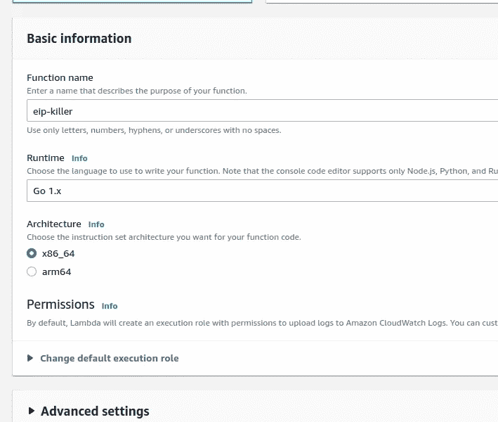

从 Web 用户界面创建 Lambda 函数

**注意**:使用默认设置创建 Lambda 也会创建一个 IAM 角色。这个 IAM 角色决定了这个 Lambda 如何与其他 AWS 服务交互。默认情况下，这个角色允许 Lambda 与 CloudWatch 对话来放置日志。在使用其他 AWS 服务时，您可以向该角色添加更多策略。

让我们继续做一个快速调用来测试这个函数是否工作。

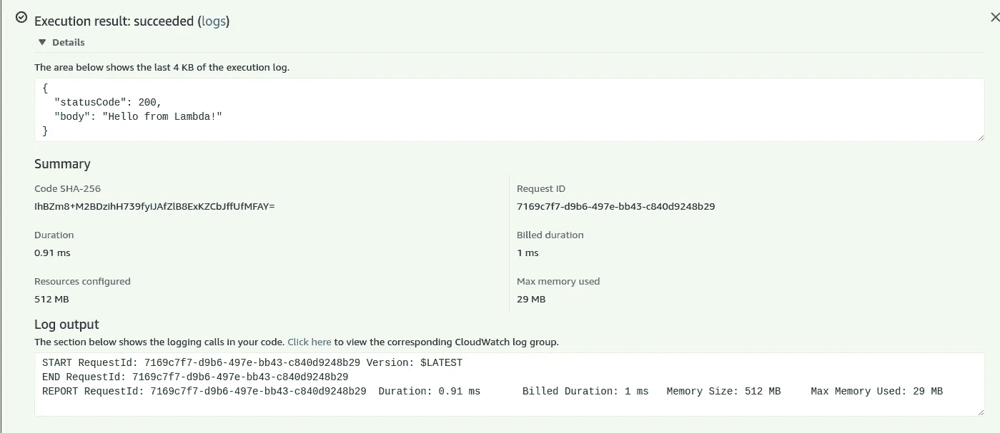

调用 Lambda 的结果

我们的 EIP 杀手还活着。但不知道如何杀人。下一期再教吧。

# 第二阶段:编写杀死 EIP 的逻辑

在测试时，您可能会看到函数的 Code 选项卡，上面写着“代码编辑器不支持 Go 1.x 运行时”对于我们开发人员来说，这意味着我们必须使用我们的文本编辑器来编写逻辑，并将预构建的二进制文件上传到 Lambda。

Go AWS SDK 的主要文档是[https://docs . AWS . Amazon . com/lambda/latest/DG/lambda-golang . html](https://docs.aws.amazon.com/lambda/latest/dg/lambda-golang.html)，不过不用担心。我把这个岗位需要的材料筛选出来。

# 阶段 2.1:初始部署过程

在我们编写实际的逻辑之前，让我们编写一个简单的“你好，EIP·黑仔”代码，以了解上传代码所需的过程。

1.  为我们的 Lambda 代码创建一个工作空间。

```
mkdir eip-killer
cd eip-killer
```

2.初始化文件夹中的 go 模块。

```
go mod init EIP-killer
```

您也可以将 repo 的 GitHub/GitLab URL 放在您想要放置 Lambda 代码的地方。

3.创建一个`main.go`并将这段代码放入其中:

因为我们使用外部依赖，所以用这个命令获取它:

```
go get github.com/aws/aws-lambda-go/lambda
```

4.用`main.go`构建一个二进制文件:

```
GOOS=linux GOARCH=amd64 go build -o main main.go
```

请记住，在创建函数时，我们选择了 x86_64 架构。所以，我们需要用`GOARCH=amd64`来反映这一点。

5.压缩二进制文件。将 zip 上传到函数。

```
zip main.zip main
```

使用此命令上传:

```
aws lambda update-function-code --function-name eip-killer --zip-file fileb://main.zip
```

虽然这可能已经足够了，但出厂设置中的默认处理程序(lambda 开始执行的地方)是`hello`。但是我们的代码使用了`main`。所以我们需要更新处理程序配置来匹配它。

我们只需要更新一次。

```
aws lambda update-function-configuration --function-name eip-killer --handler main
```

此后，当您运行 func:


更新的功能

如果你想更深入地了解 Go+Lambda，你可以在这条路上漫游:[https://github.com/aws/aws-lambda-go](https://github.com/aws/aws-lambda-go)。但是现在，我打算用 AWS SDK 来施展我们的魔法。

# 阶段 2.2:取消分配未使用的 EIP 的逻辑

再次打开`main.go`并编写以下代码:

相当大的源代码。让我们一行一行来理解。

第 14–16 行声明了一个事件结构。这个结构将成为`Handler`函数的一个参数。

在第 18 行，我们看到一个带有签名`Handler(ctx context.Context, name MyEvent) (string, error)`的函数。`Handler`这里是函数的名称。

处理程序的第一个参数是上下文对象。如果你在 golang 中使用 web 服务，你必须意识到这一点。

接下来是我们上面定义的`MyEvent`。这是按照 Lambda 的规格。

我们的处理函数也返回一个字符串和一个错误，然后冒泡到 Lambda 日志中。

第 20 行处理配置。请注意，我们使用的是 AWS SDK。SDK 可以在 Lambda 以外的平台上运行。在本地系统上，默认配置位于~/。AWS/配置。但是在 Lambda 上，它会自动加载正在运行的区域。

在第 26 行，我们创建了一个新的 EC2 客户端来与我们的 AWS 帐户交互。我们用在第 15 行创建的 config 实例初始化这个客户机。

在第 29 行，我们已经为 IPs 初始化了一个过滤器。这似乎是一个额外的步骤。但是这个变量将成为我们下一个命令的强制参数。

在第 32 行，我们得到了与我们的帐户相关的所有弹性 IP 的列表。结果没有过滤器，因为我们在第 29 行没有指定任何过滤器。

是时候看看从 69 到 76 的`isThisEIPKillable`函数了。这是灵活性的一个额外特性。这将原谅任何标签`KILLERHOLD`设置为`true`的 EIP。所以，当你有一只不想杀死的 EIP 时，你就给它贴上这个标签。这对实验来说很好，因为我们的 Lambda 将以一小时(可由用户配置)的间隔运行，每小时删除它们可能不是我们想要的结果。

让我们回到我们的主要流程。我们有一个包含所有地址的变量`result`。在第 40 行，我们检查 IP 是否与任何 EC2 相关联。然后我们运行刚刚讨论过的助手函数。如果一切正常，这意味着 KIP 可以被释放，我们继续将地址释放回 AWS 池。

在第 57–59 行，如果 EIP 与任何 EC2 关联，我们打印一些关于 EIP 关联的元数据。

就是这样。这并不难理解，不是吗？在我们部署它之前，让我们创建一些 EIP，不要将其分配给任何 EC2。我们也将有一些 EIP 杀手设置为真。

# 阶段 2.3:允许 Lambda 发布和读取 EIP

我希望您已经更新了 lambda 函数，并将 zip 文件推送到该函数。如果没有，请复习阶段 2.1。如果有，请继续阅读。

在我用实际的 EIP 测试它之前，我想展示一些别的东西。现在，如果您尝试测试该函数，您会看到如下所示的内容:

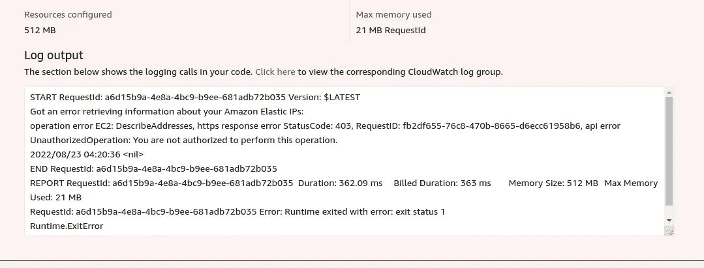

Lambda 无法访问 EIP

如果你清楚地阅读了错误消息，它说 API 调用返回 403。这意味着 Lambda 没有被授权调用 EIP API。

为了克服这个问题，我们需要访问 Lambda 来从 EC2 读取一些元数据。

当没有 Lambda Web UI 用于该功能时。如果您转到配置>权限>执行角色，如下图所示。您将看到在我们创建函数时创建了一个角色。

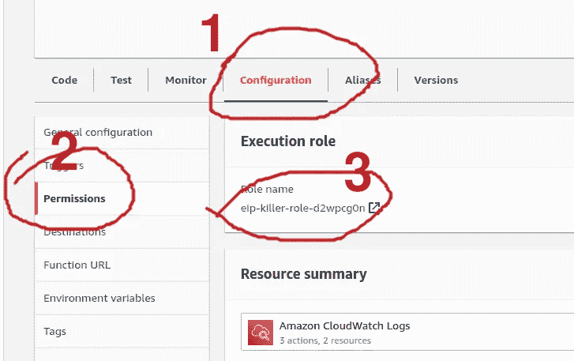

Lambda 的权限配置

单击该按钮，您将被带到该角色的 IAM 页面。

在该页面上，查找名为“Add permissions”的下拉列表，然后单击“Create inline policy”。

从可视化编辑器切换到 JSON，并粘贴这个策略。

如您所见，在 Action 部分，我们添加了对`ec2:ReleaseAddress`和`ec2:DescribeAddresses`的权限。

查看策略并为其命名，然后创建策略。

完成后，您会在附加到角色的策略列表中看到该策略。

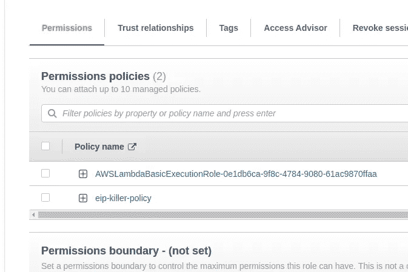

附加到角色的内嵌策略

# 阶段 2.3:测试我们的 EIP 杀手

我们还没有准备好进行真正的测试。

出于测试目的，我们将分配三个弹性 IP:

*   我们将向 EC2 实例附加一个
*   第二个会悬空
*   第三个也是悬空的，但会将我们的`KILLERHOLD`设置为真。

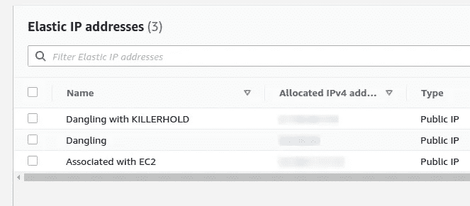

EIP 测试集

要实际调用该函数(除了测试之外)，一种方法是创建一个公共 URL。我们也可以通过 AWS CLI 调用，但我现在不打算这么做。你能做到的。

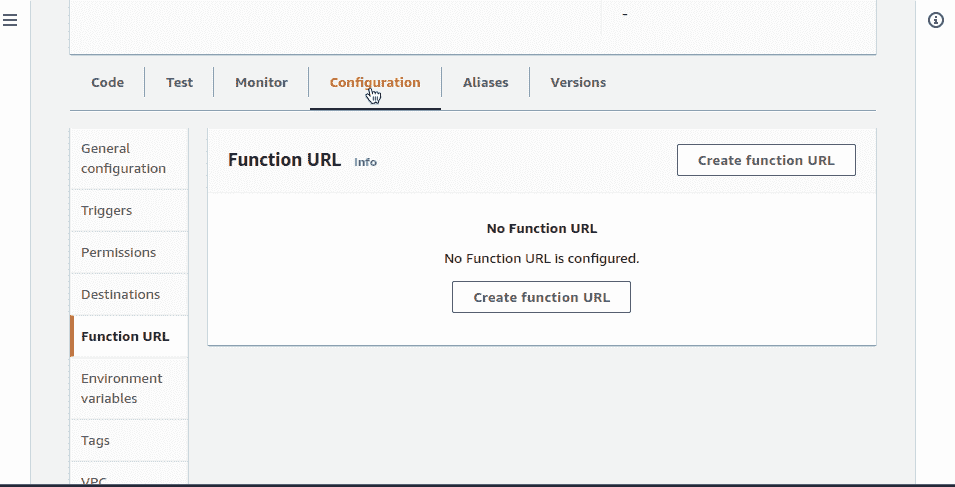

为 lambda 创建一个公共 URL

然后我打开那个 URL 来执行这个函数。

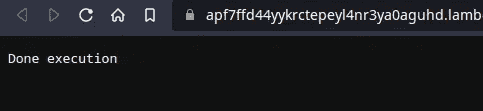

通过访问公共 URL 调用 Lambda

你可以在函数前面配置 AWS API 网关。但是这超出了本文的范围。

接下来，我们看到调用的结果。

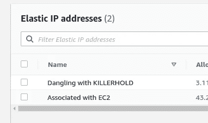

EIP·黑仔处决后的结果

第二阶段到此结束。我们现在可以杀 EIPs 了。太棒了。

# 阶段 3:每隔一小时触发一次 Lambda

EIP 杀手的主要部分已经开发出来了。现在让我们按照之前的计划，每隔一小时执行一次。

# 阶段 3.1:配置 EventBridge(又名 CloudWatch 事件)

我们将在一小时的时间间隔内发出一个事件，我们将使用 EventBridge 来执行此操作。

为了节省篇幅，我在本文中录制了一个截屏 gif。

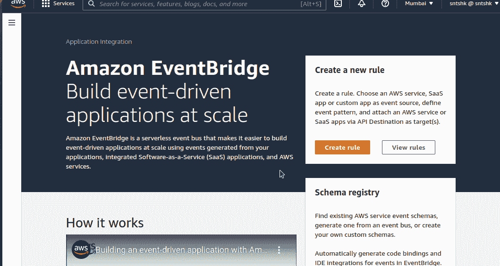

将 EventBridge 配置为在 1 小时内发出事件

完成后，该事件应出现在 Lambda 函数的触发器部分，如下图所示:

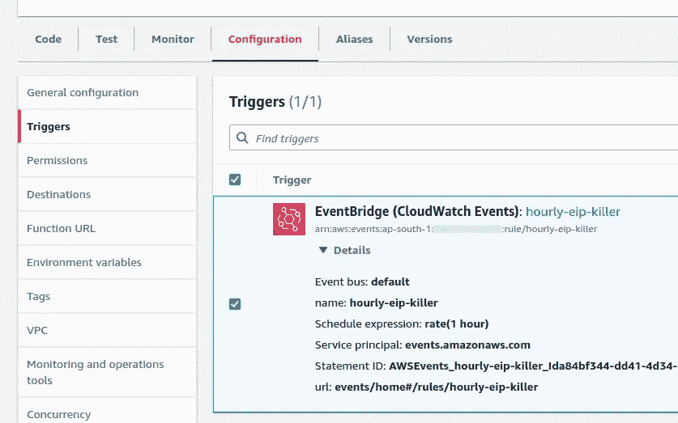

显示 EventBridge 规则的触发器配置

# 阶段 3.2:创建一个 EIP，然后睡觉

当我在凌晨 4 点写这篇文章时，我将创建一个 EIP，然后睡觉。我会在早上检查我们的设置是否正常。

*几个小时后……*

今天早上我醒来时只有一个 EIP。

这就是我们如何在一小时内完成这场杀戮。你可以配置间隔，但我认为这是最优的。你也不需要为此拥有一个公共 IP。所以如果你有，你现在可以从网络界面删除它。

*原载于 2022 年 9 月 3 日*[*https://santoshk . dev*](https://santoshk.dev/posts/2022/release-dangling-elastic-ips-using-lambda-and-go-sdk/)*。*