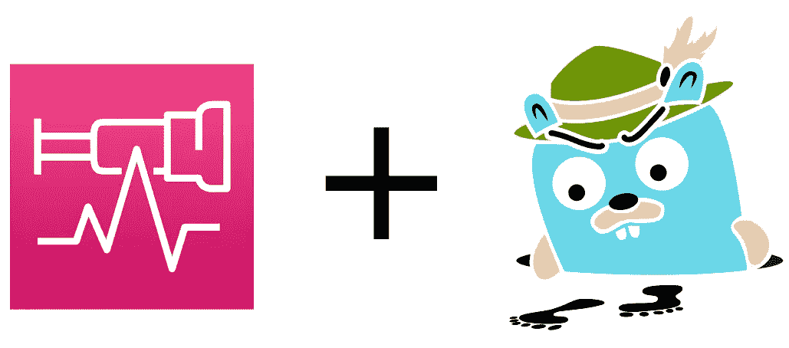
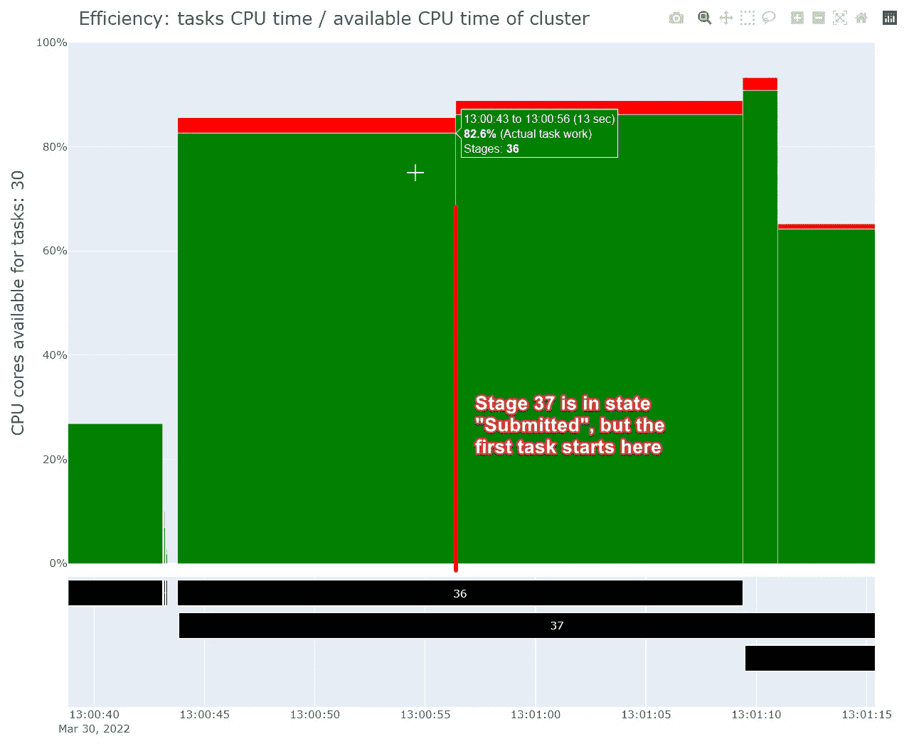
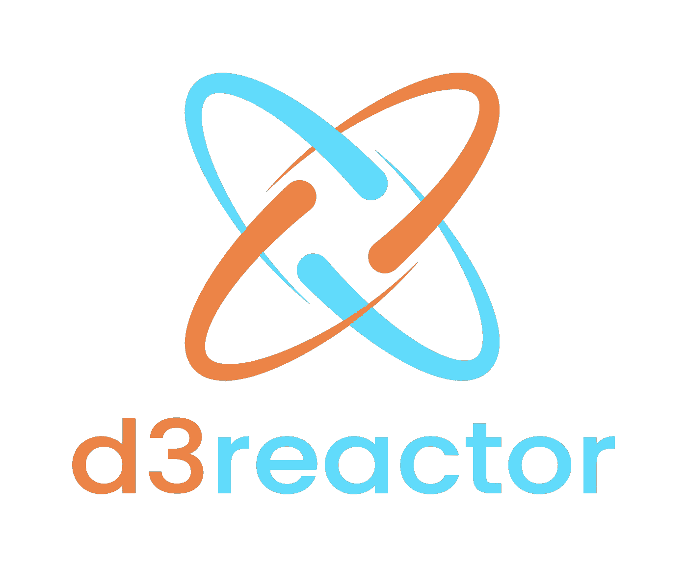
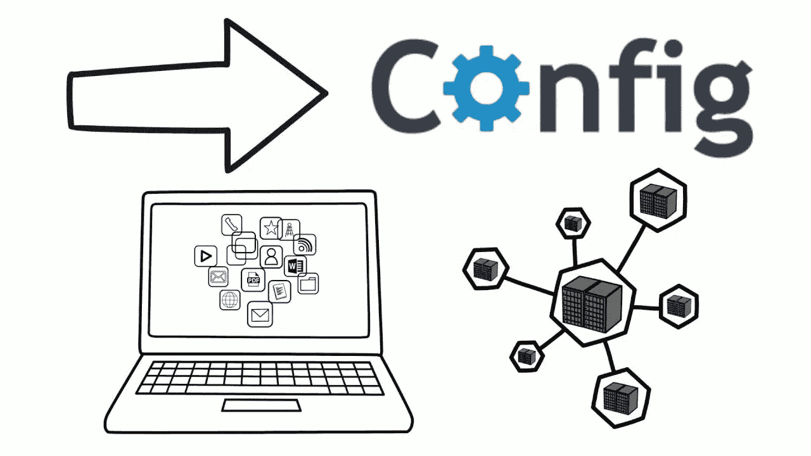

# 通过 SwiftUI 和另外 5 个开源项目回忆 iPods

> 原文：<https://betterprogramming.pub/reminiscing-ipods-through-swiftui-and-4-more-open-source-projects-c52c5adf6859>

## 第 22 期——今日精选故事——5 月 11 日

欢迎来到第 22 版咖啡字节，更好的编程每日文摘。

今天，我们将重点介绍几个开源项目以及一个模拟 iPod 设计的 SwiftUI 应用程序。[苹果公司今天正式停产 iPod Touch](https://www.apple.com/newsroom/2022/05/the-music-lives-on/)——所以这是一个很好的时间来记住我们都珍惜的 iPod 时代。

## [用 SwiftUI 打造经典 iPod 应用](/build-a-classic-ipod-app-with-swiftui-f1ff3f19b97e)

由[费尔南多·莫亚·德·里瓦斯](https://medium.com/u/30da8e1508ce?source=post_page-----c52c5adf6859--------------------------------)

想知道如何复制经典的 iPod 专辑封面和轮子设计？Fernando 深入研究了它的实现，并提出了一个简洁的 SwiftUI 应用程序:

## [将 AWS 发行版用于 Jaeger 的 OpenTelemetry】](/using-aws-distro-for-opentelemetry-with-jaeger-acf4df3a8e37)

作者:德米特里·科洛米茨

早些时候， [Dmitry](https://medium.com/u/3e42fa96c5e9?source=post_page-----c52c5adf6859--------------------------------) 已经展示了他自己的 [Jaeger 快速启动项目](/introducing-jaeger-quick-start-deploying-on-aws-f0ee5d398e8a)——一个在亚马逊网络服务(AWS)云上部署[高可用](https://docs.aws.amazon.com/whitepapers/latest/real-time-communication-on-aws/high-availability-and-scalability-on-aws.html)Jaeger——开源、端到端分布式追踪平台的解决方案。他的最新作品结合了 OpenTelemetry 和 Jaeger——这是一个完美的匹配。

## [遇见“火花视线”:火花性能一目了然](/spark-sight-spark-performance-at-a-glance-c2316d2a251b)

由阿尔弗雷多·福米特琴科

在他的第一篇文章《更好的编程》中，Alfredo 向我们介绍了他的第一个开源项目，该项目通过提供 Spark 应用程序内部发生的事情的直观表示，努力提高 Spark 性能的可视化。

## [宣布 GraphQL 的去溶剂](https://medium.com/@miakangnyc/announcing-desolver-for-graphql-697b4f893025)

由 [Miakangnyc](https://medium.com/u/72465603b9a5?source=post_page-----c52c5adf6859--------------------------------)

> [DeSolver](https://github.com/oslabs-beta/DeSolver) 是一个开源、轻量级、极简主义和非固执己见的 Node.js — [GraphQL](https://graphql.org/) 框架，为模块化解析器业务逻辑提供了一个强大而又易于使用的 API。

## [将 D3 数据可视化添加到 React 应用程序从未如此简单过](/adding-d3-data-visualizations-to-your-react-app-has-never-been-easier-2e80c9f2c712)

罗伯特·克罗克

我们都在为我们的网络应用寻找高性能的图表库。很高兴，Robert 和他的伙伴们已经将 React + D3 结合起来，提出了一个现代的、视觉上吸引人的、快速的图表库解决方案——并且您可以以声明的方式对它进行编码！

## [由颤振和燃烧基提供动力的 I/O 弹球](https://medium.com/flutter/i-o-pinball-powered-by-flutter-and-firebase-d22423f3f5d)

由[非常好的风投团队](https://medium.com/u/7781c543301e?source=post_page-----c52c5adf6859--------------------------------)

随着谷歌 I/O 于本周启动，“非常好的风险投资团队”与 Flutter 团队合作，重新构想了一款每个 90 后孩子都喜欢的游戏——使用 Flutter、Firebase 和 Flame 构建的经典弹球游戏！

## [满足归零——一种从文件定义和加载配置的方法](/how-we-define-and-load-configuration-from-files-28fefb11f432)

由[凯文万](https://medium.com/u/35ff4738485b?source=post_page-----c52c5adf6859--------------------------------)

将 JSON 用于 Restful API 配置文件可能很麻烦。但不一定非要这样。Kevin 通过他的开源项目— `go-zero`提出了一个更好的解决方案。

这一期到此结束。感谢阅读。

直到你下次喝咖啡，

[Anupam](https://anupamchugh.medium.com/) 和更好的编程团队。