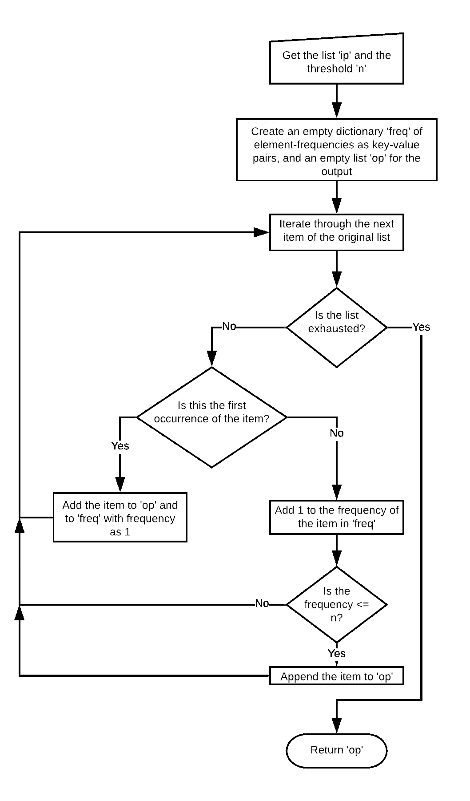
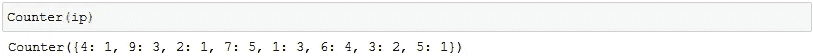
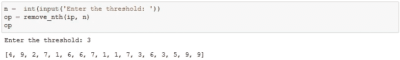
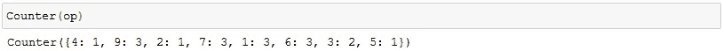
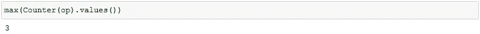
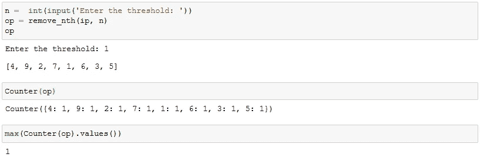

# 从列表中删除第 n 次出现的元素

> 原文：<https://betterprogramming.pub/remove-list-occurrences-c3b8124d5fd9>

## 一个经典的算法面试问题


Photo by [东旭 王](https://unsplash.com/@wdongxv?utm_source=unsplash&utm_medium=referral&utm_content=creditCopyText) on [Unsplash](https://unsplash.com/s/photos/pattern?utm_source=unsplash&utm_medium=referral&utm_content=creditCopyText)

*被困在付费墙后面？点击* [*此处*](https://medium.com/better-programming/remove-list-occurrences-c3b8124d5fd9?source=friends_link&sk=668225178ebef405d8d5d9a5ce803225) *阅读全文和我的朋友链接。*

这是解决这个经典算法面试问题的方法(感谢 [Adwait](https://www.linkedin.com/in/adwait-kumar-singh-b5321512a/) 改进了我之前的方法):



# 继续编码！

首先，我们导入必要的库:

```
import random
import numpy as np
from collections import Counter
```

然后，我们生成一个从 1 到 9 的任意整数的随机列表，任意指定大小:


获取列表中所有元素的频率:



根据我们的问题陈述，对于 n=3，输出应该是
【4，9，2，7，1，6，6，7，1，1，7，3，6，3，5，9，9】。一个元素在第三次出现后的所有出现都应该被删除。在我们的例子中，只有 7 和 6 符合条件，因为它们的频率大于 3。

我们创建一个空列表来存储输出，并创建一个空字典来存储元素频率:

```
op = []
freq = {}
```

然后我们创建一个循环来遍历列表中的元素。如果该项已经存在于`freq`的关键字中，我们将它的频率增加`1`，否则我们将它添加到`freq`中，频率为`1`:

```
for item in ip:
    if item in freq:
        freq[item] += 1
    else:
        freq[item] = 1
```

现在，我们必须检查该项的频率是否小于或等于阈值。如果是，我们把它附加到输出列表`op`，否则我们跳过它。对于第一次出现的项目，我们可以直接将其附加到`op`上，而不进行任何检查:

```
for item in ip:
    if item in freq:
        freq[item] += 1
        if freq[item] <= n:
            op.append(item)
    else:
        freq[item] = 1
        op.append(item)
```

将它包装在一个整洁的小函数中，该函数将接受列表和阈值:

```
def remove_nth(ip, n):
    op = []
    freq = {}
    for item in ip:
        if item in freq:
            freq[item] += 1
            if freq[item] <= n:
                op.append(item)
        else:
            freq[item] = 1
            op.append(item)
    return op
```

现在我们可以调用这个函数，传递列表和阈值，并获得一个删除了额外出现次数的新列表:



在这种情况下，第三个匹配项之后的所有匹配项都已从列表中删除。要验证:



我们看到 7 和 6 的频率现在分别从 5 和 4 下降到 3。其他元素的频率没有受到影响。

另外，`max(Counter(op).values())`验证没有元素在修改后的列表中出现超过三次。



调用阈值为 1 的相同函数将给出列表中的所有唯一元素:



Medium 仍然不支持向印度以外的作者支付费用。如果你喜欢我的内容，你可以给我买杯咖啡:)

[](https://www.buymeacoffee.com/siddhantsadangi) [## Siddhant Sadangi 正在 Streamlit 上创建 python 网络应用程序

### 嘿👋我刚刚在这里创建了一个页面。你现在可以给我买杯咖啡了！

www.buymeacoffee.com](https://www.buymeacoffee.com/siddhantsadangi)